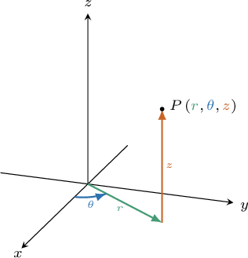
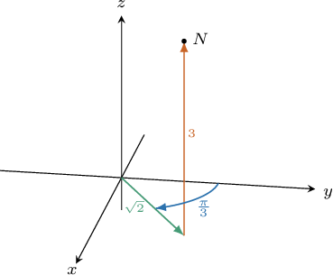
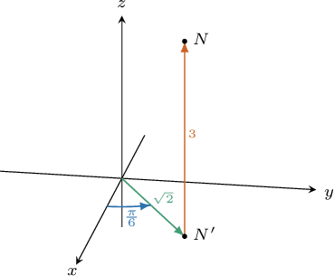

# Cylindrical Polar Coordinates

Source: https://www.mathacademy.com/topics/1981?courseId=54
Topic ID: 1981

## Prerequisites

- [Converting from Polar Coordinates to Cartesian Coordinates](../../../high-school/integrated-math-honors/lessons/integrated-math-iii-honors/936-converting-from-polar-coordinates-to-cartesian-coordinates.md)

## Lesson

### Introduction

We're used to expressing a point $P$ in three-dimensional space using $(x,y,z)$ (or Cartesian) coordinates. However, we can also express the coordinates of $P$ differently, using a system called **cylindrical polar coordinates**.

In cylindrical polar coordinates, we write the position of the point as $P(r,\theta,z),$ where $r$ and $\theta$ are the usual plane polar coordinates $(r,\theta)$ and $z$ is the usual Cartesian $z$-coordinate.

Note that

$$

r\geq 0, \qquad 0\leq \theta \lt 2\pi,\qquad -\infty < z < \infty.

$$

### Example: Identifying the Cylindrical Polar Coordinates of a Point

#### Question

What are the cylindrical polar coordinates of the point $N?$

#### Explanation

We write the position of a point in cylindrical coordinates as $(r,\theta,z),$ where $r \geq 0$ and $0 \leq \theta < 2\pi.$

According to the diagram, we have the following:

- The ray from the origin through $N'$ makes an angle of $\theta = \dfrac{\pi}{2} - \dfrac{\pi}{3} = \dfrac{\pi}{6}$ radians with the positive $x$-axis.

- The distance from the origin to $N'$ is $r=\sqrt{2}.$

- The $z$-coordinate is $z=3$ because $N$ lies $3$ units ** the $xy$-plane.

So, the cylindrical coordinates of $N$ are $\left(\sqrt{2}, \dfrac{\pi}{6}, 3\right).$

### Converting Between Cylindrical Polar Coordinates and Cartesian Coordinates

We can use the following formulas to convert between cylindrical polar coordinates $(r,\theta,z)$ and Cartesian coordinates $(x,y,z)$:

$$

x = r\cos\theta, \qquad y=r\sin\theta, \qquad z=z

$$

Notice that the formulas for $x$ and $y$ are precisely the same as for plane polar coordinates.

The final equation simply says that the $z$-coordinate in the cylindrical coordinate system corresponds exactly with the $z$-coordinate in the Cartesian system.

### Example: Converting From Cylindrical Polar Coordinates to Cartesian Coordinates

#### Question

The point $P$ has cylindrical polar coordinates $\left(4, \dfrac{\pi}{6}, -8 \right).$ Find the Cartesian coordinates of $P.$

#### Explanation

If $(r, \theta, z)$ are the cylindrical polar coordinates of a point, then its Cartesian coordinates $(x,y,z)$ can be found by using the following formulas:

$$

x = r\cos\theta, \qquad y = r\sin\theta, \qquad z = z.

$$

Calculating $x$, we get

$$

\begin{aligned}𝑥 & =𝑟cos⁡𝜃 \\ & =4cos⁡(\frac{𝜋}{6}) \\ & =4⋅\frac{\sqrt{3}}{2} \\ & =2\sqrt{3}.\end{aligned}

$$

Calculating $y$, we get

$$

\begin{aligned}𝑦 & =𝑟sin⁡𝜃 \\ & =4sin⁡(\frac{𝜋}{6}) \\ & =4⋅\frac{1}{2} \\ & =2.\end{aligned}

$$

Therefore, the Cartesian coordinates of $P$ are $(2\sqrt3, 2, -8).$

### Example: Converting From Cartesian Coordinates to Cylindrical Polar Coordinates

#### Question

The point $A$ has Cartesian coordinates $(\sqrt3,-3,\sqrt2).$ What are the cylindrical polar coordinates of $A?$

#### Explanation

We write the position of a point in cylindrical coordinates as $(r,\theta,z),$ where $r \geq 0$ and $0 \leq \theta < 2\pi.$

The Cartesian coordinates of $A$ are given as $(x,y,z) = (\sqrt3,-3,\sqrt2).$

- From these Cartesian coordinates, we know that $z=\sqrt{2}.$

- To find the values of $r$ and $\theta,$ we need to find the polar coordinates of the point $(x,y) = (\sqrt 3, -3)$ in the $xy$-plane.

First, we find $r,$ as follows:

$$

\begin{aligned}𝑟 & =\sqrt{𝑥^{2}+𝑦^{2}} \\ & =\sqrt{(\sqrt{3})^{2}+(−3)^{2}} \\ & =\sqrt{3+9} \\ & =\sqrt{12} \\ & =2\sqrt{3}\end{aligned}

$$

Now, since $(\sqrt3,-3)$ lies in the fourth quadrant, we first need to find the reference angle $\theta_R\mathbin{:}$

$$

\begin{aligned}𝜃_{𝑅} & =arctan⁡\frac{𝑦}{𝑥} \\ & =arctan⁡\frac{−3}{\sqrt{3}} \\ & =arctan⁡(\sqrt{3}) \\ & =\frac{𝜋}{3}\end{aligned}

$$

Finally, we subtract the reference angle from $2\pi\mathbin{:}$

$$

\begin{aligned}𝜃 & =2𝜋−𝜃_{𝑅} \\ & =2𝜋−\frac{𝜋}{3} \\ & =\frac{5𝜋}{3}\end{aligned}

$$

Therefore, the cylindrical coordinates of $A$ are $\left(2\sqrt{3}, \dfrac{5\pi}{3}, \sqrt2 \right).$
