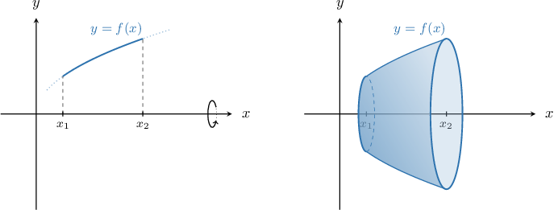
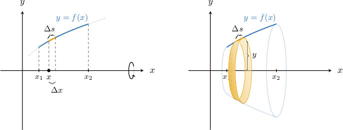
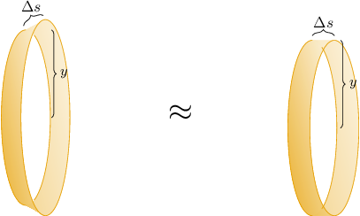
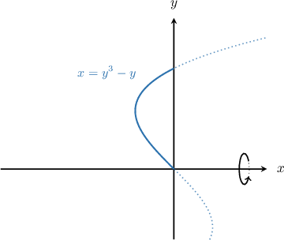

# Surface Areas of Revolution: Rotation About the X-Axis

Source: https://www.mathacademy.com/topics/1994?courseId=54
Topic ID: 1994

## Prerequisites

- [The Arc Length of a Planar Curve](../../../ap-courses/lessons/ap-calculus-bc/760-the-arc-length-of-a-planar-curve.md)
- [The Area Bounded by a Curve and the Y-Axis](../../../ap-courses/lessons/ap-calculus-ab/1041-the-area-bounded-by-a-curve-and-the-y-axis.md)
- [Surface Areas of Cylinders](../../../high-school/traditional/lessons/geometry/1762-surface-areas-of-cylinders.md)

## Lesson

### Introduction

Consider the arc of the curve $y=f(x)$ that lies between the vertical lines $x=x_1$ and $x=x_2,$ as shown below on the left. By rotating this curve $2\pi$ radians about the $x$-axis, we get a **surface of revolution,** as shown below on the right. How can we find its surface area?

First, we divide the interval $[a,b]$ into small subintervals, each of length $\Delta{x}.$ Let's consider a part of the curve that corresponds to one of those subintervals and let the length of the corresponding curved arc be $\Delta{s}.$ When this part of the curve is rotated about the $x$-axis, it forms a closed strip.

If $\Delta{x}$ is very small, we can assume that both left and right radii of the strip are approximately equal to $y=f(x).$ Then, this strip can be viewed as the lateral surface of a right cylinder with height $h=\Delta{s}$ and radius $r=y=f(x).$

We can approximate the lateral surface area of such a cylinder as

$$

S_{\text{strip}} \approx S_{\text{cylinder}} = 2\pi r \cdot h = 2\pi y \cdot \Delta{s}.

$$

The sum over all subintervals will approximate the total area $S$ that we want. The approximation becomes more and more accurate as $\Delta{s} \to 0$. Therefore, to get the area of the surface, we need to integrate:

$$

S = \int 2\pi y\,\textrm d s

$$

Recall that for a curve $y = f(x),$ the arc length element $\textrm d s$ is given by

$$

\textrm d s = \sqrt{1+\left(\dfrac{\textrm d y}{\textrm d x}\right)^2}\,\textrm d x.

$$

Therefore, we can find the total surface area using the formula

$$

S = 2\pi \int_{x_1}^{x_2} y \sqrt{1+ \left( \dfrac{\text{d}y}{\text{d}x} \right)^2} \: \text{d}x.

$$

### Example: Integrals Representing Surface Areas Generated by Functions of X

#### Question

Consider the arc of the curve $y=e^x$ that lies between the lines $x=0$ and $x=2.$ What integral gives the surface area generated when this arc is rotated $2\pi$ radians about the $x$-axis?

#### Explanation

We can find the surface area generated when a curve is rotated $2\pi$ radians about the $x$-axis using the formula

$$

S = \int 2\pi y\,\textrm d s.

$$

Since we're given a curve in the form $y = f(x),$ we have

$$

\textrm d s = \sqrt{1+\left(\dfrac{\textrm d y}{\textrm d x}\right)^2}\,\textrm d x.

$$

Therefore, we will use

$$

S = 2\pi \int_{x_1}^{x_2} y \sqrt{1+ \left( \dfrac{\text{d}y}{\text{d}x} \right)^2} \: \text{d}x.

$$

We are told that the limits of integration are from $x_1=0$ to $x_2={2}.$

Computing the derivative, we get

$$

\begin{aligned}\frac{d𝑦}{d𝑥} & =\frac{d}{d𝑥}(𝑒^{𝑥})=𝑒^{𝑥}.\end{aligned}

$$

Therefore,

$$

\begin{aligned}𝑆 & =2𝜋∫_{𝑥_{2}𝑥_{1}}^{}𝑦\sqrt{1+(\frac{d𝑦}{d𝑥})^{2}}\,d𝑥 \\ & =2𝜋∫_{20}𝑒^{𝑥}\sqrt{1+(𝑒^{𝑥})^{2}}\,d𝑥 \\ & =2𝜋∫_{20}𝑒^{𝑥}\sqrt{1+𝑒^{2𝑥}}\,d𝑥.\end{aligned}

$$

### Surface Areas Generated by Functions of Y

Suppose that we're given a curve of the form $x=f(y)$ that lies between the horizontal lines $y=y_1$ and $y=y_2.$ How do we calculate the surface area generated when this curve is rotated $2\pi$ radians about the $x$-axis?

Earlier, we showed that the surface area generated when a curve is rotated $2\pi$ radians about the $x$-axis is given by

$$

S = \int 2\pi y\,\textrm d s.

$$

For a curve $x = f(y),$ it can be shown that the arc length element $\textrm d s$ can be expressed as

$$

\textrm d s = \sqrt{1+\left(\dfrac{\textrm d x}{\textrm d y}\right)^2}\,\textrm d y.

$$

Therefore, the area of the surface that is obtained when the $x=f(y)$ curve is rotated $2\pi$ radians about the $x$-axis is given by the formula

$$

S = 2\pi \int_{y_1}^{y_2} y \sqrt{1+ \left( \dfrac{\text{d}x}{\text{d}y} \right)^2} \: \text{d}y.

$$

### Example: Integrals Representing Surface Areas Generated by Functions of Y

#### Question

Consider the arc of the curve $x=y^3-y$ that lies in the second quadrant between its $y$-intercepts. What integral gives the surface area generated when this arc is rotated $2\pi$ radians about the $x$-axis?

#### Explanation

We can find the surface area generated when a curve is rotated $2\pi$ radians about the $x$-axis using the formula

$$

S = \int 2\pi y\,\textrm d s.

$$

Since we're given a curve in the form $x = f(y),$ we have

$$

\textrm d s = \sqrt{1+\left(\dfrac{\textrm d x}{\textrm d y}\right)^2}\,\textrm d y.

$$

Therefore, we will use

$$

S = 2\pi \int_{y_1}^{y_2} y \sqrt{1+ \left( \dfrac{\text{d}x}{\text{d}y} \right)^2} \: \text{d}y.

$$

First, we need to determine the limits of integration. To do this, we find where the curve intersects the $y$-axis by solving the following equation:

$$

\begin{aligned}𝑦^{3}−𝑦 & =0 \\ 𝑦(𝑦^{2}−1) & =0 \\ 𝑦 & =0,±1\end{aligned}

$$

Hence, we need to integrate from $y=0$ to $y=1.$

Computing the derivative, we get

$$

\begin{aligned}\frac{d𝑥}{d𝑦} & =\frac{d}{d𝑦}(𝑦^{3}−𝑦)=3𝑦^{2}−1.\end{aligned}

$$

Finally, we obtain

$$

\begin{aligned}𝑆 & =2𝜋∫_{𝑦_{2}𝑦_{1}}^{}𝑦\sqrt{1+(\frac{d𝑥}{d𝑦})^{2}}\,d𝑦 \\ & =2𝜋∫_{10}𝑦\sqrt{1+(3𝑦^{2}−1)^{2}}\,d𝑦 \\ & =2𝜋∫_{10}𝑦\sqrt{2−6𝑦^{2}+9𝑦^{4}}\,d𝑦.\end{aligned}

$$

### Example: Calculating a Surface Area of Revolution

#### Question

Consider the arc of the curve $y=\sqrt{x-2}$ that lies between the lines $x=2$ and $x=4.$ Calculate the surface area generated when this arc is rotated $2\pi$ radians about the $x$-axis.

#### Explanation

We can find the surface area generated when a curve is rotated $2\pi$ radians about the $x$-axis using the formula

$$

S = \int 2\pi y\,\textrm d s.

$$

Since we're given a curve in the form $y = f(x),$ we have

$$

\textrm d s = \sqrt{1+\left(\dfrac{\textrm d y}{\textrm d x}\right)^2}\,\textrm d x.

$$

Therefore, we will use

$$

S = 2\pi \int_{x_1}^{x_2} y \sqrt{1+ \left( \dfrac{\text{d}y}{\text{d}x} \right)^2} \: \text{d}x.

$$

We are told that the limits of integration are from $x_1=2$ to $x_2=4.$

Computing the derivative, we get

$$

\begin{aligned}\frac{d𝑦}{d𝑥} & =\frac{d}{d𝑥}(\sqrt{𝑥−2})=\frac{1}{2\sqrt{𝑥−2}}\,⇒\,(\frac{d𝑦}{d𝑥})^{2}=\frac{1}{4(𝑥−2)}.\end{aligned}

$$

Therefore,

$$

\begin{aligned}𝑆 & =2𝜋∫_{𝑥_{2}𝑥_{1}}^{}𝑦\sqrt{1+(\frac{d𝑦}{d𝑥})^{2}}\,d𝑥 \\ & =2𝜋∫_{42}\sqrt{𝑥−2}\sqrt{1+\frac{1}{4(𝑥−2)}}\,d𝑥 \\ & =2𝜋∫_{42}\sqrt{𝑥−2}\sqrt{\frac{4𝑥−7}{4(𝑥−2)}}\,d𝑥 \\ & =2𝜋∫_{42}\sqrt{𝑥−2}(\frac{\sqrt{4𝑥−7}}{2\sqrt{𝑥−2}})\,d𝑥 \\ & =𝜋∫_{42}\sqrt{4𝑥−7}\,d𝑥.\end{aligned}

$$

Finally, using the substitution

$$

u=4x-7 \quad \Rightarrow\quad \textrm du = 4\,\textrm dx,

$$

we get

$$

\begin{aligned}𝑆 & =𝜋∫_{42}\sqrt{4𝑥−7}\,d𝑥 \\ & =\frac{𝜋}{4}∫_{91}\sqrt{𝑢}\,d𝑢 \\ & =\frac{𝜋}{4}⋅\frac{2}{3}\sqrt{𝑢^{3}}\,_{91} \\ & =\frac{𝜋}{6}(27−1) \\ & =\frac{13𝜋}{3}.\end{aligned}

$$
