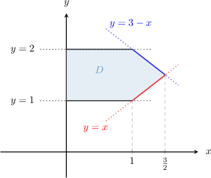
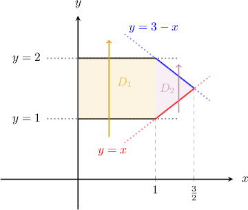
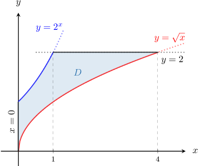
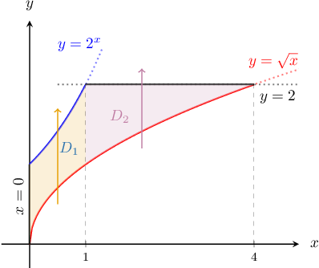
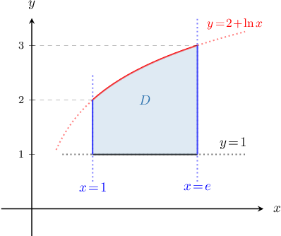
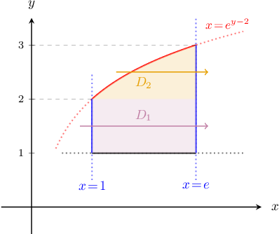
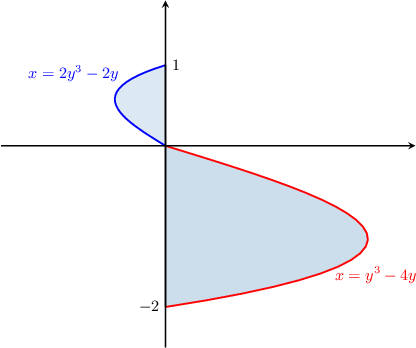
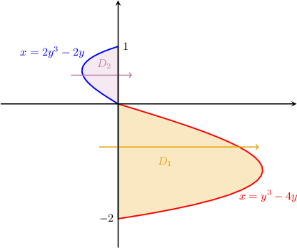

# Double Integrals Over Partitioned Regions

Source: https://www.mathacademy.com/topics/1996?courseId=54
Topic ID: 1996

## Prerequisites

- [Double Integrals Over Type II Regions](./2152-double-integrals-over-type-ii-regions.md)

## Lesson

### Introduction

Suppose we want to evaluate the double integral

$$

\displaystyle \iint\limits_{D} 2(x+y)\,\textrm{d}A,

$$

where $D$ is the finite region bounded by the lines $x=0, \, y=1, \, y=2, \, y=3-x,$ and $y=x.$ How do we proceed?

To evaluate an integral like this, we carry out the following steps:

**Step 1.** Sketch the region $D$. This allows us to determine the precise set-up of our integral.

In this example, we obtain the following:

**Step 2.** Split (if necessary) the region $D$ into several type I or II regions.

From the diagram above, we see that our region $D$ can be partitioned into two type I regions $D_1$ and $D_2,$ as follows.

So, we get

$$

D_1 = \big\{ (x,y) \: : \: 0 \leq x \leq 1, \quad 1 \leq y \leq 2\big\}

$$

and

$$

D_2= \{(x,y)\: : \: 1 \leq x \leq 3/2, \quad x \leq y \leq 3-x\}

$$

**Step 3.** Set up and evaluate the integral using the additivity property of double integrals. We recall the following fact:

*If $D$ is the union of two sub-regions, $D_1, D_2$, that don't overlap then,*

$$

\iint\limits_{D} f(x,y)\ \textrm d A = \iint\limits_{D_1} f(x,y)\ \textrm d A + \iint\limits_{D_2} f(x,y)\ \textrm d A.

$$

So, finally, we obtain

$$

\begin{aligned}\underset{𝐷}{∬}2(𝑥+𝑦)\,d𝐴 & =\underset{𝐷_{1}}{∬}2(𝑥+𝑦)\,d𝐴+\underset{𝐷_{2}}{∬}2(𝑥+𝑦)\,d𝐴 \\ & =∫_{10}^{}∫_{21}^{}2(𝑥+𝑦) d𝑦\,d𝑥+∫_{3/21}^{}∫_{3−𝑥𝑥}^{}2(𝑥+𝑦)\,d𝑦\,d𝑥.\end{aligned}

$$

### Example: Representing a Double Integral as a Repeated Integral Over a Union of Type I Regions

#### Question

Consider the finite region $D$ in the $xy$-plane enclosed by the curves $y= 2^x,$ $y=\sqrt{x}$ and lines $x=0$ and $y=2,$ as shown in the picture. Express the double integral of a function $f(x,y)$ over the region $D$ as a sum of repeated integrals over type I regions.

#### Explanation

The region $D$ can be partitioned into two type I regions $D_1$ and $D_2,$ as shown below.

As a result, we get

$$

D_1 = \big\{ (x,y) \: : \: 0 \leq x \leq 1, \quad \sqrt x \leq y \leq 2^x \big\}

$$

and

$$

D_2 = \big\{ (x,y) \: : \: 1 \leq x \leq 4, \quad \sqrt x \leq y \leq 2 \big\}.

$$

Therefore, using the additivity property of double integrals, we obtain

$$

\begin{aligned}\underset{𝐷}{∬}𝑓(𝑥,𝑦)\,d𝐴 & =\underset{𝐷_{1}}{∬}𝑓(𝑥,𝑦)\,d𝐴+\underset{𝐷_{2}}{∬}𝑓(𝑥,𝑦)\,d𝐴 \\ & =∫_{10}^{}∫_{2^{𝑥}\sqrt{√𝑥}}^{}𝑓(𝑥,𝑦)\,d𝑦\,d𝑥+∫_{41}^{}∫_{2\sqrt{√𝑥}}^{}𝑓(𝑥,𝑦)\,d𝑦\,d𝑥.\end{aligned}

$$

### Example: Representing a Double Integral as a Repeated Integral Over a Union of Type II Regions

#### Question

Consider the finite region $D$ in the $xy$-plane enclosed by the curve $y=2+\ln x,$ and the lines $y=1$, $x=1,$ and $x=e,$ as shown in the picture. Express the double integral of the function $f(x,y)$ over the region $D$ as a sum of repeated integrals over type II regions.

#### Explanation

First, notice that:

$$

\begin{aligned}𝑦=2+ln⁡𝑥 & \,⟹\,𝑥=𝑒^{𝑦−2}\end{aligned}

$$

The region $D$ can be partitioned into two type II regions $D_1$ and $D_2,$ as shown below.

As a result, we get

$$

D_1 = \bigg\{ (x,y) \: : \: 1 \leq y \leq 2, \quad 1 \leq x \leq e \bigg\}

$$

and

$$

D_2 = \bigg\{ (x,y) \: : \: 2 \leq y \leq 3, \quad e^{y-2} \leq x \leq e\bigg\}.

$$

Therefore, using the additivity property of double integrals, we obtain

$$

\begin{aligned}\underset{𝐷}{∬}𝑓(𝑥,𝑦)\,d𝐴 & =\underset{𝐷_{1}}{∬}𝑓(𝑥,𝑦)\,d𝐴+\underset{𝐷_{2}}{∬}𝑓(𝑥,𝑦)\,d𝐴 \\ & =∫_{21}^{}∫_{𝑒1}^{}𝑓(𝑥,𝑦)\,d𝑥\,d𝑦+∫_{32}^{}∫_{𝑒𝑒^{𝑦−2}}^{}𝑓(𝑥,𝑦)\,d𝑥\,d𝑦.\end{aligned}

$$

### Example: Evaluating a Double Integral Over a Partitioned Region

#### Question

The region $D$ is enclosed by the curves $x=2y^3-2y$ and $x=y^3-4y,$ and the $y$-axis, as shown in the picture. Evaluate the double integral $\displaystyle \iint\limits_{D} \mathrm{d}A.$

#### Explanation

The region $D$ can be partitioned into two type II regions $D_1$ and $D_2,$ as shown below.

As a result, we get

$$

D_1 = \bigg\{ (x,y) \: : \: -2 \leq y \leq 0, \quad 0 \leq x \leq y^3\!-\!4y \bigg\}

$$

and

$$

D_2 = \bigg\{ (x,y) \: : \: 0 \leq y \leq 1, \quad 2y^3\!-\!2y \leq x \leq 0 \bigg\}.

$$

Therefore, using the additivity property of double integrals, we obtain

$$

\begin{aligned}𝐴 & =\underset{𝐷}{∬}\,d𝐴 \\ & =\underset{𝐷_{1}}{∬}\,d𝐴+\underset{𝐷_{2}}{∬}\,d𝐴 \\ & =∫_{0−2}^{}∫_{𝑦^{3}−4𝑦0}^{}\,d𝑥\,d𝑦+∫_{10}^{}∫_{02𝑦^{3}−2𝑦}^{}\,d𝑥\,d𝑦 \\ & =∫_{0−2}^{}[𝑥]_{𝑦^{3}−4𝑦0}^{}\,d𝑦+∫_{10}^{}[𝑥]_{02𝑦^{3}−2𝑦}^{}\,d𝑦 \\ & =∫_{0−2}^{}(𝑦^{3}−4𝑦)\,d𝑦+∫_{10}^{}(2𝑦−2𝑦^{3})\,d𝑦 \\ & =[\frac{𝑦^{4}}{4}−2𝑦^{2}]_{0−2}^{}+[𝑦^{2}−\frac{𝑦^{4}}{2}]_{10}^{} \\ & =4+\frac{1}{2} \\ & =\frac{9}{2}.\end{aligned}

$$
