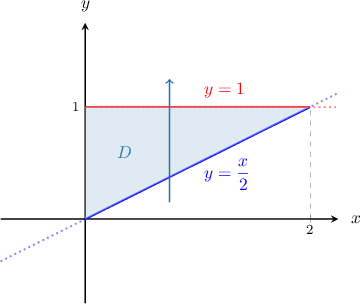
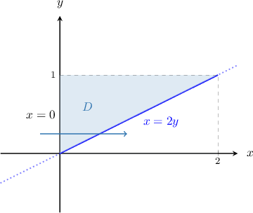
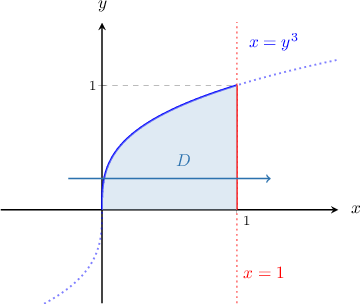
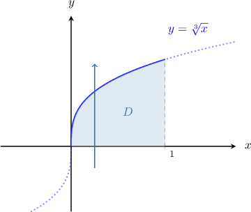
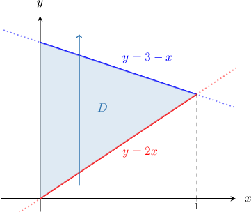
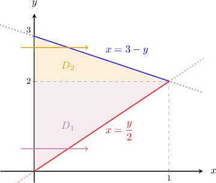
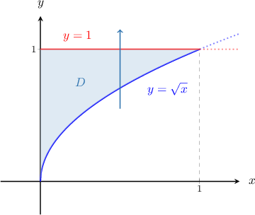
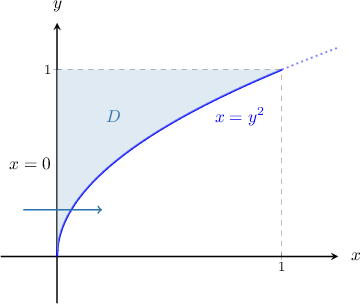

# Changing the Order of Integration in Double Integrals

Source: https://www.mathacademy.com/topics/1997?courseId=54
Topic ID: 1997

## Prerequisites

- [Double Integrals Over Partitioned Regions](./1996-double-integrals-over-partitioned-regions.md)

## Lesson

### Introduction

Suppose we want to evaluate the repeated integral

$$

\int_{\color{black}0}^{\color{black}2} \int_{\color{black}x/2}^{\color{black}1} \, e^{y^2}\,\text{d}{\color{black}y} \, \text{d}{\color{black}x}.

$$

The expression "$\,\text{d}y\,\text{d}x\,$" tells us that we should integrate first with respect to $y.$ This is problematic, though, as the integrand $e^{y^2}$ does not have an elementary antiderivative. So, what can we do?

In cases like this, **reversing the order of integration** from $\, \text{d}y\,\text{d}x\,$ to $\, \text{d}x\,\text{d}y$ might help. But beware! Because the domain of integration is non-rectangular, we can't just swap the order of the integrals. This is because, to integrate with respect to $x,$ we can't have $x$'s in the limits. So we need to work out new limits.

When swapping the order of integration, it is helpful to sketch the region $D$ over which we're integrating.

To integrate first with respect to $y,$ we imagine a line parallel to the $y$-axis, as shown above. Note the following:

- This line *enters* the region through the curve $\color{black} y=\dfrac{x}{2}$ and *leaves* at $\color{black} y=1.$ These are the variable limits for $y.$

- The minimum value of $x$ is $\color{black}0,$ and the maximum value of $x$ is ${\color{black}2}.$

So, the integral we were initially given is over the following type I region:

$$

D=\left \{ (x,y) \: : \: {\color{black}0} \leq x \leq {\color{black}2}, \quad {\color{black}\dfrac{x}{2}} \leq y \leq {\color{black}1} \right\}

$$

However, since we now want to integrate first with respect to $x,$ we need the limits for $x$ to be functions of $y$, and we need the limits of $y$ to be constants. To work these out, we redraw the region, but this time we imagine a line parallel to the $x$-axis.

- The line *enters* the region at $\color{black}x=0$ and *leaves* the region at $\color{black} x=2y.$ So these are our variable limits for $x.$

- The minimum value of $\color{black}y$ is $\color{black}0,$ and the maximum value of $y$ is ${\color{black}1}.$

So, we can consider $D$ to be the following type II region:

$$

D=\left \{ (x,y):\quad {\color{black}0} \leq x \leq {\color{black}2y}, \quad {\color{black}0} \leq y \leq {\color{black}1} \right\}

$$

Now that we have expressed the region $D$ as a type II region, we're ready to swap the order of integration and finally calculate our integral:

$$

\begin{aligned}∫_{20}∫_{1𝑥/2}\,𝑒^{𝑦^{2}}\,d𝑦\,d𝑥 & =∫_{10}∫_{2𝑦0}𝑒^{𝑦^{2}}\,d𝑥\,d𝑦 \\ & =∫_{10}𝑒^{𝑦^{2}}[∫_{2𝑦0}d𝑥]\,d𝑦 \\ & =∫_{10}𝑒^{𝑦^{2}}[𝑥]_{2𝑦0}\,d𝑦 \\ & =∫_{10}2𝑦𝑒^{𝑦^{2}}d𝑦 \\ & =[𝑒^{𝑦^{2}}]_{10} \\ & =𝑒−1.\end{aligned}

$$

### Example: Swapping the Order of Integration on a Non-Partitioned Region

#### Question

Change the order of integration in the double integral $\displaystyle \int_0^1 \int_{y^3}^{1} f(x,y) \: \text{d}x \: \text{d}y.$

#### Explanation

The diagram above shows the region of integration. It is a type II region, and its type II representation is

$$

D= \big\{ (x,y) \::\: 0 \leq y \leq1, \quad y^3 \leq x \leq 1 \big\},

$$

Notice that the top boundary of the region, written in the form $x=x(y),$ is

$$

x = y^3\quad\Longrightarrow\quad y = \sqrt[3]{x},

$$

and the bottom boundary of the region is

$$

y = 0.

$$

To change the order of integration, we write $D$ as a type I region. The type I representation of the region is

$$

D= \big\{ (x,y) \::\: 0 \leq x \leq 1, \quad 0 \leq y \leq \sqrt[3]{x} \big\}.

$$

as shown in the diagram below.

Therefore, swapping the order of integration, we obtain

$$

\begin{aligned}∫_{10}∫_{1𝑦^{3}}^{}𝑓(𝑥,𝑦)\,d𝑥\,d𝑦 & =∫_{10}∫_{\sqrt[√𝑥]{3}0}^{}𝑓(𝑥,𝑦)\,d𝑦\,d𝑥.\end{aligned}

$$

### Example: Swapping the Order of Integration on a Partitioned Region

#### Question

Change the order of integration in the double integral $\displaystyle \int_0^1\int_{2x}^{3-x} f(x,y)\,\text{d}y\,\text{d}x.$

#### Explanation

The diagram above shows the region of integration. This is a type I region, and its type I representation is

$$

D=\big\{ (x,y) \::\: 0 \leq x \leq 1, \quad 2x \leq y \leq 3-x \big\}.

$$

To change the order of integration, we need to split $D$ into two type II regions.

Notice that the right boundary of the lower region, written in the form $x=x(y),$ is

$$

x=\dfrac{y}{2}.

$$

Also, the right boundary of the upper region, written in the form $x=x(y),$ is

$$

x=3-y.

$$

So, we can write $D$ as a union of

$$

D_1 = \Big\{ (x,y) \::\: 0 \leq y \leq 2, \quad 0 \leq x \leq \dfrac{y}{2} \Big\}

$$

and

$$

D_2 = \Big\{ (x,y) \::\: 2 \leq y \leq 3, \quad 0 \leq x \leq 3-y \Big\}.

$$

Therefore, swapping the order of integration, we obtain

$$

\begin{aligned}∫_{10}∫_{3−𝑥2𝑥}𝑓(𝑥,𝑦)\,d𝑦\,d𝑥 & =∫_{20}∫_{𝑦/20}𝑓(𝑥,𝑦)\,d𝑥\,d𝑦+∫_{32}∫_{3−𝑦0}𝑓(𝑥,𝑦)\,d𝑥\,d𝑦.\end{aligned}

$$

### Example: Evaluating a Double Integral by Swapping the Order of Integration

#### Question

Change the order of integration and evaluate the double integral $\displaystyle{\int_0^{1} \int_{\sqrt{x}}^{1} 9\sqrt{y^3+1}\,\text{d}y\,\text{d}x}.$

#### Explanation

The diagram above shows the region of integration. This is a type I region, and its type I representation is

$$

D = \big\{ (x,y) \::\: 0 \leq x \leq 1, \quad \sqrt{x} \leq y \leq 1 \big\}.

$$

Notice that the left boundary of the region, written in the form $y=y(x),$ is

$$

x=0,

$$

and the right boundary of the region, written in the form $y=y(x),$ is

$$

y = \sqrt{x} \qquad\Longrightarrow\qquad x=y^2.

$$

To change the order of integration, we write $D$ as type II region. Its type II representation is

$$

D = \big\{ (x,y) \::\: 0 \leq y \leq 1, \quad 0 \leq x \leq y^2 \big\},

$$

as shown in the diagram below.

Therefore, swapping the order of integration, we obtain

$$

\begin{aligned}∫_{10}∫_{1\sqrt{𝑥}}^{}9\sqrt{𝑦^{3}+1}\,d𝑦\,d𝑥 & =∫_{10}∫_{𝑦^{2}0}^{}9\sqrt{𝑦^{3}+1}\,d𝑥\,d𝑦 \\ & =9∫_{10}\sqrt{𝑦^{3}+1}[∫_{𝑦^{2}0}^{}\,d𝑥]\,d𝑦 \\ & =9∫_{10}\sqrt{𝑦^{3}+1}[𝑥\,]_{𝑦^{2}0}^{}\,d𝑦 \\ & =3∫_{10}3𝑦^{2}(𝑦^{3}+1)^{1/2}\,d𝑦 \\ & =3[\frac{2}{3}(𝑦^{3}+1)^{3/2}]_{10} \\ & =[2(𝑦^{3}+1)^{3/2}]_{10} \\ & =2(2)^{3/2}−2 \\ & =4\sqrt{2}−2.\end{aligned}

$$
