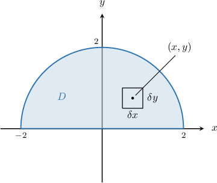
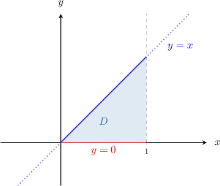
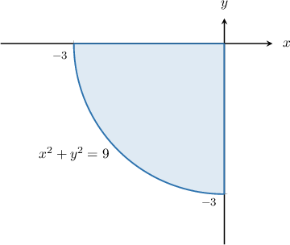

# Density, Mass, and Charge of Plane Laminas

Source: https://www.mathacademy.com/topics/2025?courseId=54
Topic ID: 2025

## Prerequisites

- [Double Integrals in Plane Polar Coordinates](./2030-double-integrals-in-plane-polar-coordinates.md)
- [Double Integrals Over Type II Regions](./2152-double-integrals-over-type-ii-regions.md)

## Lesson

### Introduction

The **mass density function** $\lambda (x,y)$ of a two-dimensional shape describes how its mass is distributed across the shape.

More precisely, $\lambda(x,y)$ tells us the *mass per unit area* at any point $(x,y)$ on the shape. The units of $\lambda$ are usually $\text{kg}/\text{m}^2.$

Suppose we want to determine the total mass of the semi-circular metal plate $D$ with mass density function $\lambda(x,y),$ shown below.

The small rectangle shown has mass $\delta M$ equal to its average density (which we can assume is approximately $\lambda (x,y)$) times the area of the piece.

$$

\delta M = \lambda (x, y)\, \delta x \delta y = \lambda (x, y) \, \delta A

$$

By summing all contributions to the mass made by each small rectangle and taking the limit as $\delta A \to 0$ in the usual way, we find that the mass of the entire plate is given by

$$

M = \iint \limits_{D} \lambda(x,y) \, \text{d}A.

$$

Note that since mass is never negative, we must have $\lambda \geq 0$ for $\lambda$ to be a valid mass density function.

### Calculating the Electric Charge Over a Metal Plate

We can also use density functions to describe the distribution of electric charge across a metallic plate.

The distribution of electric charge is given by its **charge density function,** denoted $\rho(x,y).$ The units of $\rho$ are $\text{C}/\text{m}^2,$ where $\textrm C$ is the standard unit of electric charge, known as the **coulomb**.

In general, the total electric charge $Q$ of a two-dimensional region $D$ with the charge density function $\rho(x,y)$ is given by

$$

Q = \iint\limits_D \rho(x,y) \: \mathrm d A.

$$

Since electric charge can be positive *and* negative, $\rho$ can be any real number.

### Example: Computing Mass or Charge Over a Rectangular Domain

#### Question

Find the total charge $Q$ of a metal plate that occupies the region $D = \{(x,y): 0 \le x \le 1, \, 0 \le y \le 2\}$ with charge density $\rho (x,y) = 4 - 3y^2 + 2x.$

#### Explanation

The total charge $Q$ of a plate that occupies the region $D = \{(x,y): 0 \leq x \leq 1, \, 0 \leq y \leq 2\}$ with charge density $\rho (x,y) = 4 - 3y^2 + 2x$ is given by

$$

\begin{aligned}𝑄 & =\underset{𝐷}{∬}(4−3𝑦^{2}+2𝑥)\,d𝐴.\end{aligned}

$$

First, we express our double integral as a repeated integral:

$$

\iint\limits_{D} (4 - 3y^2 + 2x) \:\text{d}A = \int_{0}^2 \left[ \int_{0}^1 (4 - 3y^2 + 2x) \:\text{d}x \right] \text{d}y

$$

Now, we evaluate the inner integral by integrating with respect to $x$, treating $y$ as a constant:

$$

\begin{aligned}∫_{20}[∫_{10}(4−3𝑦^{2}+2𝑥)\,d𝑥]d𝑦 & =∫_{20}[4𝑥−3𝑦^{2}𝑥+𝑥^{2}]_{10}\,d𝑦 \\ & =∫_{20}[(4(1)−3𝑦^{2}(1)+(1)^{2})−(4(0)−3𝑦^{2}(0)−(0)^{2})]d𝑦 \\ & =∫_{20}(5−3𝑦^{2})\,d𝑦\end{aligned}

$$

Finally, we integrate with respect to $y{:}$

$$

\begin{aligned}∫_{20}(5−3𝑦^{2})\,d𝑦 & =[5𝑦−𝑦^{3}]_{20} \\ & =(5(2)−(2)^{3})−(5(0)−(0)^{3}) \\ & =(10−8)−0 \\ & =2\end{aligned}

$$

Therefore, the charge of the plate is $Q=2.$

### Example: Computing Mass or Charge Over a Type I or Type II Region

#### Question

A triangular plate occupies the region enclosed between the lines and as shown above. The plate's mass density function is given by Find the total mass of the triangular plate.

#### Explanation

The mass of the triangular plate occupying the region with mass density is given by

Notice that is a type I region. So, we can express the integral as follows:

First, we evaluate the inner integral by integrating with respect to treating as a constant:

Then, we integrate with respect to

Therefore, the total mass of the plate is

### Example: Computing Mass or Charge Using Polar Coordinates

#### Question

Find the total charge $Q$ of a copper plate that occupies the region $D$ shown above, and has charge density

$$

\rho (x,y) = \dfrac{4x}{\sqrt{x^2+y^2}} .

$$

#### Explanation

First, notice that the region $D$ represents one-quarter of the disk of radius $3$ centered at $\left(0,0\right).$

The total charge $Q$ of an object occupying the region $D$ with charge density $\rho (x,y) = \dfrac{4x}{\sqrt{x^2+y^2}}$ is given by

$$

Q = \iint\limits_{D} \dfrac{4x}{\sqrt{x^2+y^2}} \,\text{d}A.

$$

We need to change the coordinate system from Cartesian coordinates to polar coordinates. To do this, we will use the change of variables formula in the form

$$

\iint\limits_{D} \rho(x,y) \ \mathrm d A = \iint\limits_{\Delta} \ \rho(r \cos\theta, r\sin\theta) \: r \ \mathrm d r \mathrm d \theta.

$$

The following equations connect Cartesian and polar coordinates:

$$

\begin{aligned}𝑥=𝑟cos⁡𝜃 \\ 𝑦=𝑟sin⁡𝜃\end{aligned}

$$

With that in mind, let's now write the curve $x^2+y^2=9$ in polar coordinates:

$$

\begin{aligned}𝑥^{2}+𝑦^{2} & =9 \\ (𝑟cos⁡𝜃)^{2}+(𝑟sin⁡𝜃)^{2} & =9 \\ 𝑟^{2}(cos^{2}⁡𝜃+sin^{2}⁡𝜃) & =9 \\ 𝑟^{2} & =9 \\ 𝑟 & =3\end{aligned}

$$

Therefore, in polar coordinates $(r, \theta),$ the region can be expressed as

$$

\Delta = \Big\{ (r,\theta) \: : \: 0 \leq r \leq 3, \: \pi \leq \theta \leq \dfrac{3\pi}{2} \Big\}.

$$

Therefore, we obtain

$$

\begin{aligned}\underset{𝐷}{∬}\frac{4𝑥}{\sqrt{𝑥^{2}+𝑦^{2}}}\,d𝐴 & =\underset{Δ}{∬}\frac{4𝑟cos⁡𝜃}{\sqrt{𝑟^{2}cos^{2}⁡𝜃+𝑟^{2}sin^{2}⁡𝜃}}\,𝑟\,d𝑟d𝜃 \\ & =∫_{3𝜋/2𝜋}∫_{30}4𝑟cos⁡𝜃\,d𝑟\,d𝜃 \\ & =∫_{3𝜋/2𝜋}4cos⁡𝜃[∫_{30}𝑟\,d𝑟]\,d𝜃 \\ & =∫_{3𝜋/2𝜋}4cos⁡𝜃[\frac{𝑟^{2}}{2}]_{30}\,d𝜃 \\ & =∫_{3𝜋/2𝜋}4cos⁡𝜃(\frac{9}{2}−0)\,d𝜃 \\ & =18∫_{3𝜋/2𝜋}cos⁡𝜃\,d𝜃 \\ & =18[sin⁡𝜃]_{3𝜋/2𝜋} \\ & =18[−1−0] \\ & =−18.\end{aligned}

$$

Therefore, the total charge of the quarter-disk is $Q = - 18.$
