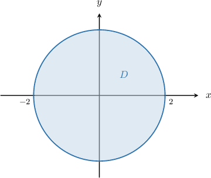
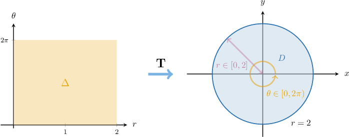
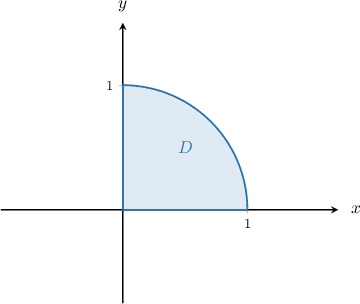
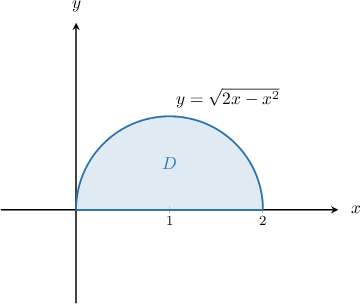
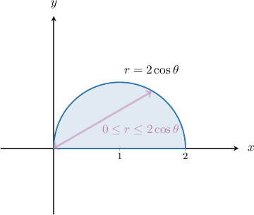
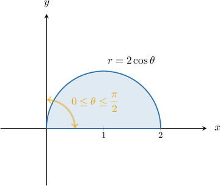
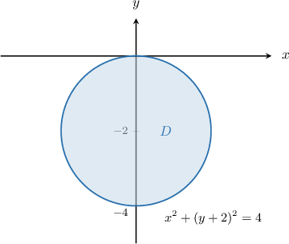
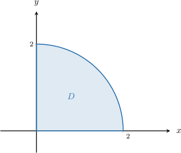

# Double Integrals in Plane Polar Coordinates

Source: https://www.mathacademy.com/topics/2030?courseId=54
Topic ID: 2030

## Prerequisites

- [Integration Using the Double-Angle Formulas](../../../ap-courses/lessons/ap-calculus-ab/1038-integration-using-the-double-angle-formulas.md)
- [Double Integrals Over Type I Regions](./2151-double-integrals-over-type-i-regions.md)
- [Polar Coordinate Transformations](./4135-polar-coordinate-transformations.md)

## Lesson

### Introduction

Evaluating double integrals by changing the variables to polar coordinates is often easier than using Cartesian coordinates.

For example, suppose we want to evaluate the double integral

$$

\displaystyle \iint\limits_{D}{{\left( {x^2 + y^2} \right)\,\mathrm d A}},

$$

where $D$ is the disk with center $(0,0)$ and radius $2,$ shown below.

This is a challenging integral to evaluate as it currently stands. However, we should recognize that the problem naturally lends itself to plane polar coordinates because

- the domain $D$ is a disc of radius $2$ centered at $O,$ which has a simple polar representation, and

- the integrand $f(x,y) = x^2+y^2$ can also be expressed simply in polar coordinates.

So, let's transform the entire problem to polar coordinates using the transformation $\mathbf T,$ defined by

$$

x=r\cos\theta, \quad y=r\sin\theta.

$$

The preimage of $D$ under the action of $\mathbf T$ is the rectangular region $\Delta,$ given by

$$

\Delta = \big\{ (r,\theta) \: : \: 0 \leq r \leq 2, \: 0 \leq \theta \leq 2\pi \big\}.

$$

The region $D$ and its preimage $\Delta$ are shown below.

To express our integral in terms of polar coordinates, we will use the **change of variables formula,** given by

$$

\iint\limits_{D} f(x,y) \, {{\color{black}{\mathrm d A}}} = \iint\limits_{\Delta} \ f(r\cos\theta, r\sin\theta) \: {{\color{black}{r \ \mathrm d r \mathrm d \theta}}}.

$$

When expressing our integral in polar coordinates, we must write

$$

{\color{black}{\textrm d A}} = {\color{black}{r\,\textrm d r\textrm d \theta}}.

$$

It's important not to forget the extra factor of $r.$

Now, applying the change of variables formula, we obtain

$$

\begin{aligned}\underset{𝐷}{∬}(𝑥^{2}+𝑦^{2})\,d𝐴 & =\underset{Δ}{∬}((𝑟cos⁡𝜃)^{2}+(𝑟sin⁡𝜃)^{2})\,𝑟\,d𝑟d𝜃 \\ & =∫_{2𝜋0}^{}∫_{20}^{}𝑟^{3}(cos^{2}⁡𝜃+sin^{2}⁡𝜃)\,d𝑟\,d𝜃 \\ & =∫_{2𝜋0}^{}∫_{20}^{}𝑟^{3}\,d𝑟\,d𝜃.\end{aligned}

$$

Evaluating the integral, we get

$$

\begin{aligned}∫_{2𝜋0}^{}∫_{20}^{}𝑟^{3}\,d𝑟\,d𝜃 & =∫_{2𝜋0}^{}d𝜃∫_{20}^{}𝑟^{3}\,d𝑟 \\ & =2𝜋⋅∫_{20}^{}𝑟^{3}\,d𝑟 \\ & =2𝜋⋅4 \\ & =8𝜋.\end{aligned}

$$

Therefore, we conclude that

$$

\displaystyle \iint\limits_{D}{{\left( {x^2 + y^2} \right)\,\mathrm d A}} = 8\pi.

$$

In terms of transformations, the change of variables formula maps the non-rectangular integration domain $D$ to the rectangular domain $\Delta,$ making the integral much easier to evaluate.

### Example: Rewriting a Double Integral Over a Circle or Part-Circle Centered at the Origin

#### Question

The region $D$ is the quarter-circle shown above. What is $\displaystyle \iint\limits_D y \sqrt{x^2+y^2} \: \textrm{d}A$ expressed in polar coordinates?

#### Explanation

We will use the change of variables formula in the form

$$

\iint\limits_{D} f(x,y) \ \mathrm d A = \iint\limits_{\Delta} \ f(r\cos\theta, r\sin\theta) \: r \ \mathrm d r \mathrm d \theta.

$$

First, notice that the region $D$ represents a portion of the disk of radius $1$ centered at the origin. In polar coordinates $(r, \theta),$ the region can be expressed as

$$

\Delta = \Big\{ (r,\theta) \: : \: 0 \leq r \leq 1, \: 0 \leq \theta \leq \dfrac{\pi}{2} \Big\}.

$$

Therefore, using the change of variables formula, we obtain

$$

\begin{aligned}\underset{𝐷}{∬}𝑦\sqrt{√𝑥^{2}+𝑦^{2}}\,d𝐴 & =\underset{Δ}{∬}(𝑟sin⁡𝜃)\sqrt{√(𝑟cos⁡𝜃)^{2}+(𝑟sin⁡𝜃)^{2}}\,𝑟\,d𝑟d𝜃 \\ & =\underset{Δ}{∬}𝑟^{2}sin⁡𝜃\sqrt{√𝑟^{2}(cos^{2}⁡𝜃sin^{2}⁡𝜃)}\,d𝑟d𝜃 \\ & =\underset{Δ}{∬}𝑟^{3}sin⁡𝜃\sqrt{√cos^{2}⁡𝜃+sin^{2}⁡𝜃}\,d𝑟d𝜃 \\ & =\underset{Δ}{∬}𝑟^{3}sin⁡𝜃\,d𝑟d𝜃 \\ & =∫_{𝜋/20}^{}∫_{10}^{}𝑟^{3}sin⁡𝜃\,d𝑟\,d𝜃.\end{aligned}

$$

### Writing More Complex Regions in Polar Coordinates

Let's get a little more practice at writing regions in polar coordinates.

Consider the semicircular disc of radius $1$ centered $(1,0)$ in the first quadrant, shown below. The equation of the curve is $y=\sqrt{2x-x^2}.$

First, we recall that the following equations relate Cartesian and polar coordinates:

$$

\begin{aligned}𝑥=𝑟cos⁡𝜃 \\ 𝑦=𝑟sin⁡𝜃\end{aligned}

$$

Let's now use the above formulas to write the function $y=\sqrt{2x-x^2}$ in polar coordinates:

$$

\begin{aligned}𝑦 & =\sqrt{√2𝑥−𝑥^{2}} \\ 𝑦^{2} & =2𝑥−𝑥^{2} \\ 𝑥^{2}+𝑦^{2} & =2𝑥 \\ (𝑟cos⁡𝜃)^{2}+(𝑟sin⁡𝜃)^{2} & =2𝑟cos⁡𝜃 \\ 𝑟^{2}(cos^{2}⁡𝜃+sin^{2}⁡𝜃) & =2𝑟cos⁡𝜃 \\ 𝑟^{2} & =2𝑟cos⁡𝜃 \\ 𝑟^{2}−2𝑟cos⁡𝜃 & =0 \\ 𝑟(𝑟−2cos⁡𝜃) & =0\end{aligned}

$$

Since $r$ cannot be identical to zero on the entire semicircle, we must have $r = 2\cos\theta.$

Now, let's determine the limits for $r$ and $\theta.$ First of all, $r$ can vary from $r=0$ (at the origin) to $r=2\cos\theta$ (at the boundary of the region):

Secondly, $\theta$ can vary between $\theta=0$ (the positive $x$-axis) and $\theta=\dfrac{\pi}{2}$ (the positive $y$-axis):

Therefore, in polar coordinates $(r, \theta),$ the region can be expressed as

$$

\Delta = \Big\{ (r,\theta) \: : \: 0 \leq r \leq 2\cos\theta, \: 0 \leq \theta \leq \dfrac{\pi}{2} \Big\}.

$$

### Example: Rewriting a Double Integral Over a Circle or Part-Circle Not Centered at the Origin

#### Question

Given that $D = \left\{(x,y) \,: \, x^2 + (y+2)^2 \leq 4\right\},$ express the following integral in polar coordinates:

$$

\displaystyle \iint\limits_D e^{\sqrt{x^2 + y^2}} \, \textrm{d}A

$$

#### Explanation

We need to change the coordinate system from Cartesian coordinates to polar coordinates. To do this, we will use the change of variables formula in the form

$$

\iint\limits_{D} f(x,y) \, \mathrm d A = \iint\limits_{\Delta} \, f(r \cos\theta, r\sin\theta) \, r \, \mathrm d r \, \mathrm d \theta.

$$

First, let's sketch our region $D{:}$

Notice that the region $D$ represents the disk of radius $2$ centered at $(0,-2).$

Cartesian and polar coordinates are connected by the following equations:

$$

\begin{aligned}𝑥=𝑟cos⁡𝜃 \\ 𝑦=𝑟sin⁡𝜃\end{aligned}

$$

With that in mind, let's now write the $x^2 + (y+2)^2 = 4$ in polar coordinates:

$$

\begin{aligned}𝑥^{2}+(𝑦+2)^{2} & =4 \\ (𝑟cos⁡𝜃)^{2}+(𝑟sin⁡𝜃+2)^{2} & =4 \\ 𝑟^{2}cos^{2}⁡𝜃+𝑟^{2}sin^{2}⁡𝜃+4𝑟sin⁡𝜃+4 & =4 \\ 𝑟^{2}(cos^{2}⁡𝜃+sin^{2}⁡𝜃)+4𝑟sin⁡𝜃 & =0 \\ 𝑟^{2}+4𝑟sin⁡𝜃 & =0 \\ 𝑟(𝑟+4sin⁡𝜃) & =0\end{aligned}

$$

Since $r$ cannot be identical to zero on the entire circle, we must have $r = -4\sin{\theta}.$

So, in polar coordinates $(r, \theta),$ the region can be expressed as

$$

\Delta = \left\{ (r,\theta) \, : \, 0 \leq r \leq -4\sin{\theta}, \, \pi \leq \theta \leq 2\pi \right\}.

$$

Therefore, using the change of variables formula, we obtain

$$

\begin{aligned}\underset{𝐷}{∬}𝑒^{\sqrt{√𝑥^{2}+𝑦^{2}}}\,d𝐴 & =\underset{Δ}{∬}𝑒^{\sqrt{√(𝑟cos⁡𝜃)^{2}+(𝑟sin⁡𝜃)^{2}}}\,𝑟\,d𝑟\,d𝜃 \\ & =∫_{2𝜋𝜋}^{}∫_{−4sin⁡𝜃0}^{}𝑟𝑒^{\sqrt{√𝑟^{2}(cos^{2}⁡𝜃+sin^{2}⁡𝜃)}}\,d𝑟\,d𝜃 \\ & =∫_{2𝜋𝜋}^{}∫_{−4sin⁡𝜃0}^{}𝑟𝑒^{\sqrt{√𝑟^{2}}}\,d𝑟\,d𝜃 \\ & =∫_{2𝜋𝜋}^{}∫_{−4sin⁡𝜃0}^{}𝑟𝑒^{𝑟}\,d𝑟\,d𝜃.\end{aligned}

$$

### Example: Evaluating Repeated Integrals Expressed in Polar Coordinates

#### Question

Evaluate $\displaystyle \int_{0}^{\pi/8} \int_0^{\sin2\theta} r \, \textrm d r\,\textrm d \theta.$

#### Explanation

First, we integrate with respect to $r,$ treating $\theta$ as a constant:

$$

\begin{aligned}∫_{𝜋/80}^{}∫_{sin⁡2𝜃0}^{}𝑟\,d𝑟\,d𝜃 & =\frac{1}{2}∫_{𝜋/80}^{}[𝑟^{2}]_{sin⁡2𝜃0}^{}\,d𝜃 \\ & =\frac{1}{2}∫_{𝜋/80}^{}sin^{2}⁡2𝜃\,d𝜃\end{aligned}

$$

Next, we recall the double-angle formula

$$

\cos{2x} = 1-2\sin^2 x.

$$

Substituting $x=2\theta$ and rearranging, we get

$$

\sin^22\theta = \dfrac12\left(1-\cos4\theta\right).

$$

Finally, we can finish our integral by integrating with respect to $\theta,$ as follows:

$$

\begin{aligned}\frac{1}{2}∫_{𝜋/80}^{}sin^{2}⁡2𝜃\,d𝜃 & =\frac{1}{2}∫_{𝜋/80}^{}\frac{1}{2}(1−cos⁡4𝜃)\,d𝜃 \\ & =\frac{1}{4}∫_{𝜋/80}^{}1−cos⁡4𝜃\,d𝜃 \\ & =\frac{1}{4}[𝜃−\frac{1}{4}sin⁡4𝜃]_{𝜋/80}^{} \\ & =\frac{1}{4}[(\frac{𝜋}{8}−\frac{1}{4}sin⁡(\frac{𝜋}{2}))−(0−\frac{1}{4}sin⁡(0))] \\ & =\frac{1}{4}(\frac{𝜋}{8}−\frac{1}{4}) \\ & =\frac{1}{4}(\frac{𝜋}{8}−\frac{2}{8}) \\ & =\frac{1}{32}(𝜋−2)\end{aligned}

$$

### Example: Evaluating a Double Integral by Converting To Polar Coordinates

#### Question

Integrate the function $f(x, y) = 15xy^2$ over the portion of the disk of radius $2$ centered at the origin, where $x \geq 0,y \geq 0.$

#### Explanation

We will use the change of variables formula in the form

$$

\iint\limits_{D} f(x,y) \ \mathrm d A = \iint\limits_{\Delta} \ f(r\cos\theta, r\sin\theta) \: r \ \mathrm d r \mathrm d \theta.

$$

First, let's sketch our region $D\mathbin{:}$

In polar coordinates $(r, \theta),$ the region can be expressed as

$$

\Delta = \left\{ (r,\theta) \: : \: 0 \leq r \leq 2, \:0\leq \theta \leq \dfrac{\pi}{2} \right\}.

$$

Therefore, using the change of variables formula, we obtain

$$

\begin{aligned}\underset{𝐷}{∬}15𝑥𝑦^{2}\,d𝐴 & =\underset{Δ}{∬}15𝑟cos⁡𝜃⋅(𝑟sin⁡𝜃)^{2}\,𝑟\,d𝑟d𝜃 \\ & =∫_{𝜋/20}^{}∫_{20}^{}15𝑟^{4}cos⁡𝜃sin^{2}⁡𝜃\,d𝑟\,d𝜃 \\ & =∫_{𝜋/20}^{}3cos⁡𝜃sin^{2}⁡𝜃∫_{20}^{}5𝑟^{4}\,d𝑟\,d𝜃 \\ & =∫_{𝜋/20}^{}3cos⁡𝜃sin^{2}⁡𝜃\,[𝑟^{5}]_{20}^{}\,d𝜃 \\ & =∫_{𝜋/20}^{}3cos⁡𝜃sin^{2}⁡𝜃(2^{5}−0)d𝜃 \\ & =32∫_{𝜋/20}^{}3cos⁡𝜃sin^{2}⁡𝜃\,d𝜃 \\ & =32[sin^{3}⁡𝜃]_{𝜋/20}^{} \\ & =32(sin^{3}⁡(\frac{𝜋}{2})−sin^{3}⁡(0)) \\ & =32(1−0) \\ & =32.\end{aligned}

$$
