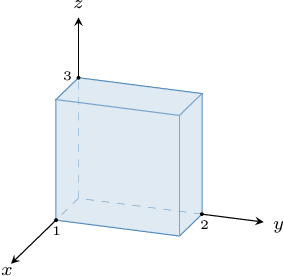
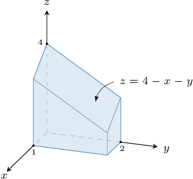
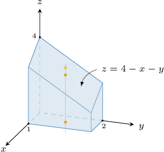
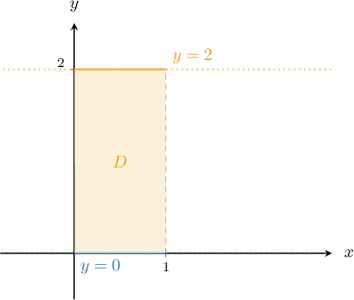

# Calculating Volumes of Solids Using Triple Integrals

Source: https://www.mathacademy.com/topics/2053?courseId=54
Topic ID: 2053

## Prerequisites

- [Triple Integrals Over Type II Regions](./2141-triple-integrals-over-type-ii-regions.md)
- [Triple Integrals Over Type III Regions](./2142-triple-integrals-over-type-iii-regions.md)

## Lesson

### Introduction

Recall that the double Integral of the function $f(x,y) = 1$ over a domain $D\subset \mathbb R^2$ is simply the area of $D\mathbin{:}$

$$

\textrm{Area}\ \!(D) = \displaystyle \iint\limits_{D} 1 \cdot \textrm d A = \displaystyle \iint\limits_{D} \ \textrm d A

$$

We have a similar result for triple integrals:

*If $R$ is a region in three-dimensional space, then the volume of $R$ is given by*

$$

\textrm{Volume}(R) = \iiint\limits_{R} \textrm{d}V.

$$

In other words, the volume of $R$ equals the triple integral of the function $f(x,y,z)=1$ over $R.$

For example, let's use triple integrals to find the volume of the rectangular prism shown below.

Notice that our solid can be written in set-builder notation as

$$

R = \big\{ (x,y,z) \: : \: 0 \leq x \leq 1, \:\: 0 \leq y \leq 2, \:\: 0 \leq z \leq 3 \big\}.

$$

Therefore, the volume of $R$ is

$$

\begin{aligned}𝑉 & =\underset{𝑅}{∭}d𝑉 \\ & =∫_{10}^{}∫_{20}^{}∫_{30}^{}d𝑧\,d𝑦\,d𝑥 \\ & =∫_{10}^{}d𝑥⋅∫_{20}^{}d𝑦⋅∫_{30}^{}d𝑧 \\ & =(1−0)⋅(2−0)⋅(3−0) \\ & =6.\end{aligned}

$$

**Note:** We get the same value using the formula for the volume of a rectangular prism:

$$

\begin{aligned}𝑉 & =length⋅width⋅height \\ & =1⋅2⋅3 \\ & =6\end{aligned}

$$

Let's see some more examples.

### Example: Finding the Volume of a Solid Given in Set Notation

#### Question

Find the volume of the solid $R,$ given by

$$

R = \Big\{ (x,y,z) \: : \: 1 \leq y \leq 2, \: 0 \leq z \leq \sqrt{2y}, \: 0 \leq x \leq yz \Big\}.

$$

#### Explanation

Notice that we have a three-dimensional type II region.

Therefore, the volume of $R$ is given by the following triple integral:

$$

\begin{aligned}𝑉 & =\underset{𝑅}{∭}d𝑉 \\ & =∫_{21}^{}∫_{\sqrt{√2𝑦}0}^{}∫_{𝑦𝑧0}^{}\,d𝑥\,d𝑧\,d𝑦 \\ & =∫_{21}^{}∫_{\sqrt{√2𝑦}0}^{}[𝑥]_{𝑥=𝑦𝑧𝑥=0}^{}\,d𝑧\,d𝑦 \\ & =∫_{21}^{}∫_{\sqrt{√2𝑦}0}^{}𝑦𝑧\,d𝑧\,d𝑦 \\ & =∫_{21}^{}𝑦[\frac{𝑧^{2}}{2}]_{𝑧=\sqrt{√2𝑦}𝑧=0}^{}\,d𝑦 \\ & =∫_{21}^{}\frac{𝑦}{2}(\sqrt{√2𝑦})^{2}\,d𝑦 \\ & =∫_{21}^{}𝑦^{2}\,d𝑦 \\ & =[\frac{𝑦^{3}}{3}]_{𝑦=2𝑦=1}^{} \\ & =\frac{1}{3}(8−1)−0 \\ & =\frac{7}{3}\end{aligned}

$$

### Example: Finding the Volume of a Solid Given a Diagram

#### Question

Find the volume of the solid region above.

**

#### Explanation

Notice that our solid can be written as the type I region

$$

R = \big\{ (x,y,z) \: : \: (x,y) \in D, \:\: 0 \leq z \leq 4-x-y \big\},

$$

where

$$

D = \big\{ (x,y) \: : \: 0 \leq x \leq 1, \:\: 0 \leq y \leq 2 \big\}

$$

is the projection of $R$ onto the $xy$-plane, shown below.

Hence, the type I representation of $R$ is

$$

R = \big\{ (x,y,z) \: : \: 0 \leq x \leq 1, \:\: 0 \leq y \leq 2, \:\: 0 \leq z \leq 4-x-y \big\}.

$$

Therefore, the volume of $R$ is given by the following triple integral:

$$

\begin{aligned}𝑉 & =\underset{𝑅}{∭}d𝑉 \\ & =∫_{10}^{}∫_{20}^{}∫_{4−𝑥−𝑦0}^{}d𝑧\,d𝑦\,d𝑥 \\ & =∫_{10}^{}∫_{20}^{}[𝑧]_{𝑧=4−𝑥−𝑦𝑧=0}^{}\,d𝑦\,d𝑥 \\ & =∫_{10}^{}∫_{20}^{}(4−𝑥−𝑦)−0\,d𝑦\,d𝑥 \\ & =∫_{10}^{}∫_{20}^{}4−𝑥−𝑦\,d𝑦\,d𝑥 \\ & =∫_{10}^{}[(4−𝑥)𝑦−\frac{𝑦^{2}}{2}]_{𝑦=2𝑦=0}^{}\,d𝑥 \\ & =∫_{10}^{}((4−𝑥)(2)−\frac{2^{2}}{2})−0\,d𝑥 \\ & =∫_{10}^{}6−2𝑥\,d𝑥 \\ & =[6𝑥−𝑥^{2}]_{𝑥=1𝑥=0}^{} \\ & =(6(1)−1^{2})−0 \\ & =5\end{aligned}

$$

### Interpreting a Verbal Description of a Solid

When a solid is described in words, we first identify its bounding surfaces and then decide how to describe the entire region with inequalities.

A useful strategy is:

- identify the variable that lies between a lower surface and an upper surface,

- determine the projection of the solid onto a coordinate plane,

- write bounds for the projected region,

- use those bounds to set up a triple integral with integrand equal to.

In many volume problems, the solid lies between a bottom surface and a top surface

In that case, we describe the solid by where is the projection of the solid onto the -plane.

So, to find the volume, we use

So, the verbal description tells us two things:

- which surface is below and which is above,

- which points belong to the base region.

Before integrating, it is always a good idea to check that the upper surface is actually above the lower surface on the entire projected region.

### Setting Up Volume from a Verbal Description

Consider the volume of the solid region enclosed by the -plane, the plane and the planes and

Notice that our solid can be written as a type I region.

First, the phrase **enclosed by the -plane** tells us that the bottom of the solid is

The plane is the top of the solid.

Also, the planes describe the projection of the solid onto the -plane. So the base region is the rectangle

Therefore, for each point in this rectangle, the variable runs from the bottom surface to the top surface:

So the volume is

Now we evaluate:

Therefore, the volume of the solid is

In problems like this, the planes involving only and usually describe the base region in the -plane, while the -plane and the surface or plane involving describe the lower and upper bounds for.

### Example: Finding the Volume of a Solid Given a Description

#### Question

Find the volume of the solid region enclosed by the surface the plane and the planes

#### Explanation

Notice that our solid can be written as a type III region.

For each point in the rectangular base region the variable runs from the surface up to the plane

So we can write:

Therefore, the volume of is given by the following triple integral:

### Using a Projection Region to Set Up a Double Integral

Sometimes a solid is enclosed between two surfaces. In these cases, we can compute its volume using a double integral over the projection region in the -plane.

Suppose a solid is enclosed between the paraboloids

To compute its volume, we use where is the projection region in the -plane.

First, we find where the two surfaces intersect. This gives the boundary of the projection region in the -plane:

So, the projection region is the disk

The height of the solid is the difference between the upper surface () and the lower surface ():

If we write using as the outer variable, then

The volume is given by the iterated integral:

### Connecting Triple Integrals and Double Integrals for Volume

Alternatively, we can conceptualize the volume of a solid using a **triple integral**.

Revisiting the previous example enclosed between the paraboloids, our solid can be formally written as a 3D region:

This means that for each point in the projection region the variable runs from the lower surface up to the upper surface

The volume of is given by evaluating a triple integral of over the region. By computing the innermost integral with respect to, this calculation logically reduces to the double integral formula:

If we write using as the outer variable, then so

### Example: Finding a Double-Integral Formula for Volume

#### Question

Consider the solid enclosed between the paraboloids and whose volume can be written in terms of double integrals, as follows:

Find and

#### Explanation

First, we need to determine the projection of the intersection of our surfaces onto the -plane. So, let's find where they intersect.

So, the projection of the intersection in the -plane is a circle.

Notice that our solid can be written as a type III region: where is the interior of the circle

As a result, the volume of is given by

Now, notice that the boundary of consists of

- the lower part and

- the upper part

for

Therefore, we have

So,
