# Triple Integrals in Spherical Polar Coordinates

Source: https://www.mathacademy.com/topics/2060?courseId=54
Topic ID: 2060

## Prerequisites

- [Surfaces in Spherical Polar Coordinates](./3570-surfaces-in-spherical-polar-coordinates.md)
- [Computing Triple Integrals Using a Change of Variables](./4151-computing-triple-integrals-using-a-change-of-variables.md)

## Lesson

### Introduction

When evaluating triple integrals, it's sometimes easier to change the variables from Cartesian coordinates to spherical polar coordinates.

For example, suppose we want to evaluate the triple integral

$$

\displaystyle \iiint\limits_R \left(x^2 + y^2 + z^2\right)^{3/2} \: \text{d}V

$$

where $R$ is the region enclosed by the sphere of radius $1$ centered at $O,$ as shown below.

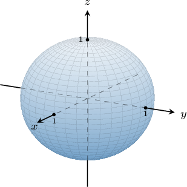

This integral seems too challenging when written in Cartesian coordinates. However, we should recognize that the problem lends itself to spherical polar coordinates because

- the domain $R$ has a simple spherical polar representation, and

- the integrand $f(x,y,z)=\left(x^2+y^2+z^2\right)^{3/2}$ can also be expressed simply in spherical polar coordinates.

So, let's transform the entire problem to spherical polar coordinates using the transformation $\mathbf{T},$ defined by

$$

x = \rho\cos\theta\sin\phi, \qquad y = \rho\sin\theta\sin\phi, \qquad z = \rho\cos\phi.

$$

The preimage of $R$ under the action of $\mathbf{T}$ is the rectangular region $\Delta,$ given by

$$

\Delta = \left\{ (\rho, \theta, \phi) \, : \, 0 \leq \rho \leq 1, \: 0 \leq \theta \lt 2\pi, \: 0 \leq \phi \leq \pi \right\},

$$

as shown below.

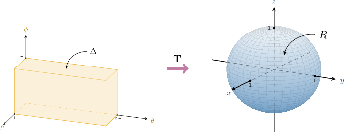

To express our integral in terms of spherical polar coordinates, we will use the change of variables formula

$$

\iiint\limits_{R} f(x,y,z) \, \mathrm{d}V = \iiint\limits_{\Delta} \, f(\rho\cos\theta\sin\phi, \rho\sin\theta\sin\phi, \rho\cos\phi) \: \left| \dfrac{\partial (x,y,z)}{\partial (\rho, \theta, \phi)} \right| \: \mathrm{d}\rho \, \mathrm{d}\theta \, \mathrm{d}\phi.

$$

It can be shown that the absolute value of the Jacobian determinant for a spherical change of variables is

$$

\left| \dfrac{\partial (x,y,z)}{\partial (\rho, \theta, \phi)} \right| = \rho^2\sin\phi.

$$

Therefore, the change of variables formula is

$$

\iiint\limits_{R} f(x,y,z) \, \mathrm{d}V = \iiint\limits_{\Delta} \, f(\rho\cos\theta\sin\phi, \rho\sin\theta\sin\phi, \rho\cos\phi) \: \rho^2\sin\phi \: \mathrm{d}\rho \, \mathrm{d}\theta \, \mathrm{d}\phi.

$$

Now, let's write our function $f(x,y,z) = \left(x^2 + y^2 + z^2\right)^{3/2}$ in spherical polar coordinates:

$$

\begin{aligned}𝑓(𝑥,𝑦,𝑧) & =𝑓(𝜌cos⁡𝜃sin⁡𝜙,𝜌sin⁡𝜃sin⁡𝜙,𝜌cos⁡𝜙) \\ & =(𝜌^{2})^{3/2} \\ & =𝜌^{3}\end{aligned}

$$

Therefore, using the change of variables formula, we obtain

$$

\begin{aligned}\underset{𝑅}{∭}(𝑥^{2}+𝑦^{2}+𝑧^{2})^{3/2}\,d𝑉 & =\underset{Δ}{∭}𝜌^{3}⋅𝜌^{2}sin⁡𝜙\,d𝜌\,d𝜃\,d𝜙 \\ & =∫_{𝜋0}∫_{2𝜋0}∫_{10}𝜌^{5}sin⁡𝜙\,d𝜌\,d𝜃\,d𝜙 \\ & =∫_{𝜋0}sin⁡𝜙\,d𝜙⋅∫_{2𝜋0}d𝜃⋅∫_{10}𝜌^{5}\,d𝜌 \\ & =[−cos⁡𝜙]_{𝜙=𝜋𝜙=0}⋅[𝜃]_{𝜃=2𝜋𝜃=0}⋅[\frac{1}{6}𝜌^{6}]_{𝜌=1𝜌=0}\,d𝜌 \\ & =−(−1−1)⋅(2𝜋−0)⋅\frac{1}{6}(1−0) \\ & =2⋅2𝜋⋅\frac{1}{6} \\ & =\frac{2𝜋}{3}.\end{aligned}

$$

### Example: Rewriting a Triple Integral Defined Over a Sphere

#### Question

The region $R$ is enclosed inside the sphere $x^2+y^2+z^2=4.$ Express the following triple integral in spherical polar coordinates.

$$

\displaystyle \iiint\limits_R (y-z)\sqrt{x^2+y^2+z^2} \:\text{d}V

$$

#### Explanation

We will use the change of variables formula in the form

$$

\iiint\limits_{R} f(x,y,z) \, \mathrm{d}V = \iiint\limits_{\Delta} \, f(\rho\cos\theta\sin\phi, \rho\sin\theta\sin\phi, \rho\cos\phi) \: \rho^2\sin\phi \: \mathrm{d}\rho \, \mathrm{d}\theta \, \mathrm{d}\phi.

$$

If $(\rho, \theta, \phi)$ are the spherical coordinates of a point, then its Cartesian coordinates $(x,y,z)$ can be found by using the following formulas:

$$

x = \rho\cos\theta\sin\phi, \qquad y = \rho\sin\theta\sin\phi, \qquad z = \rho\cos\phi

$$

Notice that the region $R$ represents the sphere of radius $2$ centered at the origin. As a result, in spherical polar coordinates, our region can be expressed as

$$

\Delta = \left\{ (\rho, \theta, \phi) \, : \, 0 \leq \rho \leq 2, \: 0 \leq \theta \lt 2\pi, \: 0 \leq \phi \leq \pi \right\}.

$$

Next, we substitute the spherical polar coordinates into the function $f(x,y,z)=(y-z)\sqrt{x^2+y^2+z^2}{:}$

$$

\begin{aligned}𝑓(𝑥,𝑦,𝑧) & =𝑓(𝜌cos⁡𝜃sin⁡𝜙,𝜌sin⁡𝜃sin⁡𝜙,𝜌cos⁡𝜙) \\ & =(𝜌sin⁡𝜃sin⁡𝜙−𝜌cos⁡𝜙)⋅𝜌 \\ & =𝜌^{2}(sin⁡𝜃sin⁡𝜙−cos⁡𝜙)\end{aligned}

$$

Therefore, using the change of variables formula, we obtain

$$

\begin{aligned}\underset{𝑅}{∭}(𝑦−𝑧)\sqrt{𝑥^{2}+𝑦^{2}+𝑧^{2}}\,d𝑉 & =\underset{Δ}{∭}𝜌^{2}(sin⁡𝜃sin⁡𝜙−cos⁡𝜙)⋅𝜌^{2}sin⁡𝜙\,d𝜌\,d𝜃\,d𝜙 \\ & =∫_{𝜋0}∫_{2𝜋0}∫_{20}𝜌^{4}sin⁡𝜙(sin⁡𝜃sin⁡𝜙−cos⁡𝜙)\,d𝜌\,d𝜃\,d𝜙.\end{aligned}

$$

### Example: Rewriting a Triple Integral Defined Over a Part-Sphere

#### Question

The region $R$ is enclosed inside the sphere $x^2+y^2+z^2=4$ for $y \leq 0.$ Express the following triple integral in spherical polar coordinates.

$$

\displaystyle \iiint\limits_R \dfrac{1}{x^2+y^2+z^2} \:\text{d}V

$$

#### Explanation

We will use the change of variables formula in the form

$$

\iiint\limits_{R} f(x,y,z) \, \mathrm{d}V = \iiint\limits_{\Delta} \, f(\rho\cos\theta\sin\phi, \rho\sin\theta\sin\phi, \rho\cos\phi) \: \rho^2\sin\phi \: \mathrm{d}\rho \, \mathrm{d}\theta \, \mathrm{d}\phi.

$$

If $(\rho, \theta, \phi)$ are the spherical coordinates of a point, then its Cartesian coordinates $(x,y,z)$ can be found by using the following formulas:

$$

x = \rho\cos\theta\sin\phi, \qquad y = \rho\sin\theta\sin\phi, \qquad z = \rho\cos\phi

$$

Notice that the region $R$ represents one-half of the sphere of radius $2$ centered at the origin.

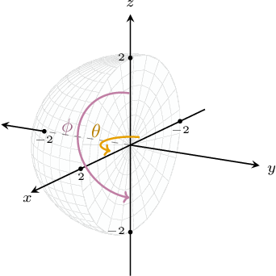

As a result, we obtain that in spherical polar coordinates, our region can be expressed as

$$

\Delta = \left\{ (\rho, \theta, \phi) \, : \, 0 \leq \rho \leq 2, \: \pi \leq \theta \leq 2\pi, \: 0 \leq \phi \leq \pi \right\}.

$$

Next, we substitute the spherical polar coordinates into the function $f(x,y,z)=\dfrac{1}{x^2+y^2+z^2}{:}$

$$

\begin{aligned}𝑓(𝑥,𝑦,𝑧) & =𝑓(𝜌cos⁡𝜃sin⁡𝜙,𝜌sin⁡𝜃sin⁡𝜙,𝜌cos⁡𝜙) \\ & =\frac{1}{𝜌^{2}}\end{aligned}

$$

Therefore, using the change of variables formula, we obtain

$$

\begin{aligned}\underset{𝑅}{∭}\frac{1}{𝑥^{2}+𝑦^{2}+𝑧^{2}}\,d𝑉 & =\underset{Δ}{∭}\frac{1}{𝜌^{2}}⋅𝜌^{2}sin⁡𝜙\,d𝜌\,d𝜃\,d𝜙 \\ & =∫_{𝜋0}∫_{2𝜋𝜋}∫_{20}sin⁡𝜙\,d𝜌\,d𝜃\,d𝜙.\end{aligned}

$$

### Example: Rewriting a Triple Integral Defined Over a Shifted Sphere

#### Question

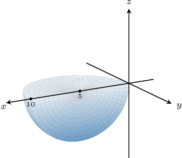

The region $R$ is enclosed inside the sphere $x^2+y^2+z^2=10x$ for $y \leq 0$ and $z \leq 0,$ shown above. Express the following triple integral in spherical polar coordinates.

$$

\iiint\limits_R \dfrac{1}{\sqrt{x^2+y^2+z^2}} \:\text{d}V

$$

#### Explanation

We will use the change of variables formula in the form

$$

\iiint\limits_{R} f(x,y,z) \, \mathrm{d}V = \iiint\limits_{\Delta} \, f(\rho\cos\theta\sin\phi, \rho\sin\theta\sin\phi, \rho\cos\phi) \: \rho^2\sin\phi \: \mathrm{d}\rho \, \mathrm{d}\theta \, \mathrm{d}\phi.

$$

If $(\rho, \theta, \phi)$ are the spherical coordinates of a point, then its Cartesian coordinates $(x,y,z)$ can be found by using the following formulas:

$$

x = \rho\cos\theta\sin\phi, \qquad y = \rho\sin\theta\sin\phi, \qquad z = \rho\cos\phi

$$

Notice that the region $R$ represents one-quarter of the sphere of radius $5$ centered at $(5,0,0).$

With that in mind, let's now write the $x^2+y^2+z^2=10x$ in spherical polar coordinates:

$$

\begin{aligned}𝑥^{2}+𝑦^{2}+𝑧^{2} & =10𝑥 \\ 𝜌^{2} & =10𝜌cos⁡𝜃sin⁡𝜙 \\ 𝜌(𝜌−10cos⁡𝜃sin⁡𝜙) & =0\end{aligned}

$$

Since $\rho$ cannot be identical to zero on the entire sphere, we must have $\rho =10\cos\theta\sin\phi.$

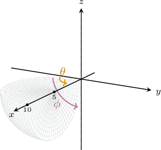

As a result, we obtain that in spherical polar coordinates, our region can be expressed as

$$

\Delta = \left\{ (\rho, \theta, \phi) \, : \, 0 \leq \rho \leq 10\cos\theta\sin\phi, \:\dfrac{3\pi}{2} \leq \theta \leq 2\pi , \: \dfrac{\pi}{2} \leq \phi \leq \pi \right\}.

$$

Next, we substitute the spherical polar coordinates into the function $f(x,y,z)= \dfrac{1}{\sqrt{x^2+y^2+z^2}}{:}$

$$

\begin{aligned}𝑓(𝑥,𝑦,𝑧) & =𝑓(𝜌cos⁡𝜃sin⁡𝜙,𝜌sin⁡𝜃sin⁡𝜙,𝜌cos⁡𝜙) \\ & =\frac{1}{𝜌}\end{aligned}

$$

Therefore, using the change of variables formula, we obtain

$$

\begin{aligned}\underset{𝑅}{∭}\frac{1}{\sqrt{𝑥^{2}+𝑦^{2}+𝑧^{2}}}\,d𝑉 & =\underset{Δ}{∭}\frac{1}{𝜌}⋅𝜌^{2}sin⁡𝜙\,d𝜌\,d𝜃\,d𝜙 \\ & =∫_{𝜋𝜋/2}∫_{2𝜋3𝜋/2}∫_{10cos⁡𝜃sin⁡𝜙0}\,\,\,\,\,\,\,\,\,\,\,𝜌sin⁡𝜙\,d𝜌\,d𝜃\,d𝜙.\end{aligned}

$$

### Example: Evaluating a Triple Integral by Converting to Spherical Polar Coordinates

#### Question

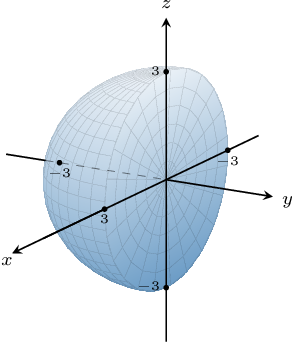

Evaluate the triple integral

$$

\displaystyle \iiint\limits_R 2z\sqrt{x^2 + y^2 + z^2} \:\text{d}V

$$

over the region $R$ enclosed inside the sphere $x^2 + y^2 + z^2 = 9$ for $y \leq 0,$ shown above.

#### Explanation

We will use the change of variables formula in the form

$$

\iiint\limits_{R} f(x,y,z) \, \mathrm{d}V = \iiint\limits_{\Delta} \, f(\rho\cos\theta\sin\phi, \rho\sin\theta\sin\phi, \rho\cos\phi) \: \rho^2\sin\phi \: \mathrm{d}\rho \, \mathrm{d}\theta \, \mathrm{d}\phi.

$$

If $(\rho, \theta, \phi)$ are the spherical coordinates of a point, then its Cartesian coordinates $(x,y,z)$ can be found by using the following formulas:

$$

x = \rho\cos\theta\sin\phi, \qquad y = \rho\sin\theta\sin\phi, \qquad z = \rho\cos\phi

$$

Notice that the region $R$ represents one-half of the sphere of radius $3$ centered at the origin.

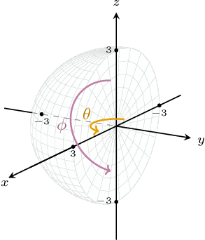

As a result, we obtain that in spherical polar coordinates, our region can be expressed as

$$

\Delta = \left\{ (\rho, \theta, \phi) \, : \, 0 \leq \rho \leq 3, \: \pi \leq \theta \leq 2\pi, \: 0 \leq \phi \leq \pi \right\}.

$$

Next, we substitute the spherical polar coordinates into the function $f(x,y,z) = 2z\sqrt{x^2 + y^2 + z^2}{:}$

$$

\begin{aligned}𝑓(𝑥,𝑦,𝑧) & =𝑓(𝜌cos⁡𝜃sin⁡𝜙,𝜌sin⁡𝜃sin⁡𝜙,𝜌cos⁡𝜙) \\ & =2𝜌cos⁡𝜙⋅𝜌 \\ & =2𝜌^{2}cos⁡𝜙\end{aligned}

$$

Therefore, using the change of variables formula, we obtain

$$

\begin{aligned}\underset{𝑅}{∭}2𝑧\sqrt{𝑥^{2}+𝑦^{2}+𝑧^{2}}\,d𝑉 & =\underset{Δ}{∭}2𝜌^{2}cos⁡𝜙⋅𝜌^{2}sin⁡𝜙\,d𝜌\,d𝜃\,d𝜙 \\ & =∫_{𝜋0}∫_{2𝜋𝜋}∫_{30}𝜌^{4}sin⁡2𝜙\,d𝜌\,d𝜃\,d𝜙 \\ & =∫_{𝜋0}sin⁡2𝜙\,d𝜙⋅∫_{2𝜋𝜋}d𝜃⋅∫_{30}𝜌^{4}\,d𝜌 \\ & =[−\frac{1}{2}cos⁡2𝜙]_{𝜙=𝜋𝜙=0}⋅[𝜃]_{𝜃=2𝜋𝜃=𝜋}⋅[\frac{1}{5}𝜌^{5}]_{𝜌=3𝜌=0} \\ & =−\frac{1}{2}(1−1)⋅(2𝜋−𝜋)⋅\frac{1}{5}(243−0) \\ & =0⋅𝜋⋅\frac{243}{5} \\ & =0\end{aligned}

$$

### Deriving the Jacobian for Spherical Polar Coordinates

Throughout this lesson, we've used the fact that

$$

\left| \dfrac{\partial (x, y, z)}{\partial (\rho, \theta, \phi)} \right| = \rho^2 \sin{\phi}.

$$

Let's now prove this result.

Given the spherical coordinate transformations

$$

x = \rho\cos\theta\sin\phi, \qquad y = \rho\sin\theta\sin\phi, \qquad z = \rho\cos\phi,

$$

we first calculate the required partial derivatives:

$$

\begin{aligned}\frac{𝜕𝑥}{𝜕𝜌} & =cos⁡𝜃sin⁡𝜙 & \,\frac{𝜕𝑥}{𝜕𝜃} & =−𝜌sin⁡𝜃sin⁡𝜙 & \,\frac{𝜕𝑥}{𝜕𝜙} & =𝜌cos⁡𝜃cos⁡𝜙 \\ \frac{𝜕𝑦}{𝜕𝜌} & =sin⁡𝜃sin⁡𝜙 & \,\frac{𝜕𝑦}{𝜕𝜃} & =𝜌cos⁡𝜃sin⁡𝜙 & \,\frac{𝜕𝑦}{𝜕𝜙} & =𝜌sin⁡𝜃cos⁡𝜙 \\ \frac{𝜕𝑧}{𝜕𝜌} & =cos⁡𝜙 & \,\frac{𝜕𝑧}{𝜕𝜃} & =0 & \,\frac{𝜕𝑧}{𝜕𝜙} & =−𝜌sin⁡𝜙\end{aligned}

$$

Therefore, the corresponding Jacobian determinant is

$$

\begin{aligned}\frac{𝜕(𝑥,𝑦,𝑧)}{𝜕(𝜌,𝜃,𝜙)} & =\begin{matrix}cos⁡𝜃sin⁡𝜙 & −𝜌sin⁡𝜃sin⁡𝜙 & 𝜌cos⁡𝜃cos⁡𝜙 \\ sin⁡𝜃sin⁡𝜙 & 𝜌cos⁡𝜃sin⁡𝜙 & 𝜌sin⁡𝜃cos⁡𝜙 \\ cos⁡𝜙 & 0 & −𝜌sin⁡𝜙\end{matrix} \\ & =cos⁡𝜙\begin{matrix}−𝜌sin⁡𝜃sin⁡𝜙 & 𝜌cos⁡𝜃cos⁡𝜙 \\ 𝜌cos⁡𝜃sin⁡𝜙 & 𝜌sin⁡𝜃cos⁡𝜙\end{matrix}−𝜌sin⁡𝜙\begin{matrix}cos⁡𝜃sin⁡𝜙 & −𝜌sin⁡𝜃sin⁡𝜙 \\ sin⁡𝜃sin⁡𝜙 & 𝜌cos⁡𝜃sin⁡𝜙\end{matrix} \\ & =cos⁡𝜙⋅(−𝜌^{2}sin⁡𝜙cos⁡𝜙(sin^{2}⁡𝜃+cos^{2}⁡𝜃))−𝜌sin⁡𝜙⋅𝜌sin^{2}⁡𝜙⋅(cos^{2}⁡𝜃+sin^{2}⁡𝜃) \\ & =−𝜌^{2}sin⁡𝜙cos^{2}⁡𝜙−𝜌^{2}sin⁡𝜙sin^{2}⁡𝜙 \\ & =−𝜌^{2}sin⁡𝜙(cos^{2}⁡𝜙+sin^{2}⁡𝜙) \\ & =−𝜌^{2}sin⁡𝜙.\end{aligned}

$$

Finally, we conclude that

$$

\left| \dfrac{\partial (x, y, z)}{\partial (\rho, \theta, \phi)} \right| = \rho^2 \sin{\phi}.

$$

### Deriving the Change of Variables Formula Using Geometry

We can also derive the change of variables formula for spherical polar coordinates using geometry.

Consider a bounded spherical box $R,$ given by

$$

R = \big\{ (\rho,\theta,\phi) \: | \: a \leq \rho \leq b, \:\: \alpha \leq \theta \leq \beta, \:\: \gamma \leq \phi \leq \psi \big\}.

$$

We can divide each interval into $l,m,$ and $n$ subdivisions such that

$$

\Delta\rho = \dfrac{b-a}{l},\qquad \Delta\theta = \dfrac{\beta-\alpha}{m},\qquad \Delta\phi = \dfrac{\psi-\gamma}{n}.

$$

This splits the region into "spherical wedges," as shown in the following diagram.

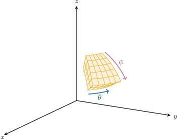

Zooming in on one of these wedges, we obtain a shape resembling a rectangular solid.

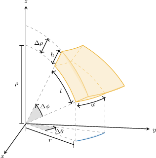

Let's note the volume of this solid as $\Delta V.$ To approximate the value of $\Delta V,$ we use the formula for the volume of a rectangular solid:

$$

\Delta V \approx lwh

$$

Clearly, the height of the rectangular solid is $h = \Delta \rho.$ We can find the remaining dimensions using simple geometry.

First, we need to find the length of the radius $r$ in the $xy$-plane. Using the following triangle and a side-on view of the wedge, we conclude that $r=\rho\sin\phi.$

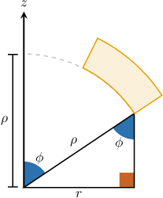

Let's add this to our diagram.

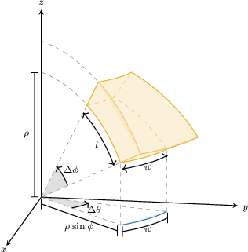

Finally, we can use the arc length formula $s = r \cdot \theta$ to find the length $l$ and width $w.$

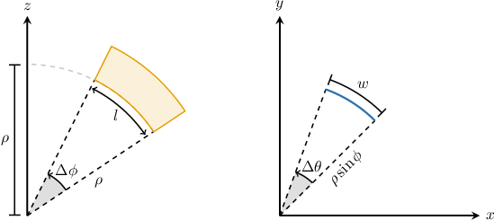

The length of our wedge is

$$

l = \rho \cdot \Delta\phi = \rho\Delta\phi

$$

and the width is

$$

w = \rho\sin\phi \cdot \Delta\theta = \rho\sin\phi\Delta\theta.

$$

Calculating the volume as a rectangular solid, we obtain

$$

\begin{aligned}Δ𝑉 & ≈𝑙𝑤ℎ \\ & =(𝜌Δ𝜙)⋅(𝜌sin⁡𝜙Δ𝜃)⋅(Δ𝜌) \\ & =𝜌^{2}sin⁡𝜙\,Δ𝜙\,Δ𝜃\,Δ𝜌.\end{aligned}

$$

As a result, we define the triple integral in spherical coordinates as the limit of a triple Riemann sum, where $(\rho_{ijk},\theta_{ijk},\phi_{ijk})$ being any sample point in the spherical subregion $B{ijk}{:}$

$$

\lim\limits_{l,m,n \to \infty} \sum\limits_{i=1}^{l} \sum\limits_{j=1}^{m} \sum\limits_{k=1}^{n} f(\rho_{ijk},\theta_{ijk},\phi_{ijk}) (\rho_{ijk})^2 \sin \phi_{ijk} \:\Delta\rho\:\Delta\theta\:\Delta\phi

$$

As we increase the number of subregions, the size of $\Delta\rho,$ $\Delta\theta,$ and $\Delta\phi$ all goes to zero, and the volume of $R$ is more accurately approximated, giving

$$

\text{d}V = \rho^2 \sin\phi \:\text{d}\rho\:\text{d}\theta\:\text{d}\phi.

$$

Therefore, we conclude that if $f(\rho,\theta,\phi)$ is continuous on a spherical box $R = [a,b] \times [\alpha,\beta] \times [\gamma, \psi],$ then

$$

\iiint\limits_{R} f(\rho,\theta,\phi) \:\text{d}V = \iiint\limits_{R} f(\rho,\theta,\phi) \rho^2 \sin\phi \:\text{d}\rho\:\text{d}\theta\:\text{d}\phi = \int_{\gamma}^{\psi}\int_{\alpha}^{\beta}\int_{a}^{b} f(\rho,\theta,\phi) \rho^2 \sin\phi \:\text{d}\rho\:\text{d}\theta\:\text{d}\phi.

$$
