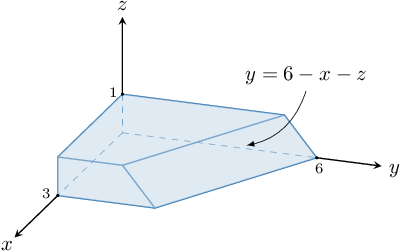
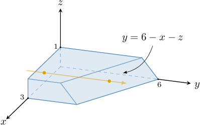
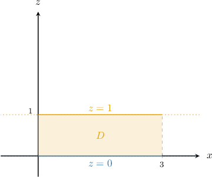
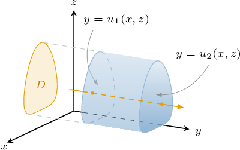
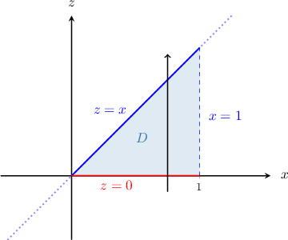
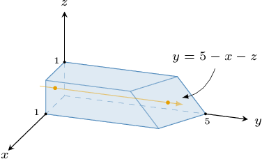
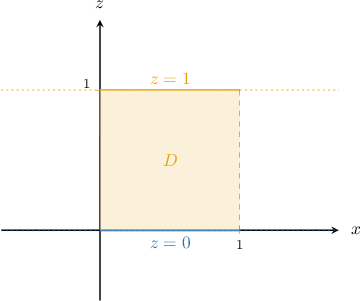

# Triple Integrals Over Type III Regions

Source: https://www.mathacademy.com/topics/2142?courseId=54
Topic ID: 2142

## Prerequisites

- [Triple Integrals Over Type I Regions](./4146-triple-integrals-over-type-i-regions.md)

## Lesson

### Introduction

Let's evaluate the triple integral

$$

\displaystyle \iiint\limits_R 2xz \: \mathrm{d}V

$$

where the region $R$ is shown below.

The region $R$ is a type III region. So, our first task is to describe this region fully.

We start by drawing an arrow parallel to the $y$-axis that

- enters the region through the *left* surface $y=0,$ and

- leave the region through the *right* surface $y=6-x-z,$

as shown below.

So, our solid can be written as the type III region

$$

R = \big\{ (x,y,z) \: : \: (x,z) \in D, \:\: 0 \leq y \leq 6-x-z \big\},

$$

where

$$

D = \big\{ (x,z) \: : \: 0 \leq x \leq 3, \:\: 0 \leq z \leq 1 \big\}

$$

is the projection of $R$ onto the $xz$-plane, shown below.

To evaluate our triple integral, we start by expressing it as a mixed integral:

$$

\iiint\limits_R 2xz \:\textrm{d}V = \iint\limits_D \left[ \int_{0}^{6-x-z} 2xz \:\textrm{d}y \right] \textrm{d}A

$$

Now, since the region $D$ is a type I *plane* region, we can express the region $R$ as

$$

R = \big\{ (x,y,z) \: : \: 0 \leq x \leq 3, \:\: 0 \leq z \leq 1, \:\: 0 \leq y \leq 6-x-z \big\},

$$

and therefore, our mixed integral can be written as the following repeating integral:

$$

\iint\limits_D \left[ \int_0^{6-x-z} 2xz \:\textrm{d}y \right] \textrm{d}A = \int_{0}^{3} \int_{0}^{1} \int_{0}^{6-x-z} 2xz \:\textrm{d}y\:\textrm{d}z\:\textrm{d}x

$$

Evaluating this using the usual methods, we get

$$

\int_{0}^{3} \int_{0}^{1} \int_{0}^{6-x-z} 2xz \:\textrm{d}y\:\textrm{d}z\:\textrm{d}x = 15.

$$

Therefore, we conclude that

$$

\iiint\limits_R 2xz \:\textrm{d}V = 15.

$$

### Example: Representing a Triple Integral as a Mixed or Repeated Integral

#### Question

Find the missing limits in the repeated integral below

$$

\displaystyle \iiint \limits_{R} f(x,y,z) \: \textrm{d}V = \int_{\ast}^{\ast} \int_{\ast}^{\ast} \int_{\ast}^{\ast} f(x,y,z) \: \mathrm{d}y \: \mathrm{d}z \: \mathrm{d}x

$$

where $R$ is the type III region defined as

$$

R=\left\{ (x,y,z) \: : \: -3 \leq x \leq 3, \: x \leq z \leq 2x+2, \: 0 \leq y \leq z+xz \right\}.

$$

#### Explanation

A type III region in three-dimensional space can be written as

$$

R = \big\{ (x,y,z) \: : \: (x,z) \in D, \: u_1(x,z) \leq y \leq u_2(x,z) \big\}.

$$

A typical three-dimensional type III region can be visualized schematically, as shown below.

If $R$ is a type III region, we can express the triple integral of $f(x,y,z)$ over $R$ as a mixed integral, as follows:

$$

\iiint\limits_{R} f(x,y,z)\,\textrm d V = \iint\limits_{D} \left[\int_{u_1(x,z)}^{u_2(x,z)} f(x,y,z)\,\textrm d y \right] \,\textrm d A

$$

In our case, we have

$$

u_1(x,z) = 0, \qquad u_2(x,z) = z+xz.

$$

Therefore, our triple integral can be written as

$$

\displaystyle \iiint \limits_{S} f(x,y,z) \: \textrm{d}V = \iint\limits_{D} \left[ \int_{0}^{z+xz} f(x,y,z) \: \mathrm{d}y \right] \mathrm{d}A.

$$

Now, the region $D$ is given by

$$

D =\left\{ (x,z) \: : \: -3 \leq x \leq 3, \: x \leq z \leq 2x+2 \right\}.

$$

Therefore, by expressing the double integral over $D$ as a repeated integral, we get

$$

\begin{aligned}\underset{𝐷}{∬}[∫_{𝑧+𝑥𝑧0}^{}𝑓(𝑥,𝑦,𝑧)\,d𝑦]d𝐴 & =∫_{3−3}^{}∫_{2𝑥+2𝑥}^{}[∫_{𝑧+𝑥𝑧0}^{}𝑓(𝑥,𝑦,𝑧)\,d𝑦]d𝑧\,d𝑥 \\ & =∫_{3−3}^{}∫_{2𝑥+2𝑥}^{}∫_{𝑧+𝑥𝑧0}^{}𝑓(𝑥,𝑦,𝑧)\,d𝑦\,d𝑧\,d𝑥.\end{aligned}

$$

### Example: Evaluating a Mixed Integral

#### Question

Evaluate the mixed integral

$$

\displaystyle \iint\limits_D \left[ \int_{0}^{\sqrt{x}} 2y\: \mathrm{d}y \right ] \mathrm{d}A,

$$

given that $D$ is the region in the $xz$-plane bounded by the lines $z=0,$ $x= 1$ and the line $z =x.$

#### Explanation

First, we evaluate the inner integral with respect to $y,$ treating $x$ and $z$ as constants:

$$

\begin{aligned}\underset{𝐷}{∬}[∫_{\sqrt{√𝑥}0}^{}2𝑦\,d𝑦]d𝐴 & =\underset{𝐷}{∬}[𝑦^{2}]_{𝑦=\sqrt{√𝑥}𝑦=0}^{}\,d𝐴 \\ & =\underset{𝐷}{∬}𝑥\,d𝐴\end{aligned}

$$

Now, to calculate this double integral, we plot $D$ as a type I plane region in the $xz$-plane.

Therefore, to evaluate our double integral as a repeated integral over this region, we integrate with respect to $z$ and then with respect to $x{:}$

$$

\begin{aligned}\underset{𝐷}{∬}𝑥\,d𝐴 & =∫_{10}^{}∫_{𝑥0}^{}𝑥\,d𝑧\,d𝑥 \\ & =∫_{10}^{}𝑥[𝑧]_{𝑧=𝑥𝑧=0}^{}\,d𝑥 \\ & =∫_{10}^{}𝑥^{2}\,d𝑥 \\ & =[\frac{1}{3}𝑥^{3}]_{𝑥=1𝑥=0}^{} \\ & =\frac{1}{3}−0 \\ & =\frac{1}{3}\end{aligned}

$$

### Example: Evaluating a Triple Integral Over a Type III Region

#### Question

Evaluate the triple integral

$$

\displaystyle \iiint\limits_R 8xy \: \mathrm{d}V

$$

where the region $R$ is given by

$$

R = \left\{ (x,y,z) \: : \: (x,z) \in D, \: 0 \leq y \leq \sqrt x \right\},

$$

and $D$ is the finite region in $xz$-plane enclosed between the $x$-axis, the line $x=1,$ and the line $z=x$ in the first quadrant.

#### Explanation

Writing down our triple integral as a mixed integral, we obtain

$$

\displaystyle \iiint \limits_{R} 8xy \, \textrm{d}V = \iint\limits_D \left[ \int_{0}^{\sqrt{x}} 8xy\: \mathrm{d}y \right ] \mathrm{d}A.

$$

First, we evaluate the inner integral with respect to $y,$ treating $x$ and $z$ as constants:

$$

\begin{aligned}\underset{𝐷}{∬}[∫_{\sqrt{√𝑥}0}^{}8𝑥𝑦\,d𝑦]d𝐴 & =\underset{𝐷}{∬}4𝑥[𝑦^{2}]_{𝑦=\sqrt{√𝑥}𝑦=0}^{}\,d𝐴 \\ & =\underset{𝐷}{∬}4𝑥(𝑥−0)\,d𝐴 \\ & =\underset{𝐷}{∬}4𝑥^{2}\,d𝐴\end{aligned}

$$

We must now evaluate this double integral over the region $D$ in the $xz$-plane shown below.

We can evaluate our double integral as follows:

$$

\begin{aligned}\underset{𝐷}{∬}4𝑥^{2}\,d𝐴 & =∫_{10}^{}∫_{𝑥0}^{}4𝑥^{2}\,d𝑧\,d𝑥 \\ & =∫_{10}^{}4𝑥^{2}[𝑧]_{𝑧=𝑥𝑧=0}^{}\,d𝑥 \\ & =∫_{10}^{}4𝑥^{2}(𝑥−0)\,d𝑥 \\ & =∫_{10}^{}4𝑥^{3}\,d𝑥 \\ & =[𝑥^{4}]_{𝑥=1𝑥=0}^{} \\ & =1^{4}−0 \\ & =1\end{aligned}

$$

### Skipping the Intermediate Step

When writing down a triple integral as a repeated integral, we can often skip the intermediate step of expressing our triple integral as a mixed integral.

For example, suppose we wish to evaluate

$$

\displaystyle \iiint\limits_R f(x,y,z) \:\mathrm{d}V

$$

where $R$ is the type III region given by

$$

R= \big\{(x,y,z) \: : \: {\color{red}a} \leq x \leq {\color{red}b}, \: {\color{blue}v_1(x)} \leq z \leq {\color{blue}v_2(x)}, \: {\color{purple}u_1(x,z)} \leq y \leq {\color{purple}u_2(x,z)} \big\}.

$$

Notice that the projection of $R$ onto the $xz$-plane is a type II plane region. Therefore, we can immediately express our triple integral as follows:

$$

\iiint\limits_R f(x,y,z) \:\textrm{d}V = \int_{\color{red}a}^{\color{red}b} \int_{\color{blue}v_1(x)}^{\color{blue}v_2(x)} \int_{\color{purple}u_1(x,z)}^{\color{purple}u_2(x,z)} f(x,y,z) \:\textrm{d}y\:\textrm{d}z\:\textrm{d}x

$$

### Example: Constructing and Evaluating Triple Integrals Over Type III Regions From Diagrams

#### Question

Evaluate the triple integral $\displaystyle \iiint\limits_R 36z^2 \: \mathrm{d}V$ over the region $R,$ shown above.

**

#### Explanation

Notice that our solid can be written as the type III region

$$

R = \big\{ (x,y,z) \: : \: (x,z) \in D, \:\: 0 \leq y \leq 5-x-z \big\},

$$

where

$$

D = \big\{ (x,z) \: : \: 0 \leq x \leq 1, \:\: 0 \leq z \leq 1 \big\}

$$

is the projection of $R$ onto the $xz$-plane, shown below.

Hence, the type III representation of $R$ is

$$

R = \big\{ (x,y,z) \: : \: 0 \leq x \leq 1, \:\: 0 \leq z \leq 1, \:\: 0 \leq y \leq 5-x-z \big\}

$$

As a result, by writing down our triple integral as a repeated integral, we obtain

$$

\displaystyle \iiint \limits_{R} 36z^2 \: \textrm{d}V = \int_{0}^{1} \int_{0}^{1} \int_{0}^{5-x-z} 36z^2 \: \mathrm{d}y \: \mathrm{d}z \: \mathrm{d}x.

$$

First, we evaluate the inner integral with respect to $y$, treating $x$ and $z$ as constants:

$$

\begin{aligned}∫_{10}^{}∫_{10}^{}∫_{5−𝑥−𝑧0}^{}36𝑧^{2}\,d𝑦\,d𝑧\,d𝑥 & =∫_{10}^{}∫_{10}^{}[∫_{5−𝑥−𝑧0}^{}36𝑧^{2}\,d𝑦]d𝑧\,d𝑥 \\ & =∫_{10}^{}∫_{10}^{}36𝑧^{2}[𝑦]_{𝑦=5−𝑥−𝑧𝑦=0}^{}\,d𝑧\,d𝑥 \\ & =∫_{10}^{}∫_{10}^{}36𝑧^{2}(5−𝑥−𝑧)\,d𝑧\,d𝑥 \\ & =∫_{10}^{}∫_{10}^{}(180𝑧^{2}−36𝑥𝑧^{2}−36𝑧^{3})\,d𝑧\,d𝑥\end{aligned}

$$

Next, we evaluate the inner integral with respect to $z$, treating $x$ as a constant:

$$

\begin{aligned}∫_{10}^{}∫_{10}^{}(180𝑧^{2}−36𝑥𝑧^{2}−36𝑧^{3})\,d𝑧\,d𝑥 & =∫_{10}^{}[∫_{10}^{}(180𝑧^{2}−36𝑥𝑧^{2}−36𝑧^{3})\,d𝑧]d𝑥 \\ & =∫_{10}^{}[60𝑧^{3}−12𝑥𝑧^{3}−9𝑧^{4}]_{𝑧=1𝑧=0}^{}\,d𝑥 \\ & =∫_{10}^{}(51−12𝑥)\,d𝑥\end{aligned}

$$

Finally, we integrate with respect to $x{:}$

$$

\begin{aligned}∫_{10}^{}(51−12𝑥)\,d𝑥 & =[51𝑥−6𝑥^{2}]_{𝑥=1𝑥=0}^{} \\ & =(51(1)−6(1)^{2})−0 \\ & =45\end{aligned}

$$
