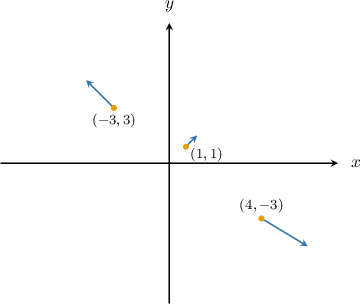
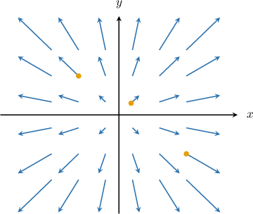
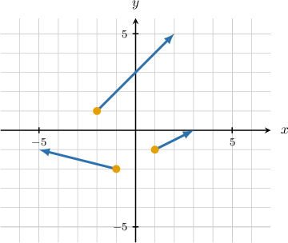
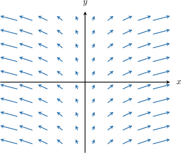
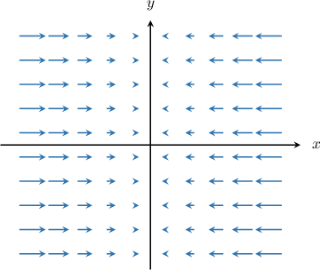
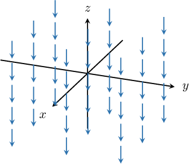

# Visualizing Vector Fields

Source: https://www.mathacademy.com/topics/3344?courseId=54
Topic ID: 3344

## Prerequisites

- [Vector Fields](./3343-vector-fields.md)

## Lesson

### Introduction

A vector field on $\mathbb R^2$ assigns a vector to every point $(x,y)$ in a region $S\subset \mathbb R^2$. We can visualize this by plotting the corresponding vector at each point in the coordinate plane.

As an example, let's sketch the vector field $\mathbf F$ at the points $(1,1), (-3,3),$ and $(4,-3),$ where $\mathbf F$ is given by

$$

\mathbf F(x,y) = x \, \mathbf{i} + y \, \mathbf{j}.

$$

To sketch the vector field at the given points, we first substitute their coordinates into the function $\mathbf F\mathbin{:}$

$$

\begin{aligned}𝐅(1,1) & =𝐢+𝐣 \\ 𝐅(−3,3) & =−3\,𝐢+3\,𝐣 \\ 𝐅(4,−3) & =4\,𝐢−3\,𝐣\end{aligned}

$$

We now draw our vectors, placing the tail ends of each vector at its corresponding point. This gives the following diagram:

Applying the same method to more points in $\mathbb{R}^2,$ we obtain the following visualization of our vector field:

### Example: Sketching a Two-Dimensional Vector Field

#### Question

Draw a diagram that represents the vector field

$$

\mathbf{F}(x,y)= -2xy \, \mathbf{i} + x^2 \, \mathbf{j}

$$

at the points $(-2,1), (-1,-2),$ and $(1,-1).$

#### Explanation

To sketch the vector field at the given points, we substitute their coordinates into the function $\mathbf F(x,y) = -2xy \, \mathbf{i} + x^2 \, \mathbf{j} \,\mathbin{:}$

$$

\begin{aligned}𝐅(−2,1) & =−2(−2)(1)\,𝐢+(−2)^{2}\,𝐣=4\,𝐢+4\,𝐣 \\ 𝐅(−1,−2) & =−2(−1)(−2)\,𝐢+(−1)^{2}\,𝐣=−4\,𝐢+𝐣 \\ 𝐅(1,−1) & =−2(1)(−1)\,𝐢+1^{2}\,𝐣=2\,𝐢+𝐣\end{aligned}

$$

We now draw our vectors. At each point, we draw the vector associated with that point, placing the tail end of the vector on the point itself. This gives the following diagram.

### Analyzing Vector Field Diagrams

Given a visualization, it's possible to determine characteristics about the underlying vector field.

For example, let's consider the visualization below.

This visualization was generated by one of the following functions.

1. $\mathbf F(x,y) = \mathbf{i} - \mathbf{j}$

2. $\mathbf G(x,y) = x \, \mathbf{i} + \mathbf{j}$

3. $\mathbf H(x,y) = y \, \mathbf{i} + \mathbf{j}$

We can determine which function generated the above diagram using a process of elimination:

- The vertical component (i.e., the $\mathbf j$ component) is positive for *every* vector in our vector field. This means we can exclude any function whose $\mathbf j$ component is negative for some $(x,y) \in \mathbb{R}^2.$ Therefore, we can rule out the following option:

- As we move away from the origin in the horizontal direction, our vectors' horizontal components (i.e., the $\mathbf i$ components) get longer. This means that the $\mathbf i$ component of our vector field is dependent on the variable $x.$ So, we can exclude any function whose $\mathbf i$ component is independent of $x.$ Hence, we can rule out the following option:

Therefore, we conclude that the diagram corresponds to the vector field $\mathbf G(x,y) = x \, \mathbf{i} + \mathbf{j}.$

### Example: Identifying a Two-Dimensional Vector Field

#### Question

Which of the following could be the function that generates the vector field above?

1. $\mathbf F(x,y) = \mathbf{i} + \mathbf{j}$

2. $\mathbf G(x,y) = 2 \, \mathbf{i}$

3. $\mathbf H(x,y) = -x \, \mathbf{i}$

#### Explanation

We notice the following:

- The vertical component (i.e., the $\mathbf j$ component) is zero for ** vector in our vector field. Therefore, we can rule out the following option:

- As we move away from the origin in the horizontal direction, our vectors' horizontal components (i.e., the $\mathbf i$ components) get longer. Therefore, we can rule out the following option:

Therefore, we conclude that the diagram corresponds to the vector field $\mathbf{H}(x,y) = -x\, \mathbf{i}.$

### Example: Identifying a Three-Dimensional Vector Field

#### Question

Which of the following could be the function that generates the vector field above?

1. $\mathbf F(x,y,z) = \mathbf j + \mathbf k$

2. $\mathbf G(x,y,z) = \mathbf k$

3. $\mathbf H(x,y,z) = z\,\mathbf k$

4. $\mathbf K(x,y,z) = -\mathbf k$

#### Explanation

We notice the following:

- Each vector in our vector field is parallel to the $z$-axis. So, the $\mathbf i$ and $\mathbf j$ components of our vector field are zero everywhere. Therefore, we can rule out the following option:

- Moreover, each vector in our vector field is pointing in the ** $z$-direction, so the $\mathbf k$ component of our vector field is negative. Therefore, we can rule out the following option:

- Finally, we note that each vector in our vector field has the same length, so the $\mathbf i$ component of our vector field is constant. Therefore, we can rule out the following option:

Therefore, we conclude that the diagram corresponds to the vector field $\mathbf K(x,y,z) = -\mathbf k.$
