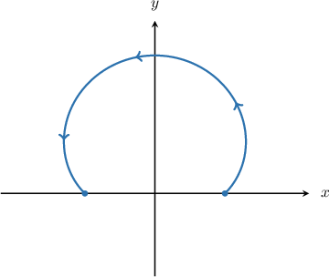
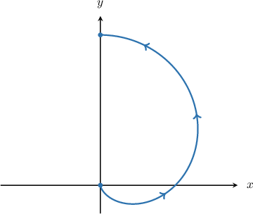
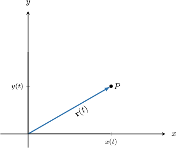
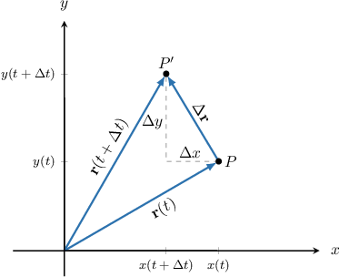
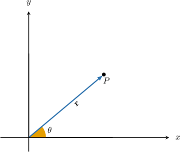
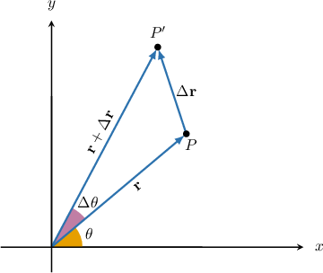
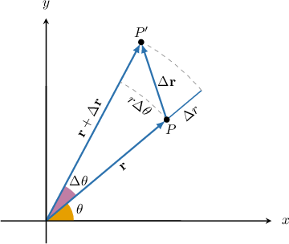

# Further Properties of Line Integrals of Scalar Functions

Source: https://www.mathacademy.com/topics/3354?courseId=54
Topic ID: 3354

## Prerequisites

- [The Arc Length of a Polar Curve](../../../ap-courses/lessons/ap-calculus-bc/999-the-arc-length-of-a-polar-curve.md)
- [Properties of Line Integrals of Scalar Functions](./3145-properties-of-line-integrals-of-scalar-functions.md)

## Lesson

### Introduction

Recall that for a path $C$ in the $xy$-plane, the arc length $L$ of $C$ can be computed as the line integral of unity with respect to arc length over $C\mathbin{:}$

$$

L = \displaystyle\int_C \, \textrm{d}s

$$

Now, if $C$ is defined parametrically as

$$

\mathbf r(t) = \langle x(t),\, y(t)\rangle, \quad a\leq t \leq b ,

$$

then we can also calculate the arc length of $C$ as

$$

L = \int_{a}^{b}||\mathbf r'(t)||\,\textrm d t = \int_{a}^{b}\sqrt{\left(\dfrac{\textrm d x}{\textrm d t}\right)^2 + \left(\dfrac{\textrm d y}{\textrm d t}\right)^2}\,\textrm d t\,.

$$

By comparing our two expressions for $L,$ we say that the **arc-length element** $\textrm ds$ for a parametrically defined curve is given by

$$

\textrm ds = \sqrt{\left(\dfrac{\textrm d x}{\textrm d t}\right)^2 + \left(\dfrac{\textrm d y}{\textrm d t}\right)^2}\,\textrm d t\,.

$$

Geometrically, we can think of $\textrm ds$ as representing the change in arc length that arises due to a vanishingly small change in $t.$ By summing (integrating) all of these small changes, we arrive at the arc length of $C.$ We'll explore this in more detail at the end of the lesson.

### The Arc Length Element for Polar Curves

Now suppose that a curve $C$ is defined using plane polar coordinates as

$$

r = r(\theta), \qquad \theta_1\leq\theta\leq\theta_2.

$$

We've already seen that a polar curve is just a special type of parametric curve in the parameter $\theta,$ where

$$

x = r(\theta)\cos\theta, \qquad y = r(\theta)\sin\theta, \qquad \theta_1\leq\theta\leq\theta_2.

$$

Using the usual formula for the arc length of a polar curve, the arc length of $C$ can be calculated as

$$

L = \int_{\theta_1}^{\theta_2}\sqrt{r^2 + \left(\dfrac{\textrm d r}{\textrm d \theta}\right)^2}\,\textrm d \theta

$$

which is the same as the line integral

$$

L = \displaystyle\int\limits_C \, \textrm{d}s.

$$

By comparing our two expressions for $L,$ the arc-length element $\textrm ds$ for a curve can also be defined using polar coordinates as follows:

$$

\textrm ds = \sqrt{r^2 + \left(\dfrac{\textrm d r}{\textrm d \theta}\right)^2}\,\textrm d \theta

$$

We'll build up a geometric understanding of this result at the end of the lesson. But for now, let's use this result to calculate some line integrals across polar curves.

### Example: Constructing Line Integrals of Unity Over Polar Curves

#### Question

Find a definite integral with respect to $\theta$ that's equivalent to $\displaystyle\int_C\,\textrm d s,$ where $C$ is the path along the polar curve $r=1-\sin{\theta}\,$ for $0 \leq \theta \leq \pi,$ shown above.

#### Explanation

The line integral of unity with respect to arc length over $C$ is equal to the arc length $L$ of $C,$ i.e.,

$$

\int_C \,\textrm d s = L.

$$

In polar coordinates, the arc length element $\textrm d s$ is given by

$$

\textrm ds = \sqrt{r^2 +\left(\frac{\textrm{d}r}{\textrm{d}\theta}\right)^2 }\,\textrm{d}\theta.

$$

So, for a polar curve defined as $r = r(\theta)$ for $\theta_1 \leq \theta \leq \theta_2,$ we have

$$

L= \int_C \,\textrm d s = \int_{\theta_1}^{\theta_2} \sqrt{r^2 +\left(\frac{\textrm{d}r}{\textrm{d}\theta}\right)^2 }\,\textrm{d}\theta.

$$

Since $r=1-\sin{\theta},$ we have

$$

\dfrac{\textrm{d}r}{\textrm{d}\theta} = -\cos{\theta}.

$$

Therefore, the expression for our line integral is

$$

\begin{aligned}∫_{𝐶}\,d𝑠 & =∫_{𝜃_{2}𝜃_{1}}^{}\sqrt{√𝑟^{2}+(\frac{d𝑟}{d𝜃})^{2}}\,d𝜃 \\ & =∫_{𝜋0}^{}\sqrt{√(1−sin⁡𝜃)^{2}+(−cos⁡𝜃)^{2}}\,d𝜃 \\ & =∫_{𝜋0}^{}\sqrt{√1−2sin⁡𝜃+sin^{2}⁡𝜃+cos^{2}⁡𝜃}\,d𝜃 \\ & =∫_{𝜋0}^{}\sqrt{√2−2sin⁡𝜃}\,d𝜃 \\ & =\sqrt{√2}∫_{𝜋0}^{}\sqrt{√1−sin⁡𝜃}\,d𝜃\,.\end{aligned}

$$

### Example: Evaluating Line Integrals of Unity Over Polar Curves

#### Question

Calculate $\displaystyle\int_C\,\textrm d s,$ where $C$ is the path along the polar curve $r=2(1+\sin\theta)$ for $0 \leq \theta \leq {\pi},$ shown above.

#### Explanation

The line integral of unity with respect to arc length over $C$ is equal to the arc length $L$ of $C,$ i.e.,

$$

\int_C \,\textrm d s = L.

$$

In polar coordinates, the arc length element $\textrm d s$ is given by

$$

\textrm ds = \sqrt{r^2 +\left(\frac{\textrm{d}r}{\textrm{d}\theta}\right)^2 }\,\textrm{d}\theta.

$$

So, for a polar curve defined as $r = r(\theta)$ for $\theta_1 \leq \theta \leq \theta_2,$ we have

$$

L= \int_C \,\textrm d s = \int_{\theta_1}^{\theta_2} \sqrt{r^2 +\left(\frac{\textrm{d}r}{\textrm{d}\theta}\right)^2 }\,\textrm{d}\theta.

$$

Since $r=2(1+\sin\theta),$ we have

$$

\dfrac{\textrm{d}r}{\textrm{d}\theta} = 2\cos{\theta}.

$$

Therefore, we evaluate our line integral as follows:

$$

\begin{aligned}𝐿 & =∫_{𝜃_{2}𝜃_{1}}^{}\sqrt{√𝑟^{2}+(\frac{d𝑟}{d𝜃})^{2}}\,d𝜃 \\ & =∫_{𝜋0}^{}\sqrt{√4(1+sin⁡𝜃)^{2}+4(cos⁡𝜃)^{2}}\,d𝜃 \\ & =2∫_{𝜋0}^{}\sqrt{√1+2sin⁡𝜃+sin^{2}⁡𝜃+cos^{2}⁡𝜃}\,d𝜃 \\ & =2∫_{𝜋0}^{}\sqrt{√1+2sin⁡𝜃+1}\,d𝜃 \\ & =2∫_{𝜋0}^{}\sqrt{√2+2sin⁡𝜃}\,d𝜃 \\ & =2\sqrt{√2}∫_{𝜋0}^{}\sqrt{√1+sin⁡𝜃}\,d𝜃\end{aligned}

$$

Next, we recall the following identities:

$$

\begin{aligned}sin^{2}⁡(\frac{𝜃}{2})+cos^{2}⁡(\frac{𝜃}{2})=1,\,sin⁡𝜃=2sin⁡(\frac{𝜃}{2})cos⁡(\frac{𝜃}{2})\end{aligned}

$$

Rewriting our integral using the above identities, we can evaluate it as follows:

$$

\begin{aligned}𝐿 & =2\sqrt{√2}∫_{𝜋0}^{}\sqrt{√1+sin⁡𝜃}\,d𝜃 \\ & =2\sqrt{√2}∫_{𝜋0}^{}\sqrt{√sin^{2}⁡(\frac{𝜃}{2})+cos^{2}⁡(\frac{𝜃}{2})+2sin⁡(\frac{𝜃}{2})cos⁡(\frac{𝜃}{2})}\,d𝜃 \\ & =2\sqrt{√2}∫_{𝜋0}^{}\sqrt{√(sin⁡(\frac{𝜃}{2})+cos⁡(\frac{𝜃}{2}))^{2}}\,d𝜃 \\ & =2\sqrt{√2}∫_{𝜋0}^{}sin⁡(\frac{𝜃}{2})+cos⁡(\frac{𝜃}{2})\,d𝜃 \\ & =4\sqrt{√2}[−cos⁡(\frac{𝜃}{2})+sin⁡(\frac{𝜃}{2})]_{𝜋0}^{} \\ & =4\sqrt{√2}(−cos⁡(\frac{𝜋}{2})+sin⁡(\frac{𝜋}{2}))−(−cos⁡(0)+sin⁡(0)) \\ & =4\sqrt{√2}((0+1)−(−1+0)) \\ & =8\sqrt{√2}\end{aligned}

$$

### Geometric Interpretation of the Arc Length Element for a Parametric Curve

Let's now build up a geometric understanding of what the arc length element $\textrm d s$ means. First, we'll consider the case of a parametric curve defined as

$$

\mathbf r(t) = \langle x(t),\, y(t)\rangle.

$$

Suppose that the point $P$ lies on this curve and has position vector $\mathbf r.$

Now consider a small change $\Delta t$ in the parameter $t.$ This change gives a new point $P'$ on the curve with position vector $\mathbf r + \Delta\mathbf r,$ where $\Delta \mathbf r$ gives the total change (as a vector) in moving from $P$ to $P',$ as shown below.

According to the diagram we have

$$

\Delta x = x(t+\Delta t) - x(t), \qquad \Delta y = y(t+\Delta t) - y(t),

$$

where $\Delta x$ and $\Delta y$ are the changes in $x$ and $y,$ respectively, corresponding to the change in $t.$

Using the fact that a difference quotient can be approximated as derivative, these quantities can be approximated as

$$

\Delta x \approx \dfrac{\textrm d x}{\textrm d t}\Delta t, \qquad \Delta y \approx \dfrac{\textrm d y}{\textrm d t}\Delta t.

$$

The change in arc length $\Delta s$ can be approximated as the magnitude of $\Delta \mathbf r.$ Therefore, by the Pythagorean theorem, we get

$$

\begin{aligned}(Δ𝑠)^{2} & ≈||Δ𝐫||^{2} \\ & =(Δ𝑥)^{2}+(Δ𝑦)^{2} \\ & ≈(\frac{d𝑥}{d𝑡}Δ𝑡)^{2}+(\frac{d𝑦}{d𝑡}Δ𝑡)^{2} \\ & =(\frac{d𝑥}{d𝑡})^{2}(Δ𝑡)^{2}+(\frac{d𝑦}{d𝑡})^{2}(Δ𝑡)^{2} \\ & =[(\frac{d𝑥}{d𝑡})^{2}+(\frac{d𝑦}{d𝑡})^{2}](Δ𝑡)^{2}.\end{aligned}

$$

Therefore,

$$

\Delta s \approx \sqrt{\left(\dfrac{\textrm d x}{\textrm d t}\right)^2 + \left( \dfrac{\textrm d y}{\textrm d t}\right)^2}\, \Delta t.

$$

If we imagine the limiting case where $\Delta t \to 0,$ we arrive at the arc length element $\textrm d s\mathbin{:}$

$$

\textrm d s = \sqrt{\left(\dfrac{\textrm d x}{\textrm d t}\right)^2 + \left( \dfrac{\textrm d y}{\textrm d t}\right)^2}\, \textrm d t

$$

### Geometric Interpretation of the Arc Length Element for a Polar Curve

Now, let's derive the formula for the arc length element $\textrm d s$ for a curve defined using plane polar coordinates. We will use a similar geometric approach.

Consider a curve $r= r(\theta)$ defined using polar coordinates. Suppose that the point $P$ lies on this curve and has position vector $\mathbf r.$

Now consider a small change $\Delta \theta$ in the parameter $\theta.$ This change gives a new point $P'$ on the curve with position vector $\mathbf r + \Delta\mathbf r,$ where $\Delta \mathbf r$ gives the total change (as a vector) in moving from $P$ to $P',$ as shown below.

From here, we see that the vector $\Delta \mathbf r$ can be approximated as the vector addition of two components:

- a vector of length $\Delta r$ acting parallel to $\mathbf r,$ and

- a vector of length $r\Delta \theta$ acting perpendicular to $\mathbf r.$

Note that $\Delta r$ is simply the difference of the radial lengths between the points $P$ and $P'.$ The expression $r\Delta \theta$ comes from the formula for the arc length of a sector of a circle.

Now, the change in arc length $\Delta s$ can be approximated as the magnitude of $\Delta \mathbf r.$ Since our two components are perpendicular, we have

$$

\begin{aligned}(Δ𝑠)^{2} & ≈||Δ𝐫||^{2} \\ & ≈(Δ𝑟)^{2}+(𝑟Δ𝜃)^{2} \\ & =Δ𝑟^{2}+𝑟^{2}(Δ𝜃)^{2}.\end{aligned}

$$

Using the fact that a difference quotient can be approximated as derivative, we have

$$

\Delta r = r(\theta + \Delta\theta) - r(\theta) = \dfrac{\textrm d r}{\textrm d \theta}\Delta\theta.

$$

Substituting this into our expression for $(\Delta s)^2$ above, we get

$$

\begin{aligned}(Δ𝑠)^{2} & ≈(\frac{d𝑟}{d𝜃})^{2}(Δ𝜃)^{2}+𝑟^{2}(Δ𝜃)^{2} \\ & =𝑟^{2}(Δ𝜃)^{2}+(\frac{d𝑟}{d𝜃})^{2}(Δ𝜃)^{2} \\ & =[𝑟^{2}+(\frac{d𝑟}{d𝜃})^{2}](Δ𝜃)^{2}.\end{aligned}

$$

Therefore,

$$

\Delta s = \sqrt{r^2 + \left(\dfrac{\textrm d r}{\textrm d \theta}\right)^2}\Delta\theta.

$$

If we imagine the limiting case where $\Delta \theta \to 0,$ we arrive at the arc length element $\textrm d s\mathbin{:}$

$$

\textrm d s = \sqrt{r^2 + \left(\dfrac{\textrm d r}{\textrm d \theta}\right)^2}\textrm d\theta

$$
