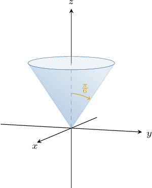
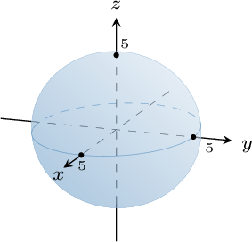
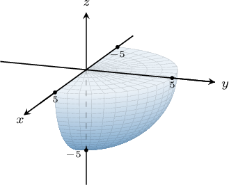
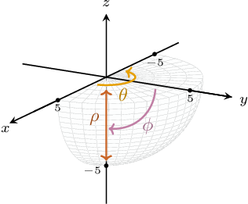
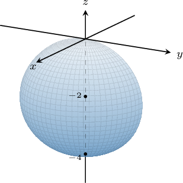
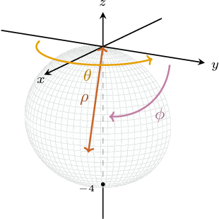

# Surfaces in Spherical Polar Coordinates

Source: https://www.mathacademy.com/topics/3570?courseId=54
Topic ID: 3570

## Prerequisites

- [Spherical Polar Coordinates](./1982-spherical-polar-coordinates.md)
- [Identifying Three-Dimensional Shapes](../../../high-school/traditional/lessons/geometry/2467-identifying-three-dimensional-shapes.md)

## Lesson

### Introduction

Recall that for a point $(\rho,\theta,\phi)$ in spherical polar coordinates,

- $\rho \geq 0$ is the distance from the point to the origin,

- ${\color{black}\theta}\in [0, 2\pi)$ is the angle between the point and the positive $x$-axis, and

- $\phi \in [0, \pi]$ is the angle the corresponding vector makes with the positive $z$-axis.

When we fix one of these coordinates, we obtain some simple surfaces. Let's describe them:

- First, let's consider the equation for $c \gt 0.$ This equation describes the set of points on a surface whose distance from the origin equals $c.$ So, we obtain a sphere of radius $c$ centered at $O.$

- Next, consider the equation where $c\in [0,2\pi).$ This equation describes the set of points that make an angle of $c$ radians with the positive $x$-axis. Therefore, we obtain a *half-plane* whose boundary is the $z$-axis.

- Finally, consider the equation where $c\in (0,\pi).$ This equation describes the set of points that make an angle of $c$ radians with the positive $z$-axis. Therefore, we obtain a *half-cone* whose axis is the $z$-axis.

### Example: Identifying the Spherical Representation of a Surface From an Image

#### Question

What is the equation of the surface shown above in spherical polar coordinates?

#### Explanation

In the picture, we are given a half-cone with the $z$-axis as its axis.

We write the position of a point (vector) in spherical polar coordinates as $(\rho,\theta,\phi),$ where

- $\rho \geq 0$ is the distance from the point to the origin,

- ${\color{black}\theta}\in [0, 2\pi)$ is the angle between the point and the positive $x$-axis, and

- $\phi \in [0, \pi]$ is the angle the corresponding vector makes with the positive $z$-axis.

Every point on the given half-cone makes an angle of $\dfrac{\pi}{6}$ radians with the positive $z$-axis. On the other hand, $\rho$ and $\theta$ can vary arbitrarily in their respective domains.

Therefore, the spherical polar equation of the surface is $\phi = \dfrac{\pi}{6}.$

### Example: Identifying the Spherical Representation of a Surface From an Equation

#### Question

What surface is defined by the equation $\rho=5$ in spherical polar coordinates?

#### Explanation

We write the position of a point (vector) in spherical polar coordinates as $(\rho,\theta,\phi),$ where

- $\rho \geq 0$ is the distance from the point to the origin,

- ${\color{black}\theta}\in [0, 2\pi)$ is the angle between the point and the positive $x$-axis, and

- $\phi \in [0, \pi]$ is the angle the corresponding vector makes with the positive $z$-axis.

With that in mind, let's examine our equation:

$$

\rho=5

$$

This equation specifies that for any point on the surface, the distance from the point to the origin must equal $5.$ On the other hand, $\theta$ and $\phi$ can vary arbitrarily in their respective domains.

Therefore, our surface is a sphere of radius $5.$

### Example: Expressing Part of a Sphere in Spherical Coordinates

#### Question

Use spherical polar coordinates to describe the solid enclosed by the quarter-sphere $x^2+y^2+z^2=25$ for $y \geq 0$ and $z \leq 0,$ shown above.

#### Explanation

We write the position of a point (vector) in spherical polar coordinates as $(\rho,\theta,\phi),$ where

- $\rho \geq 0$ is the distance from the point to the origin,

- ${\color{black}\theta}\in [0, 2\pi)$ is the angle between the point and the positive $x$-axis, and

- $\phi \in [0, \pi]$ is the angle the corresponding vector makes with the positive $z$-axis.

Notice that inside our region, the spherical polar coordinates vary within the following domains:

- $\rho \in [0,5]$

- $\theta \in \left[0,\pi\right]$

- $\phi \in \left[\dfrac{\pi}2,\pi\right]$

Therefore, we have

$$

\left\{ (\rho, \theta, \phi) \, : \, 0 \leq \rho \leq \boxed{\color{blue}5}, \: {0} \leq \theta \leq \boxed{\color{blue}\pi}, \: \boxed{\color{blue}\dfrac{\pi}2} \leq \phi \leq {\pi} \right\}.

$$

### Example: Expressing a Shifted Sphere or Part of a Shifted Sphere in Spherical Coordinates

#### Question

Use spherical polar coordinates to describe the solid enclosed by the hemisphere $x^2+y^2+z^2+4z=0$ for $x \geq 0,$ shown above.

#### Explanation

We write the position of a point (vector) in spherical polar coordinates as $(\rho,\theta,\phi),$ where

- $\rho \geq 0$ is the distance from the point to the origin,

- ${\color{black}\theta}\in [0, 2\pi)$ is the angle between the point and the positive $x$-axis, and

- $\phi \in [0, \pi]$ is the angle the corresponding vector makes with the positive $z$-axis.

If $(\rho, \theta, \phi)$ are the spherical coordinates of a point, then its Cartesian coordinates $(x,y,z)$ can be found by using the following formulas:

$$

x = \rho\cos\theta\sin\phi, \qquad y = \rho\sin\theta\sin\phi, \qquad z = \rho\cos\phi

$$

Notice that the region $R$ represents a half-sphere of radius $2$ centered at $(0,0,-2).$

With that in mind, let's now write the $x^2+y^2+z^2+4z=0$ in spherical polar coordinates:

$$

\begin{aligned}𝑥^{2}+𝑦^{2}+𝑧^{2}+4𝑧 & =0 \\ 𝜌^{2}+4𝜌cos⁡𝜙 & =0 \\ 𝜌(𝜌+4cos⁡𝜙) & =0\end{aligned}

$$

Since $\rho$ cannot be identical to zero on the entire sphere, we must have $\rho = -4\cos\phi.$

Notice that inside our region, the spherical polar coordinates vary within the following domains:

- $\rho \in [0,-4\cos\phi]$

- $\theta \in \left[-\dfrac\pi 2,\dfrac{\pi}{2}\right]$

- $\phi \in \left[\dfrac{\pi}{2}, \pi\right]$

Therefore, we have

$$

\left\{ (\rho, \theta, \phi) \, : \, 0 \leq \rho \leq -4\cos\phi, \: -\dfrac\pi 2 \leq \theta \leq \dfrac{\pi}{2}, \: \dfrac{\pi}{2} \leq \phi \leq \pi \right\}.

$$
