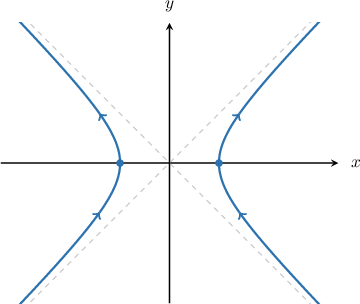
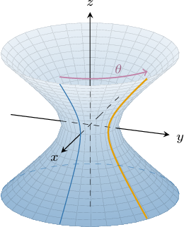
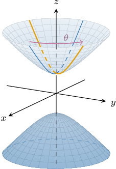

# Parametrizations of Paraboloids and Hyperboloids

Source: https://www.mathacademy.com/topics/3597?courseId=54
Topic ID: 3597

## Prerequisites

- [The Hyperbolic Functions](../calculus-i/967-the-hyperbolic-functions.md)
- [Parametric Surfaces](./1789-parametric-surfaces.md)
- [Hyperboloids](./1892-hyperboloids.md)
- [Paraboloids](./1893-paraboloids.md)

## Lesson

### Introduction

In this lesson, we will explore strategies for parametrizing hyperboloids and paraboloids.

Recall that the general equation of an elliptic paraboloid whose vertex is at $(x_0,y_0,z_0)$ and whose axis of symmetry is parallel to the $z$-axis is given by

$$

z-z_0 = \dfrac{(x-x_0)^2}{a^2} + \dfrac{(y-y_0)^2}{b^2}.

$$

We can write this equation as

$$

z = z_0 + \dfrac{(x-x_0)^2}{a^2} + \dfrac{(y-y_0)^2}{b^2}.

$$

Since this is an explicit equation for $z(x,y),$ we can easily parametrize this paraboloid as follows:

$$

\mathbf f(x,y) = \langle x,\: y,\: z(x,y)\rangle

$$

For example, consider the elliptic paraboloid defined in Cartesian coordinates as

$$

z=3x^2+y^2.

$$

For any point $(x,y,z)$ on our surface, we obtain the following parametrization:

$$

\begin{aligned}𝐟(𝑥,𝑦) & =⟨𝑥,𝑦,𝑧⟩ \\ & =⟨𝑥,\,𝑦,\,3𝑥^{2}+𝑦^{2}⟩\end{aligned}

$$

where $x \in (-\infty,\infty)$ and $y \in (-\infty,\infty).$

Parametrizing hyperbolic paraboloids is equally straightforward. Let's see some more examples.

### Example: Finding a Parametrization of a Paraboloid

#### Question

$$

\mathbf{f}(y, z) = \big\langle \boxed{\phantom{0}}, \: y, \: z \big\rangle

$$

The vector-valued function $\mathbf{f}(y, z)$ above parametrizes the hyperbolic paraboloid defined in Cartesian coordinates as $-3x=-6y^2+3z^2.$ What is the first component of $\mathbf{f}?$

#### Explanation

Solving our equation for $x,$ we obtain

$$

-3x=-6y^2+3z^2 \qquad\Longrightarrow\qquad x=2y^2-z^2.

$$

Now, for any point $(x,y,z)$ on our surface, we obtain the following:

$$

\begin{aligned}𝐟(𝑦,𝑧) & =⟨𝑥,𝑦,𝑧⟩ \\ & =⟨2𝑦^{2}−𝑧^{2},\,𝑦,\,𝑧⟩\end{aligned}

$$

where $y \in (-\infty,\infty)$ and $z \in (-\infty,\infty).$

Therefore, the first component of $\mathbf{f}$ is ${\color{blue} 2y^2-z^2}.$

### Parametrizations of Paraboloids in Cylindrical Polar Coordinates

We can also parametrize elliptic paraboloids using cylindrical polar coordinates.

For example, let's parametrize the elliptic paraboloid defined in Cartesian coordinates as

$$

z=\dfrac{x^2}{9}+y^2.

$$

The first step is to perform a substitution that transforms our paraboloid to one whose horizontal cross-sections (traces) are circles. To do this, we first define the following change of variables:

$$

x = 3X, \qquad y = Y, \qquad z = Z

$$

Substituting this into the equation of our paraboloid, we get

$$

\begin{aligned}𝑧 & =\frac{𝑥^{2}}{9}+𝑦^{2} \\ 𝑍 & =\frac{(3𝑋)^{2}}{9}+𝑌^{2} \\ 𝑍 & =𝑋^{2}+𝑌^{2}.\end{aligned}

$$

Next, recall that if $(r, \theta, z)$ are the cylindrical coordinates of a point and $(X,Y,Z)$ are the corresponding Cartesian coordinates of that point, then we have

$$

X = r\cos\theta, \qquad Y = r\sin\theta, \qquad Z = z.

$$

Substituting this into our equation, we get

$$

\begin{aligned}𝑍 & =𝑋^{2}+𝑌^{2} \\ 𝑍 & =(𝑟cos⁡𝜃)^{2}+(𝑟sin⁡𝜃)^{2} \\ 𝑍 & =𝑟^{2}(cos^{2}⁡𝜃+sin^{2}⁡𝜃) \\ 𝑍 & =𝑟^{2}.\end{aligned}

$$

Now, for any point $(x,y,z)$ on our surface, we obtain the following:

$$

\begin{aligned}𝐟(𝑟,𝜃) & =⟨𝑥,𝑦,𝑧⟩ \\ & =⟨3𝑋,𝑌,𝑍⟩ \\ & =⟨3𝑟cos⁡𝜃,\,𝑟sin⁡𝜃,\,𝑍⟩ \\ & =⟨3𝑟cos⁡𝜃,\,𝑟sin⁡𝜃,\,𝑟^{2}⟩\end{aligned}

$$

Thus, the polar parametrization of our surface is as follows:

$$

\mathbf{f}(r, \theta) = \big\langle 3 r\cos\theta, \: r\sin\theta, \: r^2 \big\rangle, \qquad r \in [0,\infty), \quad \theta \in [0,2\pi)

$$

Let's now consider a case where the elliptic paraboloid has an axis of symmetry that's not parallel to the $z$-axis.

### Example: Finding a Polar Parametrization of a Paraboloid

#### Question

The vector-valued function $\mathbf{f}(r,\theta),$ given by

$$

\mathbf{f}(r,\theta) = \big\langle \boxed{\phantom{0}} , \: r^2, \: 2 r \sin\theta \big\rangle

$$

parametrizes the elliptic paraboloid defined in Cartesian coordinates as

$$

y=4{x^2}+\dfrac{z^2}{4}.

$$

By first considering the transformations

$$

x =\dfrac1{2}X, \qquad y = Z, \qquad z = 2Y

$$

and writing the resulting system in cylindrical polar coordinates, determine the first component of $\mathbf{f}.$

#### Explanation

First, substituting the transformations

$$

x =\dfrac1{2}X, \qquad y = Z, \qquad z = 2Y

$$

into our equation, we get

$$

Z = X^2 + Y^2.

$$

If $(r, \theta, z)$ are the cylindrical coordinates of a point and $(X,Y,Z)$ are the corresponding Cartesian coordinates of that point, then we have

$$

X = r\cos\theta, \qquad Y = r\sin\theta, \qquad Z = z.

$$

Substituting this into our equation, we get

$$

\begin{aligned}𝑍 & =𝑋^{2}+𝑌^{2} \\ 𝑍 & =(𝑟cos⁡𝜃)^{2}+(𝑟sin⁡𝜃)^{2} \\ 𝑍 & =𝑟^{2}(cos^{2}⁡𝜃+sin^{2}⁡𝜃) \\ 𝑍 & =𝑟^{2}.\end{aligned}

$$

Now, for any point $(x,y,z)$ on our surface, we obtain the following:

$$

\begin{aligned}𝐟(𝑟,𝜃) & =⟨𝑥,𝑦,𝑧⟩ \\ & =⟨\frac{1}{2}𝑋,𝑍,2𝑌⟩ \\ & =⟨\frac{1}{2}𝑟cos⁡𝜃,\,𝑍,\,2𝑟sin⁡𝜃⟩ \\ & =⟨\frac{1}{2}𝑟cos⁡𝜃,\,𝑟^{2},\,2𝑟sin⁡𝜃⟩\end{aligned}

$$

where $r \in [0,\infty)$ and $\theta \in [0,2\pi).$

Therefore, the first component of $\mathbf{f}$ is ${\color{blue} \dfrac1{2} r \cos\theta}.$

### Parametrizing Hyperbolas Using Hyperbolic Functions

Consider the horizontal hyperbola with the equation

$$

\dfrac{x^2}{a^2} - \dfrac{y^2}{b^2} = 1.

$$

We can parametrize this hyperbola using hyperbolic functions, as follows:

$$

x = \pm a\cosh t, \qquad y = b\sinh t, \qquad t\in (-\infty,\infty)

$$

where negative $x$ parametrizes the left branch, and positive $x$ gives the right branch.

The advantage of using a hyperbolic parametrization compared to the usual trigonometric one is that there are no discontinuities in the domain of the parameter $t.$

To see why these equations parametrize a hyperbola, we first recall that

$$

\cosh t = \dfrac12(e^t + e^{-t}), \qquad \sinh t = \dfrac12(e^t - e^{-t}).

$$

Thus, we can write our parametrization as

$$

x = \pm \dfrac{a}{2}(e^t + e^{-t}), \qquad y = \dfrac{b}{2}(e^t - e^{-t}), \qquad t\in (-\infty,\infty).

$$

Substituting this into the left-hand side of our hyperbola equation, we get

$$

\begin{aligned}\frac{𝑥^{2}}{𝑎^{2}}−\frac{𝑦^{2}}{𝑏^{2}} & =\frac{𝑎^{2}}{4𝑎^{2}}(𝑒^{𝑡}+𝑒^{−𝑡})^{2}−\frac{𝑏^{2}}{4𝑏^{2}}(𝑒^{𝑡}−𝑒^{−𝑡})^{2} \\ & =\frac{1}{4}((𝑒^{𝑡}+𝑒^{−𝑡})^{2}−(𝑒^{𝑡}−𝑒^{−𝑡})^{2}) \\ & =\frac{1}{4}(𝑒^{2𝑡}+2𝑒^{𝑡}⋅𝑒^{−𝑡}+𝑒^{−2𝑡}−𝑒^{2𝑡}+2𝑒^{𝑡}⋅𝑒^{−𝑡}−𝑒^{−2𝑡}) \\ & =\frac{1}{4}(𝑒^{2𝑡}+2𝑒^{𝑡}⋅𝑒^{−𝑡}+𝑒^{−2𝑡}−𝑒^{2𝑡}+2𝑒^{𝑡}⋅𝑒^{−𝑡}−𝑒^{−2𝑡}) \\ & =\frac{1}{4}(2𝑒^{𝑡−𝑡}+2𝑒^{𝑡−𝑡}) \\ & =\frac{1}{4}(4𝑒^{𝑡−𝑡}) \\ & =\frac{1}{4}⋅4 \\ & =1\,✓\end{aligned}

$$

### Parametrizing Hyperboloids of One Sheet

We often need cylindrical polar coordinates *and* hyperbolic functions to parametrize a hyperboloid.

For example, let's parametrize a hyperboloid of one sheet defined in Cartesian coordinates as

$$

x^2+y^2-z^2=9.

$$

We start by transforming to cylindrical polar coordinates in the usual way:

$$

x = r\cos\theta, \qquad y = r\sin\theta, \qquad z = z.

$$

Substituting this into our equation, we get

$$

\begin{aligned}𝑥^{2}+𝑦^{2}−𝑧^{2} & =9 \\ (𝑟cos⁡𝜃)^{2}+(𝑟sin⁡𝜃)^{2}−𝑧^{2} & =9 \\ 𝑟^{2}(cos^{2}⁡𝜃+sin^{2}⁡𝜃)−𝑧^{2} & =9 \\ 𝑟^{2}−𝑧^{2} & =9.\end{aligned}

$$

Here, the hyperbola $r^2 - z^2 = 9$ represents the intersection of our hyperboloid with the vertical plane that passes through the $z$-axis and makes the angle of $\theta$ with the positive $x$-axis.

Using hyperbolic functions, we can parametrize this hyperbola as follows:

$$

\langle r, z \rangle = \langle 3\cosh{\phi}, \: 3\sinh{\phi} \rangle, \qquad \phi \in \mathbb R

$$

Therefore, for any point $(x,y,z)$ on our surface, we obtain the following parametrization of our hyperbola:

$$

\begin{aligned}𝐟(𝜃,𝜙) & =⟨𝑥,𝑦,𝑧⟩ \\ & =⟨𝑟cos⁡𝜃,\,𝑟sin⁡𝜃,\,𝑧⟩ \\ & =⟨(3cosh⁡𝜙)cos⁡𝜃,\,(3cosh⁡𝜙)sin⁡𝜃,\,3sinh⁡𝜙⟩ \\ & =⟨3cosh⁡𝜙cos⁡𝜃,\,3cosh⁡𝜙sin⁡𝜃,\,3sinh⁡𝜙⟩\end{aligned}

$$

where $\theta \in [0,2\pi)$ and $\phi \in \mathbb R.$

### Example: Finding a Parametrization of a Hyperboloid of One Sheet

#### Question

The vector-valued function $\mathbf{f}(\theta,\phi),$ given by

$$

\mathbf{f}(\theta,\phi) = \big\langle 3\cosh{\phi} \cos\theta, \: 4\sinh{\phi}, \: \boxed{\phantom{0}} \big\rangle

$$

parametrizes the hyperboloid of one sheet defined in Cartesian coordinates as

$$

\dfrac{x^2}{9}-\dfrac{y^2}{16}+z^2=1.

$$

By first considering the transformations

$$

x = 3X, \qquad y = 4Z, \qquad z = Y

$$

and writing the resulting system in cylindrical polar coordinates, determine the third component of $\mathbf{f}.$

** for $\phi\in \mathbb R.$

#### Explanation

First, substituting the transformations

$$

x = 3X, \qquad y = 4Z, \qquad z = Y

$$

into our equation, we get

$$

X^2 + Y^2 - Z^2 = 1.

$$

If $(r, \theta, Z)$ are the cylindrical coordinates of a point and $(X,Y,Z)$ are the corresponding Cartesian coordinates of that point, then we have

$$

X = r\cos\theta, \qquad Y = r\sin\theta, \qquad Z = Z.

$$

Substituting this into our equation, we get

$$

\begin{aligned}𝑋^{2}+𝑌^{2}−𝑍^{2} & =1 \\ (𝑟cos⁡𝜃)^{2}+(𝑟sin⁡𝜃)^{2}−𝑍^{2} & =1 \\ 𝑟^{2}(cos^{2}⁡𝜃+sin^{2}⁡𝜃)−𝑍^{2} & =1 \\ 𝑟^{2}−𝑍^{2} & =1.\end{aligned}

$$

Here, the hyperbola $r^2 - Z^2 = 1$ represents the intersection of our hyperboloid with the plane that passes through the $Z$-axis and makes the angle of $\theta$ with the positive $X$-axis. Using the hint, a parametrization of such hyperbola can be given as

$$

\langle r, Z \rangle = \langle \cosh{\phi}, \: \sinh{\phi} \rangle, \qquad \phi \in \mathbb R.

$$

Now, for any point $(x,y,z)$ on our surface, we obtain the following:

$$

\begin{aligned}𝐟(𝜃,𝜙) & =⟨𝑥,𝑦,𝑧⟩ \\ & =⟨3𝑋,4𝑍,𝑌⟩ \\ & =⟨3𝑟cos⁡𝜃,\,4𝑍,\,𝑟sin⁡𝜃⟩ \\ & =⟨3(cosh⁡𝜙)cos⁡𝜃,\,4sinh⁡𝜙,\,(cosh⁡𝜙)sin⁡𝜃⟩ \\ & =⟨3cosh⁡𝜙cos⁡𝜃,\,4sinh⁡𝜙,\,cosh⁡𝜙sin⁡𝜃⟩\end{aligned}

$$

where $\theta \in [0,2\pi)$ and $\phi \in \mathbb R.$

Therefore, the third component of $\mathbf{f}$ is ${\color{blue} \cosh{\phi} \sin\theta}.$

### Example: Finding a Parametrization of a Hyperboloid of Two Sheets

#### Question

The vector-valued function $\mathbf{f}(\theta,\phi),$ given by

$$

\mathbf{f}(\theta,\phi) = \big\langle \boxed{\phantom{0}}, \: 3\sinh{\phi} \sin\theta, \: 3\cosh{\phi} \big\rangle

$$

parametrizes one sheet of the hyperboloid of two sheets defined in Cartesian coordinates as $x^2 + y^2 - z^2 = -9.$ By expressing the equation of the hyperboloid in cylindrical polar coordinates, determine the first component of $\mathbf{f}.$

** for $\phi\in \mathbb R.$

#### Explanation

If $(r, \theta, z)$ are the cylindrical coordinates of a point and $(x,y,z)$ are the corresponding Cartesian coordinates of that point, then we have

$$

x = r\cos\theta, \qquad y = r\sin\theta, \qquad z = z.

$$

Substituting this into our equation, we get

$$

\begin{aligned}𝑥^{2}+𝑦^{2}−𝑧^{2} & =−9 \\ (𝑟cos⁡𝜃)^{2}+(𝑟sin⁡𝜃)^{2}−𝑧^{2} & =−9 \\ 𝑟^{2}(cos^{2}⁡𝜃+sin^{2}⁡𝜃)−𝑧^{2} & =−9 \\ 𝑟^{2}−𝑧^{2} & =−9 \\ 𝑧^{2}−𝑟^{2} & =9.\end{aligned}

$$

Here, the hyperbola $z^2 - r^2 = 9$ represents the intersection of our hyperboloid with the plane that passes through the $z$-axis and makes the angle of $\theta$ with the positive $x$-axis.

Using the hint, a parametrization of such hyperbola can be given as

$$

\langle z, r \rangle = \langle 3\cosh{\phi}, \: 3\sinh{\phi} \rangle, \qquad \phi \in \mathbb R.

$$

Now, for any point $(x,y,z)$ on our surface, we obtain the following:

$$

\begin{aligned}𝐟(𝜃,𝜙) & =⟨𝑥,𝑦,𝑧⟩ \\ & =⟨𝑟cos⁡𝜃,\,𝑟sin⁡𝜃,\,𝑧⟩ \\ & =⟨(3sinh⁡𝜙)cos⁡𝜃,\,(3sinh⁡𝜙)sin⁡𝜃,\,3cosh⁡𝜙⟩ \\ & =⟨3sinh⁡𝜙cos⁡𝜃,\,3sinh⁡𝜙sin⁡𝜃,\,3cosh⁡𝜙⟩\end{aligned}

$$

where $\theta \in [0,2\pi)$ and $\phi \in \mathbb R.$

Therefore, the first component of $\mathbf{f}$ is ${\color{blue}3\sinh{\phi} \cos\theta}.$
