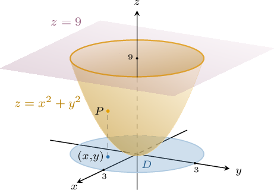
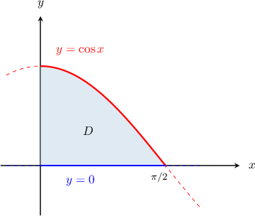
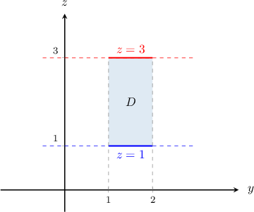
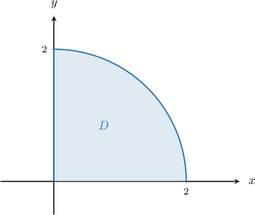

# Areas of Surfaces

Source: https://www.mathacademy.com/topics/3602?courseId=54
Topic ID: 3602

## Prerequisites

- [Areas of Parametric Surfaces](./1790-areas-of-parametric-surfaces.md)
- [Identifying Quadric Surfaces](./1898-identifying-quadric-surfaces.md)
- [Double Integrals in Plane Polar Coordinates](./2030-double-integrals-in-plane-polar-coordinates.md)

## Lesson

### Introduction

Recall that if $S$ is a surface parametrized by a differentiable vector-valued function

$$

\mathbf{r}(u,v) = \big\langle x(u,v), \: y(u,v), \: z(u,v) \big\rangle

$$

defined over a region $D$ in the $uv$-plane, then the surface area of $S$ is given by

$$

\iint\limits_{S} \: \text{d}S = \iint\limits_{D} \| \mathbf{r}'_ u \times \mathbf{r}'_v \| \: \text{d}A,

$$

where $\mathbf{r}'_ u \times \mathbf{r}'_v$ is the fundamental vector product of the surface.

Now, if our surface $S$ is defined as $z= f(x,y),$ then it can always be parameterized as

$$

\mathbf r(x,y)= \left\langle x,\: y,\: f(x,y)\right\rangle \qquad (x,y) \in D.

$$

In this case, the variables $x$ and $y$ act as parameters.

Thus, the fundamental vector product of $S$ is given by

$$

\begin{aligned}𝐫_{′𝑥}×𝐫_{′𝑦} & =\begin{matrix}𝐢 & 𝐣 & 𝐤 \\ 1 & 0 & \frac{𝜕𝑓}{𝜕𝑥} \\ 0 & 1 & \frac{𝜕𝑓}{𝜕𝑦}\end{matrix} \\ & =⟨−\frac{𝜕𝑓}{𝜕𝑥},\,−\frac{𝜕𝑓}{𝜕𝑦},\,1⟩,\end{aligned}

$$

and using the fact that $z = f(x,y),$ we can write this as

$$

\begin{aligned}𝐫_{′𝑥}×𝐫_{′𝑦} & =⟨−\frac{𝜕𝑧}{𝜕𝑥},\,−\frac{𝜕𝑧}{𝜕𝑦},\,1⟩.\end{aligned}

$$

Therefore,

$$

\| \mathbf{r}'_ u \times \mathbf{r}'_v \| = \sqrt{1 + \left(\dfrac{\partial z}{\partial x}\right)^2 + \left(\dfrac{\partial z}{\partial y}\right)^2}.

$$

So, we conclude that for a surface $S$ defined by $z=f(x,y)$ with $(x,y)\in D,$ the surface area of $S$ is given by

$$

\iint\limits_S \, \text{d}S = \iint\limits_D \sqrt{1+\left(\dfrac{\partial z}{\partial x}\right)^2+\left(\dfrac{\partial z}{\partial y}\right)^2} \: \text{d}A,

$$

where $D$ is the projection of $S$ onto the $xy$-plane.

Let's look at an example of how to apply this formula.

### A Worked Example

The surface $S$ shown above consists of the part of the paraboloid $z=x^2+y^2$ that lies under the plane $z=9.$ Let's compute the surface area of $S.$

The plane intersects the paraboloid when $z=9.$ Thus, the curve that describes the intersection points is

$$

x^2+y^2 = 9,

$$

which is a circle of radius $3$ in the $xy$-plane.

Therefore, our surface can be described by the equations

$$

z = f(x,y) = x^2 + y^2, \quad (x,y) \in D

$$

where the region $D$ is given by

$$

D = \left\{(x,y): \, x^2 + y^2 \le 9\right\}.

$$

To compute the surface area of $S,$ we use the formula

$$

\iint\limits_S \, \text{d}S = \iint\limits_D \sqrt{1+\left(\dfrac{\partial z}{\partial x}\right)^2+\left(\dfrac{\partial z}{\partial y}\right)^2} \: \text{d}A.

$$

First, we compute the partial derivatives:

$$

\begin{aligned}\frac{𝜕𝑧}{𝜕𝑥} & =\frac{𝜕}{𝜕𝑥}(𝑥^{2}+𝑦^{2})=2𝑥, \\ \frac{𝜕𝑧}{𝜕𝑦} & =\frac{𝜕}{𝜕𝑦}(𝑥^{2}+𝑦^{2})=2𝑦\end{aligned}

$$

Substituting these expressions into our surface area formula, we get

$$

\begin{aligned}\underset{𝑆}{∬}\,d𝑆 & =\underset{𝐷}{∬}\sqrt{1+(\frac{𝜕𝑧}{𝜕𝑥})^{2}+(\frac{𝜕𝑧}{𝜕𝑦})^{2}}\,d𝐴 \\ & =\underset{𝐷}{∬}\sqrt{1+(2𝑥)^{2}+(2𝑦)^{2}}\,d𝐴 \\ & =\underset{𝐷}{∬}\sqrt{1+4𝑥^{2}+4𝑦^{2}}\,d𝐴.\end{aligned}

$$

Now, by changing the variables to polar coordinates $(x,y)\to (r,\theta),$ we have $\textrm dA = r\,\textrm d r\, \textrm d \theta.$ Thus, our integration region becomes

$$

\Delta = \left\{(r,\theta): \, 0\leq r\leq 3,\:0\leq\theta\lt 2\pi\right\}.

$$

Therefore, we get

$$

\begin{aligned}\underset{𝐷}{∬}\sqrt{1+4𝑥^{2}+4𝑦^{2}}\,d𝐴 & =\underset{Δ}{∬}\sqrt{1+4(𝑟cos⁡𝜃)^{2}+4(𝑟sin⁡𝜃)^{2}}\,𝑟\,d𝑟\,d𝜃 \\ & =\underset{Δ}{∬}𝑟\sqrt{1+4𝑟^{2}(cos^{2}⁡𝜃+sin^{2}⁡𝜃)}\,d𝑟\,d𝜃 \\ & =\underset{Δ}{∬}𝑟\sqrt{1+4𝑟^{2}}\,d𝑟\,d𝜃 \\ & =∫_{2𝜋0}∫_{30}𝑟\sqrt{1+4𝑟^{2}\,}\,d𝑟\,d𝜃 \\ & =∫_{2𝜋0}\,d𝜃\,∫_{30}𝑟\sqrt{1+4𝑟^{2}\,}\,d𝑟 \\ & =2𝜋∫_{30}𝑟\sqrt{1+4𝑟^{2}\,}\,d𝑟 \\ & =2𝜋[\frac{1}{12}(1+4𝑟^{2})^{3/2}]_{30} \\ & =\frac{𝜋}{6}[(1+4𝑟^{2})^{3/2}]_{30} \\ & =\frac{𝜋}{6}(37\sqrt{37}−1).\end{aligned}

$$

So, we conclude that the area of our surface is

$$

\iint\limits_S \, \text{d}S = \dfrac{\pi}{6}(37\sqrt{37} -1).

$$

### Example: Surface Areas of Surfaces Defined as Z=F(X,Y): Rectangular Domains

#### Question

Find the surface area of the part of the plane $z = y - 4x$ that is bounded by the constraints $0 \leq x \leq 2$ and $0 \leq y \leq 1.$

#### Explanation

For a surface $S$ defined by $z = f(x,y)$ with $(x,y)\in D,$ the surface area of $S$ is given by

$$

\iint\limits_S \, \text{d}S = \iint\limits_D \sqrt{1 + \left(\dfrac{\partial z}{\partial x}\right)^2 + \left(\dfrac{\partial z}{\partial y}\right)^2} \: \text{d}A.

$$

In this case, our surface is given by

$$

z = y - 4x, \qquad 0 \leq x \leq 2, \quad 0 \leq y \leq 1.

$$

Now, since

$$

\begin{aligned}\frac{𝜕𝑧}{𝜕𝑥} & =\frac{𝜕}{𝜕𝑥}(𝑦−4𝑥)=−4, \\ \frac{𝜕𝑧}{𝜕𝑦} & =\frac{𝜕}{𝜕𝑦}(𝑦−4𝑥)=1,\end{aligned}

$$

the surface area is given by

$$

\begin{aligned}\underset{𝑆}{∬}\,d𝑆 & =\underset{𝐷}{∬}\sqrt{1+(\frac{𝜕𝑧}{𝜕𝑥})^{2}+(\frac{𝜕𝑧}{𝜕𝑦})^{2}}\,d𝐴 \\ & =\underset{𝐷}{∬}\sqrt{1+(−4)^{2}+(1)^{2}}\,d𝐴 \\ & =\underset{𝐷}{∬}\sqrt{1+16+1}\,d𝐴 \\ & =\underset{𝐷}{∬}\sqrt{18}\,d𝐴 \\ & =\underset{𝐷}{∬}3\sqrt{2}\,d𝐴 \\ & =3\sqrt{2}\underset{𝐷}{∬}d𝐴 \\ & =3\sqrt{2}⋅Area(𝐷) \\ & =3\sqrt{2}⋅(2−0)⋅(1−0) \\ & =6\sqrt{2}.\end{aligned}

$$

### Example: Surface Areas of Surfaces Defined as Z=F(X,Y): Non-Rectangular Domains

#### Question

Find the surface area of the portion of the plane $z = 2y+2x$ whose projection onto the $xy$-plane is bounded by $y=\cos{x}$ and the $x$-axis from $x=0$ to $x=\dfrac{\pi}{2}.$

#### Explanation

For a surface $S$ defined by $z=f(x,y)$ with $(x,y)\in D,$ the surface area of $S$ is given by

$$

\iint\limits_S \, \text{d}S = \iint\limits_D \sqrt{1+\left(\dfrac{\partial z}{\partial x}\right)^2+\left(\dfrac{\partial z}{\partial y}\right)^2} \: \text{d}A.

$$

In this case, our surface is given by

$$

z = 2y+2x, \qquad (x,y)\in D,

$$

where the region $D$ is given by

$$

D = \left\{ (x,y) \: : \: 0 \leq x \leq \dfrac{\pi}{2}, \: 0 \leq y \leq \cos{x} \right\},

$$

as shown in the diagram below.

Now, since

$$

\begin{aligned}\frac{𝜕𝑧}{𝜕𝑥} & =\frac{𝜕}{𝜕𝑥}(2𝑦+2𝑥)=2, \\ \frac{𝜕𝑧}{𝜕𝑦} & =\frac{𝜕}{𝜕𝑦}(2𝑦+2𝑥)=2,\end{aligned}

$$

the surface area is given by

$$

\begin{aligned}\underset{𝑆}{∬}\,d𝑆 & =\underset{𝐷}{∬}\sqrt{1+(\frac{𝜕𝑧}{𝜕𝑥})^{2}+(\frac{𝜕𝑧}{𝜕𝑦})^{2}}\,d𝐴 \\ & =\underset{𝐷}{∬}\sqrt{1+(2)^{2}+(2)^{2}}\,d𝐴 \\ & =\underset{𝐷}{∬}3\,d𝐴 \\ & =3∫_{𝜋/20}∫_{cos⁡𝑥0}\,d𝑦\,d𝑥 \\ & =3∫_{𝜋/20}𝑦\,_{cos⁡𝑥0}\,d𝑥 \\ & =3∫_{𝜋/20}cos⁡𝑥\,d𝑥 \\ & =3sin⁡𝑥\,_{𝜋/20} \\ & =3(1−0) \\ & =3.\end{aligned}

$$

### Cases Where the Domain Is the XZ- or YZ-Plane

We have similar formulas for the areas of surfaces defined by $x = f(y,z)$ and $y = f(x,z){:}$

- For a surface $S$ defined by $x=f(y,z)$ with $(y,z)\in D,$ the surface area of $S$ is given by where $D$ is the projection of $S$ onto the $yz$-plane.

- For a surface $S$ defined by $y=f(x,z)$ with $(x,z)\in D,$ the surface area of $S$ is given by where $D$ is the projection of $S$ onto the $xz$-plane.

Let's see some examples.

### Example: Surface Areas of Surfaces Defined as X=F(Y,Z) or Y=F(X,Z)

#### Question

Find the surface area of the part of the plane $x =y+\sqrt 2 z$ whose projection onto the $yz$-plane is bounded by the constraints $1 \leq y\leq 2$ and $1 \leq z \leq 3.$

#### Explanation

For a surface $S$ defined by $x=f(y,z)$ with $(y,z)\in D,$ the surface area of $S$ is given by

$$

\iint\limits_S \, \text{d}S = \iint\limits_D \sqrt{1+\left(\dfrac{\partial x}{\partial y}\right)^2+\left(\dfrac{\partial x}{\partial z}\right)^2} \: \text{d}A.

$$

In this case, our surface is given by

$$

x = y+\sqrt 2 z, \qquad (y,z)\in D,

$$

where

$$

D = \big\{ (y,z) \: : \: 1 \leq y \leq 2, \: 1 \leq z \leq 3\big\},

$$

as shown in the diagram below.

Now, since

$$

\begin{aligned}\frac{𝜕𝑥}{𝜕𝑦} & =\frac{𝜕}{𝜕𝑦}(𝑦+\sqrt{2}𝑧)=1, \\ \frac{𝜕𝑥}{𝜕𝑧} & =\frac{𝜕}{𝜕𝑧}(𝑦+\sqrt{2}𝑧)=\sqrt{2},\end{aligned}

$$

the surface area is given by

$$

\begin{aligned}\underset{𝑆}{∬}\,d𝑆 & =\underset{𝐷}{∬}\sqrt{1+(\frac{𝜕𝑥}{𝜕𝑦})^{2}+(\frac{𝜕𝑥}{𝜕𝑧})^{2}}\,d𝐴 \\ & =\underset{𝐷}{∬}\sqrt{1+(1)^{2}+(\sqrt{2})^{2}}\,d𝐴 \\ & =\underset{𝐷}{∬}\sqrt{4}\,d𝐴 \\ & =2\underset{𝐷}{∬}\,d𝐴 \\ & =2⋅Area(𝐷) \\ & =2⋅(2−1)⋅(3−1) \\ & =4.\end{aligned}

$$

### Example: Changing to Polar Coordinates

#### Question

Find the surface area of the part of the cone $z=\sqrt{x^2+y^2}$ that is subject to the constraints $x^2 + y^2 \leq 4,\, x\geq 0$ and $y\geq 0.$

#### Explanation

For a surface $S$ defined by $z=f(x,y)$ with $(x,y)\in D,$ the surface area of $S$ is given by

$$

\iint\limits_S \, \text{d}S = \iint\limits_D \sqrt{1+\left(\dfrac{\partial z}{\partial x}\right)^2+\left(\dfrac{\partial z}{\partial y}\right)^2} \: \text{d}A.

$$

In this case, our surface is given by

$$

z = \sqrt{x^2+y^2}, \qquad (x,y)\in D,

$$

where the region $D$ is given by

$$

D = \big\{ (x,y) \: : \: x^2+y^2\leq 4, \, x\geq 0, \, y\geq 0 \big\},

$$

as shown below.

Now, since

$$

\begin{aligned}\frac{𝜕𝑧}{𝜕𝑥} & =\frac{𝜕}{𝜕𝑥}(\sqrt{𝑥^{2}+𝑦^{2}})=\frac{𝑥}{\sqrt{𝑥^{2}+𝑦^{2}}}, \\ \frac{𝜕𝑧}{𝜕𝑦} & =\frac{𝜕}{𝜕𝑦}(\sqrt{𝑥^{2}+𝑦^{2}})=\frac{𝑦}{\sqrt{𝑥^{2}+𝑦^{2}}},\end{aligned}

$$

the surface area is given by

$$

\begin{aligned}\underset{𝑆}{∬}\,d𝑆 & =\underset{𝐷}{∬}\sqrt{1+(\frac{𝜕𝑧}{𝜕𝑥})^{2}+(\frac{𝜕𝑧}{𝜕𝑦})^{2}}\,d𝐴 \\ & =\underset{𝐷}{∬}\sqrt{1+(\frac{𝑥}{\sqrt{𝑥^{2}+𝑦^{2}}})^{2}+(\frac{𝑦}{\sqrt{𝑥^{2}+𝑦^{2}}})^{2}}\,d𝐴 \\ & =\underset{𝐷}{∬}\sqrt{1+\frac{𝑥^{2}}{𝑥^{2}+𝑦^{2}}+\frac{𝑦^{2}}{𝑥^{2}+𝑦^{2}}}\,d𝐴 \\ & =\underset{𝐷}{∬}\sqrt{1+\frac{𝑥^{2}+𝑦^{2}}{𝑥^{2}+𝑦^{2}}}\,d𝐴 \\ & =\underset{𝐷}{∬}\sqrt{2}\,d𝐴.\end{aligned}

$$

In polar coordinates $(r, \theta),$ the region $D$ can be expressed as

$$

\Delta = \left\{ (r,\theta) \: : \: 0 \leq r \leq 2, \: 0 \leq \theta \leq \dfrac{\pi}{2}\right\}.

$$

Therefore, using the change of variables formula for polar coordinates, we obtain

$$

\begin{aligned}\underset{𝐷}{∬}\sqrt{2}\,d𝐴 & =\underset{Δ}{∬}\sqrt{2}\,𝑟\,d𝑟\,d𝜃 \\ & =∫_{𝜋/20}∫_{20}𝑟\sqrt{2}\,d𝑟\,d𝜃 \\ & =\sqrt{2}∫_{𝜋/20}\,d𝜃∫_{20}𝑟\,d𝑟 \\ & =\sqrt{2}⋅[𝜃]_{𝜋/20}⋅[\frac{𝑟^{2}}{2}]_{20} \\ & =\sqrt{2}⋅\frac{𝜋}{2}⋅2 \\ & =𝜋\sqrt{2}.\end{aligned}

$$
