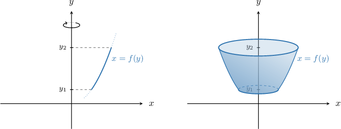
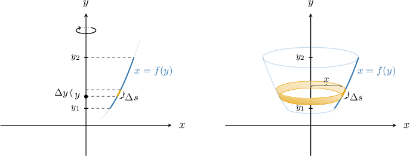
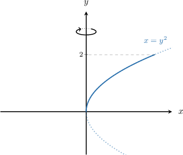
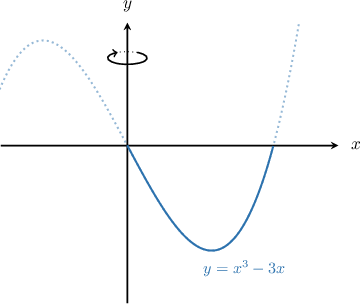

# Surface Areas of Revolution: Rotation About the Y-Axis

Source: https://www.mathacademy.com/topics/3632?courseId=54
Topic ID: 3632

## Prerequisites

- [Surface Areas of Revolution: Rotation About the X-Axis](./1994-surface-areas-of-revolution-rotation-about-the-x-axis.md)

## Lesson

### Introduction

We've seen how to calculate the surface area generated when a curve is rotated $2\pi$ radians about the $x$-axis. We can also obtain surfaces of revolution by rotating a curve $2\pi$ radians about the $y$-axis.

Consider the arc of the curve $x=f(y)$ that lies between the horizontal lines $y=y_1$ and $y=y_2.$ By rotating this curve $2\pi$ radians about the $y$-axis, we get a surface of revolution, as shown below on the right. How can we calculate its surface area?

First, we divide the interval $[y_1,y_2]$ into small subintervals, each of length $\Delta{y}.$ Let's consider a part of the curve that corresponds to one of those subintervals and let the length of the corresponding curved arc be $\Delta{s}.$ When this part of the curve is rotated about the $y$-axis, it forms a closed strip.

If $\Delta{y}$ is very small, we can assume that both left and right radii of the strip are approximately equal to $x=f(y).$ Then, this strip can be viewed as the lateral surface of a right cylinder with height $h=\Delta{s}$ and radius $r=x=f(y).$

We can approximate the lateral surface area of such a cylinder as

$$

S_{\text{strip}} \approx S_{\text{cylinder}} = 2\pi r \cdot h = 2\pi x \cdot \Delta{s}.

$$

The sum over all subintervals will approximate the total area $S$ that we want. The approximation becomes more and more accurate as $\Delta{s} \to 0$. Therefore, to get the area of the surface, we need to integrate:

$$

S = \int 2\pi x\,\textrm d s

$$

Recall that for a curve $x = f(y),$ we can express the arc length element $\textrm d s$ as

$$

\textrm d s = \sqrt{1+\left(\dfrac{\textrm d x}{\textrm d y}\right)^2}\,\textrm d y.

$$

Therefore, we can find the total surface area using the formula

$$

S = 2\pi \int_{y_1}^{y_2} x \sqrt{1+ \left( \dfrac{\text{d}x}{\text{d}y} \right)^2} \: \text{d}y.

$$

### Example: Integrals Representing Surface Areas Generated by Functions of Y

#### Question

Consider the arc of the curve $x=y^2$ that lies between $y=0$ and $y=2,$ as shown below. What integral gives the area of the surface generated when this arc is rotated $2\pi$ radians about the $y$-axis?

#### Explanation

We can find the surface area generated when a curve is rotated $2\pi$ radians about the $y$-axis using the formula

$$

S = \int 2\pi x\,\textrm d s.

$$

Since we're given a curve in the form $x = f(y),$ we have

$$

\textrm d s = \sqrt{1+\left(\dfrac{\textrm d x}{\textrm d y}\right)^2}\,\textrm d y.

$$

Therefore, we will use

$$

S = 2\pi \int_{y_1}^{y_2} x \sqrt{1+ \left( \dfrac{\text{d}x}{\text{d}y} \right)^2} \: \text{d}y.

$$

We are told that the limits of integration are from $y=0$ to $y=2.$

Computing the derivative, we get

$$

\begin{aligned}\frac{d𝑥}{d𝑦} & =\frac{d}{d𝑦}(𝑦^{2})=2𝑦.\end{aligned}

$$

Finally, we obtain

$$

\begin{aligned}𝑆 & =2𝜋∫_{𝑦_{2}𝑦_{1}}^{}𝑥\sqrt{1+(\frac{d𝑥}{d𝑦})^{2}}\,d𝑦 \\ & =2𝜋∫_{20}(𝑦^{2})\sqrt{1+(2𝑦)^{2}}\,d𝑦 \\ & =2𝜋∫_{20}𝑦^{2}\sqrt{1+4𝑦^{2}}\,d𝑦.\end{aligned}

$$

### Surface Areas Generated by Functions of X

Suppose that we're given a curve of the form $y=f(x)$ that lies between the vertical lines $x=x_1$ and $x=x_2.$ How do we calculate the surface area generated when this curve is rotated $2\pi$ radians about the $y$-axis?

Earlier, we showed that the surface area generated when a curve is rotated $2\pi$ radians about the $y$-axis is given by

$$

S = \int 2\pi x\,\textrm d s.

$$

For a curve $y = f(x),$ the arc length element $\textrm d s$ is given by

$$

\textrm d s = \sqrt{1+\left(\dfrac{\textrm d y}{\textrm d x}\right)^2}\,\textrm d x.

$$

Therefore, the area of the surface that is obtained when the $y=f(x)$ curve is rotated $2\pi$ radians about the $y$-axis is given by the formula

$$

S = 2\pi \int_{x_1}^{x_2} x \sqrt{1+ \left( \dfrac{\text{d}y}{\text{d}x} \right)^2} \: \text{d}x.

$$

### Example: Integrals Representing Surface Areas Generated by Functions of X

#### Question

Consider the arc of the curve $y=x^3-3x$ that lies in the fourth quadrant between its $x$-intercepts. What integral gives the area of the surface generated when this arc is rotated $2\pi$ radians about the $y$-axis?

#### Explanation

We can find the surface area generated when a curve is rotated $2\pi$ radians about the $y$-axis using the formula

$$

S = \int 2\pi x\,\textrm d s.

$$

Since we're given a curve in the form $y = f(x),$ we have

$$

\textrm d s = \sqrt{1+\left(\dfrac{\textrm d y}{\textrm d x}\right)^2}\,\textrm d x.

$$

Therefore, we will use

$$

S = 2\pi \int_{x_1}^{x_2} x \sqrt{1+ \left( \dfrac{\text{d}y}{\text{d}x} \right)^2} \: \text{d}x.

$$

First, we need to determine the limits of integration. To do this, we find where the curve intersects the $y$-axis by solving the following equation:

$$

\begin{aligned}𝑥^{3}−3𝑥 & =0 \\ 𝑥(𝑥^{2}−3) & =0 \\ 𝑥 & =0,±\sqrt{3}\end{aligned}

$$

Hence, we need to integrate from $x=0$ to $x= \sqrt{3}.$

Computing the derivative, we get

$$

\begin{aligned}\frac{d𝑦}{d𝑥} & =\frac{d}{d𝑥}(𝑥^{3}−3𝑥)=3𝑥^{2}−3.\end{aligned}

$$

Finally, we obtain

$$

\begin{aligned}𝑆 & =2𝜋∫_{𝑥_{2}𝑥_{1}}^{}𝑥\sqrt{1+(\frac{d𝑦}{d𝑥})^{2}}\,d𝑥 \\ & =2𝜋∫_{\sqrt{3}0}^{}𝑥\sqrt{1+(3𝑥^{2}−3)^{2}}\,d𝑥 \\ & =2𝜋∫_{\sqrt{3}0}^{}𝑥\sqrt{9𝑥^{4}−18𝑥^{2}+10}\,d𝑥.\end{aligned}

$$

### Example: Computing the Surface Area of Revolution

#### Question

Consider the segment of the line $y = 2x$ that lies between the lines $x = 0$ and $x = 2.$ Calculate the surface area generated when this segment is rotated $2\pi$ radians about the $y$-axis.

#### Explanation

We can find the surface area generated when a curve is rotated $2\pi$ radians about the $y$-axis using the formula

$$

S = \int 2\pi x\,\textrm d s.

$$

Since we're given a curve in the form $y = f(x),$ we have

$$

\textrm d s = \sqrt{1+\left(\dfrac{\textrm d y}{\textrm d x}\right)^2}\,\textrm d x.

$$

Therefore, we will use

$$

S = 2\pi \int_{x_1}^{x_2} x\sqrt{1 + \left( \dfrac{\text{d}y}{\text{d}x} \right)^2} \, \text{d}x.

$$

Computing the derivative, we get

$$

\begin{aligned}\frac{d𝑦}{d𝑥} & =\frac{d}{d𝑥}(2𝑥)=2.\end{aligned}

$$

Therefore,

$$

\left( \dfrac{\text{d}y}{\text{d}x} \right)^2 = 4.

$$

Finally, we obtain

$$

\begin{aligned}𝑆 & =2𝜋∫_{𝑥_{2}𝑥_{1}}^{}𝑥\sqrt{1+(\frac{d𝑦}{d𝑥})^{2}}\,d𝑥 \\ & =2𝜋∫_{20}𝑥\sqrt{1+4}\,d𝑥 \\ & =2𝜋\sqrt{5}∫_{20}𝑥\,d𝑥 \\ & =2𝜋\sqrt{5}[\frac{𝑥^{2}}{2}]_{20} \\ & =2𝜋\sqrt{5}[\frac{2^{2}}{2}−\frac{0^{2}}{2}] \\ & =4𝜋\sqrt{5}.\end{aligned}

$$
