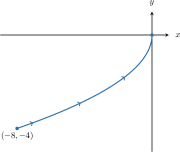
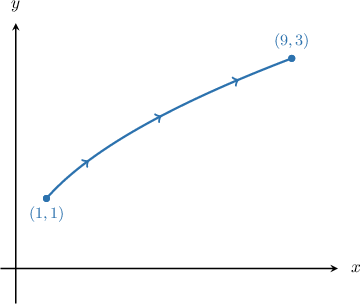
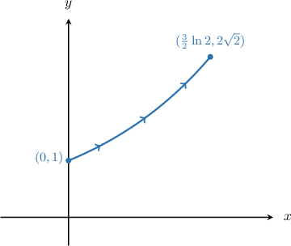

# Line Integrals of Scalar Functions Over Paths Expressed as Functions of Y

Source: https://www.mathacademy.com/topics/3689?courseId=54
Topic ID: 3689

## Prerequisites

- [Parametric Equations of Parabolas](../../../high-school/integrated-math-honors/lessons/integrated-math-iii-honors/875-parametric-equations-of-parabolas.md)
- [Line Integrals of Scalar Functions Over Paths Expressed as Functions of X](./2635-line-integrals-of-scalar-functions-over-paths-expressed-as-functions-of-x.md)

## Lesson

### Introduction

Suppose we want to evaluate the line integral with respect to arc length

$$

\displaystyle \int \limits_{C} f(x,y) \,\textrm ds,

$$

for some function $f(x,y),$ where $C$ is the section of the curve $y^2 = -2x$ traversed between the points $(-8,-4)$ and the origin, as shown below.

The first thing is to find a parametrization for $C.$ One option is to write the equation of the curve in the form $y = y(x).$ However, as this involves dealing with square roots, it can get messy.

A more elegant way is to write the equation of $C$ in the form $x = x(y),$ as follows:

$$

y^2 = -2x\qquad \Longrightarrow\qquad x = -\dfrac12 y^2

$$

Since $x$ is now an explicit function of the independent variable $y,$ we can set $y=t,$ and this gives

$$

x(t) = -\dfrac12 t^2.

$$

Therefore, we now have the following parametrization for $C\mathbin{:}$

$$

\mathbf r(t) = \left\langle-\dfrac12t^2,\, t\right\rangle,\quad -4 \leq t \leq 0,

$$

where the bounds for $t$ are the $y$-values at the path's endpoints. We can now write an expression for our line integral in terms of $t$ in the usual way.

### Example: Constructing the Line Integral of a Function Over Curve Expressed as a Function of Y

#### Question

By setting $y = t$ where $t$ is a parameter, find a definite integral with respect to $t$ that is equivalent to the integral $\displaystyle \int \limits_{C} \dfrac{x}{y} \, \textrm ds,$ where $C$ is the arc of the parabola $x = y^2$ traversed between the points $(1,1)$ and $(9, 3),$ as shown above.

#### Explanation

Notice that the given curve is of the form $x = x(y).$ Therefore, by setting $y = t,$ we have

$$

x = x(t) = t^2.

$$

This gives the following parametrization of the curve:

$$

\mathbf{r}(t) = \left\langle t^2 , \: t \right\rangle, \qquad 1 \leq t \leq 3

$$

Note that the domain $1 \leq t \leq 3$ is defined by the $y$-coordinates of the endpoints on the path.

Computing $\mathbf{r}'(t)$ and $\| \mathbf{r}'(t) \|,$ we get the following:

$$

\begin{aligned}𝐫^{′}(𝑡) & =\frac{d𝑥}{d𝑡}\,𝐢+\frac{d𝑦}{d𝑡}\,𝐣 \\ & =\frac{d}{d𝑡}(𝑡^{2})𝐢+\frac{d}{d𝑡}(𝑡)𝐣 \\ & =2𝑡\,𝐢+𝐣 \\ ‖𝐫^{′}(𝑡)‖ & =\sqrt{(\frac{d𝑥}{d𝑡})^{2}+(\frac{d𝑦}{d𝑡})^{2}} \\ & =\sqrt{(2𝑡)^{2}+1^{2}} \\ & =\sqrt{4𝑡^{2}+1}\end{aligned}

$$

Now, if $f(x,y) = \dfrac{x}{y},$ then we obtain

$$

\begin{aligned}𝑓(𝐫(𝑡)) & =\frac{𝑡^{2}}{𝑡} \\ & =𝑡.\end{aligned}

$$

Therefore, we can write the integral as

$$

\begin{aligned}\underset{𝐶}{∫}\frac{𝑥}{𝑦}\,d𝑠 & =∫_{31}𝑓(𝐫(𝑡))\,‖𝐫^{′}(𝑡)‖\,d𝑡 \\ & =∫_{31}𝑡\sqrt{4𝑡^{2}+1}\,d𝑡.\end{aligned}

$$

### Example: Evaluating the Line Integral of a Function Over Curve Expressed as a Function of Y

#### Question

Evaluate the line integral $\displaystyle \int\limits_{C} y^3e^{-x} \: \text{d}s,$ where $C$ is the section of the curve $x = \ln{y}$ from $(0, 1)$ to $\left(\dfrac32\ln 2, 2\sqrt{2}\right),$ as shown above.

#### Explanation

Notice that the given curve is of the form $x = x(y).$ Therefore, by setting $y=t,$ we have

$$

x = x(t) = \ln{t}.

$$

This gives the following parametrization of the curve:

$$

\mathbf{r}(t) = \left\langle \ln{t}, \: t \right\rangle, \qquad 1 \leq t \leq 2\sqrt{2}

$$

Note that the domain $1 \leq t \leq 2\sqrt{2}$ is defined by the $y$-coordinates of the endpoints on the path.

Computing $\mathbf{r}'(t)$ and $\| \mathbf{r}'(t) \|,$ we get the following:

$$

\begin{aligned}𝐫^{′}(𝑡) & =\frac{d𝑥}{d𝑡}\,𝐢+\frac{d𝑦}{d𝑡}\,𝐣 \\ & =\frac{d}{d𝑡}(ln⁡𝑡)𝐢+\frac{d}{d𝑡}(𝑡)𝐣 \\ & =\frac{1}{𝑡}\,𝐢+𝐣 \\ ‖𝐫^{′}(𝑡)‖ & =\sqrt{(\frac{d𝑥}{d𝑡})^{2}+(\frac{d𝑦}{d𝑡})^{2}} \\ & =\sqrt{(\frac{1}{𝑡})^{2}+1^{2}} \\ & =\sqrt{\frac{1}{𝑡^{2}}+1} \\ & =\sqrt{\frac{𝑡^{2}+1}{𝑡^{2}}} \\ & =\frac{\sqrt{𝑡^{2}+1}}{|𝑡|} \\ & =\frac{\sqrt{𝑡^{2}+1}}{𝑡}\end{aligned}

$$

Now, if $f(x,y) = y^3e^{-x},$ then we obtain

$$

\begin{aligned}𝑓(𝐫(𝑡)) & =𝑡^{3}𝑒^{−ln⁡𝑡} \\ & =𝑡^{3}⋅\frac{1}{𝑡} \\ & =𝑡^{2}.\end{aligned}

$$

Therefore, we can write the integral as

$$

\begin{aligned}\underset{𝐶}{∫}𝑦^{3}𝑒^{−𝑥}\,d𝑠 & =∫_{2\sqrt{2}1}^{}𝑓(𝐫(𝑡))\,‖𝐫^{′}(𝑡)‖\,d𝑡 \\ & =∫_{2\sqrt{2}1}^{}𝑡^{2}⋅\frac{\sqrt{𝑡^{2}+1}}{𝑡}\,d𝑡 \\ & =∫_{2\sqrt{2}1}^{}𝑡\sqrt{𝑡^{2}+1}\,d𝑡.\end{aligned}

$$

Finally, we evaluate the integral using the substitution $u = t^2 + 1,$ $\text{d}u = 2t \, \text{d}t$ as follows:

$$

\begin{aligned}∫_{2\sqrt{2}1}^{}𝑡\sqrt{𝑡^{2}+1}\,d𝑡 & =∫_{92}\sqrt{𝑢}⋅\frac{1}{2}\,d𝑢 \\ & =\frac{1}{2}⋅\frac{2}{3}\sqrt{𝑢^{3}}\,_{92} \\ & =\frac{1}{3}[\sqrt{9^{3}}−\sqrt{2^{3}}] \\ & =\frac{27−2\sqrt{2}}{3}\end{aligned}

$$
