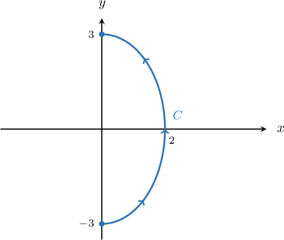
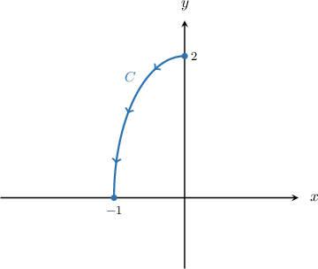

# Line Integrals of Scalar Functions Over Ellipses

Source: https://www.mathacademy.com/topics/3690?courseId=54
Topic ID: 3690

## Prerequisites

- [Parametric Equations of Ellipses](../../../high-school/integrated-math-honors/lessons/integrated-math-iii-honors/2746-parametric-equations-of-ellipses.md)
- [Line Integrals of Scalar Functions Over Circles](./3688-line-integrals-of-scalar-functions-over-circles.md)

## Lesson

### Introduction

Recall that the line integral with respect to arc length of a function $f(x,y)$ along a curve $C$ is given by

$$

\int\limits_C f(x, y) \, \textrm{d}s = \int\limits_a^b f(\mathbf r(t)) \, \| \mathbf r'(t) \| \, \textrm{d}t,

$$

where $\mathbf r(t)$ for $a \leq t \leq b$ is a parametrization of the curve $C.$

In this lesson, we will consider the case when the curve $C$ is an ellipse. To calculate a line integral along an ellipse, we need to parameterize the ellipse.

Remember that an ellipse with center $O,$ horizontal semi-axis $a,$ and vertical semi-axis $b$ can be parameterized as

$$

\mathbf r(t) = \langle a\cos t,\: b\sin t\rangle, \qquad 0\leq t \lt 2\pi.

$$

Additionally, the direction in which we traverse our ellipse does not matter, because line integrals with respect to arc length are independent of the choice of orientation.

### Example: Constructing the Line Integral of a Function Over an Ellipse

#### Question

What expression is equivalent to $\displaystyle \int_\limits{C} \dfrac{x}{y} \: \textrm{d}s,$ where $C$ is the ellipse $x^2 + 16y^2 = 16,$ traversed once in the counterclockwise direction?

#### Explanation

We will use the formula

$$

\int\limits_C f(x, y) \, \textrm{d}s = \int\limits_a^b f(\mathbf r(t)) \, \| \mathbf r'(t) \| \, \textrm{d}t.

$$

Note that we can write the equation of our ellipse in the form

$$

\dfrac{x^2}{4^2} + \dfrac{y^2}{1^2} = 1.

$$

So, the curve $C$ is an ellipse centered at $O$ with horizontal and vertical semiaxes of $4$ and $1,$ respectively. Therefore, it can be parametrized as

$$

\mathbf{r}(t) = \left\langle 4\cos{t}, \: \sin{t} \right\rangle, \qquad 0 \le t \lt 2\pi.

$$

Computing $\mathbf{r}'(t)$ and $\| \mathbf{r}'(t) \|,$ we get following:

$$

\begin{aligned}𝐫^{′}(𝑡) & =\frac{d𝑥}{d𝑡}\,𝐢+\frac{d𝑦}{d𝑡}\,𝐣 \\ & =\frac{d}{d𝑡}(4cos⁡𝑡)𝐢+\frac{d}{d𝑡}(sin⁡𝑡)𝐣 \\ & =−4sin⁡𝑡\,𝐢+cos⁡𝑡\,𝐣 \\ ‖𝐫^{′}(𝑡)‖ & =\sqrt{√(\frac{d𝑥}{d𝑡})^{2}+(\frac{d𝑦}{d𝑡})^{2}} \\ & =\sqrt{√(−4sin⁡𝑡)^{2}+(cos⁡𝑡)^{2}} \\ & =\sqrt{√16sin^{2}⁡𝑡+cos^{2}⁡𝑡} \\ & =\sqrt{√15sin^{2}⁡𝑡+(sin^{2}⁡𝑡+cos^{2}⁡𝑡)} \\ & =\sqrt{√15sin^{2}⁡𝑡+1}\end{aligned}

$$

Now, since $f(x,y) = \dfrac{x}{y},$ we obtain

$$

\begin{aligned}𝑓(𝐫(𝑡)) & =\frac{4cos⁡𝑡}{sin⁡𝑡}=4cot⁡𝑡.\end{aligned}

$$

Therefore, we can write the integral as

$$

\begin{aligned}\underset{𝐶}{∫}\frac{𝑥}{𝑦}\,d𝑠 & =∫_{2𝜋0}^{}𝑓(𝐫(𝑡))\,‖𝐫^{′}(𝑡)‖\,d𝑡 \\ & =∫_{2𝜋0}^{}4cot⁡𝑡\sqrt{√15sin^{2}⁡𝑡+1}\,d𝑡 \\ & =4∫_{2𝜋0}^{}cot⁡𝑡\sqrt{√15sin^{2}⁡𝑡+1}\,d𝑡.\end{aligned}

$$

### Example: Constructing the Line Integral of a Function Over a Part-Ellipse

#### Question

Find, as a definite integral, an expression for the line integral of the function $\displaystyle\int_\limits{C} 2xy \:\textrm{d}s,$ where the curve $C$ is the right half of the ellipse $9x^2 + 4y^2 = 36,$ shown above.

#### Explanation

We will use the formula

$$

\int\limits_C f(x, y) \, \textrm{d}s = \int\limits_a^b f(\mathbf r(t)) \, \| \mathbf r'(t) \| \, \textrm{d}t.

$$

Note that we can write the equation of our ellipse in the form

$$

\dfrac{x^2}{2^2} + \dfrac{y^2}{3^2} = 1.

$$

So, the curve $C$ is an ellipse centered at $O$ with horizontal and vertical semiaxes of $2$ and $3,$ respectively. Therefore, it can be parametrized as

$$

\mathbf{r}(t) = \left\langle 2\cos{t}, \: 3\sin{t} \right\rangle, \qquad -\dfrac{\pi}{2} \le t \le \dfrac{\pi}{2}.

$$

Computing $\mathbf{r}'(t)$ and $\| \mathbf{r}'(t) \|,$ we get following:

$$

\begin{aligned}𝐫^{′}(𝑡) & =\frac{d𝑥}{d𝑡}\,𝐢+\frac{d𝑦}{d𝑡}\,𝐣 \\ & =\frac{d}{d𝑡}(2cos⁡𝑡)𝐢+\frac{d}{d𝑡}(3sin⁡𝑡)𝐣 \\ & =−2sin⁡𝑡\,𝐢+3cos⁡𝑡\,𝐣 \\ ‖𝐫^{′}(𝑡)‖ & =\sqrt{√(\frac{d𝑥}{d𝑡})^{2}+(\frac{d𝑦}{d𝑡})^{2}} \\ & =\sqrt{√(−2sin⁡𝑡)^{2}+(3cos⁡𝑡)^{2}} \\ & =\sqrt{√4sin^{2}⁡𝑡+9cos^{2}⁡𝑡} \\ & =\sqrt{√5cos^{2}⁡𝑡+4(sin^{2}⁡𝑡+cos^{2}⁡𝑡)} \\ & =\sqrt{√5cos^{2}⁡𝑡+4}\end{aligned}

$$

Now, since $f(x,y) = 2xy,$ we obtain

$$

\begin{aligned}𝑓(𝐫(𝑡)) & =2(2cos⁡𝑡)(3sin⁡𝑡) \\ & =12sin⁡𝑡cos⁡𝑡.\end{aligned}

$$

Therefore, we can write the integral as

$$

\begin{aligned}\underset{𝐶}{∫}2𝑥𝑦\,d𝑠 & =∫_{𝜋/2−𝜋/2}^{}𝑓(𝐫(𝑡))\,‖𝐫^{′}(𝑡)‖\,d𝑡 \\ & =∫_{𝜋/2−𝜋/2}^{}12sin⁡𝑡cos⁡𝑡\sqrt{√5cos^{2}⁡𝑡+4}\,d𝑡 \\ & =12∫_{𝜋/2−𝜋/2}^{}sin⁡𝑡cos⁡𝑡\sqrt{√5cos^{2}⁡𝑡+4}\,d𝑡.\end{aligned}

$$

### Example: Computing a Line Integral of a Function Over an Ellipse

#### Question

Evaluate the line integral $\displaystyle\int_\limits{C}12xy\:\textrm{d}s,$ where the curve $C$ is the quarter-ellipse $4x^2+y^2=4$ traversed from the point $(0,2)$ to the point $(-1,0),$ as shown above.

#### Explanation

We will use the formula

$$

\int\limits_C f(x, y) \, \textrm{d}s = \int\limits_a^b f(\mathbf r(t)) \, \| \mathbf r'(t) \| \, \textrm{d}t.

$$

Note that we can write the equation of our ellipse in the form

$$

x^2 + \dfrac{y^2}{2^2} = 1.

$$

So, the curve $C$ is an ellipse centered at $O$ with horizontal and vertical semiaxes of $1$ and $2,$ respectively. Therefore, it can be parametrized as

$$

\mathbf{r}(t) = \big\langle \cos{t}, \: 2\sin{t} \big\rangle, \qquad \dfrac{\pi}{2} \le t \le \pi.

$$

Computing $\mathbf{r}'(t)$ and $\| \mathbf{r}'(t) \|,$ we get following:

$$

\begin{aligned}𝐫^{′}(𝑡) & =\frac{d𝑥}{d𝑡}\,𝐢+\frac{d𝑦}{d𝑡}\,𝐣 \\ & =\frac{d}{d𝑡}(cos⁡𝑡)𝐢+\frac{d}{d𝑡}(2sin⁡𝑡)𝐣 \\ & =−sin⁡𝑡\,𝐢+2cos⁡𝑡\,𝐣 \\ ‖𝐫^{′}(𝑡)‖ & =\sqrt{√(\frac{d𝑥}{d𝑡})^{2}+(\frac{d𝑦}{d𝑡})^{2}} \\ & =\sqrt{√(−sin⁡𝑡)^{2}+(2cos⁡𝑡)^{2}} \\ & =\sqrt{√sin^{2}⁡𝑡+4cos^{2}⁡𝑡} \\ & =\sqrt{√3cos^{2}⁡𝑡+(sin^{2}⁡𝑡+cos^{2}⁡𝑡)} \\ & =\sqrt{√1+3cos^{2}⁡𝑡}\end{aligned}

$$

Now, since $f(x,y) = 12xy$, we obtain

$$

\begin{aligned}𝑓(𝐫(𝑡)) & =12⋅cos⁡𝑡⋅2sin⁡𝑡=24sin⁡𝑡\,cos⁡𝑡.\end{aligned}

$$

Therefore, we can write the integral as

$$

\begin{aligned}\underset{𝐶}{∫}12𝑥𝑦\,d𝑠 & =∫_{𝜋𝜋/2}^{}𝑓(𝐫(𝑡))\,‖𝐫^{′}(𝑡)‖\,d𝑡 \\ & =∫_{𝜋𝜋/2}^{}24sin⁡𝑡cos⁡𝑡⋅\sqrt{√1+3cos^{2}⁡𝑡}⋅d𝑡 \\ & =24∫_{𝜋𝜋/2}^{}sin⁡𝑡cos⁡𝑡\sqrt{√1+3cos^{2}⁡𝑡}\,d𝑡.\end{aligned}

$$

We can solve this using the substitution $u=1+3\cos^2 {t},$ $\textrm d u=-6\sin t\cos t\,\textrm d t$ as follows:

$$

\begin{aligned}24∫_{𝜋𝜋/2}^{}sin⁡𝑡cos⁡𝑡\sqrt{√1+3cos^{2}⁡𝑡}\,d𝑡 & =−4∫_{41}^{}\sqrt{√𝑢}\,d𝑢 \\ & =−4⋅\frac{2}{3}𝑢^{3/2}_{41}^{} \\ & =−\frac{8}{3}(4^{3/2}−1^{3/2}) \\ & =−\frac{8}{3}(8−1) \\ & =−\frac{56}{3}\end{aligned}

$$
