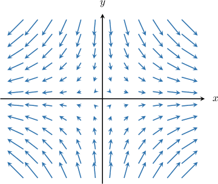
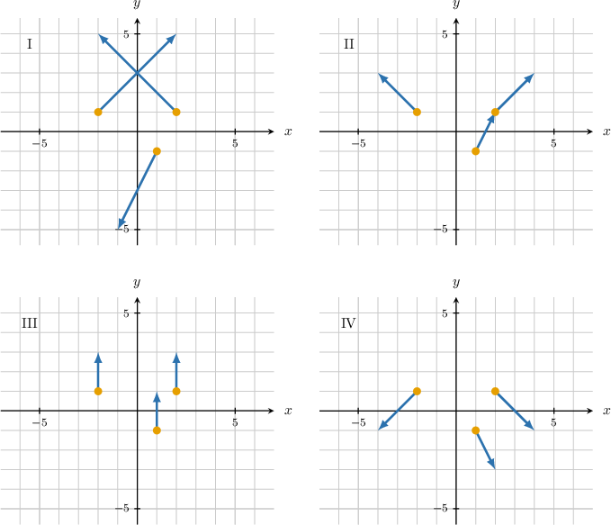
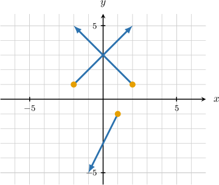
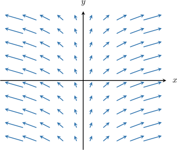
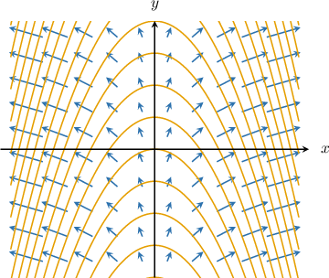
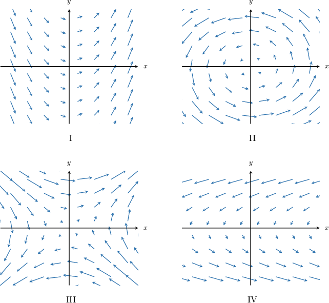
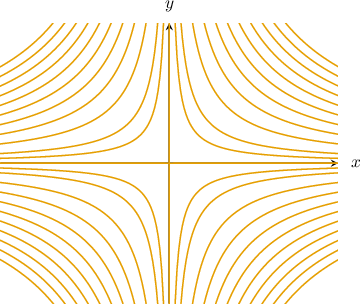
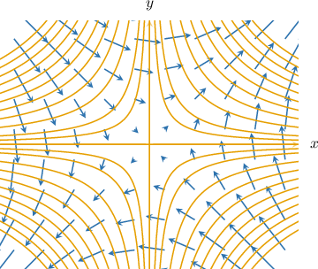
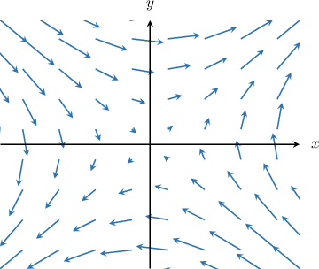

# Gradient Vector Fields

Source: https://www.mathacademy.com/topics/3692?courseId=54
Topic ID: 3692

## Prerequisites

- [The Gradient as a Normal Vector](./1939-the-gradient-as-a-normal-vector.md)
- [Visualizing Vector Fields](./3344-visualizing-vector-fields.md)

## Lesson

### Introduction

Recall that if $f(x,y)$ is a function whose partial derivatives

$$

\dfrac{\partial f}{\partial x}, \qquad \dfrac{\partial f}{\partial y},

$$

exist and are continuous at a point $(x_0,y_0) \in \mathbb{R}^2,$ then the gradient of $f$ evaluated at $(x_0, y_0)$ is given by

$$

\nabla f(x_0,y_0) = \dfrac{\partial f }{\partial x}(x_0, y_0) \,\mathbf{i} + \dfrac{\partial f }{\partial y} (x_0, y_0)\,\mathbf{j} \, .

$$

Now suppose that the gradient vector exists at every point $(x,y)$ contained within the set $U\subset \mathbb R^2.$ Then, the **gradient vector field** of $f$ is defined as the map

$$

(x,y) \longmapsto \nabla f(x,y), \qquad (x,y)\in U.

$$

As an example, consider the function $f(x,y)=x^2-y^2.$ To find the gradient vector field of $f,$ we proceed as follows.

First, we find the partial derivatives:

$$

\begin{aligned}\frac{𝜕𝑓}{𝜕𝑥} & =\frac{𝜕}{𝜕𝑥}(𝑥^{2}−𝑦^{2})=2𝑥 \\ \frac{𝜕𝑓}{𝜕𝑦} & =\frac{𝜕}{𝜕𝑦}(𝑥^{2}−𝑦^{2})=−2𝑦\end{aligned}

$$

Therefore, the gradient vector field of $f(x,y)$ is

$$

\begin{aligned}∇𝑓(𝑥,𝑦) & =2𝑥\,𝐢−2𝑦\,𝐣.\end{aligned}

$$

A sketch of this vector field is shown below.

### Example: Calculating the Gradient Vector Field of a Function

#### Question

Find the gradient vector field of the function $f(x,y) = e^{2x-3y}.$

#### Explanation

The gradient vector field of a function $f$ is given by $\nabla f.$

First, we find the partial derivatives:

$$

\begin{aligned}𝑓_{𝑥}(𝑥,𝑦) & =\frac{𝜕}{𝜕𝑥}(𝑒^{2𝑥−3𝑦}) \\ & =2𝑒^{2𝑥−3𝑦} \\ 𝑓_{𝑦}(𝑥,𝑦) & =\frac{𝜕}{𝜕𝑦}(𝑒^{2𝑥−3𝑦}) \\ & =−3𝑒^{2𝑥−3𝑦}\end{aligned}

$$

Therefore, the gradient vector field of $f(x,y)$ is

$$

\begin{aligned}∇𝑓(𝑥,𝑦) & =𝑓_{𝑥}(𝑥,𝑦)\,𝐢+𝑓_{𝑦}(𝑥,𝑦)\,𝐣 \\ & =2𝑒^{2𝑥−3𝑦}\,𝐢−3𝑒^{2𝑥−3𝑦}\,𝐣.\end{aligned}

$$

### Example: Sketching the Gradient Vector Field of a Function

#### Question

Which of the above diagrams represents the gradient vector field of the function $f(x,y) = 2y^2-x^2?$

#### Explanation

The gradient vector field of a function $f$ is given by $\nabla f.$

First, we find the partial derivatives:

$$

\begin{aligned}𝑓_{𝑥}(𝑥,𝑦) & =\frac{𝜕}{𝜕𝑥}(2𝑦^{2}−𝑥^{2}) \\ & =−2𝑥 \\ 𝑓_{𝑦}(𝑥,𝑦) & =\frac{𝜕}{𝜕𝑦}(2𝑦^{2}−𝑥^{2}) \\ & =4𝑦\end{aligned}

$$

So, the gradient vector field of $f(x,y)$ is

$$

\begin{aligned}∇𝑓(𝑥,𝑦) & =𝑓_{𝑥}(𝑥,𝑦)\,𝐢+𝑓_{𝑦}(𝑥,𝑦)\,𝐣 \\ & =−2𝑥\,𝐢+4𝑦\,𝐣.\end{aligned}

$$

Next, we have to sketch the vector field at the points $(2,1),$ $(-2,1),$ and $(1,-1).$

To sketch the vector field at the given points, we substitute their coordinates into the expression for $\nabla f.$

$$

\begin{aligned}∇𝑓(2,1) & =−2⋅2\,𝐢+4⋅1\,𝐣=−4\,𝐢+4\,𝐣 \\ ∇𝑓(−2,1) & =−2⋅(−2)\,𝐢+4⋅1\,𝐣=4\,𝐢+4\,𝐣 \\ ∇𝑓(1,−1) & =−2⋅1\,𝐢+4⋅(−1)\,𝐣=−2\,𝐢−4\,𝐣\end{aligned}

$$

Now, we draw the vectors at their corresponding points and obtain the following diagram:

### The Relationship Between the Vector Field of a Function and Its Contour Plot

Consider the gradient vector field of the function $f(x,y) = x^2+y,$ shown below. How is this vector field related to the level curves of $f?$

To answer this question, we note the following:

- As we've seen, the gradient of $f$ at a particular point $(x_0, y_0)$ lies *perpendicular* to the level curve $f(x,y) = f(x_0, y_0).$

- Therefore, the gradient field vectors of $f$ at an arbitrary point $(x,y)$ lie perpendicular to its level curve at $(x,y).$

- Moreover, the vectors always point in the direction where $f(x,y)$ is increasing.

Now, if we superimpose the level curves of $f$ onto its vector field, we get a picture that looks as follows:

Notice that the field vectors are indeed perpendicular to the level curves.

We can use a similar idea to sketch the vector field of a function using its level curves. Let's see an example.

### Example: Using the Relationship Between the Vector Field of a Function and Its Contour Plot

#### Question

Which of the above diagrams could be the gradient vector field of the function $f(x,y) = xy?$

#### Explanation

We start by plotting some level curves of the function:

- Setting $f(x,y) = -1,$ we get $xy = -1,$ which gives the hyperbola $y=-\dfrac 1x$

- Setting $f(x,y) = 0,$ we get $xy = 0,$ that is, the lines $y=0$ and $x=0$

- Setting $f(x,y) = 1,$ we get $xy =1,$ that is, the hyperbola $y=\dfrac 1x$

- Setting $f(x,y) = -2,$ we get $xy =-2,$ that is, the hyperbola $y=-\dfrac 2x$

- $\cdots$

Continuing in this way, we get the following contour plot:

Note that $f(x,y)$ increases as we move from left to right in the upper half-plane $y > 0,$ and increases as we move from right-to-left in the lower half-plane $y < 0.$

Now, we recall the following facts:

- The gradient field vectors of a function $f(x,y)$ always lie perpendicular to its level curves.

- Moreover, the vectors point in the direction where $f(x,y)$ increases.

With this in mind, we can add the vector field to the contour plot, giving the following picture.

So, the corresponding gradient field is as follows:

Therefore, the correct answer is III.
