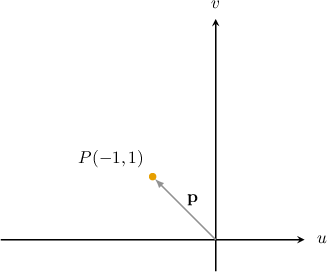
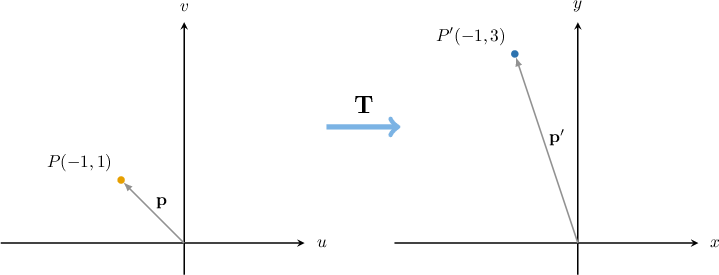
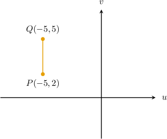
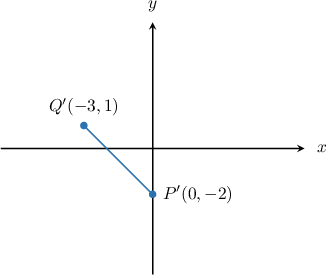
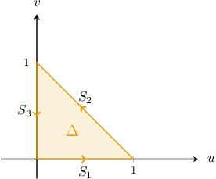
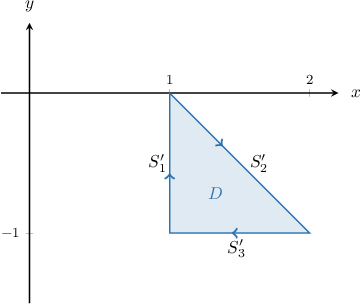
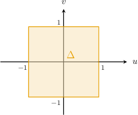
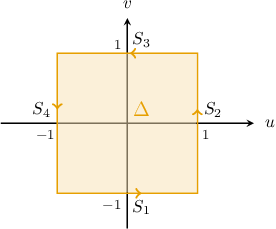
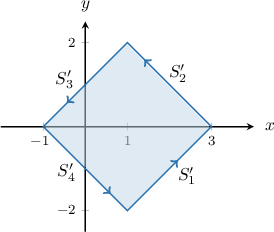
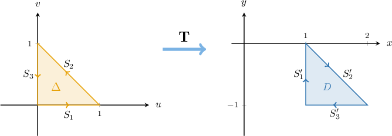

# The Image of an Affine Transformation

Source: https://www.mathacademy.com/topics/3706?courseId=54
Topic ID: 3706

## Prerequisites

- [Area Scale Factors of Linear Transformations](../../../high-school/integrated-math-honors/lessons/integrated-math-iii-honors/989-area-scale-factors-of-linear-transformations.md)
- [Affine Transformations](./3387-affine-transformations.md)

## Lesson

### Introduction

To find the image of a point under an affine transformation, all we need to do is substitute the position vector of the point into the formula for the affine transformation.

For example, consider the affine transformation $\mathbf T:\Bbb R^2 \to \Bbb R^2,$ defined by

$$

\begin{aligned}[\begin{matrix}𝑥 \\ 𝑦\end{matrix}] & =\underset{𝐴}{\underset{}{[\begin{matrix}1 & 1 \\ −1 & 1\end{matrix}]}}⋅\underset{𝐮}{\underset{}{[\begin{matrix}𝑢 \\ 𝑣\end{matrix}]}}+\underset{𝐛}{\underset{}{[\begin{matrix}−1 \\ 1\end{matrix}]}}.\end{aligned}

$$

Suppose that the point $P({\color{black}-1},{\color{black}1})$ with position vector $\mathbf p$ lies in the $uv$-plane, as shown below.

We can find the image of $P$ under the action of $\mathbf T$ by substituting $\mathbf p$ into the affine transformation formula:

$$

\begin{aligned}𝐓(𝑃) & =𝐴𝐩+𝐛 \\ & =[\begin{matrix}1 & 1 \\ −1 & 1\end{matrix}][\begin{matrix}−1 \\ 1\end{matrix}]+[\begin{matrix}−1 \\ 1\end{matrix}] \\ & =[\begin{matrix}0 \\ 2\end{matrix}]+[\begin{matrix}−1 \\ 1\end{matrix}] \\ & =[\begin{matrix}−1 \\ 3\end{matrix}]\end{aligned}

$$

Therefore, the image of $P$ is the point $P'({\color{black}-1},{\color{black}3})$ in the $xy$-plane.

We can visualize $P$ and its image under $\mathbf T$ using a diagram like the one below.

We can use a similar method to map multiple points from the $uv$-plane to the $xy$-plane using just one calculation. Let's see how.

### Example: Finding the Image of a Point or Segment

#### Question

Consider the segment $\overline{PQ}$ above, and the transformation $\mathbf T$ defined as

$$

x = u - v + 7, \qquad y = u + v +1.

$$

The image of $\overline{PQ}$ under the action of $\mathbf T$ is the segment $\overline{P'Q'}$ in the $xy$-plane. Find $\overline{P'Q'}.$

#### Explanation

An affine transformation $\mathbf T:\mathbb R^2\rightarrow\mathbb R^2$ is a function of the form

$$

\mathbf x = A \mathbf u + \mathbf b,

$$

where $\mathbf x, \mathbf u,$ and $\mathbf b$ are column vectors in $\mathbb R^2,$ and $A$ is a $2\times 2$ matrix.

Notice that we can express the given transformation as

$$

\begin{aligned}[\begin{matrix}𝑥 \\ 𝑦\end{matrix}] & =[\begin{matrix}𝑢−𝑣+7 \\ 𝑢+𝑣+1\end{matrix}] \\ & =[\begin{matrix}𝑢−𝑣 \\ 𝑢+𝑣\end{matrix}]+[\begin{matrix}7 \\ 1\end{matrix}] \\ & =\underset{𝐴}{\underset{}{[\begin{matrix}1 & −1 \\ 1 & 1\end{matrix}]}}⋅\underset{𝐮}{\underset{}{[\begin{matrix}𝑢 \\ 𝑣\end{matrix}]}}+\underset{𝐛}{\underset{}{[\begin{matrix}7 \\ 1\end{matrix}]}}.\end{aligned}

$$

The transformation $\mathbf T$ maps the endpoints of $\overline{PQ}$ to the endpoints of $\overline{P'Q'}.$ So, to find the image of $\overline{PQ},$ we find the images of each endpoint.

To quickly carry out this calculation, we set up the following matrices:

- The matrix $U$ containing the endpoints of our segment:

- The matrix $B$ that has the same shape as $U$ and with the vector $\mathbf b$ in each column:

The image of $\mathbf u$ under $\mathbf T$ is given by $A\mathbf u + \mathbf b.$ So, by applying $\mathbf T$ to $U,$ we get

$$

\begin{aligned}𝐴𝑈+𝐵 & =[\begin{matrix}1 & −1 \\ 1 & 1\end{matrix}][\begin{matrix}−5 & −5 \\ 2 & 5\end{matrix}]+[\begin{matrix}7 & 7 \\ 1 & 1\end{matrix}] \\ & =[\begin{matrix}−7 & −10 \\ −3 & 0\end{matrix}]+[\begin{matrix}7 & 7 \\ 1 & 1\end{matrix}] \\ & =[\begin{matrix}0 & −3 \\ −2 & 1\end{matrix}].\end{aligned}

$$

Therefore, the endpoints of the image in the $xy$-plane are $(0,-2)$ and $(-3,1).$

Drawing this region in the $xy$-plane, we get the following:

### Finding the Image of a Polygon

Consider the triangle $\Delta$ with sides $S_1, S_2,$ and $S_3,$ shown below. Let's imagine that we traverse the boundary once in the counterclockwise direction starting from the origin.

Let the affine transformation $\mathbf T$ be defined as

$$

\begin{aligned}[\begin{matrix}𝑥 \\ 𝑦\end{matrix}] & =\underset{𝐴}{\underset{}{[\begin{matrix}0 & 1 \\ 1 & 0\end{matrix}]}}⋅\underset{𝐮}{\underset{}{[\begin{matrix}𝑢 \\ 𝑣\end{matrix}]}}+\underset{𝐛}{\underset{}{[\begin{matrix}1 \\ −1\end{matrix}]}}.\end{aligned}

$$

To find the image of $\Delta$ under the action of $\mathbf T,$ we set up the following matrices:

- The matrix $U$ containing all vertices of our triangle, presented in the order shown in the diagram:

- The matrix $B$ that has the same shape as $U$ and with the vector $\mathbf b$ in each column:

The image of $\mathbf u$ under $T$ is given by $A\mathbf u + \mathbf b.$ So, by applying $\mathbf T$ to $U,$ we get

$$

\begin{aligned}𝐴𝑈+𝐵 & =[\begin{matrix}0 & 1 \\ 1 & 0\end{matrix}][\begin{matrix}0 & 1 & 0 \\ 0 & 0 & 1\end{matrix}]+[\begin{matrix}1 & 1 & 1 \\ −1 & −1 & −1\end{matrix}] \\ & =[\begin{matrix}0 & 0 & 1 \\ 0 & 1 & 0\end{matrix}]+[\begin{matrix}1 & 1 & 1 \\ −1 & −1 & −1\end{matrix}] \\ & =[\begin{matrix}1 & 1 & 2 \\ −1 & 0 & −1\end{matrix}].\end{aligned}

$$

The vertices of the image are given by the columns of the above matrix. Drawing these vertices in the order shown, i.e.

$$

(1,-1) \to (1,0) \to (2,-1),

$$

we get the following picture:

Notice that the polygon $D$ is traversed in the *clockwise* direction.

### Orientation-Preserving Transformations

An invertible affine transformation is **orientation-preserving** if it preserves the orientation of any polygon in the plane.

To understand this, let's go back to our triangle $\Delta$ in the $uv$-plane and its image $D$ in the $xy$-plane under the action of the affine transformation $\mathbf T.$

This transformation does *not* preserve orientation because when we traverse $\Delta$ *counterclockwise*, its image $D$ is traversed *clockwise.*

We can identify whether an affine transformation is orientation-preserving or not by examining the matrix $A$ of the associated linear map. We have the following theorem:

*Suppose an affine transformation $\mathbf T:\mathbb R^2\rightarrow\mathbb R^2$ is defined as*

$$

\mathbf x = A \mathbf u + \mathbf b,

$$

*where $\mathbf x, \mathbf u,$ and $\mathbf b$ are column vectors in $\mathbb R^2,$ and $A$ is a $2\times 2$ matrix. Then, $\mathbf{T}$ preserves orientation if*

$$

\det(A) > 0,

$$

*and does not preserve orientation if*

$$

\det(A) < 0.

$$

We sometimes refer to cases where $\det(A) < 0$ as **orientation-reversing.**

### Example: Finding the Image of a Polygon Under an Affine Transformation

#### Question

Consider the rectangle $\Delta$ in the $uv$-plane, given by

$$

\Delta = \big\{ (u,v) \: : \: -1 \leq u \leq 1, \: -1\leq v \leq 1 \big\}.

$$

The transformation $\mathbf T$ is defined as

$$

x = u - v + 1, \qquad y = u+v

$$

Find the image of $\Delta$ in the $xy$-plane under the action of $\mathbf T.$

#### Explanation

An affine transformation $\mathbf T:\mathbb R^2\rightarrow\mathbb R^2$ is a function of the form

$$

\mathbf x = A \mathbf u + \mathbf b,

$$

where $\mathbf x, \mathbf u,$ and $\mathbf b$ are column vectors in $\mathbb R^2,$ and $A$ is a $2\times 2$ matrix.

Notice that we can express the given transformation as

$$

\begin{aligned}[\begin{matrix}𝑥 \\ 𝑦\end{matrix}] & =[\begin{matrix}𝑢−𝑣+1 \\ 𝑢+𝑣\end{matrix}] \\ & =[\begin{matrix}𝑢−𝑣 \\ 𝑢+𝑣\end{matrix}]+[\begin{matrix}1 \\ 0\end{matrix}] \\ & =\underset{𝐴}{\underset{}{[\begin{matrix}1 & −1 \\ 1 & 1\end{matrix}]}}⋅\underset{𝐮}{\underset{}{[\begin{matrix}𝑢 \\ 𝑣\end{matrix}]}}+\underset{𝐛}{\underset{}{[\begin{matrix}1 \\ 0\end{matrix}]}}\end{aligned}

$$

The transformation $\mathbf T$ maps the boundary of $\Delta$ to the boundary of the image. So, to find the image of $\Delta,$ we find the images of each side.

To quickly carry out this calculation, we set up the following matrices:

- The matrix $U$ containing all vertices of our square:

- The matrix $B$ that has the same shape as $U$ and with the vector $\mathbf b$ in each column:

The image of $\mathbf u$ under $T$ is given by $A\mathbf u + \mathbf b.$ So, by applying $\mathbf T$ to $U,$ we get

$$

\begin{aligned}𝐴𝑈+𝐵 & =[\begin{matrix}1 & −1 \\ 1 & 1\end{matrix}][\begin{matrix}−1 & 1 & 1 & −1 \\ −1 & −1 & 1 & 1\end{matrix}]+[\begin{matrix}1 & 1 & 1 & 1 \\ 0 & 0 & 0 & 0\end{matrix}] \\ & =[\begin{matrix}0 & 2 & 0 & −2 \\ −2 & 0 & 2 & 0\end{matrix}]+[\begin{matrix}1 & 1 & 1 & 1 \\ 0 & 0 & 0 & 0\end{matrix}] \\ & =[\begin{matrix}1 & 3 & 1 & −1 \\ −2 & 0 & 2 & 0\end{matrix}].\end{aligned}

$$

Therefore, the vertices of the image in the $xy$-plane are $(1,-2), (3,0), (1,2),$ and $(-1,0).$

Drawing this region in the $xy$-plane, we get the following:

Notice that since $\det(A) = 2 > 0,$ this transformation is orientation-preserving.

### Example: Determining Whether an Affine Transformation is Orientation-Preserving

#### Question

Consider the affine transformation $\mathbf T$ defined as

$$

x = v - u-6, \qquad y = v -2u .

$$

Let $A$ be the matrix representation of the linear transformation associated with $\mathbf T.$

Which of the following statements are true?

1. $[\begin{aligned}−1 & 1 \\ −2 & 1\end{aligned}]$

2. $\det(A) = 1$

3. The transformation $\mathbf T$ is orientation-preserving

#### Explanation

An affine transformation $\mathbf T:\mathbb R^2\rightarrow\mathbb R^2$ is a function of the form

$$

\mathbf x = A \mathbf u + \mathbf b,

$$

where $\mathbf x, \mathbf u,$ and $\mathbf b$ are column vectors in $\mathbb R^2,$ and $A$ is a $2\times 2$ matrix.

Let's look at each statement in turn:

- Statement I is true. Indeed, notice that the given transformation can be expressed as Therefore, the matrix representation of the linear transformation associated with $\mathbf T$ is $[\begin{aligned}−1 & 1 \\ −2 & 1\end{aligned}]$

- Statement II is true. Computing the determinant of $A,$ we get

- Statement III is true. Indeed, since $\det(A) > 0,$ the affine transformation $\mathbf T$ is orientation-preserving.

Therefore, the correct answer is "I, II, and III."

### The Area Scale Factor of an Affine Transformation

Suppose an affine transformation $\mathbf T:\mathbb R^2\rightarrow\mathbb R^2$ is defined as

$$

\mathbf x = A \mathbf u + \mathbf b,

$$

where $\mathbf x, \mathbf u,$ and $\mathbf b$ are column vectors in $\mathbb R^2,$ and $A$ is a $2\times 2$ matrix.

Similar to the case of linear transformations, the **area scale factor** of $\mathbf T$ is given by the determinant of $A.$

We can identify whether an affine transformation increases or decreases the area of a polygon $\mathcal P$ by examining the area scale factor:

- If $|\det(A)|>1,$ the image of $\mathcal P$ under the action of $\mathbf T$ will have a *larger* area than $\mathcal P.$

- If $|\det(A)|=1,$ the image of $\mathcal P$ under the action of $\mathbf T$ will have the *same* area as $\mathcal P.$

- If $0 < |\det(A)| < 1,$ the image of $\mathcal P$ under the action of $\mathbf T$ will have a *smaller* area than $\mathcal P.$

Note that if $\det(A) = 0,$ the image of $\mathcal P$ is not a polygon. We discuss this case in more detail in a separate lesson.

For example, consider the affine transformation $\mathbf T:\mathbb R^2\rightarrow\mathbb R^2,$ from the previous discussion, defined as

$$

\begin{aligned}[\begin{matrix}𝑥 \\ 𝑦\end{matrix}] & =\underset{𝐴}{\underset{}{[\begin{matrix}0 & 1 \\ 1 & 0\end{matrix}]}}⋅\underset{𝐮}{\underset{}{[\begin{matrix}𝑢 \\ 𝑣\end{matrix}]}}+\underset{𝐛}{\underset{}{[\begin{matrix}1 \\ −1\end{matrix}]}}.\end{aligned}

$$

Computing the determinant of $A,$ we get

$$

\begin{aligned}0 & 1 \\ 1 & 0\end{aligned}

$$

So, the area scale factor of the transformation is

$$

|\det(A)| = |-1| = 1.

$$

Thus, the area of triangle $\Delta$ in the $uv$-plane and its image $D$ under $\mathbf T$ in the $xy$-plane have the same area.

### Example: Determining the Area Scale Factor of an Affine Transformation

#### Question

Consider the affine transformation $\mathbf T,$ defined as

$$

x = 3u+4, \qquad y = 4v - 2u.

$$

What is the area scale factor of the transformation?

#### Explanation

An affine transformation $\mathbf T:\mathbb R^2\rightarrow\mathbb R^2$ is a function of the form

$$

\mathbf x = A \mathbf u + \mathbf b,

$$

where $\mathbf x, \mathbf u,$ and $\mathbf b$ are column vectors in $\mathbb R^2,$ and $A$ is a $2\times 2$ matrix.

Notice that the given transformation can be expressed as

$$

\begin{aligned}[\begin{matrix}𝑥 \\ 𝑦\end{matrix}] & =[\begin{matrix}3𝑢+4 \\ 4𝑣−2𝑢\end{matrix}] \\ & =[\begin{matrix}3𝑢 \\ −2𝑢+4𝑣\end{matrix}]+[\begin{matrix}4 \\ 0\end{matrix}] \\ & =\underset{𝐴}{\underset{}{[\begin{matrix}3 & 0 \\ −2 & 4\end{matrix}]}}⋅\underset{𝐮}{\underset{}{[\begin{matrix}𝑢 \\ 𝑣\end{matrix}]}}+\underset{𝐛}{\underset{}{[\begin{matrix}4 \\ 0\end{matrix}]}}\end{aligned}

$$

Therefore, the matrix representation of the linear transformation associated with $\mathbf T$ is $[\begin{aligned}3 & 0 \\ −2 & 4\end{aligned}]$

Computing the determinant of $A,$ we get

$$

\begin{aligned}3 & 0 \\ −2 & 4\end{aligned}

$$

So, the area scale factor of the transformation is

$$

|\det(A)| = |12| =12.

$$
