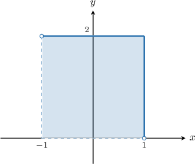
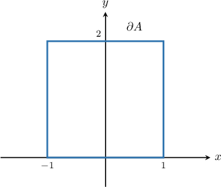
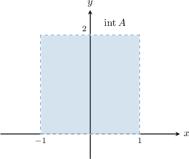
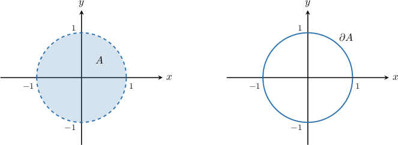
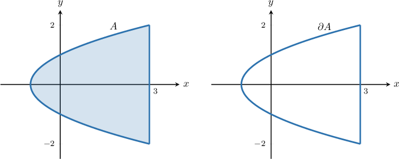
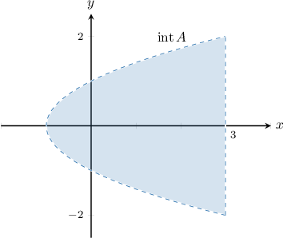
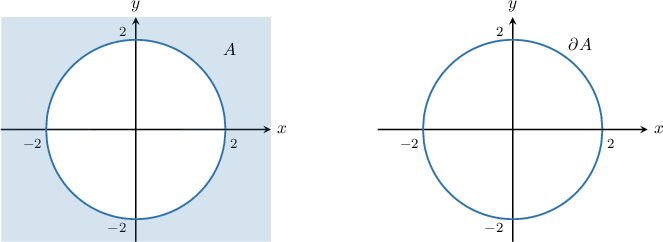
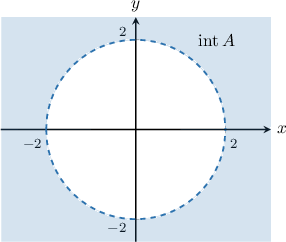

# Interiors and Boundaries of Sets

Source: https://www.mathacademy.com/topics/4063?courseId=54
Topic ID: 4063

## Prerequisites

- [Interior and Boundary Points](./1930-interior-and-boundary-points.md)
- [The Difference of Sets](../linear-algebra/2828-the-difference-of-sets.md)

## Lesson

### Introduction

The **boundary** of a set $S,$ denoted $\partial S,$ is the set that contains all the boundary points of $S.$

For example, consider the set $A,$ given by

$$

A = \big\{ (x,y)\in\mathbb R^2 \,:\, -1 \lt x \leq 1, \, 0 \lt y \leq 2 \big\}.

$$

We can represent this set as the following shaded region.

Then, the set $\partial A,$ the boundary of $A,$ has the following representation in the plane.

The **interior** of a set $S,$ denoted $\textrm{int}\, S,$ is the set containing all the interior points of $S.$ It contains every point in $S$ except the boundary points:

$$

\textrm{int}\,S = S - \partial S

$$

For our set $A$ defined above, the interior looks as follows:

More formally, the interior of $A$ is given by

$$

\textrm{int}\,A = \big\{ (x,y)\in\mathbb R^2 \,:\, -1 \lt x \lt 1, \, 0 \lt y \lt 2 \big\}.

$$

### Example: Identifying the Boundary of a Set

#### Question

Consider the set $A,$ defined by

$$

A = \big\{(x,y) \in\mathbb R^2 : x^2+y^2 -1<0\}

$$

The boundary of $A$ is given by

$$

\partial A = \big\{ (x,y) \in\mathbb R^2 \,: \boxed{\phantom{AAAAA}} \, \big\}.

$$

What is the missing expression?

#### Explanation

The boundary of a set $A,$ denoted $\partial A,$ is the set that contains all the boundary points of $A.$

The set $A$ and its boundary $\partial A$ are shown below.

From the diagram, the boundary points of $A$ lie on the circle $x^2+y^2 = 1.$

Therefore,

$$

\partial A = \big\{ (x,y) \in\mathbb R^2 \,:\, \boxed{x^2+y^2 = 1} \, \big\}.

$$

### Example: Identifying the Interior of a Set

#### Question

Consider the set $A,$ defined by

$$

A = \big\{ (x,y)\in\mathbb R^2 \,:\, y^2 - 1 \leq x , \, -2 \leq y \leq 2 \big\}.

$$

The interior of $A$ is given by

$$

\textrm{int}\,A = \big\{ (x,y)\in\mathbb R^2 \,:\, \boxed{\phantom{AAAAA}}, \, -2 < y < 2\big\}.

$$

What is the missing expression?

#### Explanation

The boundary of a set $A,$ denoted $\partial A,$ is the set that contains all the boundary points of $A.$

The set $A$ and its boundary $\partial A$ are shown below.

The interior of a set $A,$ denoted $\textrm{int}\, A,$ is the set containing all the interior points of $A.$ It contains every point in $A$ except the boundary points:

$$

\textrm{int}\,A = A - \partial A

$$

The interior of $A$ is shown below.

So, in this case, the interior of $A$ is given by

$$

\textrm{int}\,A = \big\{ (x,y)\in\mathbb R^2 \,:\, \boxed{y^2 - 1 < x}, \, -2 < y < 2\big\}.

$$

### Example: Identifying True Statements Regarding Interiors and Boundaries of Sets

#### Question

Consider the set $A,$ defined by

$$

A = \big\{ (x,y)\in\mathbb R^2 \,:\, x^2+y^2 \geq 4 \big\}.

$$

Which of the following statements are true?

1. $A - \partial A = \textrm{int}\, A$

2. $\textrm{int}\, A \cap \partial A = \emptyset$

3. $A = \textrm{int}\,A \cup \partial A$

#### Explanation

The boundary of a set $A,$ denoted $\partial A,$ is the set that contains all the boundary points of $A.$

In this case, the set $A$ and its boundary $\partial A$ are shown below.

The interior of a set $A,$ denoted $\textrm{int}\, A,$ is the set containing all the interior points of $A.$ It contains every point in $A$ except the boundary points:

$$

\textrm{int}\,A = A - \partial A

$$

The interior of $A$ is shown below.

With that in mind, let's examine each statement:

- Statement I is true. Since $\textrm{int}\,A$ contains all points in $A$ except the boundary points, we must have $A - \partial A = \textrm{int}\, A.$

- Statement II is true. Since $\textrm{int}\,A$ contains all points in $A$ except the boundary points, we must have $\textrm{int}\, A \cap \partial A = \emptyset,$ where $\emptyset$ denotes the empty set.

- Statement III is true. In this case, the set $A$ contains all of its boundary points, so we must have $A = \textrm{int}\,A \cup \partial A.$

Therefore, the correct answer is "I, II, and III."
