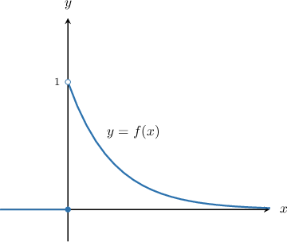

# Continuous Random Variables Over Infinite Domains

Source: https://www.mathacademy.com/topics/4100?courseId=54
Topic ID: 4100

## Prerequisites

- [Improper Integrals Involving Exponential Functions](../../../ap-courses/lessons/ap-calculus-bc/4004-improper-integrals-involving-exponential-functions.md)
- [Calculating Probabilities With Continuous Random Variables](./4043-calculating-probabilities-with-continuous-random-variables.md)

## Lesson

### Introduction

Recall that the **probability density function** (or **pdf**) of a continuous random variable $X$ defined over a set $S$ is a function $f(x)$ that satisfies the following conditions:

- $f(x) \geq 0$ for all $x$ in $S$

- $\displaystyle \int_{S} f(x) \, \textrm dx = 1$

It is common for the set $S$ of a continuous random variable $X$ to be an infinite interval. Therefore, we often need to evaluate improper integrals when determining whether a function is a valid pdf and to compute probabilities associated with such a random variable.

For example, let's consider the following function:

$$

\begin{aligned}𝑒^{−𝑥},\, & 𝑥>0, \\ 0,\, & otherwise.\end{aligned}

$$

Is $f(x)$ a valid probability density function? Let's start by sketching its graph:

Clearly, $f(x)\geq 0$ for all $x,$ so this function satisfies the first condition.

To check that $f(x)$ satisfies the second condition, we need to compute the following integral:

$$

\int_S f(x)\,\textrm d x = \int_0^\infty e^{-x}\,\textrm d x

$$

Calculating this integral using the usual methods, we get

$$

\begin{aligned}∫_{∞0}𝑒^{−𝑥}\,d𝑥 & =[−𝑒^{−𝑥}]_{∞0} \\ & =[−𝑒^{−∞}]−[−𝑒^{0}] \\ & =0−(−1) \\ & =1.\end{aligned}

$$

Therefore, since $f(x)$ satisfies both conditions, we conclude that $f(x)$ is a valid probability density function.

Let's see another example.

### Example: Checking Whether a Given Function Is a Valid PDF

#### Question

$$

\begin{aligned}\frac{1}{(𝑥−2)^{2}},\, & 𝑥≥3, \\ 0,\, & otherwise.\end{aligned}

$$

Given the function $f(x)$ above, which of the following statements are true?

1. $f(x) \geq 0$ for all $x \geq 3$

2. $\displaystyle \int_{3}^{\infty} f(x) \,\text{d}x = 1$

3. $f(x)$ is a valid probability density function

#### Explanation

For a function $f(x)$ to be a valid probability density function on a set $S,$ it must satisfy the following conditions:

- $f(x) \geq 0$ for all $x \in S$

- $\displaystyle \int_{S} f(x) \, \textrm dx = 1$

Now, let's consider each statement in turn:

- Statement I is true. Indeed, for $x \geq 3,$ we have $f(x) = \dfrac{1}{(x-2)^2} \geq 0.$

- Statement II is true. Indeed,

- Statement III is true. Since statements I and II are true, the first and second conditions are satisfied. So, $f(x)$ is a valid probability density function.

Therefore, the correct answer is "I, II, and III."

### Example: Solving for a Constant Given a PDF

#### Question

Solve for $k$ given that the following function is a probability density function:

$$

\begin{aligned}\frac{𝑘}{(4𝑥+1)^{3}},\, & 𝑥≥0, \\ 0,\, & otherwise.\end{aligned}

$$

#### Explanation

For a function $f(x)$ defined on a set $S$ to be a valid probability density function, it must satisfy the following conditions:

- $f(x) \geq 0$ for all $x \in S$

- $\displaystyle \int_{S} f(x) \, \textrm dx = 1$

In our case, for the function $f(x) = \dfrac{k}{(4x+1)^3}$ on the interval $x \geq 0,$ the second condition states that

$$

\int_{0}^{\infty} \dfrac{k}{(4x+1)^3} \, \textrm dx = 1.

$$

Computing the integral on the left-hand side, we get

$$

\begin{aligned}∫_{∞0}\frac{𝑘}{(4𝑥+1)^{3}}\,d𝑥 & =−[\frac{𝑘}{8(4𝑥+1)^{2}}]_{∞0} \\ & =\frac{𝑘}{8}.\end{aligned}

$$

Substituting this result back into the first equation and solving for $k,$ we get

$$

\dfrac{k}{8} = 1 \qquad \Longrightarrow \qquad k = 8.

$$

### Example: Computing a Probability Over an Unbounded Interval

#### Question

Compute $P\left(X > 8 \right)$ given that the random variable $X$ has the probability density function

$$

\begin{aligned}5𝑒^{−5𝑥},\, & 𝑥≥0, \\ 0,\, & otherwise.\end{aligned}

$$

#### Explanation

If a continuous random variable $X$ has the probability density function $f(x),$ then

$$

P(a < X < b) = \int_a^b f(x) \, \textrm dx.

$$

So, in our case, we have

$$

\begin{aligned}𝑃(𝑋>8) & =𝑃(8<𝑋<∞) \\ & =∫_{∞8}𝑓(𝑥)\,d𝑥 \\ & =∫_{∞8}5𝑒^{−5𝑥}\,d𝑥 \\ & =[−𝑒^{−5𝑥}]_{∞8} \\ & =𝑒^{−40}.\end{aligned}

$$
