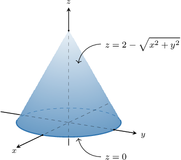
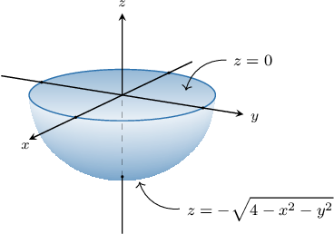

# Calculating Flux Through Closed Surfaces

Source: https://www.mathacademy.com/topics/4144?courseId=54
Topic ID: 4144

## Prerequisites

- [Calculating Flux Through Cartesian Surfaces](./4143-calculating-flux-through-cartesian-surfaces.md)
- [Flux Through Closed Surfaces](./4162-flux-through-closed-surfaces.md)

## Lesson

### Introduction

Remember that when we measure the flux of a vector field through a *closed* surface, we always calculate with respect to an outward-pointing unit normal vector.

For example, suppose we have the vector field $\mathbf F,$ given by

$$

\mathbf{F} = \langle x, \,0, \, -y^2 \rangle

$$

and the closed surface $S$ that represents the boundary of the conical solid shown below.

Let's calculate the flux of $\mathbf F$ through $S.$

First, since $S$ is a closed surface, we have that

- the upper surface $S_1: z = g(x,y) = 2 - \sqrt{x^2 + y^2}$ is oriented *upward*, and

- the lower surface $S_2: z = h(x,y) = 0$ is oriented *downward*.

Now, we write down the flux across each of the surfaces separately.

- First, we consider the upper cone $S_1.$ We compute the partial derivatives of $z=g(x,y){:}$ If we denote $\mathbf{F}=\langle P, \, Q, \, R \rangle,$ then As a result, since the positive orientation is upward, we have where $D$ is the projection of $S$ onto the $xy$-plane.

- Next, we consider the lower plane $S_2.$ Since the positive orientation is downward, the unit normal vector to the plane is $\mathbf{n} = \langle 0,0,-1 \rangle.$ As a result, we have Therefore, the flux of $\mathbf{F}$ across the entire surface is given by

### Example: Expressing Flux as a Double Integral Given a Diagram

#### Question

Consider the vector field $\mathbf{F} = \langle 0, \, x, \, -z^2 \rangle$ and the closed surface $S$ that represents the boundary of the solid shown above. Let $D$ be the projection of the solid onto the $xy$-plane. The flux of $\mathbf{F}$ across $S$ can be expressed in terms of a double integral as

$$

\displaystyle \iint\limits_S \mathbf{F} \cdot \mathrm{d}\mathbf{S} = \iint\limits_D \,\boxed{\phantom{AAAAAAA}} \: \textrm{d}A.

$$

Determine the missing expression.

#### Explanation

Since we have a closed surface, the positive orientation is outward-pointing by convention. So,

- the upper surface $S_1: z = g(x,y) = 0$ is oriented upward, and

- the lower surface $S_2: z = h(x,y) = -\sqrt{4 - x^2 - y^2}$ is oriented downward.

Now, we write down the flux across each of the surfaces separately.

- Consider the upper plane $S_1.$ Since the positive orientation is upward, the unit normal vector to the plane is $\mathbf{n} = \langle 0,0,1 \rangle.$ As a result, we have

- Consider the lower hemisphere $S_2.$ We compute the partial derivatives of $z = h(x,y){:}$ If we denote $\mathbf{F}=\langle P, \, Q, \, R \rangle,$ then As a result, since the positive orientation is downward, we have

Therefore, the flux across the entire surface is

$$

\begin{aligned}\underset{𝑆}{∬}𝐅⋅d𝐒 & =\underset{𝑆_{1}}{∬}𝐅⋅d𝐒+\underset{𝑆_{2}}{∬}𝐅⋅d𝐒 \\ & =\underset{𝐷}{∬}\frac{𝑥𝑦}{\sqrt{√4−𝑥^{2}−𝑦^{2}}}−𝑥^{2}−𝑦^{2}+4\,d𝐴.\end{aligned}

$$

### Example: Expressing Flux as a Double Integral

#### Question

Consider the vector field $\mathbf{F} = \langle x, \, y, \, 0 \rangle$ and the closed surface $S$ that encloses the finite region between the parabolic cylinder $z=1-x^2$ and the paraboloid $z=x^2+y^2.$ Let $D$ be the projection of $S$ onto the $xy$-plane. The flux of $\mathbf{F}$ across $S$ can be expressed in terms of a double integral as

$$

\displaystyle \iint\limits_S \mathbf{F} \cdot \mathrm{d}\mathbf{S} = \iint\limits_D \,\boxed{\phantom{AAAAAAA}} \: \textrm{d}A.

$$

Which of the following could be the missing expression?

#### Explanation

Since we have a closed surface, the positive orientation is outward-pointing by convention. So,

- the upper surface $S_1: z=g(x,y)=1-x^2$ is oriented upward, and

- the lower surface $S_2: z=h(x,y)=x^2+y^2$ is oriented downward.

Now, we write down the flux across each of the surfaces separately.

- Consider the upper parabolic cylinder $S_1.$ We compute the partial derivatives of $z=g(x,y){:}$

If we denote $\mathbf{F}=\langle P, \, Q, \, R \rangle,$ then

$$

P = x, \qquad Q = y, \qquad R = 0.

$$

As a result, since the positive orientation is upward, we have

$$

\begin{aligned}\underset{𝑆_{1}}{∬}𝐅⋅d𝐒 & =\underset{𝐷}{∬}(−𝑃\frac{𝜕𝑔}{𝜕𝑥}−𝑄\frac{𝜕𝑔}{𝜕𝑦}+𝑅)d𝐴 \\ & =\underset{𝐷}{∬}(−𝑥⋅(−2𝑥)−𝑦⋅(0)+0)\,d𝐴 \\ & =\underset{𝐷}{∬}2𝑥^{2}\,d𝐴.\end{aligned}

$$

- Consider the lower paraboloid $S_2.$ We compute the partial derivatives of $z=h(x,y){:}$ If we denote $\mathbf{F}=\langle P, \, Q, \, R \rangle,$ then As a result, since the positive orientation is downward, we have

Therefore, the flux across the entire surface is

$$

\begin{aligned}\underset{𝑆}{∬}𝐅⋅d𝐒 & =\underset{𝑆_{1}}{∬}𝐅⋅d𝐒+\underset{𝑆_{2}}{∬}𝐅⋅d𝐒 \\ & =\underset{𝐷}{∬}2𝑥^{2}\,d𝐴+\underset{𝐷}{∬}2𝑥^{2}+2𝑦^{2}\,d𝐴 \\ & =\underset{𝐷}{∬}4𝑥^{2}+2𝑦^{2}\,d𝐴.\end{aligned}

$$
