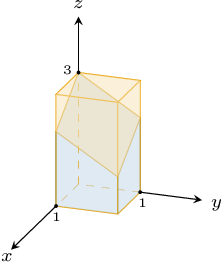
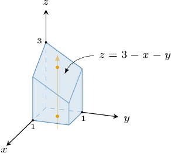
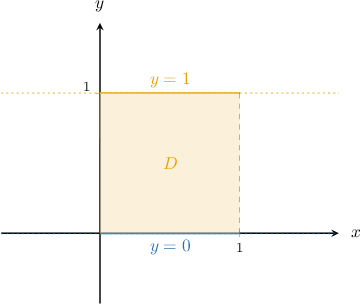
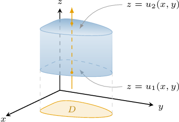
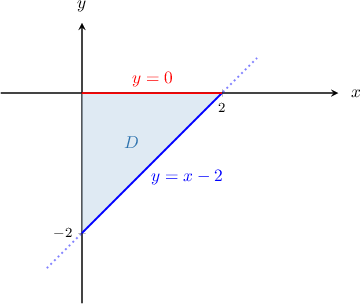
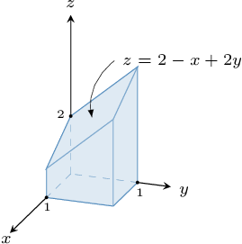
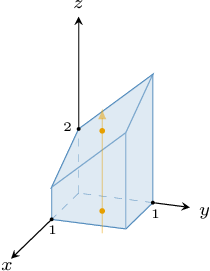

# Triple Integrals Over Type I Regions

Source: https://www.mathacademy.com/topics/4146?courseId=54
Topic ID: 4146

## Prerequisites

- [Triple Integrals Over Rectangular Domains](./2052-triple-integrals-over-rectangular-domains.md)

## Lesson

### Introduction

We've seen how to calculate the triple integral of a function $f(x,y,z)$ over a rectangular domain $R,$ given by

$$

R = [a,b]\times[c,d]\times[e,f].

$$

In this lesson, we'll learn how to calculate triple integrals over type I regions in three-dimensional space.

Before we begin, we need to discuss the meaning behind the triple integral of a function over a non-rectangular domain. To help us, consider the region $R$ shown below.

Let's discuss how to define the following triple integral:

$$

\iiint\limits_R 4xyz\,\textrm d V

$$

We start by enclosing the region $R$ by a rectangular solid $R'$ whose sides are parallel to the coordinate axes, as shown below.

Now, we extend the integrand to the rectangular region $R'$ by defining a new function $f(x,y,z)$ that's equal to $0$ outside $R$ and equals $4xyz$ inside $R\mathbin{:}$

$$

\begin{aligned}4𝑥𝑦𝑧, & (𝑥,𝑦,𝑧)∈𝑅^{′}∩𝑅 \\ 0, & (𝑥,𝑦,𝑧)∈𝑅^{′}∖𝑅\end{aligned}

$$

Although $f(x,y,z)$ might not be continuous at the boundary of $R,$ the triple integral of $f(x,y,z)$ over the rectangular domain $R'$ will exist.

Therefore, our original triple integral is defined as

$$

\iiint\limits_{R} 4xyz \, \textrm{d}V = \iiint\limits_{R'} f(x,y,z) \, \textrm{d}V.

$$

### Evaluating a Triple Integral

Let's now evaluate the triple integral

$$

\displaystyle \iiint\limits_R 4xyz \: \mathrm{d}V

$$

where the region $R$ is below.

Our first task is to find a type I representation of this region. We start by drawing an arrow parallel to the $z$-axis that

- enters the region through the bottom surface $z=0,$ and

- leaves the region through the top surface $z=3-x-y,$

as shown below.

So, our solid can be written as the type I region

$$

R = \big\{ (x,y,z) \: : \: (x,y) \in D, \:\: 0 \leq z \leq 3-x-y \big\},

$$

where

$$

D = \big\{ (x,y) \: : \: 0 \leq x \leq 1, \:\: 0 \leq y \leq 1 \big\}

$$

is the projection of $R$ onto the $xy$-plane, shown below.

We start by writing down our triple integral as a **mixed integral**, as follows:

$$

\displaystyle \iiint \limits_{R} 4xyz \: \textrm{d}V = \iint\limits_D \left[ \int_{0}^{3-x-y} 4xyz \: \mathrm{d}z \right] \mathrm{d}A

$$

Now, since the region $D$ is a type I *plane* region, we can express the region $R$ as

$$

R = \big\{ (x,y,z) \: : \: 0\leq x\leq 1, \:\: 0\leq y\leq 1, \:\: 0 \leq z \leq 3-x-y \big\},

$$

and therefore, our mixed integral can be written as the following repeated integral:

$$

\iint\limits_D \left[ \int_{0}^{3-x-y} 4xyz \: \mathrm{d}z \right] \mathrm{d}A = \int_{0}^{1} \int_{0}^{1} \int_{0}^{3-x-y} 4xyz \: \mathrm{d}z \: \mathrm{d}y \: \mathrm{d}x

$$

Evaluating this using the usual methods, we get

$$

\int_{0}^{1} \int_{0}^{1} \int_{0}^{3-x-y} 4xyz \: \mathrm{d}z \: \mathrm{d}y \: \mathrm{d}x = \dfrac{13}{9}.

$$

Therefore, we conclude that

$$

\displaystyle \iiint\limits_R 4xyz \: \mathrm{d}V = \dfrac{13}{9}.

$$

### Example: Representing a Triple Integral as a Mixed or Repeated Integral

#### Question

Find the missing limits in the repeated integral

$$

\displaystyle \iiint \limits_{R} f(x,y,z) \: \textrm{d}V = \int_{\ast}^{\ast} \int_{\ast}^{\ast} \int_{\ast}^{\ast} f(x,y,z) \: \mathrm{d}z \: \mathrm{d}x \: \mathrm{d}y,

$$

where $R$ is the type I region defined as

$$

R=\left\{ (x,y,z) \: : \: y^2 \leq x \leq 1, \: 0 \leq y \leq 1, \: -1 \leq z \leq x^2+y^2+1\right\}.

$$

#### Explanation

A type I region in three-dimensional space can be written as

$$

R = \big\{ (x,y,z) \: : \: (x,y) \in D, \: u_1(x,y) \leq z \leq u_2(x,y) \big\}.

$$

A typical three-dimensional type I region can be visualized schematically, as shown below.

If $R$ is a type I region, we can express the triple integral of $f(x,y,z)$ over $R$ as a mixed integral, as follows:

$$

\iiint\limits_{R} f(x,y,z)\,\textrm d V = \iint\limits_{D} \left[\int_{u_1(x,y)}^{u_2(x,y)} f(x,y,z)\,\textrm d z\right]\,\textrm d A

$$

In our case, we have

$$

u_1(x,y) = -1, \qquad u_2(x,y) = x^2+y^2+1.

$$

Therefore, our triple integral can be written as

$$

\displaystyle \iiint \limits_{R} f(x,y,z) \: \textrm{d}V = \iint\limits_{D} \left[ \int_{-1}^{x^2+y^2+1} f(x,y,z) \: \mathrm{d}z \right] \mathrm{d}A.

$$

Now, the region $D$ is given by the type II plane region

$$

D =\left\{ (x,y) \: : \: y^2 \leq x \leq 1, \: 0 \leq y \leq 1 \right\}.

$$

Therefore, by expressing the double integral over $D$ as a repeated integral, we get

$$

\begin{aligned}\underset{𝐷}{∬}[∫_{𝑥^{2}+𝑦^{2}+1−1}^{}𝑓(𝑥,𝑦,𝑧)\,d𝑧]d𝐴 & =∫_{10}^{}∫_{1𝑦^{2}}^{}[∫_{𝑥^{2}+𝑦^{2}+1−1}^{}𝑓(𝑥,𝑦,𝑧)\,d𝑧]d𝑥\,d𝑦 \\ & =∫_{10}^{}∫_{1𝑦^{2}}^{}∫_{𝑥^{2}+𝑦^{2}+1−1}^{}𝑓(𝑥,𝑦,𝑧)\,d𝑧\,d𝑥\,d𝑦.\end{aligned}

$$

### Example: Evaluating a Mixed Integral

#### Question

Evaluate the mixed integral

$$

\displaystyle \iint\limits_D \left[ \int_0^{xy} \dfrac{24}{x} \: \mathrm{d}z \right] \mathrm{d}A

$$

where the region $D$ in the $xy$-plane is given by

$$

D = \big\{ (x,y) \, : \, 1 \leq x \leq 3, \: 1 \leq y \leq x \big\}.

$$

#### Explanation

First, we evaluate the inner integral with respect to $z,$ treating $x$ and $y$ as constants:

$$

\begin{aligned}\underset{𝐷}{∬}[∫_{𝑥𝑦0}^{}\frac{24}{𝑥}\,d𝑧]d𝐴 & =\underset{𝐷}{∬}\frac{24}{𝑥}[𝑧]_{𝑧=𝑥𝑦𝑧=0}^{}\,d𝐴 \\ & =\underset{𝐷}{∬}\frac{24}{𝑥}(𝑥𝑦−0)\,d𝐴 \\ & =\underset{𝐷}{∬}24𝑦\,d𝐴\end{aligned}

$$

Next, we evaluate the double integral:

$$

\begin{aligned}\underset{𝐷}{∬}24𝑦\,d𝐴 & =∫_{31}^{}∫_{𝑥1}^{}24𝑦\,d𝑦\,d𝑥 \\ & =∫_{31}^{}[∫_{𝑥1}^{}24𝑦\,d𝑦]d𝑥 \\ & =∫_{31}^{}[12𝑦^{2}]_{𝑦=𝑥𝑦=1}^{}d𝑥 \\ & =∫_{31}^{}12(𝑥^{2}−1)\,d𝑥 \\ & =12∫_{31}^{}𝑥^{2}−1\,d𝑥 \\ & =12[\frac{1}{3}𝑥^{3}−𝑥]_{𝑥=3𝑥=1}^{} \\ & =12(\frac{1}{3}(27−1)−(3−1)) \\ & =80\end{aligned}

$$

### Example: Evaluating a Triple Integral Over a Type I Region

#### Question

Evaluate the triple integral

$$

\displaystyle \iiint\limits_R 6y \: \mathrm{d}V

$$

where the region $R$ is given by

$$

R = \left\{ (x,y,z) \: : \: (x,y) \in D, \: 0 \leq z \leq 3+y-x\right\},

$$

and $D$ is a finite region in $xy$-plane enclosed between the coordinate axes and the line $y=x-2$ in the fourth quadrant.

#### Explanation

Writing down our triple integral as a mixed integral, we obtain

$$

\displaystyle \iiint \limits_{R} 6y \, \textrm{d}V = \iint\limits_{D} \left[ \int_{0}^{3+y-x} 6y \, \mathrm{d}z \right] \mathrm{d}A.

$$

First, we evaluate the inner integral with respect to $z,$ treating $x$ and $y$ as constants:

$$

\begin{aligned}\underset{𝐷}{∬}[∫_{3+𝑦−𝑥0}^{}6𝑦\,d𝑧]d𝐴 & =\underset{𝐷}{∬}[6𝑦𝑧]_{𝑧=3+𝑦−𝑥𝑧=0}^{}\,d𝐴 \\ & =\underset{𝐷}{∬}6𝑦(3+𝑦−𝑥)\,d𝐴\end{aligned}

$$

We must now evaluate the double integral above over the region $D$ in the $xy$-plane shown below.

We can evaluate our double integral as follows:

$$

\begin{aligned}\underset{𝐷}{∬}6𝑦(3+𝑦−𝑥)\,d𝐴 & =∫_{20}^{}∫_{0𝑥−2}^{}6𝑦(3+𝑦−𝑥)\,d𝑦\,d𝑥 \\ & =∫_{20}^{}[∫_{0𝑥−2}^{}18𝑦+6𝑦^{2}−6𝑥𝑦\,d𝑦]d𝑥 \\ & =∫_{20}^{}[9𝑦^{2}+2𝑦^{3}−3𝑥𝑦^{2}]_{𝑦=0𝑦=𝑥−2}^{}d𝑥 \\ & =∫_{20}^{}0−9(𝑥−2)^{2}−2(𝑥−2)^{3}+3𝑥(𝑥−2)^{2}\,d𝑥 \\ & =∫_{20}^{}(𝑥−2)^{2}(𝑥−5)\,d𝑥 \\ & =∫_{20}^{}𝑥^{3}−9𝑥^{2}+24𝑥−20\,d𝑥 \\ & =[\frac{1}{4}𝑥^{4}−3𝑥^{3}+12𝑥^{2}−20𝑥]_{𝑥=2𝑥=0}^{} \\ & =(4−24+48−40)−0 \\ & =−12\end{aligned}

$$

### Skipping the Intermediate Step

When writing down a triple integral as a repeated integral, we can often skip the intermediate step of expressing our triple integral as a mixed integral.

For example, suppose we wish to evaluate

$$

\displaystyle \iiint\limits_R f(x,y,z) \: \mathrm{d}V

$$

where $R$ is the type I region given by

$$

R = \left\{ (x,y,z) \: : \: {\color{red}a} \leq x \leq {\color{red}b}, \: {\color{blue}v_1(x)} \leq y \leq {\color{blue}v_2(x)}, \: {\color{purple}u_1(x,y)} \leq z \leq {\color{purple}u_2(x,y)} \right\}.

$$

Notice that the projection of $R$ onto the $xy$-plane is a type I plane region. Therefore, we can immediately express our triple integral as a repeated integral as follows:

$$

\displaystyle \iiint \limits_{R} f(x,y,z)\: \textrm{d}V = \int_{\color{red}a}^{\color{red}b} \int_{\color{blue}v_1(x)}^{\color{blue}v_2(x)} \int_{\color{purple}u_1(x,y)}^{\color{purple}u_2(x,y)} f(x,y,z)\: \mathrm{d}z \: \mathrm{d}y \: \mathrm{d}x.

$$

### Example: Evaluating a Triple Integral Over a Type I Region Using a Diagram

#### Question

Evaluate the triple integral $\displaystyle \iiint\limits_R 4 \: \mathrm{d}V$ over the region $R,$ shown above.

**

#### Explanation

Notice that our solid can be written as the type I region

$$

R = \big\{ (x,y,z) \: : \: (x,y) \in D, \:\: 0 \leq z \leq 2-x+2y \big\},

$$

where

$$

D = \big\{ (x,y) \: : \: 0 \leq x \leq 1, \:\: 0 \leq y \leq 1 \big\}

$$

is the projection of $R$ onto the $xy$-plane, shown below.

Hence, we can express the region $R$ as

$$

R = \big\{ (x,y,z) \: : \: 0 \leq x \leq 1, \:\: 0 \leq y \leq 1, \:\: 0 \leq z \leq 2-x+2y \big\}

$$

As a result, by writing down our triple integral as a repeated integral, we obtain

$$

\displaystyle \iiint \limits_{R} 4 \: \textrm{d}V = \int_{0}^{1} \int_{0}^{1} \int_{0}^{2-x+2y} 4 \: \mathrm{d}z \: \mathrm{d}y \: \mathrm{d}x.

$$

First, we evaluate the inner integral with respect to $z$, treating $x$ and $y$ as constants:

$$

\begin{aligned}∫_{10}^{}∫_{10}^{}∫_{2−𝑥+2𝑦0}^{}4\,d𝑧\,d𝑦\,d𝑥 & =∫_{10}^{}∫_{10}^{}[∫_{2−𝑥+2𝑦0}^{}4\,d𝑧]d𝑦\,d𝑥 \\ & =∫_{10}^{}∫_{10}^{}[4𝑧]_{𝑧=2−𝑥+2𝑦𝑧=0}^{}\,d𝑦\,d𝑥 \\ & =∫_{10}^{}∫_{10}^{}4(2−𝑥+2𝑦)\,d𝑦\,d𝑥 \\ & =∫_{10}^{}∫_{10}^{}8−4𝑥+8𝑦\,d𝑦\,d𝑥\end{aligned}

$$

Next, we evaluate the inner integral with respect to $y$, treating $x$ as a constant:

$$

\begin{aligned}∫_{10}^{}∫_{10}^{}8−4𝑥+8𝑦\,d𝑦\,d𝑥 & =∫_{10}^{}[∫_{10}^{}(8−4𝑥)+8𝑦\,d𝑦]d𝑥 \\ & =∫_{10}^{}[(8−4𝑥)𝑦+4𝑦^{2}]_{𝑦=1𝑦=0}^{}\,d𝑥 \\ & =∫_{10}^{}8−4𝑥+4\,d𝑥 \\ & =∫_{10}^{}12−4𝑥\,d𝑥\end{aligned}

$$

Finally, we integrate with respect to $x{:}$

$$

\begin{aligned}∫_{10}^{}12−4𝑥\,d𝑥 & =[12𝑥−2𝑥^{2}]_{𝑥=1𝑥=0}^{} \\ & =(12−2)−0 \\ & =10.\end{aligned}

$$
