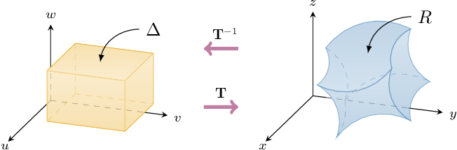

# Computing Triple Integrals Using a Change of Variables

Source: https://www.mathacademy.com/topics/4151?courseId=54
Topic ID: 4151

## Prerequisites

- [Calculating Volumes of Solids Using Triple Integrals](./2053-calculating-volumes-of-solids-using-triple-integrals.md)
- [The Jacobian of a Three-Dimensional Transformation](./2058-the-jacobian-of-a-three-dimensional-transformation.md)
- [Computing Double Integrals Using a Change of Variables](./4132-computing-double-integrals-using-a-change-of-variables.md)

## Lesson

### Introduction

Suppose that the transformation $\mathbf T,$ given by

$$

\mathbf T: (u,v,w) \longrightarrow \left(x(u,v,w), \, y(u,v,w), \, z(u,v,w) \right)

$$

is a $C^1$ transformation that has no critical points (i.e., it is invertible) inside some region $\Delta\subset \mathbb R^3,$ and that $\mathbf T(\Delta) = R,$ as shown below.

To compute the integral of a function $f(x,y,z)$ over $R,$ we use the change of variables formula

$$

\iiint\limits_{R} f(x,y,z) \ \mathrm{d}V = \iiint\limits_{\Delta} \ f(x(u,v,w), y(u,v,w), z(u,v,w)) \: \left| \dfrac{\partial (x, y, z)}{\partial (u, v, w)} \right| \: \text{d}u \text{d}v \text{d}w

$$

where $\dfrac{\partial (x, y, z)}{\partial (u, v, w)}$ is the Jacobian determinant corresponding to $\mathbf{T}.$

Note the similarity with the change of variables formula for double integrals.

### Example: Performing a Change of Variables in a Triple Integral

#### Question

Consider the finite region $R$ in Cartesian $xyz$-space, given by

$$

R = \big\{ (x,y,z) \: : \:1 \leq xy \leq 2, \: 1 \leq y \leq 2, \: 0 \leq z\leq 1 \big\}.

$$

By performing the change of variables

$$

u=xy, \qquad v=y, \qquad w=2z,

$$

write down the triple integral

$$

\displaystyle \iiint\limits_R 3xy^2+6yz \, \mathrm{d}V

$$

as a repeated integral in terms of $u,$ $v,$ and $w.$

#### Explanation

Let's define a transformation $\mathbf{T}$ as follows:

$$

\begin{aligned}𝑢 \\ 𝑣 \\ 𝑤\end{aligned}

$$

This transformation maps some region $\Delta$ in the $uvw$-space to our region $R$ in the $xyz$-space.

To find the required integral, we can use the change of variables formula

$$

\iiint\limits_{R} f(x,y,z) \ \mathrm{d}V = \iiint\limits_{\Delta} \ f(x(u,v,w), y(u,v,w), z(u,v,w)) \: \left| \dfrac{\partial (x, y, z)}{\partial (u, v, w)} \right| \: \text{d}u \text{d}v \text{d}w

$$

where $\dfrac{\partial (x, y, z)}{\partial (u, v, w)}$ is the Jacobian determinant corresponding to $\mathbf{T}.$

Note that the change of variables

$$

u=xy, \qquad v=y, \qquad w=2z,

$$

gives us the ** function $\mathbf T^{-1},$ that is

$$

\begin{aligned}𝑥 \\ 𝑦 \\ 𝑧\end{aligned}

$$

To find the required integral, we proceed in four steps:

****: Find $\Delta,$ which is the image of $R$ under the action of $\mathbf{T}^{-1}.$

Our domain in the $uvw$-space is

$$

\begin{aligned}Δ & ={(𝑢,𝑣,𝑤)\,:\,1≤𝑢≤2,\,1≤𝑣≤2,\,0≤𝑤≤2}.\end{aligned}

$$

****: Compute the Jacobian determinant corresponding to $\mathbf T^{-1}{:}$

The Jacobian determinant corresponding to $\mathbf T^{-1}$ is

$$

\begin{aligned}\frac{𝜕(𝑢,𝑣,𝑤)}{𝜕(𝑥,𝑦,𝑧)} & =\begin{matrix}\frac{𝜕𝑢}{𝜕𝑥} & \frac{𝜕𝑢}{𝜕𝑦} & \frac{𝜕𝑢}{𝜕𝑧} \\ \frac{𝜕𝑣}{𝜕𝑥} & \frac{𝜕𝑣}{𝜕𝑦} & \frac{𝜕𝑣}{𝜕𝑧} \\ \frac{𝜕𝑤}{𝜕𝑥} & \frac{𝜕𝑤}{𝜕𝑦} & \frac{𝜕𝑤}{𝜕𝑧}\end{matrix} \\ & =\begin{matrix}𝑦 & 𝑥 & 0 \\ 0 & 1 & 0 \\ 0 & 0 & 2\end{matrix} \\ & =2\begin{matrix}𝑦 & 𝑥 \\ 0 & 1\end{matrix} \\ & =2(𝑦−0) \\ & =2𝑦 \\ & =2𝑣.\end{aligned}

$$

****: Compute the Jacobian determinant corresponding to $\mathbf T{:}$

The Jacobian determinant corresponding to $\mathbf T$ is

$$

\dfrac{\partial (x, y, z)}{\partial (u, v, w)} = \left( \dfrac{\partial (u, v, w)}{\partial (x, y, z)} \right)^{-1} =\dfrac{1}{2v}.

$$

Note that $\dfrac{\partial (x, y, z)}{\partial (u, v, w)} \neq 0$ everywhere inside $\Delta.$ In other words, $\mathbf{T}$ has no critical points inside $\Delta.$

****: Perform the change of variables:

$$

\begin{aligned}\underset{𝑅}{∭}3𝑥𝑦^{2}+6𝑦𝑧\,d𝑉 & =\underset{Δ}{∭}(3𝑢𝑣+3𝑣𝑤)⋅\frac{𝜕(𝑥,𝑦,𝑧)}{𝜕(𝑢,𝑣,𝑤)}\,d𝑢d𝑣d𝑤 \\ & =\underset{Δ}{∭}3𝑣(𝑢+𝑤)⋅\frac{1}{2𝑣}\,d𝑢d𝑣d𝑤 \\ & =∫_{21}∫_{21}∫_{20}\frac{3}{2}(𝑢+𝑤)\,d𝑤\,d𝑣\,d𝑢\end{aligned}

$$

### Example: Evaluating a Triple Integral Using a Change of Variables

#### Question

Use the change of variables

$$

u = x+y^2, \qquad v= y+z, \qquad w = 2z

$$

to evaluate the triple integral

$$

\displaystyle \iiint \limits_R (x+y^2)^{15}z \: \mathrm{d}V,

$$

where the region $R$ is given by

$$

R = \big\{ (x,y,z) \: : \: 0 \leq x+y^2 \leq 1, \: 0 \leq y+z \leq 4, \: 0\leq z\leq 2 \big\}.

$$

#### Explanation

Let's define a transformation $\mathbf{T}$ as follows:

$$

\begin{aligned}𝑢 \\ 𝑣 \\ 𝑤\end{aligned}

$$

This transformation maps some region $\Delta$ in the $uvw$-space to our region $R$ in the $xyz$-space.

To compute the required integral, we can use the change of variables formula

$$

\iiint\limits_{R} f(x,y,z) \ \mathrm{d}V = \iiint\limits_{\Delta} \ f(x(u,v,w), y(u,v,w), z(u,v,w)) \: \left| \dfrac{\partial (x, y, z)}{\partial (u, v, w)} \right| \: \text{d}u \text{d}v \text{d}w

$$

where $\dfrac{\partial (x, y, z)}{\partial (u, v, w)}$ is the Jacobian determinant corresponding to $\mathbf{T}.$

Note that the change of variables

$$

u = x+y^2, \qquad v= y+z, \qquad w = 2z

$$

gives us the ** function $\mathbf T^{-1},$ that is

$$

\begin{aligned}𝑥 \\ 𝑦 \\ 𝑧\end{aligned}

$$

To compute the required integral, we proceed in four steps:

****: Find $\Delta,$ which is the image of $R$ under the action of $\mathbf{T}^{-1}.$

Our domain in the $uvw$-space is

$$

\begin{aligned}Δ & ={(𝑢,𝑣,𝑤)\,:\,0≤𝑢≤1,\,0≤𝑣≤4,\,0≤𝑤≤4}.\end{aligned}

$$

****: Compute the Jacobian determinant corresponding to $\mathbf T^{-1}{:}$

The Jacobian determinant corresponding to $\mathbf T^{-1}$ is

$$

\begin{aligned}\frac{𝜕(𝑢,𝑣,𝑤)}{𝜕(𝑥,𝑦,𝑧)} & =\begin{matrix}\frac{𝜕𝑢}{𝜕𝑥} & \frac{𝜕𝑢}{𝜕𝑦} & \frac{𝜕𝑢}{𝜕𝑧} \\ \frac{𝜕𝑣}{𝜕𝑥} & \frac{𝜕𝑣}{𝜕𝑦} & \frac{𝜕𝑣}{𝜕𝑧} \\ \frac{𝜕𝑤}{𝜕𝑥} & \frac{𝜕𝑤}{𝜕𝑦} & \frac{𝜕𝑤}{𝜕𝑧}\end{matrix} \\ & =\begin{matrix}1 & 2𝑦 & 0 \\ 0 & 1 & 1 \\ 0 & 0 & 2\end{matrix} \\ & =1⋅1⋅2 \\ & =2.\end{aligned}

$$

****: Compute the Jacobian determinant corresponding to $\mathbf T{:}$

The Jacobian determinant corresponding to $\mathbf T$ is

$$

\dfrac{\partial (x, y, z)}{\partial (u, v, w)} = \left( \dfrac{\partial (u, v, w)}{\partial (x, y, z)} \right)^{-1} = \dfrac{1}{2}.

$$

Note that $\dfrac{\partial (x, y, z)}{\partial (u, v, w)} \neq 0$ everywhere inside $\Delta.$ In other words, $\mathbf{T}$ has no critical points inside $\Delta.$

****: Perform the change of variables:

$$

\begin{aligned}\underset{𝑅}{∭}(𝑥+𝑦^{2})^{15}𝑧\,d𝑉 & =\underset{Δ}{∭}𝑢^{15}⋅\frac{𝑤}{2}⋅\frac{1}{2}\,d𝑢d𝑣d𝑤 \\ & =\frac{1}{4}\underset{Δ}{∭}𝑢^{15}𝑤\,d𝑢d𝑣d𝑤 \\ & =\frac{1}{4}∫_{10}∫_{40}∫_{40}𝑢^{15}𝑤\,d𝑤\,d𝑣\,d𝑢 \\ & =\frac{1}{4}∫_{10}𝑢^{15}\,d𝑢⋅∫_{40}d𝑣⋅∫_{40}𝑤\,d𝑤 \\ & =\frac{1}{4}⋅[\frac{𝑢^{16}}{16}]_{𝑢=1𝑢=0}⋅[𝑣]_{𝑣=4𝑣=0}⋅[\frac{𝑤^{2}}{2}]_{𝑤=4𝑤=0} \\ & =\frac{1}{4}⋅(\frac{1}{16}−0)⋅(4−0)⋅(8−0) \\ & =\frac{1}{2}\end{aligned}

$$

### Example: Computing the Volume of a Region Using a Change of Variables

#### Question

Find the volume bounded by the region $R,$ given by

$$

R = \big\{ (x,y,z) \: : \: 0 \leq x+y \leq 1, \:-2 \leq y-2x \leq 2, \: 1 \leq z^3 \leq 8 \big\}.

$$

#### Explanation

Recall that the volume of $R$ can be found as

$$

V = \iiint\limits_R \text{d}V.

$$

Let's define a transformation $\mathbf{T}$ as follows:

$$

\begin{aligned}𝑢 \\ 𝑣 \\ 𝑤\end{aligned}

$$

This transformation maps some region $\Delta$ in the $uvw$-space to our region $R$ in the $xyz$-space.

To compute the required volume, we can use the change of variables formula

$$

\iiint\limits_{R} f(x,y,z) \ \mathrm{d}V = \iiint\limits_{\Delta} \ f(x(u,v,w), y(u,v,w), z(u,v,w)) \: \left| \dfrac{\partial (x, y, z)}{\partial (u, v, w)} \right| \: \text{d}u \text{d}v \text{d}w

$$

where $\dfrac{\partial (x, y, z)}{\partial (u, v, w)}$ is the Jacobian determinant corresponding to $\mathbf{T}.$

The inequalities that define the region $R,$

$$

0 \leq x+y \leq 1, \qquad -2 \leq y-2x \leq 2, \qquad 1 \leq z^3 \leq 8,

$$

suggest that we use the change of variables

$$

u = x+y, \qquad v = y-2x, \qquad w = z^3.

$$

This change of variables gives us the ** function $\mathbf T^{-1},$ that is

$$

\begin{aligned}𝑥 \\ 𝑦 \\ 𝑧\end{aligned}

$$

To compute the required volume, we proceed in four steps:

****: Find $\Delta,$ which is the image of $R$ under the action of $\mathbf{T}^{-1}.$

Our domain in the $uvw$-space is

$$

\begin{aligned}Δ & ={(𝑢,𝑣,𝑤)\,:\,0≤𝑢≤1,\,−2≤𝑣≤2,\,1≤𝑤≤8}.\end{aligned}

$$

****: Compute the Jacobian determinant corresponding to $\mathbf T^{-1}{:}$

The Jacobian determinant corresponding to $\mathbf T^{-1}$ is

$$

\begin{aligned}\frac{𝜕(𝑢,𝑣,𝑤)}{𝜕(𝑥,𝑦,𝑧)} & =\begin{matrix}\frac{𝜕𝑢}{𝜕𝑥} & \frac{𝜕𝑢}{𝜕𝑦} & \frac{𝜕𝑢}{𝜕𝑧} \\ \frac{𝜕𝑣}{𝜕𝑥} & \frac{𝜕𝑣}{𝜕𝑦} & \frac{𝜕𝑣}{𝜕𝑧} \\ \frac{𝜕𝑤}{𝜕𝑥} & \frac{𝜕𝑤}{𝜕𝑦} & \frac{𝜕𝑤}{𝜕𝑧}\end{matrix} \\ & =\begin{matrix}1 & 1 & 0 \\ −2 & 1 & 0 \\ 0 & 0 & 3𝑧^{2}\end{matrix} \\ & =3𝑧^{2}(−1)^{3+3}\begin{matrix}1 & 1 \\ −2 & 1\end{matrix} \\ & =9𝑧^{2} \\ & =9𝑤^{2/3}.\end{aligned}

$$

****: Compute the Jacobian determinant corresponding to $\mathbf T{:}$

The Jacobian determinant corresponding to $\mathbf T$ is

$$

\dfrac{\partial (x, y, z)}{\partial (u, v, w)} = \left( \dfrac{\partial (u, v, w)}{\partial (x, y, z)} \right)^{-1} = \dfrac 19 w^{-2/3}.

$$

Note that $\dfrac{\partial (x, y, z)}{\partial (u, v, w)} \neq 0$ everywhere inside $\Delta.$ In other words, $\mathbf{T}$ has no critical points inside $\Delta.$

****: Perform the change of variables:

$$

\begin{aligned}\underset{𝑅}{∭}d𝑉 & =\underset{Δ}{∭}1⋅\frac{1}{9}𝑤^{−2/3}\,d𝑢d𝑣d𝑤 \\ & =∫_{10}∫_{2−2}∫_{81}\frac{1}{9}𝑤^{−2/3}\,d𝑤\,d𝑣\,d𝑢 \\ & =\frac{1}{9}∫_{10}d𝑢⋅∫_{2−2}d𝑣⋅∫_{81}𝑤^{−2/3}d𝑤 \\ & =\frac{1}{9}[𝑢]_{10}⋅[𝑣]_{2−2}⋅[3𝑤^{1/3}]_{81} \\ & =\frac{1}{9}⋅(1−0)⋅(2−(−2))⋅3(8^{1/3}−1^{1/3}) \\ & =\frac{4}{3}.\end{aligned}

$$
