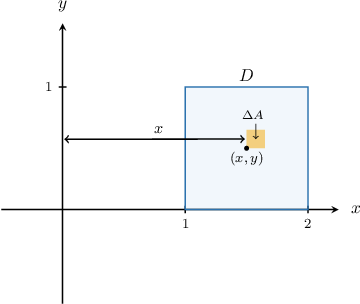
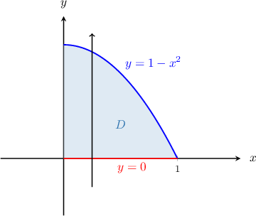
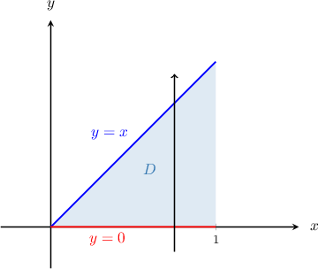
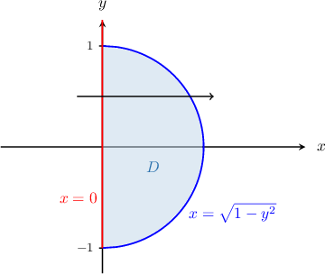

# Moments and Centers of Mass of Plane Laminas

Source: https://www.mathacademy.com/topics/4166?courseId=54
Topic ID: 4166

## Prerequisites

- [The Shortest Distance Between a Point and a Line](../../../high-school/traditional/lessons/geometry/526-the-shortest-distance-between-a-point-and-a-line.md)
- [Density, Mass, and Charge of Plane Laminas](./2025-density-mass-and-charge-of-plane-laminas.md)
- [Moments and Centers of Mass of Thin Rods](./4167-moments-and-centers-of-mass-of-thin-rods.md)

## Lesson

### Introduction

In this lesson, we'll learn how to determine the center of mass of a thin lamina whose mass is unevenly distributed.

We describe the mass distribution across a lamina using its mass density function $\lambda (x,y).$ This function tells us the *mass per unit area* at any point $(x,y)$ on the lamina.

For example, consider a thin plate with mass density function $\lambda(x,y) = 6xy$ occupying the finite rectangular region $D$ between the lines $x=1,$ $x=2,$ $y=0,$ and $y=1.$ What is the moment of the plate about the $y$-axis?

To answer this, consider a point $(x,y) \in D$ on the plate and a small rectangular piece with its bottom-left corner at $(x,y)$ and area $\Delta{A},$ as shown below.

If $\Delta{A}$ is very small, we can assume that our density function is approximately constant over the selected piece. As a result, the moment of this piece about the $y$-axis is

$$

\begin{aligned}Δ𝑀_{𝑦} & ≈𝑥⋅Δ𝑚 \\ & ≈𝑥⋅6𝑥𝑦\,Δ𝐴 \\ & =6𝑥^{2}𝑦\,Δ𝐴.\end{aligned}

$$

To find the total moment of the plate about the axis, we add together the moments of all such pieces and take the limit as $\Delta{A} \to 0.$ By doing this, we get

$$

M_y = \iint\limits_D 6x^2y \: \text{d}A.

$$

Carrying out the integration, we find that the moment of the plate about the $y$-axis is

$$

\begin{aligned}𝑀_{𝑦} & =\underset{𝐷}{∬}6𝑥^{2}𝑦\,d𝐴 \\ & =∫_{21}∫_{10}6𝑥^{2}𝑦\,d𝑦\,d𝑥 \\ & =∫_{21}3𝑥^{2}\,d𝑥⋅∫_{10}2𝑦\,d𝑦 \\ & =[𝑥^{3}]_{𝑥=2𝑥=1}⋅[𝑦^{2}]_{𝑦=1𝑦=0} \\ & =(8−1)⋅(1−0) \\ & =7.\end{aligned}

$$

The moment about the $x$-axis can be found similarly.

In general, the moments $M_x$ and $M_y$ of a lamina $D$ with mass density function $\lambda(x,y)$ about the $x$-axis and about the $y$-axis, respectively, are given by the following formulas:

$$

\begin{aligned}𝑀_{𝑥} & =\underset{𝐷}{∬}𝑦\,𝜆(𝑥,𝑦)\,d𝐴 \\ 𝑀_{𝑦} & =\underset{𝐷}{∬}𝑥\,𝜆(𝑥,𝑦)\,d𝐴\end{aligned}

$$

### Example: The Moment of a Plane Lamina About the X-Axis

#### Question

A thin plate with the mass density function is enclosed between the curve and the -axis for Find the moment of the plate about the -axis.

#### Explanation

The moment of a lamina with the mass density function about the -axis is given by

In our case, is a type I plane region, as shown below.

So, we have

and

Therefore, the moment is

### Example: The Moment of a Plane Lamina About the Y-Axis

#### Question

The lamina $D = \big\{(x,y) \:: \: 0 \le x \le y,\, 0 \le y \le 1 \big\}$ has the mass density function $\lambda(x,y) = x^2y.$ Find the moment of the lamina about the $y$-axis.

#### Explanation

The moment of a lamina $D$ with the mass density function $\lambda(x,y)$ about the $y$-axis is given by

$$

M_y = \iint\limits_D x \, \lambda(x,y) \: \text{d}A.

$$

In our case, $D$ is represented as a type II plane region and $\lambda(x,y) = x^2y.$

Therefore, the moment is

$$

\begin{aligned}𝑀_{𝑦} & =\underset{𝐷}{∬}𝑥⋅𝑥^{2}𝑦\,d𝐴 \\ & =\underset{𝐷}{∬}𝑥^{3}𝑦\,d𝐴 \\ & =∫_{10}∫_{𝑦0}𝑥^{3}𝑦\,d𝑥\,d𝑦 \\ & =∫_{10}𝑦[∫_{𝑦0}𝑥^{3}\,d𝑥]\,d𝑦 \\ & =∫_{10}𝑦⋅[\frac{𝑥^{4}}{4}]_{𝑥=𝑦𝑥=0}\,d𝑦 \\ & =∫_{10}𝑦⋅\frac{𝑦^{4}}{4}\,d𝑦 \\ & =∫_{10}\frac{𝑦^{5}}{4}\,d𝑦 \\ & =[\frac{𝑦^{6}}{24}]_{𝑦=1𝑦=0} \\ & =\frac{1}{24}.\end{aligned}

$$

### Center of Mass

Recall that a lamina's *center of mass* is the point $(\overline{x}, \overline{y})$ where its total mass could be concentrated to give the same total moment about the coordinate axes as the original lamina.

The center of mass of a lamina $D$ with the mass density function $\lambda(x,y)$ is given by

$$

(\overline{x},\overline{y}) = \left( \dfrac{M_y}{m}, \dfrac{M_x}{m} \right),

$$

where

- $\displaystyle m = \iint \limits_D \lambda (x,y) \: \text{d}A$ is the mass of the lamina,

- $\displaystyle M_x = \iint\limits_D y \, \lambda (x,y) \: \text{d}A\:$ is the moment of the lamina about the $x$-axis, and

- $\displaystyle M_y = \iint\limits_D x \, \lambda (x,y) \: \text{d}A$ is the moment of the lamina about the $y$-axis.

Remember that if we could place a fulcrum under our lamina at its center of mass, it would balance perfectly.

### Example: Find the Center of Mass of a Plane Lamina

#### Question

Consider a thin plate $D$ that has the mass density function $\lambda (x,y) = x+y$ and is enclosed between the curve $y=x$ and the $x$-axis for $0 \leq x \leq 1.$ Given that the mass of the plate is $\dfrac{1}{2}$ units and its center of mass is located at $(\overline{x}, \overline{y}),$ what is the value of $\overline{y}?$

#### Explanation

The center of mass of a lamina $D$ with the mass density function $\lambda(x,y)$ is given by

$$

(\overline{x},\overline{y}) = \left( \dfrac{M_y}{m}, \dfrac{M_x}{m} \right),

$$

where

- $\displaystyle m = \iint \limits_D \lambda (x,y) \: \text{d}A$ is the mass of the lamina,

- $\displaystyle M_x = \iint\limits_D y \, \lambda (x,y) \: \text{d}A$ is the moment of the lamina about the $x$-axis, and

- $\displaystyle M_y = \iint\limits_D x \, \lambda (x,y) \: \text{d}A$ is the moment of the lamina about the $y$-axis.

Notice that $D$ is a type I plane region:

So, we have

$$

D = \big\{ (x,y) \: : \:0 \le x \le 1, \: 0 \le y \le x \big\}

$$

and $\lambda(x,y) = x+y.$

Since we require the $y$-coordinate of the center of mass, we need to compute the moment about the $x$-axis:

$$

\begin{aligned}𝑀_{𝑥} & =\underset{𝐷}{∬}𝑦\,𝜆(𝑥,𝑦)\,d𝐴 \\ & =\underset{𝐷}{∬}𝑦⋅(𝑥+𝑦)\,d𝐴 \\ & =\underset{𝐷}{∬}𝑥𝑦+𝑦^{2}\,d𝐴 \\ & =∫_{10}∫_{𝑥0}𝑥𝑦+𝑦^{2}\,d𝑦\,d𝑥 \\ & =∫_{10}[\frac{𝑥𝑦^{2}}{2}+\frac{𝑦^{3}}{3}]_{𝑦=𝑥𝑦=0}\,d𝑥 \\ & =∫_{10}(\frac{𝑥^{3}}{2}+\frac{𝑥^{3}}{3})\,d𝑥 \\ & =\frac{5}{6}∫_{10}𝑥^{3}\,d𝑥 \\ & =\frac{5}{6}[\frac{1}{4}𝑥^{4}]_{𝑥=1𝑥=0} \\ & =\frac{5}{6}(\frac{1}{4}−0) \\ & =\frac{5}{24}\end{aligned}

$$

Therefore, we have

$$

\overline{y} = \dfrac{M_x}{m} = \dfrac{\left(\dfrac{5}{24}\right)}{\left(\dfrac{1}{2}\right)} = \dfrac{5}{12}.

$$

### Centroids

When a lamina's mass density is constant, the center of mass depends only on the shape of the lamina. In cases like these, the center of mass is called the **centroid** of the lamina. The centroid of a shape corresponds to its geometrical center.

So, $\lambda$ is constant, then the mass of the plate is

$$

\begin{aligned}𝑚 & =∬_{𝐷}𝜆\,d𝐴 \\ & =𝜆∬_{𝐷}\,d𝐴 \\ & =𝜆⋅𝐴_{𝐷},\end{aligned}

$$

where $A_D$ denotes the area of $D.$ As a result,

$$

m = \lambda \cdot A_D \qquad \Longrightarrow \qquad \dfrac{\lambda}{m} = \dfrac{1}{A_D}.

$$

Substituting the above into the formula for the $x$-coordinate of the center of mass, we obtain

$$

\begin{aligned}\frac{𝑀_{𝑦}}{𝑚} & =\frac{1}{𝑚}\underset{𝐷}{∬}𝑥\,𝜆\,d𝐴 \\ & =\frac{𝜆}{𝑚}\underset{𝐷}{∬}𝑥\,d𝐴 \\ & =\frac{1}{𝐴_{𝐷}}\underset{𝐷}{∬}𝑥\,d𝐴.\end{aligned}

$$

We can similarly compute the $y$-coordinate.

In general, the centroid of a lamina $D$ with area $A_D$ is given by $(x_c, y_c),$ where

$$

\displaystyle x_c = \dfrac{1}{A_D} \iint\limits_D x \, \: \text{d}A, \qquad \displaystyle y_c = \dfrac{1}{A_D} \iint\limits_D y \, \: \text{d}A.

$$

### Example: Find the Centroid of a Plane Lamina

#### Question

Consider the thin plate $D$ enclosed between the curve $x=\sqrt{1-y^2}$ and the $y$-axis for $-1 \leq y \leq 1.$ Find the $x$-coordinate of its centroid.

#### Explanation

The centroid of a lamina $D$ with area $A_D$ is given by $(x_c, y_c),$ where

$$

\displaystyle x_c = \dfrac{1}{A_D} \iint\limits_D x \, \: \text{d}A, \qquad \displaystyle y_c = \dfrac{1}{A_D} \iint\limits_D y \, \: \text{d}A.

$$

Notice that $D$ is a type II plane region:

So, we have

$$

D = \big\{ (x,y) \: : \: 0 \le x \le \sqrt{1-y^2}, \: -1 \le y \le 1 \big\}

$$

and

$$

A_D = \dfrac12 \cdot \pi\cdot 1^2 = \dfrac{\pi}{2}.

$$

Therefore, the $x$-coordinate of the centroid is

$$

\begin{aligned}𝑥_{𝑐} & =\frac{1}{𝐴_{𝐷}}\underset{𝐷}{∬}𝑥\,d𝐴 \\ & =\frac{2}{𝜋}∫_{1−1}∫_{\sqrt{1−𝑦^{2}}0}^{}𝑥\,d𝑥\,d𝑦 \\ & =\frac{2}{𝜋}∫_{1−1}[\frac{𝑥^{2}}{2}]_{𝑥=\sqrt{1−𝑦^{2}}𝑥=0}^{}\,d𝑦 \\ & =\frac{2}{𝜋}∫_{1−1}\frac{1−𝑦^{2}}{2}\,d𝑦 \\ & =\frac{1}{𝜋}∫_{1−1}1−𝑦^{2}\,d𝑦 \\ & =\frac{1}{𝜋}[𝑦−\frac{𝑦^{3}}{3}]_{1−1} \\ & =\frac{1}{𝜋}[(1−\frac{1}{3})−(−1+\frac{1}{3})] \\ & =\frac{1}{𝜋}⋅\frac{4}{3} \\ & =\frac{4}{3𝜋}.\end{aligned}

$$
