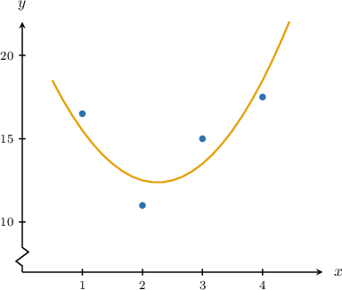
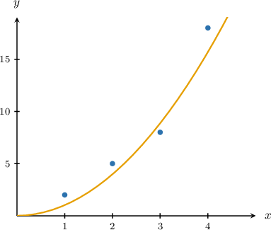

# Polynomial Regression With Matrices

Source: https://www.mathacademy.com/topics/2170?courseId=73
Topic ID: 2170

## Prerequisites

- [Selecting a Regression Model](../../../high-school/traditional/lessons/algebra-i/736-selecting-a-regression-model.md)
- [Linear Regression With Matrices](./2169-linear-regression-with-matrices.md)

## Lesson

### Introduction

We've seen how to construct a simple linear regression model given some bivariate data $(x,y).$ We can generalize this technique to fit data to an arbitrary polynomial. We call this process **polynomial regression**.

The following table gives the number of units $x$ (in hundreds) produced by a small company and the respective profits $y$ (in thousands of dollars) earned for producing $x$ units:

Suppose we want to find the quadratic function

$$

y = \beta_0 + \beta_1 x + \beta_2 x^2

$$

that best fits the given data points.

Substituting the values of $x$ into the regression equation and equating the results to the corresponding observed values of $y,$ we obtain the following system:

$$

\begin{aligned}𝛽_{0}+1𝛽_{1}+1^{2}𝛽_{2}=16 \\ 𝛽_{0}+2𝛽_{1}+2^{2}𝛽_{2}=11 \\ 𝛽_{0}+3𝛽_{1}+3^{2}𝛽_{2}=15 \\ 𝛽_{0}+4𝛽_{1}+4^{2}𝛽_{2}=18\end{aligned}

$$

This system can be written using matrix notation as

$$

\begin{aligned}1 & 1 & 1^{2} \\ 1 & 2 & 2^{2} \\ 1 & 3 & 3^{2} \\ 1 & 4 & 4^{2}\end{aligned}

$$

where $X$ is the design matrix, $\boldsymbol{\beta}$ is the parameter vector, and $\mathbf{y}$ is the observation vector.

Since our points do not lie on a quadratic curve, there will be no parameters $\beta_0, \beta_1,$ and $\beta_2$ such that this equation is true. So instead, we seek parameters $\beta_0, \beta_1,$ and $\beta_2$ that best approximate the solution.

In other words, we seek to find a column vector $\boldsymbol\beta$ such that

$$

\| \mathbf{y} - X\boldsymbol{\beta}\|

$$

is as small as possible.

Notice that this is exactly the least-squares problem for the system $X \boldsymbol{\beta} = \mathbf{y}.$ Therefore, the coefficients of the curve that best fits the data can be found as the solution to the corresponding least-squares problem!

Pre-multiplying the equation $X \boldsymbol{\beta} = \mathbf{y}$ by $X^T,$ we obtain the corresponding normal equation

$$

X^T \! X {\hat{\boldsymbol{\beta}}} = X^T \mathbf{y}.

$$

Since the columns of $X$ are linearly independent, the matrix ${X^T}X$ is invertible, and

$$

{\hat{\boldsymbol{\beta}}} = (X^T \! X )^{-1} X^T \mathbf{y}.

$$

Substituting $X$ and $\mathbf{y}$ into the formula above and simplifying, we get

$$

\begin{aligned}\hat{𝜷}=\begin{matrix}22.5 \\ −9 \\ 2\end{matrix}.\end{aligned}

$$

Therefore, the quadratic curve of best fit (regression curve) is

$$

y = 22.5 - 9x + 2x^2.

$$

### Example: Finding an Expression for a Least-Squares Regression Curve

#### Question

Consider the data above and the matrices below. Find an expression (in terms of $X$ and $\mathbf{y}$) for the vector of coefficients $\boldsymbol{\beta}$ of the curve $y=\beta_0 + \beta_1 x + \beta_2 x^2 + \beta_3 x^3$ that best fits the data.

$$

\begin{aligned}1 & 0 & 0^{2} & 0^{3} \\ 1 & 1 & 1^{2} & 1^{3} \\ 1 & 2 & 2^{2} & 2^{3} \\ 1 & 3 & 3^{2} & 3^{3} \\ 1 & 4 & 4^{2} & 4^{3}\end{aligned}

$$

#### Explanation

The coefficients of the curve

$$

y=\beta_0 + \beta_1 x + \beta_2 x^2 + \beta_3 x^3

$$

that best fits the data can be found as the least-squares solution ${\hat{\boldsymbol{\beta}}}$ to the system

$$

X \boldsymbol{\beta} = \mathbf{y},

$$

where $X$ is the design matrix, $\boldsymbol{\beta}$ is the parameter vector, and $\mathbf{y}$ is the observation vector.

Pre-multiplying this equation by $X^T,$ we obtain the corresponding normal equation

$$

X^T \! X {\hat{\boldsymbol{\beta}}} = X^T \mathbf{y}.

$$

Since the columns of $X$ are linearly independent, the matrix ${X^T}X$ is invertible and

$$

{\hat{\boldsymbol{\beta}}} = (X^T \! X )^{-1} X^T \mathbf{y}.

$$

### Example: Identifying the Elements of a Polynomial Regression Model

#### Question

The vector of coefficients of the curve $y = \beta_0 + \beta_1 x + \beta_2 x^2 + \beta_3 x^3$ that best fits the data above can be found using polynomial regression as

$$

\begin{aligned}𝛽_{0} \\ 𝛽_{1} \\ 𝛽_{2} \\ 𝛽_{3}\end{aligned}

$$

where $X$ is the corresponding design matrix and $\mathbf{y}$ is the observation vector. Find $X$ and $\mathbf{y}$ in this context.

#### Explanation

The coefficients of the curve

$$

y = \beta_0 + \beta_1 x + \beta_2 x^2 + \beta_3 x^3

$$

that best fits the data can be found as the least-squares solution ${\hat{\boldsymbol{\beta}}}$ to the system

$$

\begin{aligned}\overset{\begin{matrix}1 & 2 & 2^{2} & 2^{3} \\ 1 & 3 & 3^{2} & 3^{3} \\ 1 & 4 & 4^{2} & 4^{3} \\ 1 & 5 & 5^{2} & 5^{3} \\ 1 & 6 & 6^{2} & 6^{3}\end{matrix}}{𝑋}\overset{\begin{matrix}𝛽_{0} \\ 𝛽_{1} \\ 𝛽_{2} \\ 𝛽_{3}\end{matrix}}{𝜷} & =\overset{\begin{matrix}40 \\ 70 \\ 120 \\ 100 \\ 80\end{matrix}}{𝐲},\end{aligned}

$$

where $X$ is the design matrix, $\beta$ is the parameter vector, and $\mathbf{y}$ is the observation vector.

### Regression Curves Containing Zero Coefficients

In some cases, we might need to constrain the regression curve so that some of its coefficients equal zero.

Consider the table below, which gives the number of units $x$ (in hundreds) produced by a small company and the respective profits $y$ (in thousands of dollars) earned for producing $x$ units.

It's known that the profit equals zero when the company does not produce any goods, so $y=0$ when $x=0.$ The company wishes to find a *quadratic* curve that best fits the data *subject to* the constraint that it should pass through the point $(0,0).$

So, our regression curve must pass through the point $(0,0).$ In other words, the $y$-intercept of the quadratic curve must be $0.$ Therefore, we want to find the quadratic function

$$

y = \beta_1 x + \beta_2 x^2

$$

that best fits the given data points.

Substituting the values of $x$ into the regression equation and equating the results to the corresponding observed values of $y,$ we obtain the following system:

$$

\begin{aligned}𝛽_{1}+1^{2}𝛽_{2}=2 \\ 2𝛽_{1}+2^{2}𝛽_{2}=5 \\ 3𝛽_{1}+3^{2}𝛽_{2}=8 \\ 4𝛽_{1}+4^{2}𝛽_{2}=18\end{aligned}

$$

This system can be written using matrix notation as

$$

\begin{aligned}1 & 1^{2} \\ 2 & 2^{2} \\ 3 & 3^{2} \\ 4 & 4^{2}\end{aligned}

$$

where $X$ is the design matrix, $\boldsymbol{\beta}$ is the parameter vector, and $\mathbf{y}$ is the observation vector.

The rest of the arguments are the same as before. Since our points do not lie on a quadratic curve, there will be no parameters $\beta_1$ and $\beta_2$ such that this equation is true. So instead, we seek parameters $\beta_1$ and $\beta_2$ that best approximate the solution.

### Example: Identifying the Design Matrix When the Regression Curve Contains Zero Coefficients

#### Question

The vector of coefficients of the curve $y = \beta_0 + \beta_2 x^2 + \beta_3 x^3$ that best fits the data above can be found using polynomial regression as

$$

\begin{aligned}𝛽_{0} \\ 𝛽_{2} \\ 𝛽_{3}\end{aligned}

$$

where $X$ is the corresponding design matrix and $\mathbf{y}$ is the observation vector. Find $X$ and $\mathbf{y}$ in this context.

#### Explanation

The coefficients of the curve

$$

y = \beta_0 + \beta_2 x^2 + \beta_3 x^3

$$

that best fits the data can be found as the least-squares solution ${\hat{\boldsymbol{\beta}}}$ to the system

$$

\begin{aligned}\overset{\begin{matrix}1 & 1^{2} & 1^{3} \\ 1 & 2^{2} & 2^{3} \\ 1 & 3^{2} & 3^{3} \\ 1 & 4^{2} & 4^{3} \\ 1 & 5^{2} & 5^{3}\end{matrix}}{𝑋}\overset{\begin{matrix}𝛽_{0} \\ 𝛽_{2} \\ 𝛽_{3}\end{matrix}}{𝜷} & =\overset{\begin{matrix}6 \\ 3 \\ 2 \\ 4 \\ 6\end{matrix}}{𝐲},\end{aligned}

$$

where $X$ is the design matrix, $\beta$ is the parameter vector, and $\mathbf{y}$ is the observation vector.
