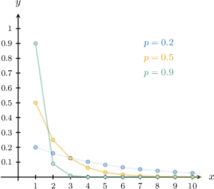

# Modeling With the Geometric Distribution

Source: https://www.mathacademy.com/topics/2839?courseId=73
Topic ID: 2839

## Prerequisites

- [The Geometric Distribution](./3284-the-geometric-distribution.md)

## Lesson

### Introduction

A **geometric distribution** is a probability distribution that models the total number of independent Bernoulli trials until the first success occurs.

If is the probability of success on each experiment, then the number of experiments needed before the first success has the following probability mass function:

If a random variable follows a geometric distribution with probability then we write

For example, suppose we repeatedly flip a coin until we get heads. Each flip of the coin is a binomial experiment, and the probability of success is

Let be the number of flips needed in order to get heads. Then has the following probability mass function:

In particular, the probability of needing tosses until we get heads is

### The Graph of the Geometric Distribution

The shape of the graph of the geometric distribution depends on the value of $p.$ When $p$ is large, the probabilities are concentrated at small values of $x.$ When $p$ is smaller, the probabilities are more spread out.

### Example: Identifying Random Variables that Follow a Geometric Distribution

#### Question

Which of the following random variables follow a geometric distribution?

1. The number of times a die is rolled until we get a $4$ for the first time

2. The number of times a $2$ is rolled when a fair die is rolled $10$ times

3. The number of times a coin is tossed until we get a head

#### Explanation

A geometric distribution is used to model the number of binomial experiments needed before the first success.

With that in mind, let's consider each of the given random variables.

- Random variable I follows a geometric distribution. Rolling a die is a binomial experiment, and the number of times the die is rolled before $4$ appears for the first time can be interpreted as the number of binomial experiments needed before the first success.

- Random variable II does ** follow a geometric distribution. Rolling a die is a binomial experiment, but the number of times that $2$ appears cannot be interpreted as the number of binomial experiments needed before the first success.

- Random variable III follows a geometric distribution. Tossing a coin is a binomial experiment, and the number of times the coin is tossed before the first head appears can be interpreted as the number of binomial experiments needed before the first success.

Therefore, the correct answer is "I and III only."

### Example: Computing the Probability of a Geometric Random Variable at a Point

#### Question

An archer is practicing archery. On average, the archer has a $7\%$ chance of missing every shot he makes. What is the probability that the archer will miss for the first time on the $8$th shot? Round your answer to $3$ decimal places.

#### Explanation

A geometric random variable $X$ with probability of success $p$ has the following probability mass function:

$$

f(x) = (1-p)^{x-1}p

$$

Let $X$ be the number of shots until the archer misses. Since the chance of missing each shot is $7\%,$ the number of shots until the archer misses can be modeled as a geometric random variable with a probability of success

$$

p = 7\% = \dfrac{7}{100} = 0.07.

$$

So, $X\sim\textrm{Geom}(0.07).$ In this case, $X$ has the following probability mass function:

$$

\begin{aligned}𝑓(𝑥) & =(1−0.07)^{𝑥−1}(0.07) \\ & =(0.93)^{𝑥−1}(0.07)\end{aligned}

$$

Therefore, the probability that the archer will miss for the first time on the $8$th shot is

$$

\begin{aligned}𝑃(𝑋=8) & =𝑓(8) \\ & =(0.93)^{8−1}(0.07) \\ & =(0.93)^{7}(0.07) \\ & ≈0.042\end{aligned}

$$

rounded to $3$ decimal places.

### Example: Computing the Probability of a Geometric Random Variable on a Bounded Interval

#### Question

A high school soccer team is playing a local tournament. On average, the team has a $10\%$ chance of getting a tie in every game. What is the probability that the team gets the first tie within the first $3$ matches? Round your answer to $3$ decimal places.

#### Explanation

A geometric random variable $X$ with probability of success $p$ has the following probability mass function:

$$

f(x) = (1-p)^{x-1}p

$$

Let $X$ be the number of matches until a tie is obtained. Since the chance of obtaining a tie in any match is $10\%,$ the number of matches until a tie is obtained can be modeled as a geometric random variable with a probability of success

$$

p = 10\% = \dfrac{10}{100} = 0.1.

$$

So, $X\sim\textrm{Geom}(0.1).$ In this case, $X$ has the following probability mass function:

$$

\begin{aligned}𝑓(𝑥) & =(1−0.1)^{𝑥−1}(0.1) \\ & =(0.9)^{𝑥−1}(0.1)\end{aligned}

$$

Therefore, the probability that the team gets the first tie within the first $3$ matches is

$$

\begin{aligned}𝑃(𝑋≤3) & =𝑃(𝑋∈{1,2,3}) \\ & =𝑓(1)+𝑓(2)+𝑓(3) \\ & =(0.9)^{1−1}(0.1)+(0.9)^{2−1}(0.1)+(0.9)^{3−1}(0.1) \\ & =(0.1)+(0.9)(0.1)+(0.9)^{2}(0.1) \\ & =[1+0.9+(0.9)^{2}](0.1) \\ & ≈0.271\end{aligned}

$$

rounded to $3$ decimal places.

### Example: Computing the Probability of a Geometric Random Variable on an Unbounded Interval

#### Question

A company is conducting interviews to fill a job. On average, $35\%$ of applicants meet all the requirements. What is the probability that an applicant who meets all the requirements will appear for the first time after the $3$rd interviewee? Round your answer to $3$ decimal places.

#### Explanation

A geometric random variable $X$ with probability of success $p$ has the following probability mass function:

$$

f(x) = (1-p)^{x-1}p

$$

Let $X$ be the number of applicants interviewed until an applicant who meets all requirements appears. Since the chance of finding an applicant who meets all the requirements is $35\%,$ the number of applicants interviewed until an applicant who meets all requirements appears can be modeled as a geometric random variable with a probability of success

$$

p = 35\% = \dfrac{35}{100} = 0.35.

$$

So, $X\sim\textrm{Geom}(0.35).$ In this case, $X$ has the following probability mass function:

$$

\begin{aligned}𝑓(𝑥) & =(1−0.35)^{𝑥−1}(0.35) \\ & =(0.65)^{𝑥−1}(0.35)\end{aligned}

$$

To compute $P(X \gt 3),$ we will use the complement:

$$

P(X \gt 3) = 1 - P(X \leq 3)

$$

Computing the probability of the complement, we get

$$

\begin{aligned}𝑃(𝑋≤3) & =𝑃(𝑋∈{1,2,3}) \\ & =𝑓(1)+𝑓(2)+𝑓(3) \\ & =(0.65)^{1−1}(0.35)+(0.65)^{2−1}(0.35)+(0.65)^{3−1}(0.35) \\ & =(0.35)+(0.65)(0.35)+(0.65)^{2}(0.35) \\ & =[1+0.65+(0.65)^{2}](0.35) \\ & ≈0.725\end{aligned}

$$

rounded to $3$ decimal places.

Therefore, the probability that an applicant who meets all the requirements will appear for the first time after the $3$rd interviewee is

$$

\begin{aligned}𝑃(𝑋>3) & =1−𝑃(𝑋≤3) \\ & ≈1−0.725 \\ & ≈0.275\end{aligned}

$$

rounded to $3$ decimal places.
