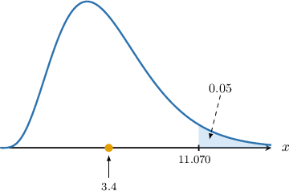
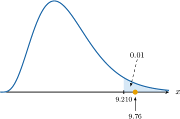

# Introduction to Chi-Square Goodness-of-Fit

Source: https://www.mathacademy.com/topics/3014?courseId=73
Topic ID: 3014

## Prerequisites

- [The Chi-Square Distribution](./3023-the-chi-square-distribution.md)
- [Modeling With Discrete Uniform Distributions](./3269-modeling-with-discrete-uniform-distributions.md)
- [Hypothesis Tests for One Mean: Known Population Variance](./3303-hypothesis-tests-for-one-mean-known-population-variance.md)

## Lesson

### Introduction

In this lesson, we will learn how hypothesis tests are used to determine whether an observed sample fits a known probability distribution. Hypothesis tests that compare sample data against known probability distributions are called **goodness-of-fit tests**.

By the end of this lesson, you'll know how to conduct a **chi-square goodness-of-fit** test to determine whether some sample data were likely drawn from a discrete uniform distribution.

Suppose we want to determine whether a particular six-sided die is fair. We can formulate the following null and alternative hypotheses:

- $H_0{:}\:$ The die is fair

- $H_1{:}\:$ The die is *not* fair

If the die is fair, it can be modeled using a discrete uniform distribution. Let $Y$ be the outcome of the die under the null hypothesis. Then, $Y\sim U\{1,2,3,4,5,6\},$ and we have

$$

P(Y=y)=\dfrac 16,\qquad y=1,2,3,4,5,6.

$$

Thus, we can reformulate our null and alternative hypotheses as follows:

- $H_0{:}\:\: Y\sim U\{1,2,3,4,5,6\}$

- $H_1{:}\:\: Y\not\sim U\{1,2,3,4,5,6\}$

The alternative hypothesis reads, "$Y$ does not follow $U\{1,2,3,4,5,6\}$."

To conduct our hypothesis test, we need some sample data. So, suppose we roll the die $120$ times and get the following frequency distribution:

Note the following:

- We've denoted the $i$th possible outcome as $y_i.$ These are simply the range of possible die scores. So, we have

- We've denoted the **observed frequency** of the $i$th outcome as $O_i.$

The score obtained when a die is thrown is the outcome of a random process. Therefore, we expect some variation in the observed frequencies *even when the die is fair*. The question we must ask ourselves is the following: Is there sufficient deviation of the observed frequencies compared to what's expected under the null hypothesis to conclude that the null hypothesis is false?

The first step to answering this question is to calculate the **expected frequency** $E_i$ of the $i$th outcome for every possible outcome.

Now, since $Y$ is uniformly distributed under $H_0,$ the probability of a random throw resulting in a score of $Y = 1$ is

$$

P(Y = 1) = \dfrac16.

$$

Therefore, the *expected* number of times we should obtain a score of $1$ when a die is rolled $N=120$ times is

$$

E_1 = \dfrac16 \cdot 120 = 20.

$$

Since $Y$ is uniform under $H_0,$ the expected frequency of the $i$th outcome is the same for every value of $i.$ Thus, for a sample size of $N=120,$ the expected frequencies are given by

$$

\begin{aligned}𝐸_{𝑖} & =𝑃(𝑌=𝑦)⋅𝑁 \\ & =\frac{1}{6}⋅120 \\ & =20.\end{aligned}

$$

This gives the following table of observed vs. expected frequencies.

### Example: Calculating Expected Frequencies

#### Question

Suppose $X$ is a random variable with support $S=\{0,1,2,3,4\}.$ We wish to carry out a hypothesis test with the following null and alternative hypotheses:

- $H_0\mathbin{:}\: X\sim U\{0,1,2,3,4\}$

- $H_1\mathbin{:}\:X\not\sim U\{0,1,2,3,4\}$

A random sample is carried out, and the sample data is shown below. Calculate the expected frequency $E_i$ for each observation.

#### Explanation

Under the null hypothesis, we have that $X\sim U\{0,1,2,3,4\}.$ Therefore,

$$

P(X=x)=\dfrac 15,\qquad x=0,1,2,3,4.

$$

The sample size is

$$

N = 45+47+46+42+40 = 220.

$$

Therefore, the expected frequencies for each observation are as follows:

$$

\begin{aligned}𝐸_{1} & =𝑁⋅𝑃(𝑋=0)=220⋅\frac{1}{5}=44 \\ 𝐸_{2} & =𝑁⋅𝑃(𝑋=2)=220⋅\frac{1}{5}=44 \\ & =⋮ \\ 𝐸_{5} & =𝑁⋅𝑃(𝑋=4)=220⋅\frac{1}{5}=44\end{aligned}

$$

A table summarizing the observed and corresponding expected frequencies is given below:

### The Chi-Square Test Statistic

Let's return to the case of the suspected biased die with the following observed and expected frequencies:

We want to test the following null and alternative hypotheses:

- $H_0\mathbin{:}\: Y\sim U\{1,2,3,4,5,6\}$

- $H_1\mathbin{:}\:Y\not\sim U\{1,2,3,4,5,6\}$

Note the following:

- If the sample data support the hypothesis that the die is fair, then we expect the *squared difference* between the observed and expected frequencies to be "small" in some sense. We square the differences so that they're always positive.

- What do we mean by small? Note that the magnitude (i.e., size) of the observed and expected frequencies will influence the magnitude of the squared differences. To mitigate this, we *scale* the data by dividing the squared differences by $E_i,$ as follows:

- Thus, if the sample data support the null hypothesis, the *sum* of these differences should also be small. So, we define the **chi-square test statistic** for this hypothesis test as follows: Scaling the data also ensures each term in the sum contributes proportionally, preventing large expected frequencies from dominating the test statistic.

To calculate the value of our test statistic in this case, we first add some additional rows to our table:

To find the chi-square test statistic, we sum the values in the final row:

$$

\begin{aligned}\underset{𝑖}{∑}\frac{(𝑂_{𝑖}−𝐸_{𝑖})^{2}}{𝐸_{𝑖}} & =0.45+1.25+1.25+0.2+0.05+0.2=3.4\end{aligned}

$$

We can think about the test statistic intuitively as follows:

- If our test statistic $(3.4)$ is *greater than* some threshold value, then there is *sufficient* evidence that $H_0$ is false, and we should reject it.

- If our test statistic $(3.4)$ is *smaller than* some threshold value, then there is *insufficient* evidence that $H_0$ is false, and we should *not* reject it.

We'll discuss the details of this shortly. For now, let's get some practice at computing chi-square test statistics.

### Example: Calculating a Test Statistic

#### Question

A particular city uses three types of public transportation: type $1,$ type $2,$ and type $3.$ Citizens' preferences across the three types are believed to be equally distributed. A random sample of citizens is conducted, and the frequency distribution of citizens who use each type of transport in the sample is shown below.

Suppose a hypothesis test is conducted with the following null and alternative hypotheses:

- $H_0\mathbin{:}\:$ Transportation preferences are distributed uniformly.

- $H_1\mathbin{:}\:$ Transportation preferences are not distributed uniformly.

Calculate the value of the chi-square test statistic for this hypothesis test.

#### Explanation

Suppose we have a set of observed frequencies $O_i$ and corresponding expected frequencies $E_i,$ as defined by a theoretical model under the null hypothesis. The chi-square test statistic is given by

$$

\sum_{i} \frac{(O_i - E_i)^2}{E_i}

$$

where

- $O_i$ is the observed frequency for category $i,$ and

- $E_i$ is the expected frequency for category $i,$ as predicted under the null hypothesis.

Let $Y$ be the preferred type of public transportation of a randomly selected citizen from the population under the null hypothesis. Then, we have

$$

P(Y=y)=\dfrac 13,\qquad y=1,2,3.

$$

The total number of citizens in the sample is

$$

N = 135 + 153+ 162 = 450.

$$

Therefore, the expected frequencies for each type of public transportation are as follows:

$$

\begin{aligned}𝐸_{1} & =𝑁⋅𝑃(𝑌=1)=450⋅\frac{1}{3}=150 \\ 𝐸_{2} & =𝑁⋅𝑃(𝑌=2)=450⋅\frac{1}{3}=150 \\ 𝐸_{3} & =𝑁⋅𝑃(𝑌=3)=450⋅\frac{1}{3}=150\end{aligned}

$$

A table summarizing the observed and corresponding theoretical frequencies is given below:

Notice that we have rounded values to four decimal places, where appropriate.

We compute our test statistic by summing the last row:

$$

\begin{aligned}\underset{𝑖}{∑}\frac{(𝑂_{𝑖}−𝐸_{𝑖})^{2}}{𝐸_{𝑖}} & =1.5+0.06+0.96 \\ & =2.52.\end{aligned}

$$

Therefore, the value of the test statistic is $\boxed{\color{blue}2.52}.$

### The Distribution of the Chi-Square Test Statistic

Suppose we have a set of observed frequencies $O_i$ and corresponding expected frequencies $E_i,$ as defined by a theoretical model under the null hypothesis. Then, it can be shown that the random variable

$$

X = \sum_{i} \frac{(O_i - E_i)^2}{E_i}

$$

approximately follows a chi-square distribution with $\nu$ degrees of freedom, where

- $O_i$ is the observed frequency for category $i,$

- $E_i$ is the expected frequency for category $i,$ as predicted under the null hypothesis, and

- the degrees of freedom $\nu$ is to be determined.

This approximation holds when all expected frequencies $E_i$ are sufficiently large (typically $E_i \geq 5$ for each category), and the observations are independent.

Before we use this result for hypothesis testing, let's discuss how to find the degrees of freedom $\nu$ for a given chi-square test.

### Degrees of Freedom

Let's again return to the case of the suspected biased die with the following observed and expected frequencies:

For a chi-square goodness-of-fit test, the number of degrees of freedom is the number of *independent* sample categories.

- We have a total of $n=6$ categories, each with an observed frequency.

- However, if the total number of observations is fixed, only $5$ of these categories may vary freely. In other words, if, for example, the first five observations are allowed to vary freely, yet $N$ (the total number of observations) is fixed, then $O_6$ cannot vary because we have the following **constraint.** where $N$ is the total number of observations.

Thus, the number of degrees of freedom for this test is

$$

\nu = n-1 = 5.

$$

More generally, we may use the following formula when computing the degrees of freedom of a chi-square test:

$$

\nu = \text{number of categories} - \text{number of constraints}

$$

In this lesson, we'll only deal with cases with one constraint. In future lessons, we'll discuss cases with more constraints and where we need to alter the number of categories.

### Conducting a Chi-Square Test

We want to test the following null and alternative hypotheses on the above data set:

- $H_0\mathbin{:}\: Y\sim U\{1,2,3,4,5,6\}$

- $H_1\mathbin{:}\:Y\not\sim U\{1,2,3,4,5,6\}$

We also have the following:

- The number of degrees of freedom for this test is

- The chi-square test statistic is

- Since this is a hypothesis test, we must choose an appropriate significance level. So, let's choose

- Since we want to know whether the test statistic exceeds a certain threshold, the chi-square goodness-of-fit test is *always right-tailed*.

Using a chi-square table, the critical value for $\nu=5$ at a $5\%$ significance level is $\chi^2_{\text{critical}}=11.070,$ and the critical region is

$$

X\geq 11.070

$$

as shown below.

Our test statistic $(3.4)$ does not lie inside the critical region. Therefore, there is $\boxed{\color{blue}\text{insufficient}}$ evidence to reject the null hypothesis.

In other words, we have no evidence to suggest that the die is biased.

### Example: Carrying Out a Chi-Square Goodness of Fit Test

#### Question

Suppose $Y$ is a random variable with support $S=\{1,2,3\}.$ A random sample is carried out, and the sample data is shown below.

Conduct a chi-square goodness of fit test at the $1\%$ significance level with the following null and alternative hypotheses:

- $H_0\mathbin{:}\: Y\sim U\{1,2,3\}$

- $H_1\mathbin{:}\: Y\not\sim U\{1,2,3\}$

The table below gives the values of $w$ that satisfy $P(W\geq w) = p,$ where $W\sim \chi^2(\nu).$

#### Explanation

Suppose we have a set of observed frequencies $O_i$ and corresponding expected frequencies $E_i,$ as defined by a theoretical model under the null hypothesis. Then, the random variable

$$

X = \sum_{i} \frac{(O_i - E_i)^2}{E_i}

$$

approximately follows a chi-square distribution with $\nu$ degrees of freedom, where

- $O_i$ is the observed frequency for category $i,$ and

- $E_i$ is the expected frequency for category $i,$ as predicted under the null hypothesis.

This approximation holds when all expected frequencies $E_i$ are sufficiently large (typically $E_i \geq 5$ for each category), and the observations are independent.

Under the null hypothesis, we have that $Y\sim U\{1,2,3\}.$ Therefore,

$$

P(Y=y)=\dfrac{1}{3},\qquad y=1,2,3.

$$

The sample size is

$$

N = 57 + 40 + 53 = 150.

$$

Therefore, the expected frequencies for each species are as follows:

$$

\begin{aligned}𝐸_{1} & =𝑁⋅𝑃(𝑌=1)=150⋅\frac{1}{3}=50 \\ 𝐸_{2} & =𝑁⋅𝑃(𝑌=2)=150⋅\frac{1}{3}=50 \\ 𝐸_{3} & =𝑁⋅𝑃(𝑌=3)=150⋅\frac{1}{3}=50\end{aligned}

$$

A table summarizing the observed and corresponding theoretical frequencies is given below:

First, we compute our test statistic by summing the last row:

$$

\begin{aligned}\underset{𝑖}{∑}\frac{(𝑂_{𝑖}−𝐸_{𝑖})^{2}}{𝐸_{𝑖}} & =1.28+2+6.48 \\ & =9.76\end{aligned}

$$

Therefore, the test statistic is $\boxed{\color{blue}9.76}.$

There is only one constraint on our data: the total number of observations must equal $N.$ Therefore, the number of degrees of freedom $\nu$ is calculated as follows:

$$

\begin{aligned}𝜈 & =number of categories−number of constraints \\ & =3−1 \\ & =2\end{aligned}

$$

So, there are $\nu = \boxed{\color{blue}2}$ degrees of freedom.

From the given chi-square table, the critical value for $\nu=2$ at a $1\%$ significance level is $\chi^2_{\text{critical}}=9.210,$ and the critical region is

$$

X\geq 9.210

$$

as shown below.

Our test statistic $(9.76)$ lies inside the critical region. Therefore, there is $\boxed{\color{blue}\text{sufficient}}$ evidence to reject the null hypothesis.
