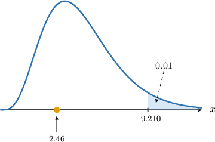

# Testing Binomial Models Using Chi-Square Goodness-of-Fit

Source: https://www.mathacademy.com/topics/3015?courseId=73
Topic ID: 3015

## Prerequisites

- [Introduction to Chi-Square Goodness-of-Fit](./3014-introduction-to-chi-square-goodness-of-fit.md)

## Lesson

### Introduction

In this lesson, we'll learn how to conduct chi-square goodness-of-fit tests to determine whether some sample data fit a binomial distribution.

First, let's remind ourselves of some basic facts.

- Given a random variable $X\sim B(n, p),$ the probability mass function of $X$ is given by

- Given a random sample of size $N$ drawn from $X\sim B(n,p),$ the expected frequency of the outcome $X=x$ is given by

Let's get some practice at computing expected values using the binomial distribution.

### Example: Calculating Expected Frequencies

#### Question

Suppose $X$ is a random variable with support $S=\{0,1,2,3\}.$ We wish to carry out a hypothesis test with the following null and alternative hypotheses:

- $H_0\mathbin{:}\: X\sim B(3, 0.4)$

- $H_1\mathbin{:}\:X\not\sim B(3, 0.4)$

A random sample is carried out, and the data is shown below. Calculate the expected frequency $E_i$ for each observation.

#### Explanation

Under the null hypothesis, we have that $X\sim B(3, 0.4).$ Therefore,

$$

\begin{aligned}𝑃(𝑋=𝑥) & =(\frac{𝑛}{𝑥})𝑝^{𝑥}(1−𝑝)^{𝑛−𝑥} \\ & =(\frac{3}{𝑥})(0.4)^{𝑥}(0.6)^{3−𝑥},\,𝑥=0,1,2,3.\end{aligned}

$$

Let's calculate the probability of each value of $X{:}$

$$

\begin{aligned}𝑃(𝑋=0) & =(\frac{3}{0})(0.4)^{0}(0.6)^{3}=0.216 \\ 𝑃(𝑋=1) & =(\frac{3}{1})(0.4)^{1}(0.6)^{2}=0.432 \\ 𝑃(𝑋=2) & =(\frac{3}{2})(0.4)^{2}(0.6)^{1}=0.288 \\ 𝑃(𝑋=3) & =(\frac{3}{3})(0.4)^{3}(0.6)^{0}=0.064\end{aligned}

$$

The sample size is

$$

N = 120+180+65+35 = 400.

$$

Therefore, the expected frequencies for each observation are as follows:

$$

\begin{aligned}𝐸_{0} & =𝑁⋅𝑃(𝑋=0)=400⋅0.216=86.4 \\ 𝐸_{1} & =𝑁⋅𝑃(𝑋=1)=400⋅0.432=172.8 \\ 𝐸_{2} & =𝑁⋅𝑃(𝑋=2)=400⋅0.288=115.2 \\ 𝐸_{3} & =𝑁⋅𝑃(𝑋=3)=400⋅0.064=25.6\end{aligned}

$$

A table summarizing the observed and corresponding expected frequencies is given below:

### Estimating a Binomial Probability

Suppose $X$ is a random variable with support $S=\{0,1,2,3\}.$ A random sample is carried out, and the sample data is shown below.

Suppose we wish to conduct a chi-square goodness-of-fit test with the following null and alternative hypotheses:

- $H_0\mathbin{:}\:$ The sample data fit a binomial distribution $B(3,p)$

- $H_1\mathbin{:}\:$ The sample data does not fit a binomial distribution $B(3,p)$

Notice we're not given the success probability $p.$ Therefore, we must estimate it from the sample data, which we can do as follows:

$$

\begin{aligned}\hat{𝑝} & =\frac{total number of successes}{total number of trials} \\ & =\frac{∑(𝑥_{𝑖}⋅𝑂_{𝑖})}{𝑛⋅𝑁}\end{aligned}

$$

where

- $\hat p$ is our estimate of the success probability $p,$

- $N$ is the number of observations,

- $n$ is the number of trials in each binomial sequence.

In our case, we have the following:

- The total number of observations is given by

- The number of trials in each binomial sequence is

So, in our case, we have

$$

\begin{aligned}\hat{𝑝} & =\frac{0⋅12+1⋅32+2⋅44+3⋅12}{3⋅(100)} \\ & =0.52.\end{aligned}

$$

Therefore, the proposed distribution is $B(3,0.52).$

### Example: Estimating a Binomial Probability From Sample Data

#### Question

A food quality control team tests boxes of packaged salads to check for damage. Each box contains $3$ salad packs. The results of the test are summarized below.

A chi-square goodness-of-fit test is conducted at the $1\%$ significance level with the following null and alternative hypotheses:

- $H_0\mathbin{:}\:$ The sample data fit a binomial distribution $B(3,p)$

- $H_1\mathbin{:}\:$ The sample data does not fit a binomial distribution $B(3,p)$

Use this data to calculate an estimate of $p.$

#### Explanation

Let the random variable $X$ be the number of damaged packs in a randomly selected box.

First, we write down the null and alternative hypotheses:

- $H_0\mathbin{:}\: X\sim B(3,p)$

- $H_1\mathbin{:}\:X\not\sim B(3,p)$

The number of observations is

$$

N=20+30+8+2 = 60.

$$

We can calculate an estimate of $p,$ which we denote as $\hat p,$ as follows:

$$

\begin{aligned}\hat{𝑝} & =\frac{total number of successes}{total number of trials} \\ & =\frac{∑(𝑥_{𝑖}⋅𝑂_{𝑖})}{𝑛⋅𝑁},\end{aligned}

$$

where $O_i$ is the observed frequency for the $i$th observation, $N$ is the number of observations, and $n$ is the number of trials in each Binomial sequence. So, in our case, we have

$$

\begin{aligned}\hat{𝑝} & =\frac{0⋅20+1⋅30+2⋅8+3⋅2}{3⋅(60)} \\ & ≈0.2889\end{aligned}

$$

rounded to four decimal places.

Therefore, the proposed distribution is $X\sim B(3,0.2889).$

### The Chi-Square Test

Let's remind ourselves of the key facts regarding chi-square goodness-of-fit tests.

Suppose we have a set of observed frequencies $O_i$ and corresponding expected frequencies $E_i,$ as defined by a theoretical model under the null hypothesis. Then, the random variable

$$

X = \sum_{i} \frac{(O_i - E_i)^2}{E_i}

$$

approximately follows a chi-square distribution with $\nu$ degrees of freedom, where

- $O_i$ is the observed frequency for category $i,$

- $E_i$ is the expected frequency for category $i,$ as predicted under the null hypothesis, and

- the number of degrees of freedom $\nu$ is given by

$$

\nu = \text{number of categories} - \text{number of constraints}.

$$

This approximation holds when all expected frequencies $E_i$ are sufficiently large (typically $E_i \geq 5$ for each category), and the observations are independent.

Note the following:

- If $p$ is *given*, there is only one constraint: the total number of observations is fixed. In this case, we have

- If $p$ is *not* given, then it must be estimated. Estimating $p$ places an extra constraint on our data. In such cases, we have

Let's see an example.

### Example: Carrying Out a Chi-Square Test

#### Question

A basketball player practices free throws, shooting $5$ times per session and tracking the number of successful shots. The frequency distribution of successful shots per session is summarized below.

The player's coach wants to test whether a binomial distribution can model the observed data. Carry out a chi-square goodness-of-fit test at the $10\%$ significance level with the following null and alternative hypotheses:

- $H_0\mathbin{:}\:$ The observed distribution can be modeled as $B(5, p)$

- $H_1\mathbin{:}\:$ The observed distribution cannot be modeled as $B(5, p)$

The table below gives the values of $w$ that satisfy $P(W\geq w) = q,$ where $W\sim \chi^2(\nu).$

#### Explanation

Suppose we have a set of observed frequencies $O_i$ and corresponding expected frequencies $E_i,$ as defined by a theoretical model under the null hypothesis. Then, the random variable

$$

X = \sum_{i} \frac{(O_i - E_i)^2}{E_i}

$$

approximately follows a chi-square distribution with $\nu$ degrees of freedom, where

- $O_i$ is the observed frequency for category $i,$ and

- $E_i$ is the expected frequency for category $i,$ as predicted under the null hypothesis.

This approximation holds when all expected frequencies $E_i$ are sufficiently large (typically $E_i \geq 5$ for each category), and the observations are independent.

The number of observations is

$$

N= 12+32+67+52+27+10 = 200.

$$

We can calculate an estimate of $p,$ which we denote as $\hat p,$ as follows:

$$

\begin{aligned}\hat{𝑝} & =\frac{total number of successes}{total number of trials} \\ & =\frac{∑(𝑦_{𝑖}⋅𝑂_{𝑖})}{𝑛⋅𝑁},\end{aligned}

$$

where $N$ is the number of observations, and $n$ is the number of trials in each binomial sequence. So, in our case, we have

$$

\begin{aligned}\hat{𝑝} & =\frac{0⋅12+1⋅32+2⋅67+3⋅52+4⋅27+5⋅0}{5⋅200} \\ & =0.48.\end{aligned}

$$

Therefore, the proposed distribution is $Y\sim B(5, \, 0.48).$

Under the hypothesis that $Y\sim B(5, \, 0.48),$ we have

$$

\begin{aligned}𝑃(𝑌=𝑦) & =(\frac{𝑛}{𝑦})𝑝^{𝑦}(1−𝑝)^{𝑛−𝑦} \\ & =(\frac{5}{𝑦})(0.48)^{𝑦}(0.52)^{5−𝑦},\,𝑦=0,1,2,3,4,5\end{aligned}

$$

Let's calculate the probability of each value of $Y{:}$

$$

\begin{aligned}𝑃(𝑌=0) & =(\frac{5}{0})(0.48)^{0}(0.52)^{5}=0.038 \\ 𝑃(𝑌=1) & =(\frac{5}{1})(0.48)^{1}(0.52)^{4}=0.1755 \\ 𝑃(𝑌=2) & =(\frac{5}{2})(0.48)^{2}(0.52)^{3}=0.324 \\ 𝑃(𝑌=3) & =(\frac{5}{3})(0.48)^{3}(0.52)^{2}=0.299 \\ 𝑃(𝑌=4) & =(\frac{5}{4})(0.48)^{4}(0.52)^{1}=0.138 \\ 𝑃(𝑌=5) & =(\frac{5}{5})(0.48)^{5}(0.52)^{0}=0.0255\end{aligned}

$$

Therefore, the expected frequencies for each observation are as follows:

$$

\begin{aligned}𝐸_{0} & =𝑁⋅𝑃(𝑌=0)=200⋅0.0380=7.6 \\ 𝐸_{1} & =𝑁⋅𝑃(𝑌=1)=200⋅0.1755=35.1 \\ 𝐸_{2} & =𝑁⋅𝑃(𝑌=2)=200⋅0.3240=64.8 \\ 𝐸_{3} & =𝑁⋅𝑃(𝑌=3)=200⋅0.2990=59.8 \\ 𝐸_{4} & =𝑁⋅𝑃(𝑌=4)=200⋅0.1380=27.6 \\ 𝐸_{5} & =𝑁⋅𝑃(𝑌=5)=200⋅0.0255=5.1\end{aligned}

$$

A table summarizing the observed and corresponding theoretical frequencies is given below:

First, we compute our test statistic by summing the last row:

$$

\begin{aligned}\underset{𝑖}{∑}\frac{(𝑂_{𝑖}−𝐸_{𝑖})^{2}}{𝐸_{𝑖}} & =2.5474+0.2738+0.0747+1.0173+0.0130+4.7078 \\ & ≈8.6\end{aligned}

$$

Therefore, the test statistic is approximately $\boxed{\color{blue}8.6}.$

There are two constraints on our data: the total number of observations must equal $N,$ and our estimated probability of success $\hat p.$ Therefore, the number of degrees of freedom $\nu$ is calculated as follows:

$$

\begin{aligned}𝜈 & =number of categories−number of constraints \\ & =6−2 \\ & =4\end{aligned}

$$

So, there are $\nu = \boxed{\color{blue}4}$ degrees of freedom.

From the given chi-square table, the critical value for $\nu=4$ at a $10\%$ significance level is $\chi^2_{\text{critical}}=7.779,$ and the critical region is

$$

X\geq 7.779

$$

as shown below.

### Cases Where Regrouping is Needed

To apply the chi-square goodness-of-fit test, the expected frequencies $E_i$ must all be sufficiently large. The usual rule of thumb is

$$

E_i \geq 5.

$$

This isn't the case for every category in some samples. Whenever this happens, we must combine our data and form new categories to satisfy this condition before applying the chi-square test.

Let's see an example.

### Example: Carrying Out a Chi-Square Test (Regrouping Needed)

#### Question

Suppose $Y$ is a random variable with support $S = \{0,1,2,3\}.$ A random sample is carried out, and the sample data is shown below.

Carry out a chi-square goodness of fit test at the $1\%$ significance level with the following null and alternative hypotheses:

- $H_0\mathbin{:}\:$ The observed distribution can be modeled as $B(3,0.6)$

- $H_1\mathbin{:}\:$ The observed distribution cannot be modeled as $B(3,0.6)$

The table below gives the values of $w$ that satisfy $P(W\geq w) = q,$ where $W\sim \chi^2(\nu).$

#### Explanation

Suppose we have a set of observed frequencies $O_i$ and corresponding expected frequencies $E_i,$ as defined by a theoretical model under the null hypothesis. Then, the random variable

$$

X = \sum_{i} \frac{(O_i - E_i)^2}{E_i}

$$

approximately follows a chi-square distribution with $\nu$ degrees of freedom, where

- $O_i$ is the observed frequency for category $i,$ and

- $E_i$ is the expected frequency for category $i,$ as predicted under the null hypothesis.

This approximation holds when all expected frequencies $E_i$ are sufficiently large (typically $E_i \geq 5$ for each category), and the observations are independent.

The number of observations is

$$

N= 3+12+27+8 = 50.

$$

Under the hypothesis that $Y\sim B(3, \, 0.6),$ we have

$$

\begin{aligned}𝑃(𝑌=𝑦) & =(\frac{𝑛}{𝑦})𝑝^{𝑦}(1−𝑝)^{𝑛−𝑦} \\ & =(\frac{3}{𝑦})(0.6)^{𝑦}(0.4)^{3−𝑦},\,𝑦=0,1,2,3.\end{aligned}

$$

Let's calculate the probability of each value of $Y{:}$

$$

\begin{aligned}𝑃(𝑌=0) & =(\frac{3}{0})(0.6)^{0}(0.4)^{3}=0.064 \\ 𝑃(𝑌=1) & =(\frac{3}{1})(0.6)^{1}(0.4)^{2}=0.288 \\ 𝑃(𝑌=2) & =(\frac{3}{2})(0.6)^{2}(0.4)^{1}=0.432 \\ 𝑃(𝑌=3) & =(\frac{3}{3})(0.6)^{3}(0.4)^{0}=0.216\end{aligned}

$$

Therefore, the expected frequencies for each observation are as follows:

$$

\begin{aligned}𝐸_{0} & =𝑁⋅𝑃(𝑌=0)=50⋅0.064=3.2 \\ 𝐸_{1} & =𝑁⋅𝑃(𝑌=1)=50⋅0.288=14.4 \\ 𝐸_{2} & =𝑁⋅𝑃(𝑌=2)=50⋅0.432=21.6 \\ 𝐸_{3} & =𝑁⋅𝑃(𝑌=3)=50⋅0.216=10.8\end{aligned}

$$

Notice that there is one frequency less than $5,$ so we combine the values $Y=0$ and $Y=1.$

A table summarizing the observed and corresponding theoretical frequencies is given below:

We have rounded values to six decimal places, where appropriate. Notice that all of the expected frequencies here are greater than or equal to $5.$

First, we compute our test statistic by summing the last row:

$$

\begin{aligned}\underset{𝑖}{∑}\frac{(𝑂_{𝑖}−𝐸_{𝑖})^{2}}{𝐸_{𝑖}} & =0.384\,091+1.35+0.725\,926 \\ & ≈2.46.\end{aligned}

$$

Therefore, the test statistic is approximately $\boxed{\color{blue}2.46}.$

There is one constraint on our data: the total number of observations must equal $N.$ Therefore, the number of degrees of freedom $\nu$ is calculated as follows:

$$

\begin{aligned}𝜈 & =number of categories−number of constraints \\ & =3−1 \\ & =2\end{aligned}

$$

**** We must use the number of categories in the combined table!

So, there are $\nu = \boxed{\color{blue}2}$ degrees of freedom.

From the given chi-square table, the critical value for $\nu=1$ at a $1\%$ significance level is $\chi^2_{\text{critical}}=9.210,$ and the critical region is

$$

X\geq 9.210

$$

as shown below.

