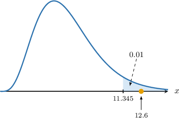
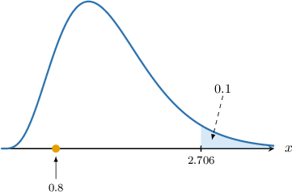

# Testing Poisson Models Using Chi-Square Goodness-of-Fit

Source: https://www.mathacademy.com/topics/3016?courseId=73
Topic ID: 3016

## Prerequisites

- [Introduction to Chi-Square Goodness-of-Fit](./3014-introduction-to-chi-square-goodness-of-fit.md)

## Lesson

### Introduction

In this lesson, we'll learn how to conduct chi-square goodness-of-fit tests to determine whether some sample data fit a Poisson distribution.

First, let's remind ourselves of some basic facts.

- Given a random variable $X \sim \textrm{Po}(\lambda)$, the probability mass function of $X$ is given by where $\lambda > 0$ is the average rate of occurrence.

- Given a random sample of size $N$ drawn from $X \sim \textrm{Po}(\lambda)$, the expected frequency of the outcome $X = x$ is given by

Let's get some practice at computing expected values using the Poisson distribution.

### Example: Calculating Expected Frequencies

#### Question

A publishing house believes the number of misspellings per page of a draft book follows a Poisson distribution $\mathrm{Po}(2.5).$ They wish to carry out a hypothesis test with the following null and alternative hypotheses:

- $H_0\mathbin{:}\:$ The observed distribution can be modeled as $\mathrm{Po}(2.5)$

- $H_1\mathbin{:}\:$ The observed distribution cannot be modeled as $\mathrm{Po}(2.5)$

The table below shows the number of misspellings per page and their corresponding frequencies. Calculate the missing expected frequencies. Round your final answers to one decimal place.

#### Explanation

Under the null hypothesis, we have that $X\sim \mathrm{Po}(2.5).$ Therefore,

$$

\begin{aligned}𝑃(𝑋=𝑥) & =\frac{𝜆^{𝑥}𝑒^{−𝜆}}{𝑥!} \\ & =\frac{(2.5)^{𝑥}𝑒^{−2.5}}{𝑥!},\,𝑥=0,1,2,…\end{aligned}

$$

Let's calculate the probability of each missing value of $X{:}$

$$

\begin{aligned}𝑃(𝑋=0) & =\frac{(2.5)^{0}𝑒^{−2.5}}{0!}≈0.082\,085 \\ 𝑃(𝑋=1) & =\frac{(2.5)^{1}𝑒^{−2.5}}{1!}≈0.205\,212 \\ 𝑃(𝑋=2) & =\frac{(2.5)^{2}𝑒^{−2.5}}{2!}≈0.256\,516 \\ 𝑃(𝑋=3) & =\frac{(2.5)^{3}𝑒^{−2.5}}{3!}≈0.213\,763 \\ 𝑃(𝑋≥4) & =1−𝑃(𝑋=0)−𝑃(𝑋=1)−𝑃(𝑋=2)−𝑃(𝑋=3)=0.242\,424\end{aligned}

$$

The number of observations is

$$

N = 15 + 18 + 9 + 26+ 12 = 80.

$$

Therefore, the expected frequencies for each observation are as follows:

$$

\begin{aligned}𝐸_{0} & =𝑁⋅𝑃(𝑋=0)=80⋅0.082\,085≈6.6 \\ 𝐸_{2} & =𝑁⋅𝑃(𝑋=2)=80⋅0.256\,516≈20.5 \\ 𝐸_{3} & =𝑁⋅𝑃(𝑋=3)=80⋅0.213\,763≈17.1 \\ 𝐸_{4} & =𝑁⋅𝑃(𝑋≥4)=80⋅0.242\,424≈19.4\end{aligned}

$$

A table summarizing the observed and corresponding expected frequencies is given below:

### Estimating the Rate Parameter

Suppose $Y$ is a random variable with support $S=\{0,1,2,3, \ldots\}.$ A random sample is carried out, and the sample data is shown below.

A chi-square goodness of fit test is conducted with the following null and alternative hypotheses:

- $H_0\mathbin{:}\:$ The sample data fit a Poisson distribution $\mathrm{Po}(\lambda)$

- $H_1\mathbin{:}\:$ The sample data does not fit a Poisson distribution $\mathrm{Po}(\lambda)$

Notice we're not given the rate parameter $\lambda.$ Therefore, we must estimate it from the sample data, which we can do as follows:

$$

\begin{aligned}\overset{𝜆}{^} & =\frac{total number of events}{total number of observations} \\ & =\frac{∑(𝑦_{𝑖}⋅𝑂_{𝑖})}{𝑁},\end{aligned}

$$

where $O_i$ is the observed frequency for the $i$th observation, and $N$ is the number of observations.

In our case, the total number of observations is given by

$$

N= 10+15+22+13 = 60.

$$

So, in our case, we have

$$

\begin{aligned}\overset{𝜆}{^} & =\frac{0⋅10+1⋅15+2⋅22+3⋅13}{60} \\ & ≈1.63.\end{aligned}

$$

Therefore, the proposed distribution is $Y\sim \mathrm{Po}(1.63).$

### Example: Estimating the Rate Parameter From Sample Data

#### Question

Suppose $Y$ is a random variable with support $S=\{0,1,2,3, \ldots\}.$ A random sample is carried out, and the sample data is shown below.

A chi-square goodness of fit test is conducted at the $10\%$ significance level with the following null and alternative hypotheses:

- $H_0\mathbin{:}\: Y\sim \mathrm{Po}(\lambda)$

- $H_1\mathbin{:}\: Y\not\sim \mathrm{Po}(\lambda)$

Use this data to calculate an estimator for the rate $\lambda.$

#### Explanation

The number of observations is

$$

N=30+27+10+3=70.

$$

We can calculate an estimator for $\lambda,$ which we denote as $\hat \lambda,$ as follows:

$$

\begin{aligned}\overset{𝜆}{^} & =\frac{total number of events}{total number of observations} \\ & =\frac{∑(𝑦_{𝑖}⋅𝑂_{𝑖})}{𝑁},\end{aligned}

$$

where $O_i$ is the observed frequency for the $i$th observation, $N$ is the number of observations. So, in our case, we have

$$

\begin{aligned}\overset{𝜆}{^} & =\frac{0⋅30+1⋅27+2⋅10+3⋅3}{70} \\ & =0.8.\end{aligned}

$$

Therefore, the proposed distribution is $Y\sim \mathrm{Po}(0.8).$

### The Chi-Square Test

Let's remind ourselves of the key facts regarding chi-square goodness-of-fit tests.

Suppose we have a set of observed frequencies $O_i$ and corresponding expected frequencies $E_i,$ as defined by a theoretical model under the null hypothesis. Then, the random variable

$$

X = \sum_{i} \frac{(O_i - E_i)^2}{E_i}

$$

approximately follows a chi-square distribution with $\nu$ degrees of freedom, where

- $O_i$ is the observed frequency for category $i,$

- $E_i$ is the expected frequency for category $i,$ as predicted under the null hypothesis, and

- the number of degrees of freedom $\nu$ is given by

$$

\nu = \textrm{number of categories} - \textrm{number of constraints}.

$$

This approximation holds when all expected frequencies $E_i$ are sufficiently large (typically $E_i \geq 5$ for each category), and the observations are independent.

Note the following:

- If $\lambda$ is *given*, there is only one constraint: the total number of observations is fixed. In this case, we have

- If $\lambda$ is *not* given, then it must be estimated. Estimating $\lambda$ places an extra constraint on our data. In such cases, we have

Let's see an example.

### Example: Carrying Out a Chi-Square Test

#### Question

A shopping center manager believes that the average number of customer complaints received on a randomly selected day follows a Poisson distribution $\mathrm{Po}(\lambda).$ The frequency distribution of the complaints received over a period of $50$ days is summarized below.

Conduct a chi-square goodness of fit test at the $1\%$ significance level with the following null and alternative hypotheses:

- $H_0\mathbin{:}\:$ The observed distribution can be modeled as $\mathrm{Po}(\lambda)$

- $H_1\mathbin{:}\:$ The observed distribution cannot be modeled as $\mathrm{Po}(\lambda)$

The table below gives the values of $w$ that satisfy $P(W\geq w) = p,$ where $W\sim \chi^2(\nu).$

#### Explanation

Suppose we have a set of observed frequencies $O_i$ and corresponding expected frequencies $E_i,$ as defined by a theoretical model under the null hypothesis. Then, the random variable

$$

Y= \sum_{i} \frac{(O_i - E_i)^2}{E_i}

$$

approximately follows a chi-square distribution with $\nu$ degrees of freedom, where

- $O_i$ is the observed frequency for category $i,$ and

- $E_i$ is the expected frequency for category $i,$ as predicted under the null hypothesis.

This approximation holds when all expected frequencies $E_i$ are sufficiently large (typically $E_i \geq 5$ for each category), and the observations are independent.

Let the random variable $Y$ be the number of complaints received on a randomly selected day.

The number of observations is

$$

N= 6 + 12 + 18 + 14= 50.

$$

We can calculate an estimate for $\lambda,$ which we denote as $\hat \lambda,$ as follows:

$$

\begin{aligned}\overset{𝜆}{^} & =\frac{total number of events}{total number of observations} \\ & =\frac{∑(𝑦_{𝑖}⋅𝑂_{𝑖})}{𝑁},\end{aligned}

$$

where $O_i$ is the observed frequency for the $i$th observation, and $N$ is the number of observations. So, in our case, we have

$$

\begin{aligned}\overset{𝜆}{^} & =\frac{0⋅6+1⋅12+2⋅18+3⋅14}{50} \\ & =1.8.\end{aligned}

$$

Therefore, the proposed distribution is $Y\sim \mathrm{Po}(1.8).$

Under the hypothesis that $Y\sim \mathrm{Po}(1.8),$ we have

$$

\begin{aligned}𝑃(𝑌=𝑦) & =\frac{𝜆^{𝑦}𝑒^{−𝜆}}{𝑦!} \\ & =\frac{(1.8)^{𝑦}𝑒^{−1.8}}{𝑦!},\,𝑦=0,1,2,3,….\end{aligned}

$$

Let's calculate the probability of each value of $Y{:}$

$$

\begin{aligned}𝑃(𝑌=0) & =\frac{(1.8)^{0}𝑒^{−1.8}}{0!}≈0.165\,299 \\ 𝑃(𝑌=1) & =\frac{(1.8)^{1}𝑒^{−1.8}}{1!}≈0.297\,538 \\ 𝑃(𝑌=2) & =\frac{(1.8)^{2}𝑒^{−1.8}}{2!}≈0.267\,784 \\ 𝑃(𝑌=3) & =\frac{(1.8)^{3}𝑒^{−1.8}}{3!}≈0.160\,671 \\ 𝑃(𝑌≥4) & =1−𝑃(𝑌=0)−𝑃(𝑌=1)−𝑃(𝑌=2)−𝑃(𝑌=3)=0.108\,708\end{aligned}

$$

Therefore, the expected frequencies for each observation are as follows:

$$

\begin{aligned}𝐸_{0} & =𝑁⋅𝑃(𝑌=0)=50⋅0.165\,299≈8.2650 \\ 𝐸_{1} & =𝑁⋅𝑃(𝑌=1)=50⋅0.297\,538≈14.8769 \\ 𝐸_{2} & =𝑁⋅𝑃(𝑌=2)=50⋅0.267\,784≈13.3892 \\ 𝐸_{3} & =𝑁⋅𝑃(𝑌=3)=50⋅0.160\,671≈8.0336 \\ 𝐸_{4} & =𝑁⋅𝑃(𝑌≥4)=50⋅0.108\,708≈5.4354\end{aligned}

$$

A table summarizing the observed and corresponding theoretical frequencies is given below:

Notice that the expected frequencies are greater than or equal to $5.$ Also, we have rounded values to four decimal places, where appropriate.

We compute our test statistic by summing the last row:

$$

\begin{aligned}\underset{𝑖}{∑}\frac{(𝑂_{𝑖}−𝐸_{𝑖})^{2}}{𝐸_{𝑖}} & =0.6207+0.5563+1.5878+4.4311+5.4354 \\ & =12.6313\end{aligned}

$$

Therefore, the test statistic is $\boxed{\color{blue}12.6}$ (rounded to one decimal place).

Our data has two constraints: the total number of observations must equal $N,$ and the estimated rate parameter $\hat \lambda.$ Therefore, the number of degrees of freedom $\nu$ is calculated as follows:

$$

\begin{aligned}𝜈 & =number of categories−number of constraints \\ & =5−2 \\ & =3\end{aligned}

$$

So, there are $\nu = \boxed{\color{blue}3}$ degrees of freedom.

From the given chi-square table, the critical value for $\nu=3$ at a $1\%$ significance level is $\chi^2_{\textrm{critical}}=11.345,$ and the critical region is

$$

Y\geq 11.345

$$

as shown below.

### Cases Where Regrouping is Needed

To apply the chi-square goodness-of-fit test, the expected frequencies $E_i$ must all be sufficiently large. The usual rule of thumb is

$$

E_i \geq 5.

$$

This isn't the case for every category in some samples. Whenever this happens, we must combine our data and form new categories to satisfy this condition before applying the chi-square test.

Let's see an example.

### Example: Carrying Out a Chi-Square Test (Regrouping Needed)

#### Question

The manager of a chocolate shop believes that the weekly number of customer complaints about the service follows a Poisson distribution with rate parameter $\lambda.$ The frequency distribution of the complaints over $40$ weeks is summarized below.

Conduct a chi-square goodness of fit test at the $10\%$ significance level with the following null and alternative hypotheses:

- $H_0\mathbin{:}\: Y\sim \mathrm{Po}(\lambda)$

- $H_1\mathbin{:}\: Y\not\sim \mathrm{Po}(\lambda)$

where the rate parameter $\lambda$ is unknown.

The table below gives the values of $w$ that satisfy $P(W\geq w) = p,$ where $W\sim \chi^2(\nu).$

#### Explanation

Suppose we have a set of observed frequencies $O_i$ and corresponding expected frequencies $E_i,$ as defined by a theoretical model under the null hypothesis. Then, the random variable

$$

X = \sum_{i} \frac{(O_i - E_i)^2}{E_i}

$$

approximately follows a chi-square distribution with $\nu$ degrees of freedom, where

- $O_i$ is the observed frequency for category $i,$ and

- $E_i$ is the expected frequency for category $i,$ as predicted under the null hypothesis.

This approximation holds when all expected frequencies $E_i$ are sufficiently large (typically $E_i \geq 5$ for each category), and the observations are independent.

Let $Y$ be the number of customer complaints received per week. Under the null hypothesis, we have that $Y \sim \mathrm{Po}(\lambda).$

The number of observations is

$$

N = 20+12+8 =40.

$$

We can calculate an estimator for $\lambda,$ which we denote as $\hat \lambda,$ as follows:

$$

\begin{aligned}\overset{𝜆}{^} & =\frac{total number of events}{total number of observations} \\ & =\frac{∑(𝑦_{𝑖}⋅𝑂_{𝑖})}{𝑁},\end{aligned}

$$

where $O_i$ is the observed frequency for the $i$th observation, $N$ is the number of observations. So, in our case, we have

$$

\begin{aligned}\overset{𝜆}{^} & =\frac{0⋅20+1⋅12+2⋅8}{40} \\ & =0.7.\end{aligned}

$$

Therefore, the proposed distribution is $Y\sim \mathrm{Po}(0.7).$

Under the hypothesis that $Y \sim \mathrm{Po}(0.7),$ we have

$$

\begin{aligned}𝑃(𝑌=𝑦) & =\frac{𝜆^{𝑦}𝑒^{−𝜆}}{𝑦!} \\ & =\frac{(0.7)^{𝑦}𝑒^{−0.7}}{𝑦!},\,𝑦=0,1,2.\end{aligned}

$$

Let's calculate the probability of each value of $Y{:}$

$$

\begin{aligned}𝑃(𝑌=0) & =\frac{(0.7)^{0}𝑒^{−0.7}}{0!}≈0.496\,585 \\ 𝑃(𝑌=1) & =\frac{(0.7)^{1}𝑒^{−0.7}}{1!}≈0.347\,610 \\ 𝑃(𝑌=2) & =\frac{(0.7)^{2}𝑒^{−0.7}}{2!}≈0.121\,663 \\ 𝑃(𝑌≥3) & =1−𝑃(𝑌=0)−𝑃(𝑌=1)−𝑃(𝑌=2)=0.034\,142\end{aligned}

$$

Therefore, the expected frequencies for each observation are as follows:

$$

\begin{aligned}𝐸_{0} & =𝑁⋅𝑃(𝑌=0)=40⋅0.496\,585≈19.8634 \\ 𝐸_{1} & =𝑁⋅𝑃(𝑌=1)=40⋅0.347\,610≈13.9044 \\ 𝐸_{2} & =𝑁⋅𝑃(𝑌=2)=40⋅0.121\,663≈4.8665 \\ 𝐸_{3} & =𝑁⋅𝑃(𝑌≥3)=40⋅0.034\,142≈1.3657\end{aligned}

$$

Notice that there are two frequencies less than $5,$ so we combine the values $Y = 2$ and $Y=3.$

A table summarizing the observed and corresponding theoretical frequencies is given below:

We have rounded values to four decimal places, where appropriate.

We compute our test statistic by summing the last row:

$$

\begin{aligned}\underset{𝑖}{∑}\frac{(𝑂_{𝑖}−𝐸_{𝑖})^{2}}{𝐸_{𝑖}} & =0.0009+0.2608+0.5014 \\ & ≈0.8\end{aligned}

$$

Therefore, the test statistic is $\boxed{\color{blue}0.8}$ (rounded to one decimal place).

Our data has two constraints: the total number of observations must equal $N,$ and the estimated rate $\hat \lambda.$ Therefore, the number of degrees of freedom $\nu$ is calculated as follows:

$$

\begin{aligned}𝜈 & =number of categories−number of constraints \\ & =3−2 \\ & =1\end{aligned}

$$

**** We must use the number of categories in the combined table!

So, there is $\nu = \boxed{\color{blue}1}$ degree of freedom.

From the given chi-square table, the critical value for $\nu = 1$ at a $10\%$ significance level is $\chi^2_{\textrm{critical}} = 2.706,$ and the critical region is

$$

X\geq 2.706

$$

as shown below.

