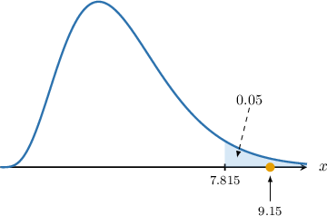

# Testing Continuous Uniform Models Using Chi-Square Goodness-of-Fit

Source: https://www.mathacademy.com/topics/3017?courseId=73
Topic ID: 3017

## Prerequisites

- [Modeling With Continuous Uniform Distributions](./2990-modeling-with-continuous-uniform-distributions.md)
- [Introduction to Chi-Square Goodness-of-Fit](./3014-introduction-to-chi-square-goodness-of-fit.md)

## Lesson

### Introduction

In this lesson, we'll learn how to conduct chi-square goodness-of-fit tests to determine whether some sample data fit a continuous uniform distribution.

First, let's remind ourselves of some basic facts.

- Given a random variable the probability density function (PDF) of is given by

- For any interval the probability that lies within that interval is

- If we divide the range into intervals with endpoints then the expected frequency of observations falling in the th interval is given by where is the total number of observations in the sample.

Let's get some practice at computing expected frequencies using the continuous uniform distribution.

### Example: Calculating Expected Frequencies

#### Question

The salaries of a company's employees range from $30\,000$ to $90\,000$ dollars. A company director wishes to carry out a hypothesis test with the following null and alternative hypotheses:

- $H_0\mathbin{:}\:$ The salaries are distributed uniformly.

- $H_1\mathbin{:}\:$ The salaries are not distributed uniformly.

A random sample of employees is taken, and the frequency distribution of their salaries is shown below. Calculate the expected frequency $E_i$ for each salary category.

#### Explanation

Let $X$ be the salary of a randomly selected employee (in thousands of dollars). Under the null hypothesis, we have that $X\sim U[30,90].$ Therefore,

$$

P(a\leq X\lt b)= \dfrac{b-a}{90-30} = \dfrac{b-a}{60}

$$

where $a \lt b$ and $a,b\in [30,90].$

The sample size is

$$

N = 12+10+6+2 = 30.

$$

Therefore, the expected frequencies for each class of observations are as follows:

$$

\begin{aligned}𝐸_{1} & =𝑁⋅𝑃(30≤𝑋<42) \\ & =30⋅(\frac{42−30}{60}) \\ & =6 \\ 𝐸_{2} & =𝑁⋅𝑃(42≤𝑋<60) \\ & =30⋅(\frac{60−42}{60}) \\ & =9 \\ 𝐸_{3} & =𝑁⋅𝑃(60≤𝑋<80) \\ & =30⋅(\frac{80−60}{60}) \\ & =10 \\ 𝐸_{4} & =𝑁⋅𝑃(80≤𝑋≤90) \\ & =30⋅(\frac{90−80}{60}) \\ & =5\end{aligned}

$$

A table summarizing the observed and corresponding expected frequencies is given below:

### The Chi-Square Test

Let's remind ourselves of the key facts regarding chi-square goodness-of-fit tests.

Suppose we have a set of observed frequencies $O_i$ and corresponding expected frequencies $E_i,$ as defined by a theoretical model under the null hypothesis. Then, the random variable

$$

X = \sum_{i} \frac{(O_i - E_i)^2}{E_i}

$$

approximately follows a chi-square distribution with $\nu$ degrees of freedom, where

- $O_i$ is the observed frequency for category $i,$

- $E_i$ is the expected frequency for category $i,$ as predicted under the null hypothesis,

- The number of degrees of freedom $\nu$ is given by

$$

\nu = \text{number of categories} - \text{number of constraints}.

$$

This approximation holds when all expected frequencies $E_i$ are sufficiently large (typically $E_i \geq 5$ for each category), and the observations are independent.

In this lesson, we'll only consider the case with one constraint: the sum of the expected frequencies should equal $N,$ the total number of observations. We'll deal with cases with two or more constraints in other lessons.

### Example: Calculating a Test Statistic

#### Question

Suppose $Y$ is a continuous random variable with support $S=[0,120].$ A random sample is carried out, and the frequency distribution of the sample data is shown below.

A chi-square goodness of fit test is conducted at the $1\%$ significance level with the following null and alternative hypotheses:

- $H_0\mathbin{:}\: Y\sim U[0,120]$

- $H_1\mathbin{:}\:Y\not\sim U[0,120]$

Calculate the value of the test statistic for this hypothesis test.

#### Explanation

Suppose we have a set of observed frequencies $O_i$ and corresponding expected frequencies $E_i,$ as defined by a theoretical model under the null hypothesis. Then, the random variable

$$

X = \sum_{i} \frac{(O_i - E_i)^2}{E_i}

$$

approximately follows a chi-square distribution with $\nu$ degrees of freedom, where

- $O_i$ is the observed frequency for category $i,$ and

- $E_i$ is the expected frequency for category $i,$ as predicted under the null hypothesis.

This approximation holds when all expected frequencies $E_i$ are sufficiently large (typically $E_i \geq 5$ for each category), and the observations are independent.

Under the null hypothesis, we have that $Y\sim U[0,120].$ Therefore,

$$

P(a\leq Y\lt b)= \dfrac{b-a}{120-0} = \dfrac{b-a}{120}

$$

where $a \lt b$ and $a,b\in [0,120].$

The sample size is

$$

N = 31 + 42 + 27 = 100.

$$

Therefore, the expected frequencies for each class of observation are as follows:

$$

\begin{aligned}𝐸_{1} & =𝑁⋅𝑃(0≤𝑌<30) \\ & =100⋅(\frac{30−0}{120}) \\ & =25 \\ 𝐸_{2} & =𝑁⋅𝑃(30≤𝑌<90) \\ & =100⋅(\frac{90−30}{120}) \\ & =50 \\ 𝐸_{3} & =𝑁⋅𝑃(90≤𝑌<120) \\ & =100⋅(\frac{120−90}{120}) \\ & =25\end{aligned}

$$

A table summarizing the observed and corresponding expected frequencies is given below:

We compute our test statistic by summing the last row:

$$

\begin{aligned}\underset{𝑖}{∑}\frac{(𝑂_{𝑖}−𝐸_{𝑖})^{2}}{𝐸_{𝑖}} & =1.44+1.28+0.16 \\ & =2.88\end{aligned}

$$

Therefore, the value of the test statistic is $\boxed{\color{blue}2.88}.$

### Example: Carrying Out a Chi-Square Test

#### Question

The salaries of a company's employees range from $30\,000$ to $90\,000$ dollars. A random sample of employees is taken, and the frequency distribution of their salaries is shown below.

Conduct a chi-squre goodness -of-fit test at the $5\%$ significance level with the following null and alternative hypotheses:

- $H_0\mathbin{:}\:$ The salaries are distributed uniformly.

- $H_1\mathbin{:}\:$ The salaries are not distributed uniformly.

The table below gives the values of $w$ that satisfy $P(W\geq w) = p,$ where $W\sim \chi^2(\nu).$

#### Explanation

Suppose we have a set of observed frequencies $O_i$ and corresponding expected frequencies $E_i,$ as defined by a theoretical model under the null hypothesis. Then, the random variable

$$

X = \sum_{i} \frac{(O_i - E_i)^2}{E_i}

$$

approximately follows a chi-square distribution with $\nu$ degrees of freedom, where

- $O_i$ is the observed frequency for category $i,$ and

- $E_i$ is the expected frequency for category $i,$ as predicted under the null hypothesis.

This approximation holds when all expected frequencies $E_i$ are sufficiently large (typically $E_i \geq 5$ for each category), and the observations are independent.

Let $Y$ be the salary of a randomly selected employee (in thousands of dollars). Under the null hypothesis, we have that $Y\sim U[30,90].$ Therefore,

$$

P(a\leq Y\lt b)= \dfrac{b-a}{90-30} = \dfrac{b-a}{60}

$$

where $a \lt b$ and $a,b\in [30,90].$

The sample size is

$$

N = 27+49+27+17 = 120.

$$

Therefore, the expected frequencies for each class of observation are as follows:

$$

\begin{aligned}𝐸_{1} & =𝑁⋅𝑃(30≤𝑌<40) \\ & =120⋅(\frac{40−30}{60}) \\ & =20 \\ 𝐸_{2} & =𝑁⋅𝑃(40≤𝑌<60) \\ & =120⋅(\frac{60−40}{60}) \\ & =40 \\ 𝐸_{3} & =𝑁⋅𝑃(60≤𝑌<80) \\ & =120⋅(\frac{80−60}{60}) \\ & =40 \\ 𝐸_{4} & =𝑁⋅𝑃(80≤𝑌≤90) \\ & =120⋅(\frac{90−80}{60}) \\ & =20\end{aligned}

$$

A table summarizing the observed and corresponding expected frequencies is given below:

We compute our test statistic by summing the last row:

$$

\begin{aligned}\underset{𝑖}{∑}\frac{(𝑂_{𝑖}−𝐸_{𝑖})^{2}}{𝐸_{𝑖}} & =2.45+2.025+4.225+0.45 \\ & =9.15\end{aligned}

$$

There is only one constraint on our data: the total number of observations must equal $N.$ Therefore, the number of degrees of freedom $\nu$ is calculated as follows:

$$

\begin{aligned}𝜈 & =number of categories−number of constraints \\ & =4−1 \\ & =3\end{aligned}

$$

So, there are $\nu = \boxed{\color{blue}3}$ degrees of freedom.

From the given chi-square table, the critical value for $\nu=3$ at a $5\%$ significance level is $\chi^2_{\text{critical}}=7.815,$ and the critical region is

$$

X\geq 7.815

$$

as shown below.

