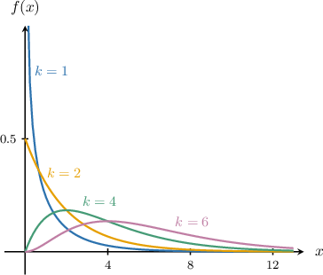
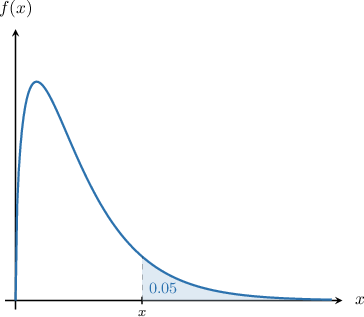

# The Chi-Square Distribution

Source: https://www.mathacademy.com/topics/3023?courseId=73
Topic ID: 3023

## Prerequisites

- [The Standard Normal Distribution](./265-the-standard-normal-distribution.md)
- [The Gamma Function](./3289-the-gamma-function.md)
- [Continuous Random Variables Over Infinite Domains](./4100-continuous-random-variables-over-infinite-domains.md)

## Lesson

### Introduction

**The chi-square distribution** with $k$ **degrees of freedom**, denoted $\chi^2(k)$, is the distribution of a random variable that is the sum of the squares of $k$ independent standard normal random variables.

Thus, if $Z_1, Z_2, \ldots, Z_k$ are mutually independent, where $Z_i\sim N(0,1)$, then

$$

Z_1^2+Z_2^2+\ldots+Z_k^2\sim \chi^2(k).

$$

It can be shown that $X \sim \chi^2(k)$ has the following probability density function:

$$

\begin{aligned}\frac{1}{2^{𝑘/2}Γ(\frac{𝑘}{2})}𝑥^{𝑘/2−1}𝑒^{−𝑥/2}, & 𝑥≥0 \\ 0, & otherwise\end{aligned}

$$

Note that $\Gamma$ is the gamma function.

The diagram below shows $f(x)$ for various degrees of freedom $k.$

The chi-square distribution is widely used in inferential statistics. In particular, it is used in **goodness of fit** tests, where experimental data is compared against a hypothesized theoretical model. You will learn more about the applications of the chi-square distribution in future lessons.

### Example: Computing a Probability for a Chi-Square Random Variable Using the PDF

#### Question

Given that calculate Round your final answer to four decimal places.

**

**

#### Explanation

A chi-square random variable with degrees of freedom has the following probability density function:

We're given that So, has the following probability density function:

Recalling that for any natural number we have

So, the probability distribution becomes

Finally, we calculate as follows:

### Working With a Percentage Points Table

Let $X\sim\chi^2(3).$ Suppose we wish to know the specific value $x$ such that

$$

P(X\geq x) = 0.05.

$$

Here, $\alpha = 0.05$ is sometimes called the **significance level**. The required probability is represented by the shaded region below.

We often resort to percentage points tables to look up our desired values rather than computing these probabilities by hand (which would be very difficult).

Some percentage points for the $\chi^2(3)$ distribution are given below. Each cell in the table gives a value $x$ such that $P(X\geq x) = p$ for a particular value of $p.$

From the table, we have

$$

P(X \geq 7.815) = 0.05.

$$

Therefore, $x = 7.815.$

### Example: Using a Percentage Points Table To Find a Chi-Square Probability

#### Question

The table below gives the values of $x$ that satisfy $P(X\geq x) = p,$ where $X\sim \chi^2(k).$ Given that the random variable $X \sim \chi^2(7),$ find the value of $x$ such that $P(X \geq x) = 0.99.$

#### Explanation

Since $X \sim \chi^2(7),$ we focus on the row of the table that corresponds to $k=7.$

From this row, we see that

$$

P(X \geq 1.239) = 0.990.

$$

Therefore, our answer is $x=1.239.$

### Example: Computing a Chi-Square Probability Using the Complement

#### Question

The table below gives the values of $x$ that satisfy $P(X\geq x) = p,$ where $X\sim \chi^2(k).$ Given that $X \sim \chi^2(7),$ find the value of $x$ such that $P(X \leq x) = 0.005.$

#### Explanation

The table shows probabilities in the form $P(X > x).$ So first, we express the desired probability in this form:

$$

\begin{aligned}𝑃(𝑋>𝑥) & =1−𝑃(𝑋≤𝑥) \\ & =1−0.005 \\ & =0.995\end{aligned}

$$

Now, since $X \sim \chi^2(7),$ we focus on the row of the table that corresponds to $k=7.$

From this row, we see that

$$

P(X > 0.989) = 0.995.

$$

Therefore, our answer is $x=0.989.$

### Example: Finding a Probability Involving Sums of Squared Standard Normal Variables

#### Question

Let the random variable $Y$ be defined as

$$

Y = Z_1^2+Z_2^2+\cdots + Z_{10}^2

$$

where $Z_i\sim N(0,1)$ for $1\leq i\leq 10.$ Find the value $y$ that satisfies $P(Y\leq y) = 0.99.$

**

#### Explanation

If $Z_i\sim N(0,1)$ for $1\leq i \leq k$ are independent normal random variables, then the sum

$$

Z_1^2+Z_2^2+\cdots + Z_{k}^2

$$

follows a $\chi^2(k)$ distribution with $k$ degrees of freedom.

So, in our case, we have

$$

Y = Z_1^2+Z_2^2+\cdots + Z_{10}^2 \sim \chi^2(10).

$$

First, we express the given probability in the form $P(Y\geq y){:}$

$$

\begin{aligned}𝑃(𝑌≤𝑦) & =1−𝑃(𝑌≥𝑦) \\ 0.99 & =1−𝑃(𝑌≥𝑦) \\ 𝑃(𝑌≥𝑦) & =0.01\end{aligned}

$$

Now, we wish to find the value $y$ such that $P(Y\geq y) = 0.01$ This can be found from the given table:

$$

P(Y\geq 23.209) = 0.01

$$

which means

$$

P(Y\leq 23.209) = 0.99.

$$

Therefore, the value $y$ that satisfies $P(Y\leq y) = 0.99$ is $y=\boxed{\color{blue}23.209}.$
