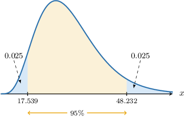
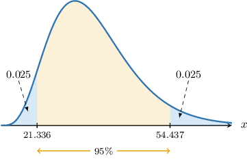
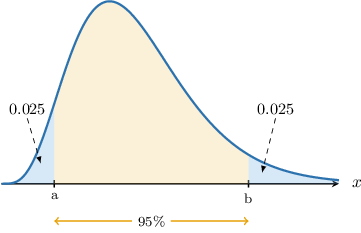

# Confidence Intervals for One Variance

Source: https://www.mathacademy.com/topics/3299?courseId=73
Topic ID: 3299

## Prerequisites

- [Confidence Intervals for One Mean: Known Population Variance](./260-confidence-intervals-for-one-mean-known-population-variance.md)
- [The Chi-Square Distribution](./3023-the-chi-square-distribution.md)
- [The Sample Variance](./3820-the-sample-variance.md)

## Lesson

### Introduction

In this lesson, we will discuss the sampling distribution of the sample variance $S^2$ and explain how this can be used to construct confidence intervals for the population variance $\sigma^2.$

First, consider a random sample $X_1, X_2, \ldots, X_n$ of size $n.$ The **sample variance** $S^2,$ defined as

$$

S^2 = \dfrac{1}{n-1} \sum_{i=1}^n \left( X_i - \overline{X} \right)^2

$$

is an unbiased estimate of the population variance $\sigma^2.$

In general, the distribution of $S^2$ is difficult to find. However, if the random sample is taken from a *normally distributed* population, that is

$$

X_i\sim N(\mu,\sigma^2), \qquad i=1,2,\ldots,n,

$$

then it can be shown that the sampling distribution of the random variable

$$

\dfrac{(n-1)S^2}{\sigma^2}

$$

follows a chi-square distribution $\chi^2(n-1)$ with $n-1$ degrees of freedom.

### Confidence Intervals for Variances

Suppose that a sample of size $n=26$ is drawn from a *normal* population with unknown variance $\sigma^2.$ After processing our results, we compute an unbiased estimate of the variance in the usual way and get the following result:

$$

s^2 = 4

$$

This is an unbiased **point estimate** of the population variance $\sigma^2.$ However, it is unsatisfactory because we have no information regarding its reliability.

For this reason, it's often more helpful to report a **confidence interval** for $\sigma^2.$ In this case, a confidence interval is an interval of the form

$$

(s^2-E, \: s^2+E)

$$

where

- $s^2$ is our estimate of the population variance, and

- $E$ is some **margin of error**.

In addition, we need to give some indication regarding the reliability of our confidence interval. With this in mind, we will construct a $95\%$ confidence interval for the population variance $\sigma^2$.

### Constructing a Confidence Interval

We have the following sample data from our normally distributed population:

$$

s^2=4, \qquad n=26

$$

If we define a new random variable $X$ as

$$

X = \dfrac{(n-1)S^2}{\sigma^2},

$$

then using the result discussed earlier, we have that

$$

X\sim\chi^2(25),

$$

where $\chi^2(25)$ denotes a chi-square distribution with $25$ degrees of freedom.

We wish to find an interval that we're $95\%$ confident that the random variable $X$ lies within. The diagram below shows the PDF for the $\chi^2(25)$ distribution. The interval we wish to find is also indicated.

Here, $a$ and $b$ are the labels assigned to the interval's endpoints.

According to our diagram, we have

$$

P(X < a) = P(X > b) = 0.025,

$$

or, equivalently,

$$

P(a < X < b) = 0.95.

$$

Now, consider the inequality inside the parentheses of the last probability statement:

$$

a < X < b

$$

To obtain an expression for the required confidence interval, we solve this inequality for the population variance $\sigma^2.$

Using our definition for $X,$ we have

$$

\begin{aligned}𝑎< & \,\frac{(𝑛−1)𝑆^{2}}{𝜎^{2}}<𝑏 \\ \frac{1}{𝑏}< & \,\frac{𝜎^{2}}{(𝑛−1)𝑆^{2}}<\frac{1}{𝑎} \\ \frac{(𝑛−1)𝑆^{2}}{𝑏}< & \,𝜎^{2}<\frac{(𝑛−1)𝑆^{2}}{𝑎}.\end{aligned}

$$

Replacing $S^2$ with the point estimate $s^2,$ we reach the following expression for our confidence interval:

$$

\dfrac{(n-1)s^2}{b} \lt\: {\sigma^2} \lt \dfrac{(n-1)s^2}{a }\qquad (\ast)

$$

Now, using a percentage points table for a $\chi^2(25)$ distribution, we find that

$$

a\approx 13.120, \qquad b\approx 40.646.

$$

Finally, substituting our values for $a,b,n=26,$ and $s^2=4$ into $(\ast),$ we obtain that our $95\%$ confidence interval for $\sigma^2$ is

$$

\begin{aligned}(2.460,\,7.622).\end{aligned}

$$

Now that we've seen how to construct a particular confidence interval, let's discuss the more general procedure.

### The General Result

Suppose we have a random sample of size $n$ from a *normal* population with unknown variance $\sigma^2.$ Then, for a given value $\alpha$ between $0$ and $1,$ a $[100(1-\alpha)]\%$ confidence interval for the population variance $\sigma^2$ is given by

$$

\bigg( \dfrac{(n-1)s^2}{\color{blue}b}, \: \dfrac{(n-1)s^2}{\color{red}a} \bigg),

$$

where $P(X < {\color{red}a}) = P(X > {\color{blue}b}) = \dfrac{\alpha}{2},$ and $X \sim \chi^2(n-1)$ has a chi-square distribution with $n-1$ degrees of freedom.

Finally, by taking the square roots in our formula above, the corresponding confidence interval for the population standard deviation $\sigma$ can be written as

$$

\bigg( \dfrac{s\sqrt{n-1}}{\sqrt{\color{blue}b}}, \: \dfrac{s\sqrt{n-1}}{\sqrt{\color{red}a}} \bigg).

$$

### Example: Finding a Confidence Interval for the Population Variance

#### Question

Consider a sample of size $n=32$ from a normal population. Given that the sample variance is $s^2=2.56,$ find a $95\%$ confidence interval for the population variance $\sigma^2.$

**

#### Explanation

We are told that the population is normally distributed, but we do not know the population variance $\sigma^2.$ In cases like this, the random variable

$$

\dfrac{(n-1)S^2}{\sigma^2}

$$

follows a chi-square distribution $\chi^2(n-1)$ with $n-1$ degrees of freedom, where

- $n$ is the sample size,

- $S^2$ is the sample variance, and

- $\sigma^2$ is the population variance.

Given a value $\alpha$ between $0$ and $1,$ the corresponding $[100(1-\alpha)]\%$ confidence interval for the population variance $\sigma^2$ can be written as

$$

\bigg( \dfrac{(n-1)s^2}{\color{blue}b}, \: \dfrac{(n-1)s^2}{\color{red}a} \bigg),

$$

where $P(X > {\color{blue}b}) = \dfrac{\alpha}{2},$ $P(X < {\color{red}a}) = \dfrac{\alpha}{2},$ and $X \sim \chi^2(n-1).$

In our case,

$$

n = 32, \qquad s^2 = 2.56.

$$

We are interested in finding a $95\%$ confidence interval. So, we have

$$

\alpha=1-0.95=0.05 \qquad\Longrightarrow\qquad \dfrac{\alpha}{2}=0.025.

$$

We are given that $P(X > \boxed{\color{blue}48.232}) = 0.025$ and $P(X < \boxed{\color{red}17.539}) = 0.025.$ As a result,

$$

b = {\color{blue}48.232}, \qquad a = {\color{red}17.539}.

$$

Therefore, a $95\%$ confidence interval for the population variance $\sigma^2$ is the following:

$$

\begin{aligned}(\frac{(32−1)⋅2.56}{48.232},\,\frac{(32−1)⋅2.56}{17.539})=(1.645,\,4.525)\end{aligned}

$$

### Example: Finding a Confidence Interval for the Population Standard Deviation

#### Question

Consider a sample of size from a normal population. Given that the sample standard deviation is find a confidence interval for the population standard deviation of the distribution.

**

#### Explanation

We are told that the population is normally distributed, but we do not know the population variance In cases like this, the random variable

follows a chi-square distribution with degrees of freedom, where

- is the sample size,

- is the sample variance, and

- is the population variance.

Given a value between and the corresponding confidence interval for the population variance can be written as

and the corresponding confidence interval for the population standard deviation can be written as

where and

In our case,

We are interested in finding a confidence interval. So, we have

We are given that and As a result,

Therefore, a confidence interval for the population standard deviation is the following:

### Example: Finding Confidence Intervals: Applications

#### Question

A sample of $30$ high school students was surveyed on the number of hours they spent playing video games last week. The sample standard deviation was $2.56\, \text{h}.$ Assuming the number of hours playing video games is normally distributed among the population under consideration, find a $95\%$ confidence interval for the population standard deviation corresponding to all students in this school.

**

#### Explanation

We are told that the population is normally distributed, but we do not know the population variance $\sigma^2.$ In cases like this, the random variable

$$

\dfrac{(n-1)S^2}{\sigma^2}

$$

follows a chi-square distribution $\chi^2(n-1)$ with $n-1$ degrees of freedom, where

- $n$ is the sample size,

- $S^2$ is the sample variance, and

- $\sigma^2$ is the population variance.

Given a value $\alpha$ between $0$ and $1,$ the corresponding $[100(1-\alpha)]\%$ confidence interval for the population variance $\sigma^2$ can be written as

$$

\bigg( \dfrac{(n-1)s^2}{\color{blue}b}, \: \dfrac{(n-1)s^2}{\color{red}a} \bigg),

$$

and the corresponding confidence interval for the population standard deviation $\sigma$ can be written as

$$

\bigg( \dfrac{s\sqrt{n-1}}{\sqrt{\color{blue}b}}, \: \dfrac{s\sqrt{n-1}}{\sqrt{\color{red}a}} \bigg),

$$

where $P(X > {\color{blue}b}) = \dfrac{\alpha}{2},$ $P(X < {\color{red}a}) = \dfrac{\alpha}{2},$ and $X \sim \chi^2(n-1).$

In our case,

$$

n = 30, \qquad s = 2.56\, \text{h}.

$$

We are interested in finding a $95\%$ confidence interval. So, we have

$$

\alpha=1-0.95=0.05 \qquad\Longrightarrow\qquad \dfrac{\alpha}{2}=0.025.

$$

We also need to find the values $a$ and $b$ such that $P(X > {\color{blue}b}) = 0.025$ and $P(X < {\color{red}a}) = 0.025,$ where $X$ has a chi-square distribution with $\nu = n-1=30-1=29$ degrees of freedom.

From the percentage points table of the chi-square distribution, we obtain that $b = {\color{blue}45.722}{:}$

Also, since

$$

\begin{aligned}𝑃(𝑋>𝑎) & =1−𝑃(𝑋<𝑎) \\ & =1−0.025 \\ & =0.975,\end{aligned}

$$

from the same table, we get that $a = {\color{red}16.047}{:}$

Therefore, a $95\%$ confidence interval for the population standard deviation $\sigma$ is the following:

$$

\begin{aligned}(\frac{2.56⋅\sqrt{30−1}}{\sqrt{45.722}},\frac{2.56⋅\sqrt{30−1}}{\sqrt{16.047}})=(2.039, & \,3.441)\end{aligned}

$$
