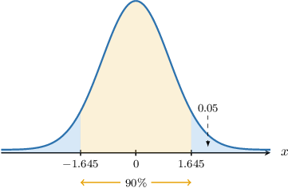
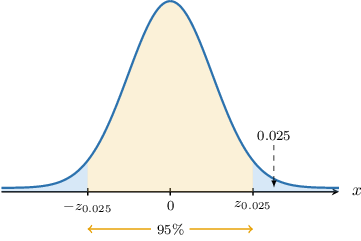

# Confidence Intervals for One Proportion

Source: https://www.mathacademy.com/topics/3300?courseId=73
Topic ID: 3300

## Prerequisites

- [Confidence Intervals for One Mean: Known Population Variance](./260-confidence-intervals-for-one-mean-known-population-variance.md)
- [Point Estimates of Population Proportions](./3932-point-estimates-of-population-proportions.md)

## Lesson

### Introduction

Let's now discuss how to construct a confidence interval for the proportion of the population whose members have a particular characteristic.

As a concrete example, let $p$ represent the proportion of the United States voting population that will vote for candidate $A$ in the next presidential election.

Suppose we conduct a random sample of size $n=40$ from our population. After processing our results, we find that the proportion $\widehat{\,p}$ of sample members that plan to vote for candidate $A$ is given by

$$

\widehat{\,p} = 0.3.

$$

This is our *estimate* of the population proportion $p.$

Of course, the quantity that we're *really* interested in is $p,$ the proportion of the entire voting population that will vote for candidate $A.$ We want to get an idea of how accurate our estimate is. Therefore, we wish to construct a confidence interval of the form

$$

(\widehat{\,p}-E, \: \widehat{\,p}+E),

$$

where $E$ is some **margin of error.**

Let's now discuss how to construct a $95\%$ confidence interval for the population proportion $p.$

### Constructing Confidence Intervals

We have and we wish to construct a confidence interval for the population proportion

To construct our confidence interval, the first thing to do is to establish the sampling distribution of

Since the United States has around million registered voters, the sample size is clearly less than of the population size. This means that, provided certain conditions are met, the following approximation can be applied:

Let's check that our usual conditions hold in this case (where we use as an estimate for):

Since all three conditions hold, the above approximation is applicable.

By transforming to a standard normal random variable, we have

Since the true population proportion is unknown, we substitute in this formula the sample proportion for

We wish to find a -interval that we're confident that the random variable lies within. This interval is indicated in the diagram below:

To help with the notation, we define a new parameter Since we're computing a confidence interval, we have

Notice that is precisely the area bounded by each "tail" that we're excluding from our confidence interval. Let's label the critical values at the endpoints of our interval as

According to our diagram,

Using a percentage points table for the standard normal distribution, we find that Therefore,

In other words,

Therefore, there is a probability that our random variable will lie in the interval

Now, here's the trick. We solve the inequality inside the parentheses of the last probability statement for the population proportion

Therefore, a confidence interval for the population proportion is given by

Finally, substituting our values

we obtain that our confidence interval for is

which simplifies to

Now that we've seen how to construct a particular confidence interval, let's discuss the more general procedure.

### Confidence Intervals for Proportions

Suppose we have a random sample of size $n$ from a sufficiently large population with sample proportion $\widehat{\,p}.$ Let's also assume that the following conditions are satisfied:

- $n \widehat{\,p} > 5$

- $n (1-\widehat{\,p}) > 5$

Then, for a given value $\alpha$ between $0$ and $1,$ a $[100(1-\alpha)]\%$ confidence interval for the population proportion $p$ is given by

$$

\left( \widehat{\,p} - z_{\alpha/2} \cdot \sqrt{\dfrac{\widehat{\,p}(1-\widehat{\,p})}{n}},\: \widehat{\,p} + z_{\alpha/2} \cdot \sqrt{\dfrac{\widehat{\,p}(1-\widehat{\,p})}{n}} \right).

$$

The endpoints of our confidence interval are the **confidence limits** and are given by

$$

\widehat{\,p} \pm z_{\alpha/2} \cdot \sqrt{\dfrac{\widehat{\,p}(1-\widehat{\,p})}{n}}.

$$

Each part of the formula above has a name:

- $\!\widehat{\,p}$ is the sample proportion

- $p$ is the population proportion

- $n$ is the sample size

- $z_{\alpha/2}$ is the corresponding $z$-score

- $E = z_{\alpha/2}\cdot \sqrt{\dfrac{\widehat{\,p}(1-\widehat{\,p})}{n}}$ is the margin of error

$$

𝑧

$$

So, our confidence interval can be written as follows:

$$

\begin{aligned}(\overset{\,𝑝}{ˆ}−[margin of error], & \,\overset{\,𝑝}{ˆ}+[margin of error]) \\ (\overset{\,𝑝}{ˆ}−[z-score]⋅[standard error], & \,\overset{\,𝑝}{ˆ}+[z-score]⋅[standard error]) \\ (\overset{\,𝑝}{ˆ}−𝑧_{𝛼/2}⋅\sqrt{\frac{\overset{\,𝑝}{ˆ}(1−\overset{\,𝑝}{ˆ})}{𝑛}}, & \,\overset{\,𝑝}{ˆ}+𝑧_{𝛼/2}⋅\sqrt{\frac{\overset{\,𝑝}{ˆ}(1−\overset{\,𝑝}{ˆ})}{𝑛}})\end{aligned}

$$

Since computing a confidence interval amounts to finding the corresponding confidence limits, we will use the two terms interchangeably.

Finally, in the future, you may assume that if a population is "large," it is sufficiently larger than any sample drawn from it.

### Example: Finding Confidence Intervals for Population Proportions

#### Question

Consider a sample of size $n=100$ from a large population where some individuals have a particular characteristic. Given that the proportion of those in the sample with the characteristic is $\widehat{\,p}=0.64,$ find a $90\%$ confidence interval for the population proportion $p$ of individuals having this characteristic.

**

#### Explanation

Since $n=100$ and $\widehat{\,p}=0.64,$ we have that

- $n \widehat{\,p} = 100 \cdot 0.64 = 64 > 5,$ and

- $n(1-\widehat{\,p}) = 100 \cdot (1-0.64) = 36 > 5.$

As a result, we may use the following normal approximation:

$$

\dfrac{\widehat{\,p} - p}{\sqrt{\widehat{\,p}(1-\widehat{\,p})/n}\phantom{|}} \sim N(0,1),

$$

where

- $\!\widehat{\,p}$ is the sample proportion,

- $p$ is the population proportion, and

- $n$ is the sample size.

Given a value $\alpha$ between $0$ and $1,$ the corresponding $[100(1-\alpha)]\%$ confidence interval for the population proportion $p$ of the original distribution can be written as

$$

\widehat{\,p} \pm z_{\alpha/2} \cdot \sqrt{\dfrac{\widehat{\,p}(1-\widehat{\,p})}{n}},

$$

where $P(Z > z_{\alpha/2}) = \dfrac{\alpha}{2}$ and $Z \sim N(0,1).$

We are interested in finding a $90\%$ confidence interval. So, we have

$$

\alpha=1-0.9=0.1 \qquad\Longrightarrow\qquad \dfrac{\alpha}{2}=0.05.

$$

We are given that $P(Z > 1.645) = 0.05.$ As a result,

$$

z_{\alpha/2} = z_{0.05} = 1.645.

$$

Therefore, a $90\%$ confidence interval for the population proportion $p$ is the following:

$$

\begin{aligned} & 0.64±1.645⋅\sqrt{\frac{0.64(1−0.64)}{100}} \\ & 0.64±0.079\end{aligned}

$$

### Example: Finding Confidence Intervals for Population Proportions In Context

#### Question

A survey of a random sample of $1\,500$ U.S. households reveals that $780$ of them own at least one dog. Find a $95\%$ confidence interval for the proportion of all U.S. households that own at least one dog.

**

#### Explanation

First, let's interpret the data:

- the population consists of all U.S. households,

- some of the households surveyed own at least one dog, and some don't,

- the size of the random sample is $n=1\, 500,$ and

- the proportion of households in the sample that own at least one dog can be found as follows:

$$

\widehat{p\,} = \dfrac{780}{1\, 500} = 0.52

$$

Now, we have that

- $n \widehat{\,p} =1\,500 \cdot 0.52 = 780 > 5,$ and

- $n(1-\widehat{\,p}) = 1\,500 \cdot (1-0.52) = 720 > 5.$

As a result, we may use the following normal approximation:

$$

\dfrac{\widehat{\,p} - p}{\sqrt{\widehat{\,p}(1-\widehat{\,p})/n}\phantom{|}} \sim N(0,1),

$$

where

- $\!\widehat{\,p}$ is the sample proportion,

- $p$ is the population proportion, and

- $n$ is the sample size.

Given a value $\alpha$ between $0$ and $1,$ the corresponding $[100(1-\alpha)]\%$ confidence interval for the population proportion $p$ of the original distribution can be written as

$$

\widehat{\,p} \pm z_{\alpha/2} \cdot \sqrt{\dfrac{\widehat{\,p}(1-\widehat{\,p})}{n}},

$$

where $P(Z > z_{\alpha/2}) = \dfrac{\alpha}{2}$ and $Z \sim N(0,1).$

We are interested in finding a $95\%$ confidence interval. So, we have

$$

\alpha=1-0.95=0.05 \qquad\Longrightarrow\qquad \dfrac{\alpha}{2}=0.025.

$$

We also need to find the $z$-score value $z_{0.025}$ such that $P(Z > z_{0.025}) = 0.025,$ where $Z \sim N(0,1).$

From the percentage points table of the normal distribution, we obtain that $z_{0.025}=1.96{:}$

Therefore, a $95\%$ confidence interval for the population proportion $p$ is the following:

$$

\begin{aligned} & 0.52±1.96⋅\sqrt{\frac{0.52(1−0.52)}{1\,500}} \\ & 0.52±0.025\end{aligned}

$$
