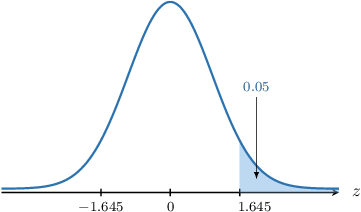
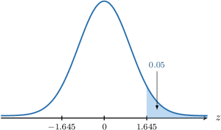
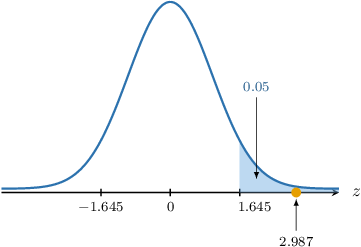

# Hypothesis Tests for Two Means: Known Population Variances

Source: https://www.mathacademy.com/topics/3310?courseId=73
Topic ID: 3310

## Prerequisites

- [Hypothesis Tests for One Mean: Known Population Variance](./3303-hypothesis-tests-for-one-mean-known-population-variance.md)

## Lesson

### Introduction

In this lesson, we'll learn how to use hypothesis tests to determine whether sample data show a statistically significant difference between two population means in cases where the population variances are known.

Suppose we have two normally distributed populations $X$ and $Y,$ where

$$

X\sim N(\mu_x, \sigma^2_x), \qquad Y\sim N(\mu_y, \sigma^2_y).

$$

If we conduct a random sample of size $n_x$ from the first population and a second, *independent* random sample of size $n_y$ from the second population, then we know that

$$

\overline{X}\sim N\left(\mu_x,\dfrac{\sigma_x^2}{n_x}\right), \qquad \overline{Y}\sim N\left(\mu_y,\dfrac{\sigma_y^2}{n_y}\right),

$$

where $\overline{X}$ and $\overline{Y}$ are the sample means.

Now, we know that the sum or difference of two independent normally distributed random variables is also normal. Moreover, using our usual results for subtracting means and variances, we have

$$

\overline{X} - \overline{Y} \sim N\left(\mu_x - \mu_y,\dfrac{\sigma_x^2}{n_x} + \dfrac{\sigma_y^2}{n_y} \right).

$$

This means that the random variable $Z,$ defined as

$$

Z = \dfrac{\overline{X} - \overline{Y}- (\mu_x - \mu_y)}{\sqrt{\dfrac{\sigma_x^2}{n_x} + \dfrac{\sigma_y^2}{n_y}}}

$$

follows a standard normal distribution $N(0,1).$

### Independent vs. Dependent Samples

Throughout this lesson, we assume that samples from two populations $X$ and $Y$ are **independent**. Two samples are independent if they are not directly related or connected. In particular:

- The selection or outcome of one sample does not influence the selection or outcome of the other.

- The individuals or data points within each sample are not paired or matched in any way, and there is no inherent relationship between the observations in the two groups.

Let's consider some examples.

**Example - Independent Samples**

A pharmaceutical company wants to test the effectiveness of a new drug for treating high blood pressure. So they recruit 100 participants with high blood pressure, 50 of whom are randomly assigned to receive the new drug (the treatment group) and 50 to receive a placebo (the control group). The blood pressure of participants in both groups is measured after a certain period.

In this case, the treatment and control groups represent independent samples, as the outcomes in one group are not influenced by the outcomes in the other group, and the participants are not paired or matched in any way.

**Example - Dependent Samples**

The pharmaceutical company wants to test the effectiveness of the high blood pressure drug. So they recruit 50 participants, all of whom have high blood pressure. First, each participant's blood pressure is measured before starting the drug treatment (baseline measurement). Then, all participants receive the new drug for a certain period, and their blood pressure is measured again after completing the treatment (post-treatment measurement).

In this case, the two samples (baseline and post-treatment measurements) represent dependent samples. This is because the samples are collected from the same group of participants at two different points in time, and each participant's post-treatment blood pressure is related to their baseline blood pressure.

### Describing the Null and Alternative Hypotheses

Let's now consider a concrete example.

A factory has two machines, machine $X$ and machine $Y,$ that independently produce table tennis balls. The diameters of the balls made by the machines are known to be normally distributed with standard deviations of $\sigma_x = 0.25\,\text{mm}$ and $\sigma_y = 0.3\,\text{mm},$ respectively.

Engineers want to know whether the population mean diameter $\mu_x$ of balls produced by machine $X$ is larger than the population mean diameter $\mu_y$ of balls made by machine $Y.$ They decide to conduct a hypothesis test at the $5\%$ significance level.

The engineers sampled $14$ balls produced by machine $X$ and $16$ balls made by machine $Y$ and found that their mean diameters are $40.2\,\text{mm}$ and $39.9,\text{mm},$ respectively. Is there sufficient evidence that $\mu_x > \mu_y$ based on data from this sample?

We are told that the populations are normally distributed, and the samples are independent. Therefore, the distribution of the difference of sample means is also normal, namely,

$$

\overline{X} - \overline{Y} \sim N\left( \mu_x-\mu_y, \dfrac{\sigma_x^2}{n_x} + \dfrac{\sigma_y^2}{n_y}\right),

$$

where

- $\overline{X}$ and $\overline{Y}$ are the sample means,

- $\mu_x$ and $\mu_y$ are the population means,

- $\sigma_x^2$ and $\sigma_y^2$ are the population variances, and

- $n_x$ and $n_y$ are the sample sizes.

Let's form our null and alternative hypotheses:

- $H_0: \mu_x = \mu_y$ is the null hypothesis

- $H_1: \mu_x > \mu_y$ is the alternative (one-tailed) hypothesis

Next, we'll compute the critical region. Remember that the critical region contains all $z$-values that are *collectively* unlikely under the null hypothesis and therefore cause the null hypothesis to be rejected.

To find the critical region for this test at the $\alpha = 5\%$ level of significance, we need to find a particular value $z_p$ of $Z$ such that

$$

P(Z\geq z_p) = \alpha = 0.05.

$$

To do this, we can use the following percentage points table.

From the table,

$$

P(Z > 1.645) = 0.05.

$$

So, we have that

- $z_{0.05} = 1.645$ is our critical value, and

- $Z\geq 1.645$ the critical region.

Now that we've established the critical region, let's compute the test statistic.

### Computing the Test Statistic

We have the following critical region at the $5\%$ significance level.

Also, we have the following sample data:

$$

\begin{aligned}\overset{𝑥}{} & =40.2,\, & \overset{𝑦}{–} & =39.9 \\ 𝑛_{𝑥} & =14,\, & 𝑛_{𝑦} & =16, \\ 𝜎_{𝑥} & =0.25,\, & 𝜎_{𝑦} & =0.3\end{aligned}

$$

Assuming the null hypothesis, i.e., $\mu_x=\mu_y,$ we compute our test statistic as follows:

$$

\begin{aligned}𝑧 & =\frac{\overset{𝑥}{}−\overset{𝑦}{–}−(𝜇_{𝑥}−𝜇_{𝑦})}{\sqrt{\frac{𝜎_{2𝑥}}{𝑛_{𝑥}}+\frac{𝜎_{2𝑦}}{𝑛_{𝑦}}}} \\ & =\frac{40.2−39.9−(0)}{\sqrt{\frac{0.25^{2}}{14}+\frac{0.3^{2}}{16}}} \\ & ≈2.987\end{aligned}

$$

Notice that our test statistic ($2.987$) lies in the critical region, as shown below.

Therefore, we conclude the following:

- If we assume $\mu_x=\mu_y$ (i.e., the null hypothesis is true), getting two samples where the means differ by $\overline{x}-\overline{y} = 0.3\,\text{mm}$ or more has a probability that is *smaller than* $0.05 = 5\%,$ our significance level.

- Therefore, we have a statistically significant result and reject the null hypothesis.

- In conclusion, there is *sufficient* evidence that, at the $5\%$ level of significance, we have $\mu_x \gt \mu_y.$

Let's now look at a situation where we must consider the left tail of the critical region.

### Example: Testing a Hypothesis Given Two Normal Populations: One-Tailed Tests

#### Question

Consider two independent samples of sizes $n_x=35$ and $n_y=15$ from normal populations $X$ and $Y$ with standard deviations $\sigma_x=2$ and $\sigma_y=3,$ respectively. We wish to carry out the hypothesis test at the $5\%$ significance level to determine whether there is sufficient evidence that the population mean $\mu_x$ of $X$ is smaller than the population mean $\mu_y$ of $Y.$

Given that the sample means are $\overline{x}=6$ and $\overline{y}=7,$ which of the following statements are true?

1. The $5\%$ **** critical region for the test statistic is approximately $Z \le -1.960$

2. At the $5\%$ level of significance, there is **** evidence that $\mu_x \lt \mu_y$

3. At the $5\%$ level of significance, there is **** evidence that $\mu_x \lt \mu_y$

**

#### Explanation

We are told that the populations are normally distributed and the samples are independent. Therefore, the distribution of the difference of sample means is also normal, namely,

$$

\overline{X} - \overline{Y} \sim N\left( \mu_x-\mu_y, \dfrac{\sigma_x^2}{n_x} + \dfrac{\sigma_y^2}{n_y}\right),

$$

and we have that

$$

\dfrac{\overline{X} - \overline{Y}- (\mu_x - \mu_y)}{\sqrt{\dfrac{\sigma_x^2}{n_x} + \dfrac{\sigma_y^2}{n_y}}} \sim N(0,1),

$$

where

- $\overline{X}$ and $\overline{Y}$ are the sample means,

- $\mu_x$ and $\mu_y$ are the population means,

- $\sigma_x^2$ and $\sigma_y^2$ are the population variances, and

- $n_x$ and $n_y$ are the sample sizes.

In our example:

- $H_0: \mu_x = \mu_y$ is the null hypothesis

- $H_1: \mu_x < \mu_y$ is the alternative (one-tailed) hypothesis

Assuming the null hypothesis, i.e., $\mu_x-\mu_y=0,$ we compute the test statistic:

$$

\begin{aligned}𝑧 & =\frac{\overset{𝑥}{}−\overset{𝑦}{–}−(𝜇_{𝑥}−𝜇_{𝑦})}{\sqrt{\frac{𝜎_{2𝑥}}{𝑛_{𝑥}}+\frac{𝜎_{2𝑦}}{𝑛_{𝑦}}}} \\ & =\frac{6−7−(0)}{\sqrt{\frac{2^{2}}{35}+\frac{3^{2}}{15}}} \\ & ≈−1.183\end{aligned}

$$

Let's now examine our statements.

- Statement I is false. According to the table, the $5\%$ one-tailed critical value is $z \approx 1.645.$ $p$ $0.100$ $0.050$ $0.025$ $0.010$ $0.005$ $z_p$ $1.282$ $\color{blue} 1.645$ $1.960$ $2.326$ $2.576$ However, since the alternative hypothesis is $\mu_x \lt \mu_y,$ we must consider the left tail. We do this using the symmetry of the normal distribution. So, our critical region is

- Statement II is true, while statement III is false. Our test statistic ($-1.183$) does not lie in the critical region, as shown below. So, we do not reject the null hypothesis $H_0.$ As a result, we conclude the following: $\qquad$ **

Therefore, the correct answer is "II only."

### Example: Testing a Hypothesis Given Two Normal Populations: Two-Tailed Tests

#### Question

Consider two independent samples of sizes $n_x=12$ and $n_y=15$ from normal populations $X$ and $Y$ with standard deviations $\sigma_x=2$ and $\sigma_y=4,$ respectively. We wish to carry out a hypothesis test at the $10\%$ significance level to determine whether there is sufficient evidence that the population mean $\mu_x$ of $X$ is not equal to the population mean $\mu_y$ of $Y.$

Given that the sample means are $\overline{x}=25$ and $\overline{y}=24,$ which of the following statements are true?

1. The $10\%$ **** critical region for the test statistic is approximately $Z \le -1.645$ or $Z\ge 1.645$

2. At the $10\%$ level of significance, there is **** evidence that $\mu_x \neq \mu_y$

3. At the $10\%$ level of significance, there is **** evidence that $\mu_x \neq \mu_y$

**

#### Explanation

We are told that the populations are normally distributed and the samples are independent. Therefore, the distribution of the difference of sample means is also normal, namely,

$$

\overline{X} - \overline{Y} \sim N\left( \mu_x-\mu_y, \dfrac{\sigma_x^2}{n_x} + \dfrac{\sigma_y^2}{n_y}\right),

$$

and we have that

$$

\dfrac{\overline{X} - \overline{Y}- (\mu_x - \mu_y)}{\sqrt{\dfrac{\sigma_x^2}{n_x} + \dfrac{\sigma_y^2}{n_y}}} \sim N(0,1),

$$

where

- $\overline{X}$ and $\overline{Y}$ are the sample means,

- $\mu_x$ and $\mu_y$ are the population means,

- $\sigma_x^2$ and $\sigma_y^2$ are the population variances, and

- $n_x$ and $n_y$ are the sample sizes.

In our example:

- $H_0: \mu_x = \mu_y$ is the null hypothesis

- $H_1: \mu_x \neq \mu_y$ is the alternative (two-tailed) hypothesis

Assuming the null hypothesis, i.e., $\mu_x-\mu_y=0,$ we compute the test statistic:

$$

\begin{aligned}𝑧 & =\frac{\overset{𝑥}{}−\overset{𝑦}{–}−(𝜇_{𝑥}−𝜇_{𝑦})}{\sqrt{\frac{𝜎_{2𝑥}}{𝑛_{𝑥}}+\frac{𝜎_{2𝑦}}{𝑛_{𝑦}}}} \\ & =\frac{25−24−(0)}{\sqrt{\frac{2^{2}}{12}+\frac{4^{2}}{15}}} \\ & ≈0.845\end{aligned}

$$

Let's now examine our statements.

- Statement I is true. According to the table, the $10\%$ ** critical value (the same as the $10\% \div 2 = 5\%$ ** critical value) is $z \approx 1.645.$ $p$ $0.100$ $0.050$ $0.025$ $0.010$ $0.005$ $z_p$ $1.282$ $\color{blue}1.645$ $1.960$ $2.326$ $2.576$ Since we are considering both tails, our critical region is

- Statement II is true, while statement III is false. Our test statistic ($0.845$) does not lie in the critical region, as shown below. So, we don't reject the null hypothesis $H_0.$ As a result, we conclude the following: $\qquad$ **

Therefore, the correct answer is "I and II only."

### Large Samples

Up to now, we've assumed that the underlying populations are normally distributed. However, if both samples are *sufficiently large,* then according to the central limit theorem, we can use the approximation

$$

\dfrac{\overline{X} - \overline{Y}- (\mu_x - \mu_y)}{\sqrt{\dfrac{\sigma_x^2}{n_x} + \dfrac{\sigma_y^2}{n_y}}} \approx N(0,1).

$$

Typically, "sufficiently large" means that $n_x \geq 30$ *and* $n_y\geq 30.$

So, even though we might not know the underlying distribution, we can still use the following formula for the test statistic:

$$

z = \dfrac{\overline{x} - \overline{y}- (\mu_x - \mu_y)}{\sqrt{\dfrac{\sigma_x^2}{n_x} + \dfrac{\sigma_y^2}{n_y}}}

$$

### Example: Testing a Hypothesis Given Two Large Samples

#### Question

Consider two independent samples of sizes $n_x = 82$ and $n_y = 71$ from populations $X$ and $Y$ with standard deviations $\sigma_x = 12$ and $\sigma_y = 9,$ respectively. We wish to carry out the hypothesis test at the $5 \%$ significance level to determine whether there is sufficient evidence that the population mean $\mu_x$ of $X$ is smaller than the population mean $\mu_y$ of $Y.$

Given that the sample means are $\overline{x}=12$ and $\overline{y}=17,$ which of the following statements are true?

1. The $5\%$ critical region for the test statistic is approximately $Z \le -1.645$

2. At the $5\%$ level of significance, there is **** evidence that $\mu_x \lt \mu_y$

3. At the $5\%$ level of significance, there is **** evidence that $\mu_x \lt \mu_y$

**

#### Explanation

We do not know the distribution of the population. However, the samples are independent, and the sample sizes $n_x = 82 \geq 30$ and $n_y = 71 \geq 30$ are **. Therefore, according to the central limit theorem, we may use the following approximation:

$$

\overline{X} - \overline{Y} \sim N\left( \mu_x-\mu_y, \dfrac{\sigma_x^2}{n_x} + \dfrac{\sigma_y^2}{n_y}\right),

$$

and we have that

$$

\dfrac{\overline{X} - \overline{Y}- (\mu_x - \mu_y)}{\sqrt{\dfrac{\sigma_x^2}{n_x} + \dfrac{\sigma_y^2}{n_y}}} \sim N(0,1),

$$

where

- $\overline{X}$ and $\overline{Y}$ are the sample means,

- $\mu_x$ and $\mu_y$ are the population means,

- $\sigma_x^2$ and $\sigma_y^2$ are the population variances, and

- $n_x$ and $n_y$ are the sample sizes.

In our example:

- $H_0: \mu_x = \mu_y$ is the null hypothesis

- $H_1: \mu_x < \mu_y$ is the alternative (one-tailed) hypothesis

Assuming the null hypothesis, i.e., $\mu_x-\mu_y = 0,$ we compute the test statistic:

$$

\begin{aligned}𝑧 & =\frac{\overset{𝑥}{}−\overset{𝑦}{–}−(𝜇_{𝑥}−𝜇_{𝑦})}{\sqrt{\frac{𝜎_{2𝑥}}{𝑛_{𝑥}}+\frac{𝜎_{2𝑦}}{𝑛_{𝑦}}}} \\ & =\frac{12−17−(0)}{\sqrt{\frac{12^{2}}{82}+\frac{9^{2}}{71}}} \\ & ≈−2.938\end{aligned}

$$

Let's now examine our statements.

- Statement I is true. According to the table, the $5 \%$ one-tailed critical value is $z \approx 1.645.$ $p$ $0.100$ $0.050$ $0.025$ $0.010$ $0.005$ $z_p$ $1.282$ $\color{blue}1.645$ $1.960$ $2.326$ $2.576$ However, since the alternative hypothesis is $\mu_x \lt \mu_y$, we must consider the left tail. We do this using the symmetry of the normal distribution. So, our critical region is

- Statement II is false, while statement III is true. Our test statistic ($-2.938$) lies in the critical region, as shown below. So, we reject the null hypothesis $H_0.$ As a result, we conclude the following: $\qquad$ **

Therefore, the correct answer is "I and III only."

### Example: Applications of Hypothesis Testing

#### Question

Previous studies show that the scores of men and women on a particular test have standard deviations of $17$ points and $14$ points, respectively. Scientists want to determine whether the population mean $\mu_x$ for men is the same as the population mean $\mu_y$ for women. They decide to conduct a hypothesis test at the $10\%$ significance level.

Given that the scientists sampled $150$ men and $125$ women and found that their mean scores on the test are $99.7$ points and $101.2$ points, respectively, which of the following statements are true?

1. The $10\%$ critical region for the test statistic is approximately $Z \le -1.645$ or $Z \ge 1.645$

2. At the $10\%$ level of significance, there is **** evidence that $\mu_x \neq \mu_y$

3. At the $10\%$ level of significance, there is **** evidence that $\mu_x \neq \mu_y$

**

#### Explanation

We do not know the distribution of the population. However, the samples are independent, and the sample sizes $n_x = 150 \geq 30$ and $n_y = 125 \geq 30$ are **. Therefore, according to the central limit theorem, we may use the following approximation:

$$

\overline{X} - \overline{Y} \sim N\left( \mu_x-\mu_y, \dfrac{\sigma_x^2}{n_x} + \dfrac{\sigma_y^2}{n_y}\right),

$$

and we have that

$$

\dfrac{\overline{X} - \overline{Y}- (\mu_x - \mu_y)}{\sqrt{\dfrac{\sigma_x^2}{n_x} + \dfrac{\sigma_y^2}{n_y}}} \sim N(0,1),

$$

where

- $\overline{X}$ and $\overline{Y}$ are the sample means,

- $\mu_x$ and $\mu_y$ are the population means,

- $\sigma_x^2$ and $\sigma_y^2$ are the population variances, and

- $n_x$ and $n_y$ are the sample sizes.

In our example:

- $H_0: \mu_x = \mu_y$ is the null hypothesis

- $H_1: \mu_x \neq \mu_y$ is the alternative (two-tailed) hypothesis

Also, we have

$$

\overline{x} =99.7, \quad \overline{y} = 101.2, \quad n_x = 150, \quad n_y = 125, \quad \sigma_x = 17, \quad \sigma_y = 14.

$$

Assuming the null hypothesis, i.e., $\mu_x-\mu_y=0,$ we compute the test statistic:

$$

\begin{aligned}𝑧 & =\frac{\overset{𝑥}{}−\overset{𝑦}{–}−(𝜇_{𝑥}−𝜇_{𝑦})}{\sqrt{\frac{𝜎_{2𝑥}}{𝑛_{𝑥}}+\frac{𝜎_{2𝑦}}{𝑛_{𝑦}}}} \\ & =\frac{99.7−101.2−(0)}{\sqrt{\frac{17^{2}}{150}+\frac{14^{2}}{125}}} \\ & ≈−0.802\end{aligned}

$$

Let's now examine our statements.

- Statement I is true. According to the table, the $10\%$ ** critical value (the same as the $10\% \div 2 = 5\%$ ** critical value) for the $z$-score is $z \approx 1.645.$ $p$ $0.100$ $0.050$ $0.025$ $0.010$ $0.005$ $z_p$ $1.282$ $\color{blue}1.645$ $1.960$ $2.326$ $2.576$ Since we are considering both tails, our critical region is

- Statement II is true, while statement III is false. Our test statistic ($-0.802$) does not lie in the critical region, as shown below. So, we can't reject the null hypothesis $H_0.$ As a result, we conclude the following: $\qquad$ **

Therefore, the correct answer is "I and II only."
