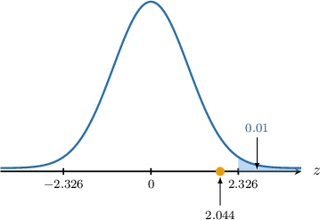
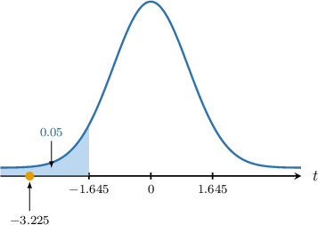
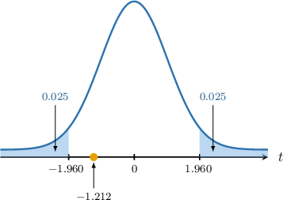
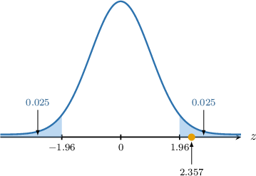

# Hypothesis Tests for Two Means: Paired-Sample Z-Test

Source: https://www.mathacademy.com/topics/3312?courseId=73
Topic ID: 3312

## Prerequisites

- [Hypothesis Tests for Two Means: Known Population Variances](./3310-hypothesis-tests-for-two-means-known-population-variances.md)

## Lesson

### Introduction

Suppose an athletics coach wishes to determine the effect of a new dietary supplement on athletes' $100\,\textrm m$ sprinting performance.

A sample of $n = 100$ athletes is taken, yielding two data sets:

$$

\big\{x_1,x_2,\ldots,x_{100}\big\}, \qquad \big\{y_1,y_2,\ldots,y_{100}\big\}

$$

These data sets are *dependent* because each pair $(x_i, y_i)$ is collected from the *same athlete*. For this reason, we call this a **paired sample**.

Let's define the following variables:

- $X_i$ is the sprint completion time (in seconds) of the $i$th athlete before they begin taking the supplement.

- $Y_i$ is the sprint completion time (in seconds) of the $i$th athlete after they begin taking the supplement.

- $\textrm E[X_i] = \mu_x$ is the (population) sprint time before taking the supplement.

- $\textrm E[Y_i] = \mu_y$ is the (population) sprint time after taking the supplement.

In a previous lesson, we learned how to conduct a hypothesis test for the difference $\mu_x - \mu_y,$ the difference between two *independent* samples. However, these techniques cannot be applied here since our samples are dependent. So, how do we compare these two samples? The answer lies in analyzing the differences.

Instead of working with two datasets, we compute the difference for each pair:

$$

D_i = X_i - Y_i

$$

By reducing the problem to a single dataset of differences, we can analyze the distribution of $D_i$ to draw inferences about the mean difference between the sprint times before and after taking the supplement.

Let's assume that the set $D_1, D_2, \ldots D_n$ are independent and identically distributed (I.I.D). Then, we have two possible cases:

- Suppose we run some tests, and it's confirmed that $D_i$ is normally distributed. Then, the distribution of the sample mean $\overline D$ is given by where $\mu$ is the population mean of $D_i,$ and $\sigma^2$ is the population variance of $D_i.$

- If $D_i$ is not normally distributed but the sample size is large, then by the central limit theorem,

We can use one-sample procedures to test a hypothesis for $\mu,$ the mean difference between pre- and post-treatment sprint times in both cases.

Let's take a look at a concrete example.

### A Worked Example

Consider a sample $x_1, x_2, x_3, x_4, x_5$ from a random variable $X,$ and a sample $y_1, y_2, y_3, y_4, y_5$ from a random variable $Y,$ shown in the table above. Given that the two samples are paired and $D=X-Y$ is normally distributed with mean $\mu$ and variance $\sigma^2 = (3.5)^2,$ we wish to carry out a hypothesis test at the $1\%$ significance level to determine whether there is sufficient evidence that $\mu \gt 0.$

Recall that if

$$

D \sim N(\mu, \sigma^2),

$$

then

$$

\overline{D} \sim N\left(\mu, \dfrac{\sigma^2}{n}\right),

$$

where

- $\overline{D}$ is the sample mean of the differences,

- $\mu$ is the population mean of $D,$

- $\sigma^2$ is the population variance of $D,$ and

- $n$ is the sample size.

As a result, we may use a normal approximation:

$$

\dfrac {\overline{D} - \mu}{\sigma / \sqrt{n}} \sim N(0,1)

$$

We also have the following point estimate for $\mu{:}$

$$

\overline{d}=\overline{x}-\overline{y} = \dfrac1n\sum_{i} d_i

$$

In our example, the null and alternative hypotheses are the following:

- $H_0: \mu = 0$ is the null hypothesis

- $H_1: \mu > 0$ is the alternative (one-tailed) hypothesis

First, we compute the differences in the paired observations:

Then, we find a point estimate for $\mu{:}$

$$

\overline{d} = \dfrac{2+3+4+5+2}{5} = 3.2

$$

Assuming the null hypothesis, i.e., $\mu=0,$ we compute the test statistic:

$$

\begin{aligned}𝑧 & =\frac{\overset{𝑑}{–}−𝜇}{𝜎/\sqrt{𝑛}} \\ & =\frac{3.2−0}{3.5/\sqrt{5}} \\ & ≈2.044\end{aligned}

$$

Next, we determine the critical region corresponding to our significance level.

The table below shows the $z$-scores $z_p$ such that $P(Z > z_p) = p$ for some particular values of $p,$ where $Z\sim N(0,1).$

According to the table, the $1\%$ one-tailed critical value is $z \approx 2.326.$ Since the alternative hypothesis is $\mu \gt 0,$ we must consider the right tail. So, our critical region is

$$

Z \geq \boxed{\color{blue}2.326}.

$$

Finally, notice that our test statistic ($2.044$) lies outside the critical region, as shown below.

So, we do not reject the null hypothesis $H_0.$ As a result, we conclude that there is $\boxed{\color{blue}\text{insufficient}}$ evidence that, at the $1\%$ level of significance, we have $\mu \gt 0.$

Let's take a look at an example involving a large sample.

### Example: Hypothesis Tests for Means of Paired-Samples: One-Tailed Tests

#### Question

Consider two paired samples of size $n=65$ from the random variables $X$ and $Y.$ Given that the means for these samples are $\overline{x} = 16$ and $\overline{y} = 17,$ respectively, and the population variance of $D=X-Y$ is $\sigma^2 = (2.5)^2,$ carry out a hypothesis test at the $5\%$ significance level to determine whether there is sufficient evidence that $\mu \lt 0,$ where $\mu$ is the population mean of $D.$

The table below shows the $z$-scores $z_p$ such that $P(Z > z_p) = p$ for some particular values of $p,$ where $Z\sim N(0,1).$

#### Explanation

We do not know the distribution of the difference $D.$ However, the sample size $n = 65\geq 30$ is **. Therefore, according to the central limit theorem, we may use the following approximation:

$$

\overline{D} \sim N\left(\mu, \dfrac{\sigma^2}{n}\right),

$$

where

- $\overline{D}$ is the sample mean,

- $\mu$ is the population mean of $D$,

- $\sigma^2$ is the population variance of $D,$ and

- $n$ is the sample size.

As a result, we may use a normal approximation:

$$

\dfrac {\overline{D} - \mu}{\sigma/ \sqrt{n}} \sim N(0,1)

$$

We also have the following point estimate for $\mu{:}$

$$

\overline{d}=\overline{x}-\overline{y}

$$

In our example:

- $H_0: \mu = 0$ is the null hypothesis

- $H_1: \mu < 0$ is the alternative (one-tailed) hypothesis

First, we find a point estimate for $\mu{:}$

$$

\overline{d} = \overline{x} - \overline{y} = 16 - 17 = -1

$$

Assuming the null hypothesis, i.e., $\mu=0,$ we compute the test statistic:

$$

\begin{aligned}𝑧 & =\frac{\overset{𝑑}{–}−𝜇}{𝜎/\sqrt{𝑛}} \\ & =\frac{−1−0}{2.5/\sqrt{65}} \\ & ≈−3.225\end{aligned}

$$

According to the table, the $5\%$ one-tailed critical value is $z \approx 1.645.$

Since the alternative hypothesis is $\mu \lt 0,$ we must consider the left tail. So, our critical region is

$$

Z \leq \boxed{\color{blue}-1.645}.

$$

Our test statistic ($-3.225$) lies in the critical region, as shown below.

So, we reject the null hypothesis $H_0.$ As a result, we conclude the following:

$\qquad$ There is $\boxed{\color{blue}\text{sufficient}}$ evidence that, at the $5\%$ level of significance, we have $\mu \lt 0.$

### Example: Hypothesis Tests for Means of Paired-Samples: Two-Tailed Tests

#### Question

Consider two paired samples of size $n=49$ from the random variables $X$ and $Y.$ Given that the means for these samples are $\overline{x} = 14.4$ and $\overline{y} = 14.85,$ respectively, and the population variance of $D=X-Y$ is $\sigma^2 = (2.6)^2,$ carry out a hypothesis test at the $5\%$ significance level to determine whether there is sufficient evidence that $\mu \neq 0,$ where $\mu$ is the population mean of $D.$

The table below shows the $z$-scores $z_p$ such that $P(Z > z_p) = p$ for some particular values of $p,$ where $Z\sim N(0,1).$

#### Explanation

We do not know the distribution of the difference $D.$ However, the sample size $n = 49\geq 30$ is **. Therefore, according to the central limit theorem, we may use the following approximation:

$$

\overline{D} \sim N\left(\mu, \dfrac{\sigma^2}{n}\right),

$$

where

- $\overline{D}$ is the sample mean,

- $\mu$ is the population mean of $D,$

- $\sigma^2$ is the population variance of $D,$ and

- $n$ is the sample size.

As a result, we may use a normal approximation:

$$

\dfrac {\overline{D} - \mu}{\sigma/ \sqrt{n}} \sim N(0,1)

$$

We also have the following point estimate for $\mu{:}$

$$

\overline{d}=\overline{x}-\overline{y}

$$

In our example:

- $H_0: \mu = 0$ is the null hypothesis

- $H_1: \mu \neq 0$ is the alternative (two-tailed) hypothesis

First, we find a point estimate for $\mu{:}$

$$

\overline{d} = \overline{x} - \overline{y} = 14.4 - 14.85 = -0.45

$$

Assuming the null hypothesis, i.e., $\mu=0,$ we compute the test statistic:

$$

\begin{aligned}𝑧 & =\frac{\overset{𝑑}{–}−𝜇}{𝜎/\sqrt{𝑛}} \\ & =\frac{−0.45−0}{2.6/\sqrt{49}} \\ & ≈−1.212\end{aligned}

$$

According to the table, the $5\%$ two-tailed critical value (the same as the $5\% \div 2 = 2.5\%$ one-tailed critical value) is $z \approx 1.960.$

Since we are considering both tails, our critical region is

$$

Z \leq \boxed{\color{blue}-1.960} \qquad \text{or} \qquad Z \geq \boxed{\color{blue}1.960}.

$$

Our test statistic ($-1.212$) lies outside the critical region, as shown below.

So, we do not reject the null hypothesis $H_0.$ As a result, we conclude the following:

$\qquad$ There is $\boxed{\color{blue}\text{insufficient}}$ evidence that, at the $5\%$ level of significance, we have $\mu \neq 0.$

### Example: Hypothesis Tests for Means of Paired-Samples: Applications

#### Question

A company psychologist measured the anxiety levels of a group of $42$ employees before and after they participated in an anxiety treatment program. The levels are recorded on a scale from $1$ to $10.$ The observations' results show that the mean anxiety score before the treatment program is $7.2,$ and the mean score after the treatment program is $6.8.$ It is known that the population variance of the differences between the scores before and after the treatment is $\sigma^2 = (1.1)^2.$

Carry out a hypothesis test at the $5\%$ significance level to determine whether there is sufficient evidence that the anxiety levels after participating in the anxiety treatment program are different.

The table below shows the $z$-scores $z_p$ such that $P(Z > z_p) = p$ for some particular values of $p,$ where $Z\sim N(0,1).$

#### Explanation

Let $X$ be the anxiety level of a randomly selected employee before the anxiety treatment program, and let $Y$ be the anxiety level of the same employee after the anxiety treatment program.

We do not know the distribution of the difference $D = X-Y.$ However, the sample size $n =42\geq 30$ is **. Therefore, according to the central limit theorem, we may use the following approximation:

$$

\overline{D} \sim N\left(\mu, \dfrac{\sigma^2}{n}\right),

$$

where

- $\overline{D}$ is the sample mean,

- $\mu$ is the population mean of $D,$

- $\sigma^2$ is the population variance of $D,$ and

- $n$ is the sample size.

As a result, we may use a normal approximation:

$$

\dfrac {\overline{D} - \mu}{\sigma/ \sqrt{n}} \sim N(0,1)

$$

We also have the following point estimate for $\mu{:}$

$$

\overline{d}=\overline{x}-\overline{y}

$$

where $\overline{x}$ is the sample's mean before the anxiety treatment, and $\overline{y}$ is the sample's mean after the treatment.

In our example:

- $H_0: \mu = 0$ is the null hypothesis (the anxiety level remains the same)

- $H_1: \mu \neq 0$ is the alternative (two-tailed) hypothesis (the anxiety levels after participating in the anxiety treatment program are different)

First, we find a point estimate for $\mu{:}$

$$

\overline{d} = \overline{x} - \overline{y} =7.2 - 6.8= 0.4

$$

Assuming the null hypothesis, i.e., $\mu=0,$ we compute the test statistic:

$$

\begin{aligned}𝑧 & =\frac{\overset{𝑑}{–}−𝜇}{𝜎/\sqrt{𝑛}} \\ & =\frac{0.4}{1.1/\sqrt{42}} \\ & ≈2.357\end{aligned}

$$

According to the table, the $5\%$ two-tailed critical value (the same as the $5\% \div 2 = 2.5\%$ one-tailed critical value) is $z \approx 1.960.$

Since the alternative hypothesis is $\mu \neq 0,$ we must consider the two tails. So, our critical region is

$$

Z \leq \boxed{\color{blue}-1.960} \qquad \text{or} \qquad Z \geq \boxed{\color{blue}1.960}.

$$

Our test statistic ($2.357$) lies in the critical region, as shown below.

At the $5\%$ level of significance, there is $\boxed{\color{blue}\text{sufficient}}$ evidence that the anxiety levels before and after participating in the anxiety treatment program are different.
