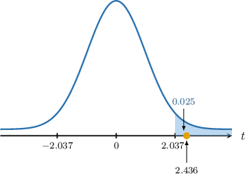

# Hypothesis Tests for Two Means: Equal But Unknown Population Variances

Source: https://www.mathacademy.com/topics/3313?courseId=73
Topic ID: 3313

## Prerequisites

- [Hypothesis Tests for Two Means: Known Population Variances](./3310-hypothesis-tests-for-two-means-known-population-variances.md)
- [Hypothesis Tests for One Mean: Unknown Population Variance](./3311-hypothesis-tests-for-one-mean-unknown-population-variance.md)
- [Pooled Variance](./4117-pooled-variance.md)

## Lesson

### Introduction

In this lesson, we'll learn how to conduct hypothesis tests for the difference between two population means when the population variances are *unknown* yet assumed to be *equal*.

Suppose we have two normally distributed populations, $X$ and $Y,$ with means $\mu_x$ and $\mu_y,$ respectively. Furthermore, we assume that both populations share the same unknown variance $\sigma^2.$

$$

X\sim N(\mu_x, \sigma^2), \qquad Y\sim N(\mu_y, \sigma^2)

$$

If we conduct a random sample of size $n_x$ from the first population and a second, *independent* random sample of size $n_y$ from the second population, then we know that

$$

\overline{X}\sim N\left(\mu_x,\dfrac{\sigma^2}{n_x}\right), \qquad \overline{Y}\sim N\left(\mu_y,\dfrac{\sigma^2}{n_y}\right),

$$

where $\overline{X}$ and $\overline{Y}$ are the sample means.

Now, we know that the sum or difference of two independent normally distributed random variables is also normal. Moreover, using our usual results for subtracting means and variances, we have

$$

\overline{X} - \overline{Y} \sim N\left(\mu_x - \mu_y, \sigma^2\left(\dfrac{1}{n_x} + \dfrac{1}{n_y}\right)\right).

$$

Since the variance $\sigma^2$ is unknown, we must replace it with a suitable estimate. In this case, we can use a pooled estimate of the variance.

$$

S_p^2 = \dfrac{(n_x-1)S_x^2 + (n_y-1)S_y^2}{n_x+n_y -2}

$$

This means that the random variable $T,$ defined as

$$

T = \frac{(\overline{X} - \overline{Y}) - (\mu_x - \mu_y)}{S_p\sqrt{\dfrac{1}{n_x} + \dfrac{1}{n_y}}}

$$

follows a $t$-distribution with $\nu = n_x +n_y -2$ degrees of freedom.

### A Worked Example

Consider two samples of sizes $n_x=16$ and $n_y=18$ from independent normal populations $X$ and $Y$ with equal population variance, where the sample means are $\overline{x}=15.2$ and $\overline{y}=13.5,$ and the sample standard deviations are $s_x=1.75$ and $s_y=2.25.$

We wish to carry out a hypothesis test at the $2.5\%$ significance level to determine whether there is sufficient evidence that the population mean $\mu_x$ of $X$ is larger than the population mean $\mu_y$ of $Y.$

To solve a problem like this, we proceed as follows.

We are told that the populations are normally distributed and their variances are equal, but we do not know the population variance $\sigma^2.$

In cases like this, the random variable

$$

\dfrac{\overline{X} - \overline{Y}- (\mu_x - \mu_y)}{S_p \sqrt{\dfrac{1}{n_x} + \dfrac{1}{n_y}}}

$$

follows a student's $t$-distribution $T_\nu$ with $\nu=n_x+n_y-2$ degrees of freedom, where

- $\overline{X}$ and $\overline{Y}$ are the sample means,

- $\mu_x$ and $\mu_y$ are the population means,

- $n_x$ and $n_y$ are the sample sizes,

- $S_x^2$ and $S_y^2$ are the sample variance, and

- $S_p^2 = \dfrac{(n_x-1)S_x^2+(n_y-1)S_y^2}{n_x+n_y-2}$ is the pooled estimate of the variance.

In our example, the null and alternative hypotheses are the following:

- $H_0: \mu_x = \mu_y$ is the null hypothesis

- $H_1: \mu_x \gt \mu_y$ is the alternative (one-tailed) hypothesis

First, let's compute the number of degrees of freedom and the pooled estimate of the variance for our samples:

$$

\begin{aligned}𝜈 & =16+18−2=32 \\ 𝑆_{2𝑝}^{} & =\frac{(16−1)(1.75)^{2}+(18−1)(2.25)^{2}}{16+18−2}=\frac{33}{8}\end{aligned}

$$

Assuming the null hypothesis, i.e., $\mu_x-\mu_y=0,$ we compute the test statistic:

$$

\begin{aligned}𝑡 & =\frac{\overset{𝑥}{}−\overset{𝑦}{–}−(𝜇_{𝑥}−𝜇_{𝑦})}{𝑆_{𝑝}\sqrt{√\frac{1}{𝑛_{𝑥}}+\frac{1}{𝑛_{𝑦}}}} \\ & =\frac{15.2−13.5−(0)}{\sqrt{√\frac{33}{8}}⋅\sqrt{√\frac{1}{16}+\frac{1}{18}}} \\ & ≈2.436\end{aligned}

$$

Next, we determine the critical region corresponding to our significance level.

Given a random variable $T$ that has a student's $t$-distribution $T_k$ with $k$ degrees of freedom, the table below shows the $t$-scores $t_{k,p}$ such that $P(T > t_{k,p}) = p$ for some particular values of $k$ and $p.$

According to the table, the $2.5\%$ one-tailed critical value for $\nu=32$ degrees of freedom is $t \approx 2.037.$ Since the alternative hypothesis is $\mu_x \gt \mu_y,$ we must consider the right tail. So, our critical region is

$$

T \geq 2.037.

$$

Finally, notice that our test statistic ($2.436$) lies in the critical region, as shown below.

So, we reject the null hypothesis $H_0.$ As a result, we conclude that there is *sufficient* evidence that, at the $2.5\%$ level of significance, we have $\mu_x \gt \mu_y.$

### Example: Testing a Hypothesis Given Normal Populations: One-Tailed Tests

#### Question

Consider two samples of sizes $n_x=23$ and $n_y=17$ from independent normal populations $X$ and $Y$ with equal population variance. We wish to carry out a hypothesis test at the $1\%$ significance level to determine whether there is sufficient evidence that the population mean $\mu_x$ of $X$ is smaller than the population mean $\mu_y$ of $Y.$

Given that the sample means are $\overline{x}=4.4$ and $\overline{y}=5.6,$ and the sample standard deviations are $s_x=2$ and $s_y=2.5,$ which of the following statements are true?

1. The $1\%$ **** critical region for the test statistic is approximately $T \le -2.429$

2. At the $1\%$ level of significance, there is **** evidence that $\mu_x \lt \mu_y$

3. At the $1\%$ level of significance, there is **** evidence that $\mu_x \lt \mu_y$

**

#### Explanation

We are told that the populations are normally distributed and their variances are equal, but we do not know the population variance $\sigma^2.$

In cases like this, the random variable

$$

\dfrac{\overline{X} - \overline{Y}- (\mu_x - \mu_y)}{S_p \sqrt{\dfrac{1}{n_x} + \dfrac{1}{n_y}}}

$$

follows a student's $t$-distribution $T_\nu$ with $\nu=n_x+n_y-2$ degrees of freedom, where

- $\overline{X}$ and $\overline{Y}$ are the sample means,

- $\mu_x$ and $\mu_y$ are the population means,

- $n_x$ and $n_y$ are the sample sizes,

- $S_x^2$ and $S_y^2$ are the sample variance, and

- $S_p^2 = \dfrac{(n_x-1)S_x^2+(n_y-1)S_y^2}{n_x+n_y-2}$ is the pooled estimate of the variance.

In our example:

- $H_0: \mu_x = \mu_y$ is the null hypothesis

- $H_1: \mu_x \lt \mu_y$ is the alternative (one-tailed) hypothesis

First, let's compute the number of degrees of freedom and the pooled estimate of the variance for our samples:

$$

\begin{aligned}𝜈 & =23+17−2=38 \\ 𝑆_{2𝑝}^{} & =\frac{(23−1)(2)^{2}+(17−1)(2.5)^{2}}{23+17−2}=\frac{188}{38}\end{aligned}

$$

Assuming the null hypothesis, i.e., $\mu_x-\mu_y=0,$ we compute the test statistic:

$$

\begin{aligned}𝑡 & =\frac{\overset{𝑥}{}−\overset{𝑦}{–}−(𝜇_{𝑥}−𝜇_{𝑦})}{𝑆_{𝑝}\sqrt{√\frac{1}{𝑛_{𝑥}}+\frac{1}{𝑛_{𝑦}}}} \\ & =\frac{4.4−5.6−(0)}{\sqrt{√\frac{188}{38}}⋅\sqrt{√\frac{1}{23}+\frac{1}{17}}} \\ & ≈−1.687\end{aligned}

$$

Let's now examine our statements.

- Statement I is true. According to the table, the $1\%$ one-tailed critical value for $\nu=38$ degrees of freedom is $t \approx 2.429.$ $k \setminus p$ $0.100$ $0.050$ $0.025$ $0.010$ $0.005$ $37$ $\,1.305\,$ $\,1.687\,$ $\,2.026\,$ $\,2.431\,$ $\,2.715\,$ $38$ $\,1.304\,$ $\,1.686\,$ $\,2.024\,$ $\color{blue}\,2.429\,$ $\,2.712\,$ $39$ $\,1.304\,$ $\,1.685\,$ $\,2.023\,$ $\,2.426\,$ $\,2.708\,$ However, since the alternative hypothesis is $\mu_x \lt \mu_y,$ we must consider the left tail. We do this using the symmetry of the $t$-distribution. So, our critical region is

- Statement II is true, while statement III is false. Our test statistic ($-1.687$) does not lie in the critical region, as shown below. So, we don't reject the null hypothesis $H_0.$ As a result, we conclude the following:

**

Therefore, the correct answer is "I and II only."

### Example: Testing a Hypothesis Given Normal Populations: Two-Tailed Tests

#### Question

Consider two samples of sizes $n_x=12$ and $n_y=15$ from independent normal populations $X$ and $Y$ with equal population variances. We wish to carry out a hypothesis test at the $10\%$ significance level to determine whether there is sufficient evidence that the population mean $\mu_x$ of $X$ is not equal to the population mean $\mu_y$ of $Y.$

Given that the sample means are $\overline{x}=-1$ and $\overline{y}=1,$ and the sample standard deviations are $s_x=2$ and $s_y=3,$ which of the following statements are true?

1. The $10\%$ **** critical region for the test statistic is approximately $T \le -1.216$ or $T \ge 1.216$

2. At the $10\%$ level of significance, there is **** evidence that $\mu_x \neq \mu_y$

3. At the $10\%$ level of significance, there is **** evidence that $\mu_x \neq \mu_y$

**

#### Explanation

We are told that the populations are normally distributed and their variances are equal, but we do not know the population variance $\sigma^2.$

In cases like this, the random variable

$$

\dfrac{\overline{X} - \overline{Y}- (\mu_x - \mu_y)}{S_p \sqrt{\dfrac{1}{n_x} + \dfrac{1}{n_y}}}

$$

follows a student's $t$-distribution $T_\nu$ with $\nu=n_x+n_y-2$ degrees of freedom, where

- $\overline{X}$ and $\overline{Y}$ are the sample means,

- $\mu_x$ and $\mu_y$ are the population means,

- $n_x$ and $n_y$ are the sample sizes,

- $S_x^2$ and $S_y^2$ are the sample variance, and

- $S_p^2 = \dfrac{(n_x-1)S_x^2+(n_y-1)S_y^2}{n_x+n_y-2}$ is the pooled estimate of the variance.

In our example:

- $H_0: \mu_x = \mu_y$ is the null hypothesis

- $H_1: \mu_x \neq \mu_y$ is the alternative (two-tailed) hypothesis

First, let's compute the number of degrees of freedom and the pooled estimate of the variance for our samples:

$$

\begin{aligned}𝜈 & =12+15−2=25 \\ 𝑆_{2𝑝}^{} & =\frac{(12−1)(2)^{2}+(15−1)(3)^{2}}{12+15−2}=\frac{34}{5}\end{aligned}

$$

Assuming the null hypothesis, i.e., $\mu_x-\mu_y=0,$ we compute the test statistic:

$$

\begin{aligned}𝑡 & =\frac{\overset{𝑥}{}−\overset{𝑦}{–}−(𝜇_{𝑥}−𝜇_{𝑦})}{𝑆_{𝑝}\sqrt{√\frac{1}{𝑛_{𝑥}}+\frac{1}{𝑛_{𝑦}}}} \\ & =\frac{−1−1−(0)}{\sqrt{√\frac{34}{5}}⋅\sqrt{√\frac{1}{12}+\frac{1}{15}}} \\ & ≈−1.980\end{aligned}

$$

Let's now examine our statements.

- Statement I is false. According to the table, the $10\%$ ** critical value (the same as the $10\% \div 2 = 5\%$ ** critical value) for $\nu=25$ degrees of freedom is $t \approx 1.708.$ $k \setminus p$ $0.100$ $0.050$ $0.025$ $0.010$ $0.005$ $23$ $\,1.219\,$ $\,1.714\,$ $\,2.069\,$ $\,2.500\,$ $\,2.807\,$ $24$ $\,1.218\,$ $\,1.711\,$ $\,2.064\,$ $\,2.492\,$ $\,2.797\,$ $25$ $\,1.216\,$ $\,1.708\,$ $\,2.060\,$ $\,2.485\,$ $\,2.787\,$ Since we are considering both tails, our critical region is

- Statement II is false, while statement III is true. Our test statistic ($-1.980$) lies in the critical region, as shown below. So, we reject the null hypothesis $H_0.$ As a result, we conclude the following:

**

Therefore, the correct answer is "III only."

### Large Samples

Up to now, we've assumed that the underlying population is normally distributed. However, if we have a *sufficiently large* sample, then according to the central limit theorem the random variable

$$

\dfrac{\overline{X} - \overline{Y}- (\mu_x - \mu_y)}{S_p \sqrt{\dfrac{1}{n_x} + \dfrac{1}{n_y}}}

$$

can be approximated by the student's $t$-distribution $T_\nu$ with $\nu=n_x+n_y-2$ degrees of freedom.

Typically, "sufficiently large" means that

$$

n \geq 30.

$$

So, even though we might not know the underlying distribution, we can still use the same formula for the test statistic.

### Example: Testing a Hypothesis Given Large Samples

#### Question

Consider two samples of sizes $n_x=91$ and $n_y=100$ from independent populations $X$ and $Y$ with equal population variances. We wish to carry out a hypothesis test at the $2.5\%$ significance level to determine whether there is sufficient evidence that the population mean $\mu_x$ of $X$ is smaller than the population mean $\mu_y$ of $Y.$

Given that the sample means are $\overline{x}=0$ and $\overline{y}=1.2,$ and the sample standard deviations are $s_x=2$ and $s_y=3,$ which of the following statements are true?

1. The $2.5\%$ critical region for the test statistic is approximately $T \leq -1.973$

2. At the $2.5\%$ level of significance, there is **** evidence that $\mu_x \lt \mu_y$

3. At the $2.5\%$ level of significance, there is **** evidence that $\mu_x \lt \mu_y$

**

#### Explanation

We do not know the distribution of the population, nor do we know the population variance $\sigma^2$ (although we're told that it's the same for both populations). However, the sample sizes $n_x = 91 \geq 30$ and $n_y = 100 \geq 30$ are **.

In cases like this, the random variable

$$

\dfrac{\overline{X} - \overline{Y}- (\mu_x - \mu_y)}{S_p \sqrt{\dfrac{1}{n_x} + \dfrac{1}{n_y}}}

$$

can be approximated by the student's $t$-distribution $T_\nu$ with $\nu=n_x+n_y-2$ degrees of freedom, where

- $\overline{X}$ and $\overline{Y}$ are the sample means,

- $\mu_x$ and $\mu_y$ are the population means,

- $n_x$ and $n_y$ are the sample sizes,

- $S_x^2$ and $S_y^2$ are the sample variance, and

- $S_p^2 = \dfrac{(n_x-1)S_x^2+(n_y-1)S_y^2}{n_x+n_y-2}$ is the pooled estimate of the variance.

In our example:

- $H_0: \mu_x = \mu_y$ is the null hypothesis

- $H_1: \mu_x \lt \mu_y$ is the alternative (one-tailed) hypothesis

First, let's compute the number of degrees of freedom and the pooled estimate of the variance for our samples:

$$

\begin{aligned}𝜈 & =91+100−2=189 \\ 𝑆_{2𝑝}^{} & =\frac{(91−1)(2)^{2}+(100−1)(3)^{2}}{91+100−2}=\frac{139}{21}\end{aligned}

$$

Assuming the null hypothesis, i.e., $\mu_x-\mu_y=0,$ we compute the test statistic:

$$

\begin{aligned}𝑡 & =\frac{\overset{𝑥}{}−\overset{𝑦}{–}−(𝜇_{𝑥}−𝜇_{𝑦})}{𝑆_{𝑝}\sqrt{√\frac{1}{𝑛_{𝑥}}+\frac{1}{𝑛_{𝑦}}}} \\ & =\frac{0−1.2−(0)}{\sqrt{√\frac{139}{21}}⋅\sqrt{√\frac{1}{91}+\frac{1}{100}}} \\ & ≈−3.219\end{aligned}

$$

Let's now examine our statements.

- Statement I is true. According to the table, the $2.5\%$ one-tailed critical value for $\nu=189$ degrees of freedom is $t \approx 1.973.$ $k \setminus p$ $0.005$ $0.010$ $0.025$ $0.050$ $0.100$ $189$ $\,2.602\,$ $\,2.346\,$ $\color{blue}\,1.973\,$ $\,1.653\,$ $\,1.286\,$ $190$ $\,2.602\,$ $\,2.346\,$ $\,1.973\,$ $\,1.653\,$ $\,1.286\,$ $191$ $\,2.602\,$ $\,2.346\,$ $\,1.972\,$ $\,1.653\,$ $\,1.286\,$ However, since the alternative hypothesis is $\mu_x \lt \mu_y,$ we must consider the left tail. We do this using the symmetry of the $t$-distribution. So, our critical region is

- Statement II is false, while statement III is true. Our test statistic ($-3.219$) lies in the critical region, as shown below. So, we reject the null hypothesis $H_0.$ As a result, we conclude the following:

**

Therefore, the correct answer is "I and III only."

### Example: Testing a Hypothesis for the Mean: Applications

#### Question

Daily work hours by employees of companies A and B are known to be normally distributed with equal population variances. Statisticians want to determine whether the population mean $\mu_x$ of the number of hours worked daily by employees from company A is different from the population mean $\mu_y$ of the number of hours worked daily by employees from company B. They decide to conduct a hypothesis test at the $1\%$ significance level.

The statisticians sampled $22$ employees from company A and $26$ employees from company B and found that the first sample has a mean time of $6$ hours and a standard deviation of $1$ hour, while the second sample has a mean time of $7.5$ hours and a standard deviation of $2$ hours.

Which of the following statements are true?

1. The $1\%$ **** critical region for the test statistic is approximately $-2.687 \leq T \le 2.687$

2. At the $1\%$ level of significance, there is **** evidence that $\mu_x \neq \mu_y$

3. At the $1\%$ level of significance, there is **** evidence that $\mu_x \neq \mu_y$

**

#### Explanation

We are told that the populations are normally distributed and their variances are equal, but we do not know the population variance $\sigma^2.$

In cases like this, the random variable

$$

\dfrac{\overline{X} - \overline{Y}- (\mu_x - \mu_y)}{S_p \sqrt{\dfrac{1}{n_x} + \dfrac{1}{n_y}}}

$$

follows a student's $t$-distribution $T_\nu$ with $\nu=n_x+n_y-2$ degrees of freedom, where

- $\overline{X}$ and $\overline{Y}$ are the sample means,

- $\mu_x$ and $\mu_y$ are the population means,

- $n_x$ and $n_y$ are the sample sizes,

- $S_x^2$ and $S_y^2$ are the sample variances, and

- $S_p^2 = \dfrac{(n_x-1)S_x^2+(n_y-1)S_y^2}{n_x+n_y-2}$ is the pooled estimate of the variance.

In our example:

- $H_0: \mu_x = \mu_y$ is the null hypothesis

- $H_1: \mu_x \neq \mu_y$ is the alternative (two-tailed) hypothesis

Also, we have

$$

\overline{x} = 6, \quad \overline{y} = 7.5, \quad n_x = 22, \quad n_y = 26, \quad s_x = 1, \quad s_y = 2.

$$

First, let's compute the number of degrees of freedom and the pooled estimate of the variance for our samples:

$$

\begin{aligned}𝜈 & =22+26−2=46 \\ 𝑆_{2𝑝}^{} & =\frac{(22−1)(1)^{2}+(26−1)(2)^{2}}{22+26−2}=\frac{121}{46}\end{aligned}

$$

Assuming the null hypothesis, i.e., $\mu_x-\mu_y=0,$ we compute the test statistic:

$$

\begin{aligned}𝑡 & =\frac{\overset{𝑥}{}−\overset{𝑦}{–}−(𝜇_{𝑥}−𝜇_{𝑦})}{𝑆_{𝑝}\sqrt{√\frac{1}{𝑛_{𝑥}}+\frac{1}{𝑛_{𝑦}}}} \\ & =\frac{6−7.5−(0)}{\sqrt{√\frac{121}{46}}⋅\sqrt{√\frac{1}{22}+\frac{1}{26}}} \\ & ≈−3.193\end{aligned}

$$

Let's now examine our statements.

- Statement I is false. According to the table, the $1\%$ ** critical value (the same as the $1\% \div 2 = 0.5\%$ ** critical value) for $\nu=46$ degrees of freedom is $t \approx 2.687.$ $k \setminus p$ $0.100$ $0.050$ $0.025$ $0.010$ $0.005$ $44$ $\,1.301\,$ $\,1.680\,$ $\,2.015\,$ $\,2.414\,$ $\,2.692\,$ $45$ $\,1.301\,$ $\,1.679\,$ $\,2.014\,$ $\,2.412\,$ $\,2.690\,$ $46$ $\,1.300\,$ $\,1.679\,$ $\,2.013\,$ $\,2.410\,$ $\color{blue}\,2.687\,$ Since we are considering both tails, our critical region is

- Statement II is false, while statement III is true. Our test statistic ($-3.193$) lies in the critical region, as shown below. So, we reject the null hypothesis $H_0.$ As a result, we conclude the following:

**

Therefore, the correct answer is "III only."
