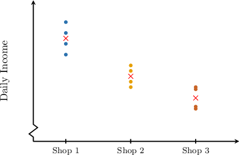
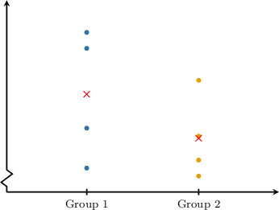

# One-Factor Within Groups and Between Groups Variation

Source: https://www.mathacademy.com/topics/3315?courseId=73
Topic ID: 3315

## Prerequisites

- [Double Summations](../multivariable-calculus/1983-double-summations.md)
- [The Sample Variance](./3820-the-sample-variance.md)
- [Sums of Squares](../../../high-school/integrated-math-honors/lessons/integrated-math-ii-honors/5204-sums-of-squares.md)

## Lesson

### Introduction

In this lesson, we will learn two statistics used to compare the values of a particular feature across different groups. These statistics will tell us if the mean value of the feature is significantly different in at least one group compared to the others.

The following table reports the daily incomes, in hundreds of dollars, over four days of the three different shops.

First, let's compute the means of each group:

$$

\begin{aligned}\overset{𝑥}{}_{1} & =\frac{15+17+16+14}{4}=15.5 \\ \overset{𝑥}{}_{2} & =\frac{12.5+11.5+13+11}{4}=12 \\ \overset{𝑥}{}_{3} & =\frac{9+11+10.8+9.2}{4}=10\end{aligned}

$$

Then, we plot the data and the means of each group.

We observe that:

- The average income of Shop 1 ($15.5$) is higher than that of Shop 2 ($12$), which in turn is higher than that of Shop 3 ($10$).

- The data points for each shop are tightly clustered around their respective means.

Now, compare this to the following plot, which is related to a different data set and evaluates a certain feature across two groups.

As in the previous example, the average of Group 1 is greater than the average of Group 2. However, in this case, there is a large variation within each group, which makes it more difficult to determine whether the group influences the distribution of values.

These examples suggest that to compare the distribution of a feature across different groups, we must consider both the variation *between* the groups' averages and the variation *within* each group.

### A Worked Example

Let's return to the example of the distribution of the daily incomes of three shops.

Note the following:

- We will denote the number of groups as $K.$ In our case, $K=3.$

- Each group will be identified with a number $k$ between $1$ and $K.$

- For each group, we will denote the number of data points in the group as $n_k.$ In our case, we reported the incomes of $4$ days for each shop. So, we have

- We denote $x_{jk}$ the $j$th data point from the $k$th group. So, we have

- We denote $\overline{x}_{k}$ the sample mean of the $k$th group:

### Sum of Squares Within Groups

The **sum of squares within groups,** denoted $\text{SSW},$ estimates how much the data points vary inside groups. To calculate it, we proceed as follows:

- For each group, we sum the squared deviations of the data points from the sample mean of the group:

- We sum the results:

Let's calculate $\text{SSW}$ for our example.

We've already calculated the sample means:

$$

\overline{x}_1 = 15.5, \qquad \overline{x}_2 = 12, \qquad \overline{x}_3 = 10

$$

Let's subtract the group sample mean from each data point.

Now, we compute the sum of the squared deviations from the sample mean of each sample (the inner summation in the above formula):

$$

\begin{aligned}\underset{\underset{𝑗=1}{∑}}{\overset{}{4}}(𝑥_{𝑗1}−\overset{𝑥}{}_{1})^{2} & =(−0.5)^{2}+(1.5)^{2}+(0.5)^{2}+(−1.5)^{2}=5 \\ \underset{\underset{𝑗=1}{∑}}{\overset{}{4}}(𝑥_{𝑗2}−\overset{𝑥}{}_{2})^{2} & =(0.5)^{2}+(−0.5)^{2}+(1)^{2}+(−1)^{2}=2.5 \\ \underset{\underset{𝑗=1}{∑}}{\overset{}{4}}(𝑥_{𝑗3}−\overset{𝑥}{}_{3})^{2} & =(−1)^{2}+(1)^{2}+(0.8)^{2}+(−0.8)^{2}=3.28\end{aligned}

$$

Finally, the sum of squares within groups is the sum of the above results:

$$

\text{SSW} = 5 + 2.5 + 3.28= 10.78

$$

### Example: Calculating SSW Using Raw Data

#### Question

A particular feature is being examined across $3$ groups of individuals to determine if the mean varies by group. The table below shows the values of this feature for three samples. The first sample contains $4$ individuals from the first group, the second sample contains $3$ individuals from the second group, and the third sample contains $5$ individuals from the third group.

What is the sum of squares within groups (SSW) for these samples?

#### Explanation

The sum of squares within groups is the sum of the squared deviations of each data point from the mean of its sample. That is

$$

\text{SSW} = \sum_{k=1}^K \sum_{j=1}^{n_k} \left(x_{jk} - \overline{x}_k\right)^2,

$$

where

- $K$ is the number of groups,

- $n_k$ is the number of individuals in the $k$th group,

- $x_{jk}$ is the $j$th data point from the $k$th group,

- $\overline{x}_{k}$ is the sample mean of the $k$th group.

In our case, we have a sample consisting of $3$ groups. There are $4$ individuals in the first group, $3$ in the second group, and $5$ in the third group. Therefore, $K=3,$ $n_1=4,$ $n_2=3,$ $n_3=5.$

First, let's compute the means of each group:

$$

\begin{aligned}\overset{𝑥}{}_{1} & =\frac{9.5+7+7.5+8}{4}=8 \\ \overset{𝑥}{}_{2} & =\frac{7+5+6}{3}=6 \\ \overset{𝑥}{}_{3} & =\frac{8+9+9.2+10+8.8}{5}=9\end{aligned}

$$

Let's subtract the group sample mean from each data.

Finally, the sum of squares within groups is the sum of the above results:

$$

\text{SSW} = 3.5+2+2.08=7.58

$$

### The Simplified Form of SSW

We will now derive a simplified formula for calculating our sum of squares within groups statistic:

$$

\text{SSW} = \sum_{k=1}^K \sum_{j=1}^{n_k} \left(x_{jk} - \overline{x}_k\right)^2

$$

Recall that an unbiased estimator of the sample variance for the $k$th group is as follows:

$$

s_k^2 = \dfrac{1}{n_k-1}\sum_{j=1}^{n_k}\left(x_{jk} - \overline{x}_k\right)^2.

$$

We multiply the above expression by $n_k-1$ to get rid of the fraction:

$$

(n_k-1)s_k^2 = \sum_{j=1}^{n_k}\left(x_{jk} - \overline{x}_k\right)^2

$$

Finally, we can replace $(n_k-1)s_k^2$ in the $\text{SSW}$ summation:

$$

\text{SSW} = \sum_{k=1}^K (n_k-1)s_k^2

$$

Let's see an example.

### Example: Calculating SSW Using Summary Statistics

#### Question

A particular feature is being examined across $3$ groups of individuals to determine if the mean varies by group. The summary statistics of three samples, one from each group, are given in the table below, where $n_k$ is the size of each sample, and $s_k$ is the sample standard deviation.

Find the sum of squares within groups (SSW) of these samples.

#### Explanation

The sum of squares within groups is the sum of the squared deviations of each data point from the mean of its sample. That is

$$

\text{SSW} = \sum_{k=1}^K \sum_{j=1}^{n_k} \left(x_{jk} - \overline{x}_k\right)^2,

$$

where

- $K$ is the number of groups,

- $n_k$ is the number of individuals in the $k$th group,

- $x_{jk}$ is the $j$th data point from the $k$th group,

- $\overline{x}_{k}$ is the sample mean of the $k$th group.

Now, if $s_k^2$ is the unbiased estimate of the population variance $\sigma^2$ obtained from the data in group $k$ only, then

$$

s_k^2 = \dfrac{1}{n_k-1}\sum_{j=1}^{n_k}\left(x_{jk} - \overline{x}_k\right)^2 \quad\Longrightarrow\quad (n_k-1)s_k^2 = \sum_{j=1}^{n_k}\left(x_{jk} - \overline{x}_k\right)^2.

$$

This means we can express $\text{SSW}$ in the following simplified form:

$$

\text{SSW} = \sum_{k=1}^K (n_k - 1)s_k^2

$$

Therefore, we can compute the sum of squares within groups as follows:

$$

\begin{aligned}SSW & =(10−1)(0.9)^{2}+(12−1)(1.2)^{2}+(18−1)(1.6)^{2} \\ & =7.29+15.84+43.52 \\ & =66.65\end{aligned}

$$

### Sum of Squares Between Groups

The $\text{SSW}$ statistic measures the variation within groups. However, its significance lies not in its standalone value but in its relationship to a complementary statistic that captures the variation *between* groups, called the **sum of squares between groups** ($\text{SSB}$).

As we will discuss in a future lesson, the relation between $\text{SSB}$ and $\text{SSW}$ provides meaningful insights into the problem of comparing means across different groups.

The sum of squares between groups estimates how much the groups' sample means differ from the sample mean of the entire sample (called the **grand sample mean**). We will denote the grand sample mean as $\overline{x}.$

To calculate $\text{SSB},$ we proceed as follows:

- For each group, we calculate the squared deviation of the group sample mean from the grand sample mean:

- We multiply the results by the group sizes:

- We sum the results:

We multiply each squared deviation by the group size $n_k$ to ensure that the differences between the group mean and the grand mean are weighted by each group's size. Larger groups have more data points contributing to the overall variation, so their deviation from the grand mean should have a proportionally larger effect to account for their influence fairly.

### A Worked Example

Suppose that a particular feature is being examined across $3$ groups of individuals to determine if the mean varies by group. The table below shows the values of this feature for three samples, each consisting of $4$ individuals from each group.

It is easy to show that the grand sample mean is $10.$ Let's use this to find the sum of squares between groups (SSB) for these samples.

We will use the formula we've just learned, that is

$$

\text{SSB} = \sum_{k=1}^K n_k \left(\overline{x}_k - \overline{x}\right)^2,

$$

where

- $K$ is the number of groups,

- $n_k$ is the sample size of the $k$th group,

- $\overline{x}_{k}$ is the sample mean of the $k$th group,

- $\overline{x}$ is the mean of the entire sample (the grand mean).

In our case, we have a sample of $4$ individuals for each of the $3$ groups. Therefore, $K=3$ and $n_k=4$ for all groups.

First, let's compute the mean of each group:

$$

\begin{aligned}\overset{𝑥}{}_{1} & =\frac{15+7+14+16}{4}=13 \\ \overset{𝑥}{}_{2} & =\frac{10+11+8+7}{4}=9 \\ \overset{𝑥}{}_{3} & =\frac{9+7+8+8}{4}=8\end{aligned}

$$

We are given that $\overline{x} = 10.$

Finally, the sum of squares between groups is

$$

\begin{aligned}SSB & =4[(13−10)^{2}+(9−10)^{2}+(8−10)^{2}] \\ & =4[9+1+4] \\ & =56.\end{aligned}

$$

### Example: Calculating SSB Using Raw Data

#### Question

A particular feature is being examined across $3$ groups of individuals to determine if the mean varies by group. The table below shows the values of this feature for three samples. The first sample contains $3$ individuals from the first group, the second sample contains $4$ individuals from the second group, and the third sample contains $5$ individuals from the third group.

Given that the grand sample mean is $10,$ what is the sum of squares between groups (SSB) of these samples?

#### Explanation

The sum of squares between groups is the sum of squared deviations of the group sample means from the grand sample mean multiplied by the sample size, that is

$$

\text{SSB} = \sum_{k=1}^K n_k \left(\overline{x}_k - \overline{x}\right)^2,

$$

where

- $K$ is the number of groups,

- $n_k$ is the sample size of the $k$th group,

- $\overline{x}_{k}$ is the sample mean of the $k$th group,

- $\overline{x}$ is the mean of the entire sample (the grand mean).

In our case, we have a sample consisting of $3$ groups. There are $3$ individuals in the first group, $4$ in the second, and $5$ in the third. Therefore, $K=3,$ $n_1=3,$ $n_2=4,$ and $n_3=5.$

First, let's compute the mean of each group:

$$

\begin{aligned}\overset{𝑥}{}_{1} & =\frac{9+7+8}{3}=8 \\ \overset{𝑥}{}_{2} & =\frac{10+11+8+7}{4}=9 \\ \overset{𝑥}{}_{3} & =\frac{18+7+11+16+8}{5}=12\end{aligned}

$$

We are given that $\overline{x} = 10.$

Finally, the sum of squares between groups is

$$

\begin{aligned}SSB & =3⋅(8−10)^{2}+4⋅(9−10)^{2}+5⋅(12−10)^{2} \\ & =3⋅4+4⋅1+5⋅4 \\ & =36.\end{aligned}

$$

### Example: Calculating SSB Using Summary Statistics

#### Question

A particular feature is being examined across $3$ groups of individuals to determine if the mean varies by group. The summary statistics of three samples, one from each group, are given in the table below, where $n_k$ is the size of each sample, and $\overline{x}_k$ is the sample mean.

What is the sum of squares between groups (SSB) of these samples?

#### Explanation

The sum of squares between groups is the sum of squared deviations of the group sample means from the grand sample mean multiplied by the sample size, that is

$$

\text{SSB} = \sum_{k=1}^K n_k \left(\overline{x}_k - \overline{x}\right)^2,

$$

where

- $K$ is the number of groups,

- $n_k$ is the sample size of the $k$th group,

- $\overline{x}_{k}$ is the sample mean of the $k$th group,

- $\overline{x}$ is the mean of the entire sample (the grand mean).

In our case, we have a sample consisting of $3$ groups. Therefore, $K=3.$

First, let's calculate the mean of the entire sample:

$$

\overline{x} = \dfrac{35(5.4)+40(4.3)+32(4.1)}{35+40+32} = 4.6

$$

Then, we can compute the sum of squares between groups as follows:

$$

\begin{aligned}SSB & =35(5.4−4.6)^{2}+40(4.3−4.6)^{2}+32(4.1−4.6)^{2} \\ & =22.4+3.6+8 \\ & =34\end{aligned}

$$
