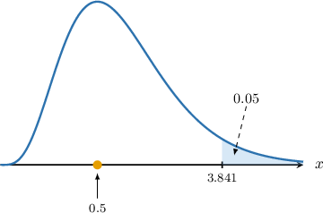
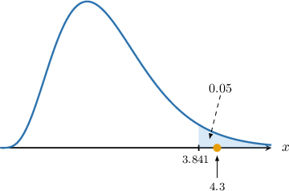
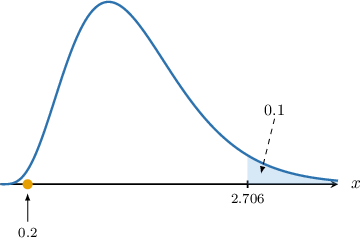

# Chi-Square Tests of Independence and Homogeneity

Source: https://www.mathacademy.com/topics/3317?courseId=73
Topic ID: 3317

## Prerequisites

- [Introduction to Chi-Square Goodness-of-Fit](./3014-introduction-to-chi-square-goodness-of-fit.md)

## Lesson

### Introduction

We can conduct hypothesis tests to decide whether sample data provide evidence that two categorical variables are associated.

Suppose we want to investigate whether a student's exam result is associated with the school they attend. The district superintendent conducts a random sample of $60$ students who sat a particular math exam from two schools in the district, and they get the following two-way frequency table (also called a **contingency table**) of results.

This is a $2\times 2$ contingency table because we have two levels for the row factors (School 1 and School 2) and two for the column factors (Pass and Fail).

We wish to test the following hypotheses:

- $H_0:\:\:$ The pass rates are independent of the choice of school

- $H_1:\:\:$ The pass rates are *not* independent of the choice of school

The first step in conducting our hypothesis test is calculating the **expected frequency** for every possible outcome, assuming that the null hypothesis is true.

First, we must find the probabilities associated with each row factor, i.e., we must find

$$

P(\textrm{Student is from School 1}), \qquad P(\textrm{Student is from School 2})

$$

and for each column factor

$$

P(\textrm{Student passes}), \qquad P(\textrm{Student fails}).

$$

We're not given these probabilities. However, they can be estimated from the sample data. We'll use the notation $\hat p(A)$ to denote our sample estimate of $P(A){:}$

So, in our case, we have:

$$

\begin{aligned}\overset{𝑝}{^}(Student is from School 1) & =\frac{18+6}{60}=0.4 \\ \overset{𝑝}{^}(Student is from School 2) & =\frac{24+12}{60}=0.6 \\ \overset{𝑝}{^}(Student passes the exam) & =\frac{18+24}{60}=0.7 \\ \overset{𝑝}{^}(Student fails the exam) & =\frac{6+12}{60}=0.3\end{aligned}

$$

Recall that if two events $A$ and $B$ are independent, then

$$

P(A\cap B) = P(A)\cdot P(B).

$$

Let's estimate the probability of each combination of values of $A$ and $B$ *under the assumption of independence:*

$$

\begin{aligned}𝑃(School 1∩Pass) & =\overset{𝑝}{^}(Student is from School 1)⋅\overset{𝑝}{^}(Student passes)=0.28 \\ 𝑃(School 1∩Fail) & =\overset{𝑝}{^}(Student is from School 1)⋅\overset{𝑝}{^}(Student fails)=0.12 \\ 𝑃(School 2∩Pass) & =\overset{𝑝}{^}(Student is from School 2)⋅\overset{𝑝}{^}(Student passes)=0.42 \\ 𝑃(School 2∩Fail) & =\overset{𝑝}{^}(Student is from School 2)⋅\overset{𝑝}{^}(Student fails)=0.18\end{aligned}

$$

This gives the following table of probabilities:

Let $E_{ij}$ denote the expected frequency in the $i$th row and $j$th column. To calculate the expected frequencies, we multiply each probability by $N=60,$ the total number of sample elements. For example,

$$

E_{11} = 60\cdot 0.28 = 16.8.

$$

Adding these values to our original table, we get the following:

Here, $O_{ij}$ is the *observed* frequency in the $i$th row and $j$th column.

Now that we've seen a concrete example, let's generalize a little.

### Calculating Expected Frequencies in the General Case

Given a contingency table with $n$ levels for the row factor $A_1, A_2, \ldots A_n$ and $m$ levels for the column factor $B_1, B_2, \ldots, B_m,$ under the hypothesis that the factors are independent, we have that the probability of an individual having the value $A_i$ for the row factor and the value $B_j$ for the column factor is equal to the product of the probabilities:

$$

P(A_i \cap B_j) = P(A_i) \cdot P(B_j), \qquad i=1,2,\ldots, n \quad j=1,2,\ldots, m

$$

We can calculate estimates for the probabilities $P(A_i)$ and $P(B_j),$ which we denote as $\hat p(A_i)$ and $\hat p(B_j),$ respectively, as follows:

$$

\begin{aligned}\overset{𝑝}{^}(𝐴_{𝑖}) & =\frac{number of observations with level 𝐴_{𝑖}}{total number of observations} \\ \overset{𝑝}{^}(𝐵_{𝑗}) & =\frac{number of observations with level 𝐵_{𝑗}}{total number of observations}\end{aligned}

$$

For a sample of size $N,$ the expected frequency $E_{ij}$ of the event $A_i\cap B_j$ under the assumption of independence is given by

$$

E_{ij} = N\cdot P(A_i\cap B_j).

$$

Let's see another example.

### Example: Calculating Expected Values

#### Question

A group of $80$ people, consisting of adults and children, were asked about their holiday preferences: beach or mountains. The aim is to determine whether people's age and vacation preferences are independent.

The following contingency table reports the sample's frequency distribution. Fill in the missing values of the expected frequencies under the hypothesis that the features are independent.

#### Explanation

We are given a contingency table with $2$ levels for the row factor (Adults and Children) and $2$ for the column factors (Beach and Mountains).

Given a contingency table with $n$ levels for the row factor $A_1, A_2, \ldots, A_n$ and $m$ levels for the column factor $B_1, B_2, \ldots, B_m,$ under the hypothesis that the factors are independent, we have that the probability of an individual having the value $A_i$ for the row factor and the value $B_j$ for the column factor is equal to the product of the probabilities:

$$

P(A_i \cap B_j) = P(A_i) \cdot P(B_j), \qquad i=1,2,\ldots, n \quad j=1,2,\ldots, m

$$

We can calculate estimates for the probabilities $P(A_i)$ and $P(B_j),$ which we denote as $\hat p(A_i)$ and $\hat p(B_j),$ respectively, as follows:

$$

\begin{aligned}\overset{𝑝}{^}(𝐴_{𝑖}) & =\frac{number of observations with level 𝐴_{𝑖}}{total number of observations} \\ \overset{𝑝}{^}(𝐵_{𝑗}) & =\frac{number of observations with level 𝐵_{𝑗}}{total number of observations}\end{aligned}

$$

So, in our case we have

$$

\begin{aligned}\overset{𝑝}{^}(Adults) & =\frac{20+28}{80}=\frac{3}{5} \\ \overset{𝑝}{^}(Children) & =\frac{24+8}{80}=\frac{2}{5} \\ \overset{𝑝}{^}(Beach) & =\frac{20+24}{80}=\frac{11}{20} \\ \overset{𝑝}{^}(Mountains) & =\frac{28+8}{80}=\frac{9}{20}\end{aligned}

$$

Next, let's estimate the probability of each combination of values under the assumption of independence:

$$

\begin{aligned}𝑃(Adults∩Beach) & =\overset{𝑝}{^}(Adults)⋅\overset{𝑝}{^}(Beach)=\frac{33}{100} \\ 𝑃(Adults∩Mountains) & =\overset{𝑝}{^}(Adults)⋅\overset{𝑝}{^}(Mountains)=\frac{27}{100} \\ 𝑃(Children∩Beach) & =\overset{𝑝}{^}(Children)⋅\overset{𝑝}{^}(Beach)=\frac{11}{50} \\ 𝑃(Children∩Mountains) & =\overset{𝑝}{^}(Children)⋅\overset{𝑝}{^}(Mountains)=\frac{9}{50}\end{aligned}

$$

Therefore, the expected frequencies for each combination of values under the assumption of independence can be estimated as follows:

$$

\begin{aligned}𝐸_{11} & =𝑁⋅𝑃(Adults∩Beach)=80⋅\frac{33}{100}=26.4 \\ 𝐸_{12} & =𝑁⋅𝑃(Adults∩Mountains)=80⋅\frac{27}{100}=21.6 \\ 𝐸_{21} & =𝑁⋅𝑃(Children∩Beach)=80⋅\frac{11}{50}=17.6 \\ 𝐸_{22} & =𝑁⋅𝑃(Children∩Mountains)=80⋅\frac{9}{50}=14.4\end{aligned}

$$

A table summarizing the observed and corresponding expected frequencies is given below:

### The Distribution of the Test Statistic

Suppose we have a contingency table with $n$ rows and $m$ columns. Then, the random variable

$$

X = \sum_{i} \sum_{j} \frac{(O_{ij} - E_{ij})^2}{E_{ij}}

$$

approximately follows a chi-square distribution with $\nu$ degrees of freedom, where

- $O_{ij}$ is the observed frequency for row $i$ and column $j,$ and

- $E_{ij}$ is the expected frequency for row $i$ and column $j,$ as predicted under the null hypothesis that the row and column factors are independent.

This approximation holds when all expected frequencies $E_{ij}$ are sufficiently large (typically $E_{ij} \geq 5$ for each cell), and the observations are independent.

Before we use this result for hypothesis testing, let's discuss how to find the degrees of freedom $\nu$ for a given chi-square test.

### Degrees of Freedom

Let's return to the following contingency table, which includes the observed and expected frequencies for a sample of $N=60$ students who sat an exam from two schools.

Recall that for a chi-square goodness-of-fit test, the number of degrees of freedom is the number of independent sample categories (cells). The case for independence tests is similar:

- In this case, we have a contingency table with $2\cdot 2 = 4$ cells.

- In total, we have $3$ constraints: The sum of the observations must equal $N.$ We also formed two estimates, which both set an additional constraint: We figured these out earlier in the lesson. Note that the probabilities do not form additional constraints because they can be derived using the rule of complements. Similarly, the probabilities of the various intersections do not form additional constraints.

Therefore, the number of degrees of freedom for this test is

$$

\nu = 4 - 3 = 1.

$$

More generally, given a contingency table with $n$ rows and $m$ columns:

- The total number of observations must equal $N,$ and the estimates $\hat p (A_1), \hat p(A_2),\ldots \hat p(A_{n-1})$ and $\hat p(B_1), \hat p(B_2), \ldots \hat p(B_{m-1})$ set a constraint each. The estimates $\hat p(A_n)$ and $\hat p(B_m)$ can be deduced by the others, so they don't create a constraint.

- Therefore, the number of degrees of freedom $\nu$ is calculated as follows:

### Conducting a Chi-Square Test

We wish to conduct a chi-square test for independence at the $5\%$ significance level with the following null and alternative hypotheses:

- $H_0:\:\:$ The pass rates are independent of the choice of school

- $H_1:\:\:$ The pass rates are *not* independent of the choice of school

To do this, we'll need the table below that gives the values of $w$ that satisfy $P(W\geq w) = p,$ where $W\sim \chi^2(\nu).$

Notice that all of the expected frequencies are greater than or equal to $5.$

First, we calculate the term $\dfrac{(O_{ij} - E_{ij})^2}{E_{ij}}$ for each combination of values of the variables:

$$

\begin{aligned}\frac{(𝑂_{11}−𝐸_{11})^{2}}{𝐸_{11}} & =\frac{(18−16.8)^{2}}{16.8}≈0.0857 \\ \frac{(𝑂_{12}−𝐸_{12})^{2}}{𝐸_{12}} & =\frac{(6−7.2)^{2}}{7.2}=0.2 \\ \frac{(𝑂_{21}−𝐸_{21})^{2}}{𝐸_{21}} & =\frac{(109−102.5)^{2}}{102.5}≈0.0571 \\ \frac{(𝑂_{22}−𝐸_{22})^{2}}{𝐸_{22}} & =\frac{(96−102.5)^{2}}{102.5}≈0.1333\end{aligned}

$$

Notice that we rounded to four decimal places.

We compute our test statistic by summing the above results:

$$

\begin{aligned}𝑋 & =\underset{𝑖}{∑}\underset{𝑗}{∑}\frac{(𝑂_{𝑖𝑗}−𝐸_{𝑖𝑗})^{2}}{𝐸_{𝑖𝑗}} \\ & ≈0.0857+0.2+0.0571+0.1333 \\ & ≈0.5\end{aligned}

$$

We previously established that the number of degrees of freedom for this test is

$$

\nu = 1.

$$

From the given chi-square table, the critical value for $\nu=1$ at a $5\%$ significance level is $\chi^2_{\textrm{critical}}=3.841,$ and the critical region is

$$

X\geq 3.841

$$

as shown below.

Therefore, we conclude that there is insufficient evidence to suggest that the pass rates depend upon the school choice.

### Example: Chi-Square Tests for Independence

#### Question

In a handwriting survey, $100$ people were asked whether they were right- or left-handed. The aim is to determine whether hand preference and gender are independent.

The following contingency table reports the observed and expected frequencies under the hypothesis that the variables are independent.

A chi-square test for independence is conducted at the $5\%$ significance level with the following null and alternative hypotheses:

- $H_0\mathbin{:}\:$ Hand preference and gender are independent

- $H_1\mathbin{:}\:$ Hand preference and gender are not independent

The table below gives the values of $w$ that satisfy $P(W\geq w) = q,$ where $W\sim \chi^2(\nu).$

Use this information to complete the hypothesis test and state your conclusion.

#### Explanation

Suppose we have a contingency table with $n$ rows and $m$ columns. Then, the random variable

$$

X = \sum_{i} \sum_{j} \frac{(O_{ij} - E_{ij})^2}{E_{ij}}

$$

approximately follows a chi-square distribution with $\nu$ degrees of freedom, where

- $O_{ij}$ is the observed frequency for row $i$ and column $j,$ and

- $E_{ij}$ is the expected frequency for row $i$ and column $j,$ as predicted under the null hypothesis that the row and column factors are independent.

This approximation holds when all expected frequencies $E_{ij}$ are sufficiently large (typically $E_{ij} \geq 5$ for each cell), and the observations are independent.

Notice that all of the expected frequencies are greater than or equal to $5.$

First, we calculate the term $\dfrac{(O_{ij} - E_{ij})^2}{E_{ij}}$ for each combination of values of the variables:

$$

\begin{aligned}\frac{(𝑂_{11}−𝐸_{11})^{2}}{𝐸_{11}} & =\frac{(37−33.2)^{2}}{33.2}≈0.4349 \\ \frac{(𝑂_{12}−𝐸_{12})^{2}}{𝐸_{12}} & =\frac{(3−6.8)^{2}}{6.8}≈2.1235 \\ \frac{(𝑂_{21}−𝐸_{21})^{2}}{𝐸_{21}} & =\frac{(46−49.8)^{2}}{49.8}≈0.2900 \\ \frac{(𝑂_{22}−𝐸_{22})^{2}}{𝐸_{22}} & =\frac{(14−10.2)^{2}}{10.2}≈1.4157\end{aligned}

$$

Notice that we rounded to four decimal places.

First, we compute our test statistic by summing the above results:

$$

\begin{aligned}𝑋 & =\underset{𝑖}{∑}\underset{𝑗}{∑}\frac{(𝑂_{𝑖𝑗}−𝐸_{𝑖𝑗})^{2}}{𝐸_{𝑖𝑗}} \\ & =0.4349+2.1235+0.2900+1.4157 \\ & ≈4.3\end{aligned}

$$

Therefore, the test statistic is approximately $\boxed{\color{blue}4.3}.$

We now compute the number of degrees of freedom:

- Given a contingency table with $n$ rows and $m$ columns: the number of constraints is $1 + (m-1) + (n-1)$ the total number of observations must equal $N,$ and the estimates $\hat p (A_1), \hat p(A_2),\ldots \hat p(A_{n-1})$ and $\hat p(B_1), \hat p(B_2), \ldots \hat p(B_{m-1})$ set a constraint each. Notice that the $\hat p(A_n)$ and $\hat p(B_m)$ can be deduced by the others, so they don't create a constraint. Therefore, the number of degrees of freedom $\nu$ is calculated as follows: So, in our case there are $\nu = (2-1)(2-1)=\boxed{\color{blue}1}$ degree of freedom.

From the given chi-square table, the critical value for $\nu=1$ at a $5\%$ significance level is $\chi^2_{\textrm{critical}}=3.841,$ and the critical region is

$$

X\geq 3.841

$$

as shown below.

### Tests for Homogeneity

The **chi-square test for homogeneity** is similar to the chi-square independence test. The tests are carried out similarly, but the setup and interpretation differ.

- The chi-square test for independence involves data from a single population and examines the relationship between two categorical variables. We recently discussed whether there was an association between school choice and exam results. Here, the population contained all students in a particular school district, and the null hypothesis assumed that the two variables were independent.

- The chi-square test for homogeneity collects data from separate, independent populations, and the goal is to compare how a single categorical variable is distributed across these groups. For example, you might investigate whether voting preferences differ between regions. In this case, there are multiple populations (the different regions), and the null hypothesis states that the distributions are the same across all groups.

Both tests use contingency tables to compare observed and expected frequencies and calculate the chi-square statistic. However, the test for homogeneity focuses on comparing distributions across groups, while the test for independence identifies relationships between variables within a population.

Let's see an example of a chi-square homogeneity test.

### Example: Chi-Square Tests for Homogeneity

#### Question

A research institute wants to determine whether there is a difference in voting preferences across two regions, Region A and Region B. They conducted two samples, one for each region, and asked each voter whether they planned to vote for Candidate X or Candidate Y in an upcoming election.

In total, $180$ voters were sampled from Region A, while $120$ were sampled from Region B. The following contingency table reports their findings.

A chi-square test for homogeneity is conducted at the $10\%$ significance level with the following null and alternative hypotheses:

- $H_0\mathbin{:}:$ The distribution of voting preferences is the same across both regions

- $H_1\mathbin{:}:$ The distribution of voting preferences is not the same across both regions

The table below gives the values of $w$ that satisfy $P(W\geq w) = p,$ where $W\sim \chi^2(\nu).$

Use this information to complete the hypothesis test and state your conclusion.

#### Explanation

Suppose we have a contingency table in which a feature with $m$ levels is examined on $n$ samples from different populations. Then, the random variable

$$

X = \sum_{i} \sum_{j} \frac{(O_{ij} - E_{ij})^2}{E_{ij}}

$$

approximately follows a chi-square distribution with $\nu$ degrees of freedom, where

- $O_{ij}$ is the observed frequency for population $i$ and feature level $j,$ and

- $E_{ij}$ is the expected frequency for population $i$ and feature level $j,$ as predicted under the null hypothesis that the distribution of the feature is the same in the two populations.

Given that $N_1, N_2, \ldots, N_n$ are the sample sizes and $N=N_1 + \ldots + N_n$ is the grand sample size, the expected frequencies can be calculated as follows:

$$

E_{ij} = N_i \cdot \widehat p_j

$$

where $\widehat p_i$ is the proportion of individuals with value $A_i$ in the grand sample.

This approximation holds when all expected frequencies $E_{ij}$ are sufficiently large (typically $E_{ij} \geq 5$ for each cell), and the observations are independent.

In our case, we have a sample of $N_1 = 180$ voters from Region A (population 1) and a sample of $N_2 = 120$ voters from Region B (population 2).

First, we estimate the probability $\widehat{p}_{X}$ of a randomly selected voter choosing Candidate X.

$$

\begin{aligned}\overset{𝑝}{ˆ}_{𝑋} & =\frac{110+70}{300}=0.6\end{aligned}

$$

Then, the probability $\widehat{p}_{Y}$ of that a randomly selected voter chooses Candidate Y is

$$

\begin{aligned}\overset{𝑝}{ˆ}_{𝑌} & =1−\overset{𝑝}{ˆ}_{𝑋}=1−0.6=0.4.\end{aligned}

$$

Therefore, the expected frequencies for each cell under the assumption that the distribution of votes is the same across both populations can be estimated as follows:

$$

\begin{aligned}𝐸_{11} & =\overset{𝑝}{ˆ}_{𝑋}⋅𝑁_{1}=0.6⋅180=108 \\ 𝐸_{12} & =\overset{𝑝}{ˆ}_{𝑌}⋅𝑁_{1}=0.4⋅180=72 \\ 𝐸_{21} & =\overset{𝑝}{ˆ}_{𝑋}⋅𝑁_{2}=0.6⋅120=72 \\ 𝐸_{22} & =\overset{𝑝}{ˆ}_{𝑌}⋅𝑁_{2}=0.4⋅120=48\end{aligned}

$$

So, our table now looks as follows:

Notice that all of the expected frequencies are greater than or equal to $5.$

Now, we calculate the term $\dfrac{(O_{ij} - E_{ij})^2}{E_{ij}}$ for each combination of value and population:

$$

\begin{aligned}\frac{(𝑂_{11}−𝐸_{11})^{2}}{𝐸_{11}} & =\frac{(110−108)^{2}}{108}≈0.0370 \\ \frac{(𝑂_{12}−𝐸_{12})^{2}}{𝐸_{12}} & =\frac{(70−72)^{2}}{72}≈0.0556 \\ \frac{(𝑂_{21}−𝐸_{21})^{2}}{𝐸_{21}} & =\frac{(70−72)^{2}}{72}≈0.0556 \\ \frac{(𝑂_{22}−𝐸_{22})^{2}}{𝐸_{22}} & =\frac{(50−48)^{2}}{48}≈0.0833\end{aligned}

$$

Notice that we rounded to four decimal places.

First, we compute our test statistic by summing the above results:

$$

\begin{aligned}𝑋 & =\underset{𝑖}{∑}\underset{𝑗}{∑}\frac{(𝑂_{𝑖𝑗}−𝐸_{𝑖𝑗})^{2}}{𝐸_{𝑖𝑗}} \\ & =0.0370+0.0556+0.0556+0.0833 \\ & ≈0.2\end{aligned}

$$

Therefore, the test statistic is approximately $\boxed{\color{blue}0.2}.$

Next, we compute the degrees of freedom:

- Given a contingency table with $n$ populations and $m$ levels of a feature: the number of constraints is $1 + (m-1) + (n-1)$ the total number of observations must equal $N,$ the estimates $\widehat p_1, \widehat p_2,\ldots \widehat p_{m-1}$ and $N_1, N_2, \ldots N_{n-1}$ set a constraint each. Notice that the $\widehat p_m$ and $N_n$ can be deduced by the others, so they don't create a constraint. Therefore, the number of degrees of freedom $\nu$ is calculated as follows:

$$

\begin{aligned}𝜈 & =number of cells−number of constraints \\ & =𝑛𝑚−1−(𝑛−1)−(𝑚−1) \\ & =𝑛𝑚−𝑛−𝑚+1 \\ & =(𝑛−1)(𝑚−1)\end{aligned}

$$

So, in our case there is $\nu = (2-1)(2-1)=\boxed{\color{blue}1}$ degree of freedom.

From the given chi-square table, the critical value for $\nu=1$ at a $10\%$ significance level is $\chi^2_{\textrm{critical}}=2.706,$ and the critical region is

$$

X\geq 2.706

$$

as shown below.

So, we conclude that there is no evidence that the vote distribution varies across different regions.
