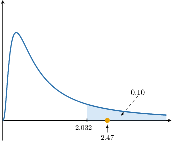
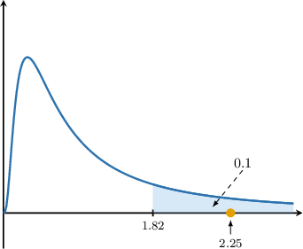
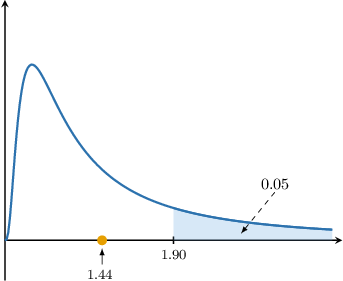

# Hypothesis Tests for Two Variances

Source: https://www.mathacademy.com/topics/3318?courseId=73
Topic ID: 3318

## Prerequisites

- [The F-Distribution](./3060-the-f-distribution.md)
- [Hypothesis Tests for One Variance](./3314-hypothesis-tests-for-one-variance.md)

## Lesson

### Introduction

In this lesson, we learn how to conduct hypothesis tests to evaluate whether sufficient evidence exists that two variances from normal populations are equal.

Suppose we have two independent normal populations $X$ and $Y{:}$

$$

X\sim N(\mu_x, \sigma^2_x), \qquad Y\sim N(\mu_y, \sigma^2_y)

$$

We conduct a sample of size $n_x$ from $X$ and a sample of size $n_y$ from $Y.$

Let $W_\nu$ denote a chi-square random variable with $\nu$ degrees of freedom, i.e.

$$

W_\nu \sim \chi^2(\nu).

$$

In a previous lesson, we saw that

$$

W_{n_x-1} = \dfrac{(n_x-1)S_x^2}{\sigma^2_x}, \qquad W_{n_y-1} = \dfrac{(n_y-1)S_y^2}{\sigma^2_y}

$$

where $S_x^2$ and $S_y^2$ are the sample variances.

Additionally, by the definition of the $F$-distribution, we have

$$

\dfrac{W_{\nu_1} / \nu_1}{W_{\nu_2} / \nu_2} \sim F(\nu_1, \nu_2).

$$

To define a critical region, we first need a test statistic whose distribution is known under the null hypothesis. In this case, a natural choice for the statistic is the ratio of the sample variances:

$$

\frac{S_x^2 }{ S_y^2}

$$

But what is the distribution of this ratio?

As we will see, it is easier to analyze the distribution of the standardized ratio

$$

\frac{{S_x^2}/{\sigma_x^2}}{{S_y^2}/{\sigma_y^2}}.

$$

Under the null hypothesis $\sigma_x^2 = \sigma_y^2$, so under $H_0$ our ratio coincides with the standardized one. This is why studying the standardized form allows us to determine the critical region for the test.

Our goal is to find the probability distribution of

$$

\dfrac{S_x^2/\sigma^2_x}{S_y^2/\sigma^2_y}.

$$

Using the relationship between the sample variance and chi-square distributions, we can write

$$

\dfrac{S_x^2}{\sigma^2_x} = \dfrac{ (n_x-1)S_x^2/\sigma^2_x}{n_x-1}

$$

and similarly

$$

\dfrac{S_y^2}{\sigma^2_y} = \dfrac{ (n_y-1)S_y^2/\sigma^2_y}{n_y-1}.

$$

Therefore,

$$

\dfrac{S_x^2}{\sigma^2_x} = \dfrac{ W_{n_x-1} }{n_x-1}, \qquad \dfrac{S_y^2}{\sigma^2_y} = \dfrac{ W_{n_y-1}}{n_y-1}.

$$

So, if we divide $S_x^2/\sigma^2_x$ by $S_y^2/\sigma^2_y,$ this is simply the ratio of two chi-square random variables scaled by their respective degrees of freedom.

Therefore, by the definition of the $F$-distribution, we have

$$

\dfrac{S_x^2/\sigma^2_x}{S_y^2/\sigma^2_y} = \dfrac{ W_{n_x-1}/(n_x-1) }{ W_{n_y-1}/(n_y-1) } \sim F(n_x-1, n_y-1).

$$

Let's summarize this result:

Given two random samples from independent normal populations $X$ and $Y,$ the random variable

$$

\dfrac{S_x^2/\sigma_x^2}{S_y^2/\sigma_y^2}

$$

follows the $F$-distribution with $\nu_x = n_x-1$ and $\nu_y = n_y-1$ degrees of freedom, where

- $S_x^2$ and $S_y^2$ are the sample variances,

- $\sigma_x^2$ and $\sigma_y^2$ are the population variances,

- $n_x$ and $n_y$ are the sample sizes.

Furthermore, if $\sigma_x^2 = \sigma_y^2,$ we have

$$

\dfrac{S_x^2}{S_y^2} \sim F(\nu_x, \nu_y).

$$

### Reformulating as a Right-Tailed Test

When conducting hypothesis tests for variances, we usually work with the right-tailed critical values of the $F$-Distribution. For this reason, we should always divide the larger variance by the smaller one when calculating our test statistic.

For example,

- If our alternative hypothesis is then, we find our right-tailed test statistic $f$ by calculating the ratio where $s_x^2$ and $s_y^2$ are the usual unbiased estimates of $\sigma_x^2$ and $\sigma_y^2,$ respectively.

- On the other hand, if our alternative hypothesis is then, we can rewrite this as in which case, the right-tailed test statistic is given by

- Similarly, if the alternative hypothesis is $\sigma^2_x \neq \sigma^2_y,$ we can conduct a right-tailed test by dividing the larger sample variance by the smaller.

Let's see some examples.

### Example: Testing the Hypothesis That the First Variance Is Larger Than The Second

#### Question

Consider two samples of size $n_x=18$ and $n_y=14$ from two independent normal populations $X$ and $Y$ having population variances $\sigma_x^2$ and $\sigma_y^2,$ respectively. Unbiased estimates of the population variances obtained from these two samples are $s_x^2=1.1^2$ and $s_y^2=0.7^2.$

Conduct a hypothesis test at a $10\%$ significance level to test the hypothesis $H_0: \sigma_x^2 = \sigma_y^2$ against the alternative $H_1: \sigma_x^2 > \sigma_y^2.$

The table below gives some values of $w$ that satisfy $P(W\gt w) = p,$ where $W\sim F(\nu_1, \nu_2).$

#### Explanation

We are told that the two populations are independent and normally distributed, but we do not know the population variances $\sigma_x^2$ and $\sigma_y^2.$

Given two random samples from independent normal populations $X$ and $Y,$ the random variable

$$

\dfrac{S_x^2/\sigma_x^2}{S_y^2/\sigma_y^2}

$$

follows an $F$-distribution with $\nu_x = n_x-1$ and $\nu_y = n_y-1$ degrees of freedom, where

- $S_x^2$ and $S_y^2$ are the sample variances,

- $\sigma_x^2$ and $\sigma_y^2$ are the population variances,

- $n_x$ and $n_y$ are the sample sizes.

Furthermore, if $\sigma_x^2 = \sigma_y^2,$ we have

$$

\dfrac{S_x^2}{S_y^2} \sim F(\nu_x, \nu_y).

$$

In our example:

- $H_0: \sigma_x^2 = \sigma_y^2$ is the null hypothesis

- $H_1: \sigma_x^2 \gt \sigma_y^2$ is the alternative (one-tailed) hypothesis

Assuming the null hypothesis, we compute the test statistic. Remember, we divide the ** variance by the ** one.

$$

f = \dfrac{s_x^2}{s_y^2} = \dfrac{(1.1)^2}{(0.7)^2} \approx \boxed{\color{blue}2.47}

$$

Next, we find the critical region. Define the random variable $W$ as

$$

W\sim F(\nu_x, \nu_y) = F(18-1, 14-1) =F(17,13).

$$

Since the alternative hypothesis is $\sigma^2_x\gt \sigma_y^2,$ we must consider the right tail. This means we need to find the value $a$ such that

$$

P(W \geq a) = 0.1.

$$

According to the table, the $10\%$ one-tailed critical value is $2.032{:}$

So, our critical region is

$$

W \geq 2.032.

$$

Our test statistic ($2.47$) lies in the critical region, as shown below.

So, we reject the null hypothesis $H_0.$ As a result, we conclude the following:

**

### Example: Testing the Hypothesis That the First Variance Is Smaller Than The Second

#### Question

Consider two samples of size $n_x=21$ and $n_y=18$ from two independent normal populations $X$ and $Y$ having population variances $\sigma_x^2$ and $\sigma_y^2,$ respectively. Unbiased estimates of the population variances obtained from these two samples are $s_x^2=4^2$ and $s_y^2=6^2.$

Conduct a hypothesis test at a $10\%$ significance level to test the hypothesis $H_0: \sigma_x^2 = \sigma_y^2$ against the alternative $H_1: \sigma_x^2 < \sigma_y^2.$

The table below gives some values of $w$ that satisfy $P(W\gt w) = p,$ where $W\sim F(\nu_1, \nu_2).$

#### Explanation

We are told that the two populations are independent and normally distributed, but we do not know the population variances $\sigma_x^2$ and $\sigma_y^2.$

Given two random samples from independent normal populations $X$ and $Y,$ the random variable

$$

\dfrac{S_x^2/\sigma_x^2}{S_y^2/\sigma_y^2}

$$

follows an $F$-distribution with $\nu_x = n_x-1$ and $\nu_y = n_y-1$ degrees of freedom, where

- $S_x^2$ and $S_y^2$ are the sample variances,

- $\sigma_x^2$ and $\sigma_y^2$ are the population variances,

- $n_x$ and $n_y$ are the sample sizes.

Furthermore, if $\sigma_x^2 = \sigma_y^2,$ we have

$$

\dfrac{S_x^2}{S_y^2} \sim F(\nu_x, \nu_y), \quad\text{and}\quad \dfrac{S_y^2}{S_x^2} \sim F(\nu_y, \nu_x) .

$$

In our example:

- $H_0: \sigma_y^2 = \sigma_x^2$ is the null hypothesis

- $H_1: \sigma_y^2 \gt \sigma_x^2$ is the alternative (one-tailed) hypothesis

Notice that we've rewritten our null and alternative hypotheses to use a right-tailed test (the table contains only right-tailed critical values).

Assuming the null hypothesis, we compute the test statistic. Remember, we divide the ** variance by the ** one.

$$

f = \dfrac{s_y^2}{s_x^2}=\dfrac{6^2}{4^2} = \boxed{\color{blue}2.25}

$$

Next, we find the critical region. Define the random variable $W$ as

$$

W\sim F(\nu_y, \nu_x) = F(18-1, 21-1) =F(17,20).

$$

Since the alternative hypothesis is $\sigma^2_y\gt \sigma_x^2,$ we must consider the right tail. This means we need to find the value $a$ such that

$$

P(W \geq a) = 0.1.

$$

According to the table, the $10\%$ one-tailed critical value is $1.82{:}$

So, we reject the null hypothesis $H_0.$ As a result, we conclude the following:

**

### Example: Testing the Hypothesis That the Variances are Unequal

#### Question

Consider two samples of size $n_x=30$ and $n_y=25$ from two normal populations having population variances $\sigma_x^2$ and $\sigma_y^2,$ respectively. Unbiased estimates of the population variances obtained from the two samples are $s_x^2=5^2$ and $s_y^2=6^2.$

Conduct a hypothesis test at a $10\%$ significance level to test the hypothesis $H_0: \sigma_x^2 = \sigma_y^2$ against the alternative $H_1: \sigma_x^2 \neq \sigma_y^2.$

The table below gives some values of $w$ that satisfy $P(W\gt w) = p,$ where $W\sim F(\nu_1, \nu_2).$

#### Explanation

We are told that the two populations are independent and normally distributed, but we do not know the population variances $\sigma_x^2$ and $\sigma_y^2.$

Given two random samples from independent normal populations $X$ and $Y,$ the random variable

$$

\dfrac{S_x^2/\sigma_x^2}{S_y^2/\sigma_y^2}

$$

follows an $F$-distribution with $\nu_x = n_x-1$ and $\nu_y = n_y-1$ degrees of freedom, where

- $S_x^2$ and $S_y^2$ are the sample variances,

- $\sigma_x^2$ and $\sigma_y^2$ are the population variances,

- $n_x$ and $n_y$ are the sample sizes.

Furthermore, if $\sigma_x^2 = \sigma_y^2,$ we have

$$

\dfrac{S_x^2}{S_y^2} \sim F(\nu_x, \nu_y),\qquad\dfrac{S_y^2}{S_x^2} \sim F(\nu_y, \nu_x).

$$

In our example:

- $H_0: \sigma_x^2 = \sigma_y^2$ is the null hypothesis

- $H_1: \sigma_x^2 \neq \sigma_y^2$ is the alternative (two-tailed) hypothesis

Assuming the null hypothesis, we compute the test statistic. Remember, we divide the ** variance by the ** one.

$$

f = \dfrac{s_y^2}{s_x^2} = \dfrac{6^2}{5^2} = \boxed{\color{blue}1.44 }

$$

Next, we find the critical region. First, define the random variable $W$ as

$$

W\sim F(\nu_y, \nu_x) = F(25-1, 30-1) = F(24,29).

$$

This is a two-tailed test at a $10\%$ significance level, so $5\%$ per tail. However, since our test statistic $f > 1,$ we only need to consider the right tail. This means we need to find the value $a$ such that

$$

P(W \geq a) = 0.05.

$$

According to the table, the $5\%$ right-tailed critical value is $1.90{:}$

Our test statistic ($1.44$) does not lie in the critical region, as shown below.

So, we do not reject the null hypothesis $H_0.$ As a result, we conclude the following:

**
