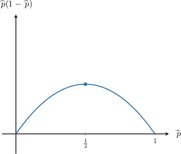
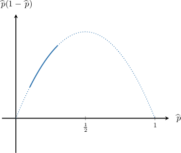

# Estimating Sample Sizes for Proportions: Finite Population Correction

Source: https://www.mathacademy.com/topics/3321?courseId=73
Topic ID: 3321

## Prerequisites

- [Estimating Sample Sizes for Proportions](./3320-estimating-sample-sizes-for-proportions.md)
- [Confidence Intervals for One Proportion: Finite Population Corrections](./3931-confidence-intervals-for-one-proportion-finite-population-corrections.md)

## Lesson

### Introduction

Suppose we have a finite population of size $N$ in which a proportion $p$ of individuals has a particular characteristic.

In a previous lesson, we saw that we can estimate the sampling distribution of $p$ as

$$

\widehat{\,p} \sim N\left( p, \dfrac{p(1-p)}{n}\cdot \dfrac{N-n}{N-1} \right)

$$

where

- $\!\widehat{\,p}$ is the sample proportion,

- $p$ is the population proportion,

- $N$ is the population size, and

- $n$ is the sample size.

Recall that the quantity

$$

\dfrac{N-n}{N-1}

$$

is the *finite population correction factor* applied to the variance of $\widehat{\,p}.$ It is appropriate to apply this correction factor whenever $n > 5\%\cdot N.$

Now, recall that the $[100(1-\alpha)]\%$ confidence interval for $p$ in the cases where $n > 5\%\cdot N$ is given by

$$

\widehat{\,p} \pm \overbrace{z_{\alpha/2} \cdot \sqrt{\dfrac{\widehat{\,p}(1-\widehat{\,p})}{n}\cdot \dfrac{N-n}{N-1} }}^{\text{margin of error}}

$$

where $P(Z > z_{\alpha/2}) = \dfrac{\alpha}{2}$ and $Z\sim N(0,1).$

Suppose we require the margin of error to be smaller than $\varepsilon.$ Then, we must have

$$

z_{\alpha/2} \cdot \sqrt{\dfrac{\widehat{\,p}(1-\widehat{\,p})}{n}\cdot \dfrac{N-n}{N-1} } \leq \varepsilon

$$

By isolating $n,$ we can find the minimum sample size needed for the margin or error to be smaller than $\varepsilon.$ We learned how to do this for large populations in a previous lesson.

To isolate $n,$ we start by squaring both sides:

$$

z_{\alpha/2}^2 \cdot \dfrac{\widehat{\,p}(1-\widehat{\,p})}{n}\cdot \dfrac{N-n}{N-1} \leq \varepsilon^2

$$

Dividing this inequality by $\varepsilon^2$ and rearranging slightly, we get

$$

z_{\alpha/2}^2 \cdot \dfrac{\widehat{\,p}(1-\widehat{\,p})}{\varepsilon^2}\cdot \dfrac{N-n}{n(N-1)} \leq 1.

$$

Now, we let

$$

m = z_{\alpha/2}^2 \cdot \dfrac{\widehat{\,p}(1-\widehat{\,p})}{\varepsilon^2}.

$$

Then, our inequality becomes

$$

m\cdot \dfrac{N-n}{n(N-1)} \leq 1.

$$

We can solve for $n$ as follows:

$$

\begin{aligned}𝑚⋅(𝑁−𝑛) & ≤𝑛(𝑁−1) \\ 𝑚𝑁−𝑚𝑛 & ≤𝑛𝑁−𝑛 \\ 𝑚𝑁 & ≤𝑚𝑛+𝑛𝑁−𝑛 \\ 𝑚𝑁 & ≤𝑛(𝑚+𝑁−1) \\ 𝑛 & ≥\frac{𝑁𝑚}{𝑚+𝑁−1}\end{aligned}

$$

You should practice deriving this result for yourself without referring to these notes.

Now, let's use this result to find some optimal sample sizes.

### Example: Finding the Minimum Sample Size When a Point Estimate Is Given

#### Question

A scientist is studying a population of $630$ cats of a particular breed. They believe that $10\%$ of the cats have a certain genetic disorder.

Find a lower bound for the number of cats the scientist should examine to ensure that the margin of error for the $99\%$ confidence interval for the population proportion of the cats with the disorder is at most $0.02.$

**

#### Explanation

Given a value $\alpha$ between $0$ and $1,$ the corresponding $[100(1-\alpha)]\%$ confidence interval for the population proportion $p$ for a small population can be written as

$$

\widehat{\,p} \pm \overbrace{z_{\alpha/2} \cdot \sqrt{\dfrac{\widehat{\,p}(1-\widehat{\,p})}{n} \cdot \dfrac{N-n}{N-1}}}^{\large \text{margin of error}},

$$

where

- $\!\widehat{\,p}$ is the sample proportion,

- $p$ is the population proportion,

- $n$ is the sample size,

- $N$ is the population size satisfying the condition $n > 0.05\cdot N,$

- $P(Z > z_{\alpha/2}) = \dfrac{\alpha}{2}$ and $Z \sim N(0,1).$

If we require the margin of error to be at most $\varepsilon,$ then

$$

z_{\alpha/2} \cdot \sqrt{\dfrac{\widehat{\,p}(1-\widehat{\,p})}{n} \cdot \dfrac{N-n}{N-1}} \leq \varepsilon.

$$

Doing some algebra to isolate $n,$ we get

$$

n \geq \dfrac{Nm}{N + m - 1},

$$

where

$$

m = \dfrac{z_{\alpha/2}^2 \, \widehat{\,p}(1-\widehat{\,p})}{\varepsilon^2}

$$

is the minimum sample size needed when the population is large.

We are interested in finding a $99\%$ confidence interval. So, we have

$$

\alpha=1-0.99=0.01 \qquad\Longrightarrow\qquad \dfrac{\alpha}{2}=0.005.

$$

We are given that $P(Z > 2.576) = 0.005.$ As a result,

$$

z_{\alpha/2} = z_{0.005} = 2.576.

$$

We're given the estimate $\widehat{\,p} = 10\% = 0.1.$ Therefore, substituting

$$

\varepsilon=0.02, \qquad \widehat{\,p}=0.1, \qquad z_{\alpha/2}=2.576

$$

into the inequality for $n,$ we obtain

$$

\begin{aligned}𝑚 & =\frac{𝑧_{2𝛼/2}\,\overset{\,𝑝}{ˆ}(1−\overset{\,𝑝}{ˆ})}{𝜀^{2}} \\ & =\frac{(2.576)^{2}\,0.1(1−0.1)}{(0.02)^{2}} \\ & ≈1493.05, \\ 𝑛 & ≥\frac{𝑁𝑚}{𝑁+𝑚−1} \\ & =\frac{630⋅1493.05}{630+1493.05−1} \\ & ≈443.26.\end{aligned}

$$

Finally, rounding up to the nearest integer, we get that $n=444$ or larger.

### Example: Finding the Minimum Sample Size When a Point Estimate Is Not Given

#### Question

Consider a population of size $N=900$ where some individuals have a particular characteristic. Find a lower bound for the sample size $n$ required to ensure that the margin of error for the $95\%$ confidence interval for the population proportion of individuals having the characteristic is at most $0.06.$

**

#### Explanation

Given a value $\alpha$ between $0$ and $1,$ the corresponding $[100(1-\alpha)]\%$ confidence interval for the population proportion $p$ for a small population can be written as

$$

\widehat{\,p} \pm \overbrace{z_{\alpha/2} \cdot \sqrt{\dfrac{\widehat{\,p}(1-\widehat{\,p})}{n} \cdot \dfrac{N-n}{N-1}}}^{\large \text{margin of error}},

$$

where

- $\!\widehat{\,p}$ is the sample proportion,

- $p$ is the population proportion,

- $n$ is the sample size,

- $N$ is the population size satisfying the condition $n > 0.05\cdot N,$

- $P(Z > z_{\alpha/2}) = \dfrac{\alpha}{2}$ and $Z \sim N(0,1).$

If we require the margin of error to be at most $\varepsilon,$ then

$$

z_{\alpha/2} \cdot \sqrt{\dfrac{\widehat{\,p}(1-\widehat{\,p})}{n} \cdot \dfrac{N-n}{N-1}} \leq \varepsilon.

$$

Doing some algebra to isolate $n,$ we get

$$

n \geq \dfrac{Nm}{N + m - 1},

$$

where

$$

m = \dfrac{z_{\alpha/2}^2 \, \widehat{\,p}(1-\widehat{\,p})}{\varepsilon^2}

$$

is the minimum sample size needed when the population is large.

We are interested in finding a $95\%$ confidence interval. So, we have

$$

\alpha=1-0.95=0.05 \qquad\Longrightarrow\qquad \dfrac{\alpha}{2}=0.025.

$$

We are given that $P(Z > 1.96) = 0.025.$ As a result,

$$

z_{\alpha/2} = z_{0.025} = 1.96.

$$

We do not know $\widehat{\,p}$, and consequently, we do not know $\widehat{\,p}(1-\widehat{\,p})$ either. However, to find a lower bound for $n,$ we can simply replace the expression $\widehat{\,p}(1-\widehat{\,p})$ with its maximum value for $\widehat{\,p} \in [0,1].$

From the diagram, we see that the maximum value of $\widehat{\,p}(1-\widehat{\,p})$ occurs when

$$

\widehat{\,p} = \dfrac12,

$$

and therefore, the maximum value of $\widehat{\,p}(1-\widehat{\,p})$ is

$$

\dfrac{1}{2} \cdot \left(1-\dfrac{1}{2}\right) = \dfrac{1}{4}.

$$

Therefore, substituting

$$

\varepsilon=0.06, \qquad \widehat{\,p}=\dfrac 12, \qquad z_{\alpha/2}=1.96

$$

into the inequality for $n,$ we obtain

$$

\begin{aligned}𝑚 & =\frac{𝑧_{2𝛼/2}\,\overset{\,𝑝}{ˆ}(1−\overset{\,𝑝}{ˆ})}{𝜀^{2}} \\ & =\frac{(1.96)^{2}\,0.25}{(0.06)^{2}} \\ & ≈266.78, \\ 𝑛 & ≥\frac{𝑁𝑚}{𝑁+𝑚−1} \\ & =\frac{900⋅266.78}{900+266.78−1} \\ & ≈205.96.\end{aligned}

$$

Finally, rounding up to the nearest integer, we get that $n=206$ or larger.

### Example: Finding the Minimum Sample Size When an Interval Estimate Is Given

#### Question

Consider a population of size $N=8\,000$ where it's known that between $10\%$ and $30\%$ of individuals have a particular characteristic. Find a lower bound for sample size $n$ required to ensure that the margin of error for the $99\%$ confidence interval for the population proportion of individuals having the characteristic is at most $0.03.$

**

#### Explanation

Given a value $\alpha$ between $0$ and $1,$ the corresponding $[100(1-\alpha)]\%$ confidence interval for the population proportion $p$ for a small population can be written as

$$

\widehat{\,p} \pm \overbrace{z_{\alpha/2} \cdot \sqrt{\dfrac{\widehat{\,p}(1-\widehat{\,p})}{n} \cdot \dfrac{N-n}{N-1}}}^{\large \text{margin of error}},

$$

where

- $\!\widehat{\,p}$ is the sample proportion,

- $p$ is the population proportion,

- $n$ is the sample size,

- $N$ is the population size satisfying the condition $n > 0.05\cdot N,$

- $P(Z > z_{\alpha/2}) = \dfrac{\alpha}{2}$ and $Z \sim N(0,1).$

If we require the margin of error to be at most $\varepsilon,$ then

$$

z_{\alpha/2} \cdot \sqrt{\dfrac{\widehat{\,p}(1-\widehat{\,p})}{n} \cdot \dfrac{N-n}{N-1}} \leq \varepsilon.

$$

Doing some algebra to isolate $n$ we get

$$

n \geq \dfrac{Nm}{N + m - 1},

$$

where

$$

m = \dfrac{z_{\alpha/2}^2 \, \widehat{\,p}(1-\widehat{\,p})}{\varepsilon^2}

$$

is the minimum sample size needed when the population is large.

We are interested in finding a $99\%$ confidence interval. So, we have

$$

\alpha=1-0.99=0.01 \qquad\Longrightarrow\qquad \dfrac{\alpha}{2}=0.005.

$$

We are given that $P(Z > 2.576) = 0.005.$ As a result,

$$

z_{\alpha/2} = z_{0.005} = 2.576.

$$

We have the estimate $p \in [0.1, 0.3].$ So, to found our lower bound for $n,$ we replace $\widehat{\,p}(1-\widehat{\,p})$ with the maximum of the function $f(p) = p(1-p)$ for $p\in[0.1, 0.3].$

Since $f$ increases in the given interval, the maximum occurs at $p=0.3.$ Therefore, we replace $\widehat{\,p}(1-\widehat{\,p})$ with $0.3(1-0.3)=0.21.$

Therefore, substituting

$$

\varepsilon=0.03, \qquad \widehat{\,p}=0.3, \qquad z_{\alpha/2}= 2.576

$$

into the inequality for $n,$ we obtain

$$

\begin{aligned}𝑚 & =\frac{𝑧_{2𝛼/2}\,\overset{\,𝑝}{ˆ}(1−\overset{\,𝑝}{ˆ})}{𝜀^{2}} \\ & =\frac{(2.576)^{2}\,0.3(1−0.3)}{(0.03)^{2}} \\ & ≈1\,548.35, \\ 𝑛 & =\frac{𝑁𝑚}{𝑁+𝑚−1} \\ & ≥\frac{8\,000⋅1\,548.35}{8\,000+1\,548.35−1} \\ & =1297.41.\end{aligned}

$$

Finally, rounding up to the nearest integer, we get that $n=1298$ or larger.
