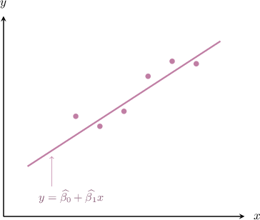
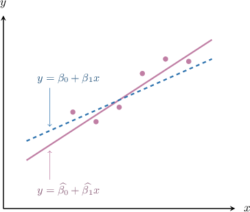
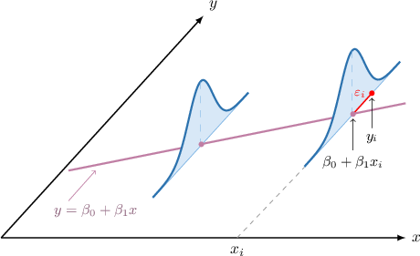

# Confidence Intervals for Linear Regression Slope Parameters

Source: https://www.mathacademy.com/topics/3322?courseId=73
Topic ID: 3322

## Prerequisites

- [Linear Regression](./1057-linear-regression.md)
- [Residuals and Residual Plots](./3595-residuals-and-residual-plots.md)
- [Confidence Intervals for One Mean: Unknown Population Variance](./3855-confidence-intervals-for-one-mean-unknown-population-variance.md)

## Lesson

### Introduction

Suppose we conduct a random sample of $n$ of *paired* observations $(x_i,y_i)$ drawn from a population.

$$

(x_1,y_1), \quad (x_2,y_2), \quad \ldots, \quad (x_n,y_n)

$$

Using previously discussed techniques, we can calculate the linear regression line for this data, which we'll denote as

$$

y = \widehat{\beta_0} + \widehat{\beta_1} x.

$$

Our *estimates* for the **slope parameter** $\widehat{\beta_1}$ and **intercept parameter** $\widehat{\beta_0}$ are given by

$$

\widehat{\beta_1} = \dfrac{S_{xy}}{S_{xx}}, \qquad \widehat{\beta_0} = \overline{y} - \widehat{\beta_1}\overline{x},

$$

where $\overline{x}$ and $\overline{y}$ are the mean values of $x_i$ and $y_i,$ and the quantities $S_{xx}$ and $S_{xy}$ are given by

$$

S_{xx} = \sum_{i=1}^n (x_i-\overline{x})^2, \qquad S_{xy} = \sum_{i=1}^n (x_i-\overline{x})(y_i-\overline{y}).

$$

Plotting our regression line alongside the sample data, we might get a diagram similar to the following:

Notice that we referred to $\widehat{\beta_0}$ and $\widehat{\beta_1}$ as *estimates*. This is because if we were to conduct a census on the population, we'd be able to calculate the "true" regression equation for the data that considers every population member. We'll denote this "true" regression line as

$$

y = \beta_0 + \beta_1 x.

$$

The two lines are shown below.

To summarize,

- the regression equation $y = \widehat{\beta_0} + \widehat{\beta_1} x$ is an estimate of the true regression equation $y = \beta_0 + \beta_1 x,$

- $\widehat{\beta_1}$ is an estimate of the "true" slope parameter $\beta_1,$ and

- $\widehat{\beta_0}$ is an estimate of the "true" intercept parameter $\beta_0.$

In this lesson, we will learn how to construct confidence intervals for the slope parameter $\beta_1.$

### Summary of the Key Result

Given a value $\alpha$ between $0$ and $1,$ the corresponding $[100(1-\alpha)]\%$ confidence interval for the slope $\beta_1$ of our model can be written as

$$

\widehat{\,\beta}_1 \: \pm \: \overbrace{t_{n-2,\alpha/2} \cdot \textrm{SE}[\widehat{\,\beta}_1\,] }^{\textrm{margin of error}}.

$$

Note the following:

- $\!\widehat{\,\beta}_1$ is our point estimate for the slope, computed by fitting the data points from our sample.

- $P(T > t_{n-2,\alpha/2}) = \dfrac{\alpha}{2},$ where $T$ has a student's $t$-distribution with $n-2$ degrees of freedom.

- $\textrm{SE}[\widehat{\,\beta}_1\,]$ is the standard error of $\widehat{\,\beta}_1,$ given by where we have: $\textrm{MSE}$ is the so-called **mean squared error** of the model, given by where $\widehat{\,y}_i$ is the estimate of $y_i$ given by our regression model. $S_{xx}$ is the usual sum of squares formula:

The derivation of this result is rather long, and we leave it until the end of the lesson. For now, note the following:

- Each data point in the sample has some *residual* (i.e., error) associated with it. The error of our regression model at the data point $(x_i,y_i)$ is given by

- The expression $\displaystyle\sum\limits_{i=1}^n (y_i - \widehat{\,y}_i)^2$ gives the sum of the squared residuals of our regression model.

- Even considering the entire population, the data points will not fall on a perfectly straight line. Thus, errors are present even in the "true" regression model. These errors have some (unknown) variance, which we'll denote as $\sigma^2.$

- It can be shown that the $\textrm{MSE}$ is an *unbiased* estimator of $\sigma^2.$

### Example: Finding Confidence Intervals for Slope Parameters

#### Question

Let $\widehat{\,y}=\widehat{\,\beta}_0+\widehat{\,\beta}_1x=1.6+0.7 x$ be the regression line fitted using a sample $(x_1,y_1), \: \ldots, \: (x_{8},y_{8})$ of $n=8$ paired observations. Assuming that all conditions for the simple regression model are satisfied, the mean square error of the model is $1.25,$ and $S_{xx} = \sum_{i=1}^n (x_i - \overline{x})^2 = 42,$ find a $90\%$ confidence interval for the slope of the regression line.

**

#### Explanation

We use the following notations:

- $y=\beta_0 + \beta_1 x$ is the regression line that best fits the population, and

- $\widehat{\,y}=\widehat{\,\beta}_0+\widehat{\,\beta}_1x$ is the estimate of the "true" regression line given by the data in our sample.

In this case, we have that

$$

\widehat{\,y}=\widehat{\,\beta}_0+\widehat{\,\beta}_1x=1.6+0.7 x.

$$

We are told that all assumptions for a simple regression model are held. So, given a value $\alpha$ between $0$ and $1,$ the corresponding $[100(1-\alpha)]\%$ confidence interval for the slope $\beta_1$ of our model can be written as

$$

\widehat{\,\beta}_1 \: \pm \: \overbrace{t_{n-2,\alpha/2} \cdot \textrm{SE}[\widehat{\,\beta}_1\,] }^{\textrm{margin of error}}.

$$

Note the following:

- $\!\widehat{\,\beta}_1$ is our point estimate for the slope, computed using the data points from our sample.

- $P(T > t_{n-2,\alpha/2}) = \dfrac{\alpha}{2},$ where $T$ has a student's $t$-distribution with $n-2$ degrees of freedom.

- $\textrm{SE}[\widehat{\,\beta}_1\,]$ is the standard error of $\widehat{\,\beta}_1,$ given by where we have: $\textrm{MSE}$ is the mean squared error of the model: where $\widehat{\,y}_i$ is the estimate of $y_i$ given by our regression model. $S_{xx}$ is the usual sum of squares formula:

To construct the confidence interval, we proceed as follows:

- **** Find the point estimate. From the regression equation $\widehat{\,y}=1.6+0.7 x,$ our point estimate is

- **** Find the margin of error. Since we are interested in finding a $90\%$ confidence interval, we have We are given that $P(T > 1.943) = 0.05.$ As a result, Now, we can compute the margin of error:

- **** Determine the limits of the confidence interval:

### Example: Finding Confidence Intervals in Context

#### Question

The table above shows the number of hours each of four students spent studying for a biology exam and the grades they finally obtained on that exam. The corresponding fitted linear regression line using this sample is $\widehat{\,y} = 21.3 + 10x.$ Assuming that all conditions for the simple regression model are satisfied, $\overline{x}=5,$ and $\textrm{MSE}=1.375,$ find a $90\%$ confidence interval for the slope of the regression line.

**

$$

\textrm{SE}[\widehat{\,\beta}_1\,] = \sqrt{ \dfrac{\textrm{MSE}}{S_{xx}}}.

$$

#### Explanation

We use the following notations:

- $y=\beta_0 + \beta_1 x$ is the regression line that best fits the population, and

- $\widehat{\,y}=\widehat{\,\beta}_0+\widehat{\,\beta}_1x$ is the estimate of the "true" regression line given by the data in our sample.

In this case, we have that

$$

\widehat{\,y}=\widehat{\,\beta}_0+\widehat{\,\beta}_1x = 21.3 + 10x.

$$

We are told that all assumptions for a simple regression model are held. So, given a value $\alpha$ between $0$ and $1,$ the corresponding $[100(1-\alpha)]\%$ confidence interval for the slope $\beta_1$ of our model can be written as

$$

\widehat{\,\beta}_1 \: \pm \: \overbrace{t_{n-2,\alpha/2} \cdot \textrm{SE}[\widehat{\,\beta}_1\,] }^{\textrm{margin of error}}.

$$

Note the following:

- $\!\widehat{\,\beta}_1$ is our point estimate for the slope, computed using the data points from our sample.

- $P(T > t_{n-2,\alpha/2}) = \dfrac{\alpha}{2},$ where $T$ has a student's $t$-distribution with $n-2$ degrees of freedom.

- $\textrm{SE}[\widehat{\,\beta}_1\,]$ is the standard error of $\widehat{\,\beta}_1,$ given by where we have: $\textrm{MSE}$ is the mean squared error of the model: where $\widehat{\,y}_i$ is the estimate of $y_i$ given by our regression model. $S_{xx}$ is the usual sum of squares formula:

To construct the confidence interval, we proceed as follows:

- **** Find the point estimate. From the regression equation $\widehat{\,y} = 21.3 + 10x,$ our point estimate is

- **** Find the margin of error. Since we are interested in finding a $90\%$ confidence interval, we have We are given that $P(T > 2.92) = 0.05.$ As a result, Computing $S_{xx},$ we get Now, we can compute the margin of error:

- **** Determine the limits of the confidence interval:

### Deriving an Expression for the Confidence Interval

We'll now derive our expression for the confidence interval for our slope parameter estimate $\widehat{\beta_1}.$

Suppose we conduct a random sample of $n$ of *paired* observations $(x_i,y_i).$

$$

(x_1,y_1), \quad (x_2,y_2), \quad \ldots, \quad (x_n,y_n)

$$

Let's assume that our "global" regression line (i.e., the line that best fits the entire population) is given by

$$

y = \beta_0 + \beta_1 x.

$$

For each $i=1,2,\ldots,n,$ let

$$

y_i = \beta_0 + \beta_1 x_i + \epsilon_i,

$$

where we assume that the error terms $\epsilon_i$ are I.I.D, and

$$

\epsilon_i \sim N(0, \sigma^2)

$$

for some unknown variance $\sigma^2.$ The error terms and their distribution can be visualized as shown below.

This means that each $y_i$ is a normally distributed random variable with

$$

y_i \sim N\left( \beta_0 + \beta_1 x_i , \sigma^2\right).

$$

It can be shown that

$$

\textrm E[\widehat{\beta}_1] = \beta_1, \qquad \textrm{Var}[\widehat{\beta_1}] = \dfrac{\sigma^2}{S_{xx}}.

$$

We'll derive these results separately in a while. But for now, we'll simply state them.

Using these results, we can express the distribution of $\widehat{\beta_1}$ as

$$

\widehat{\beta}_1 \sim N\left(\beta_1, \: \dfrac{\sigma^2}{S_{xx}} \right).

$$

We do not know $\sigma^2,$ the variance of the error terms. However, it can be shown that the mean squared error, given by

$$

\textrm{MSE} = \dfrac{1}{n-2}\sum\limits_{i=1}^n (y_i - \widehat{\,y}_i)^2,

$$

is an unbiased estimator of $\sigma^2.$

Our estimate of the standard error of $\widehat{\beta}_1$ is now given by

$$

\textrm{SE}[\widehat{\beta}_1] = \sqrt{\dfrac{\textrm{MSE}}{S_{xx}}}.

$$

Since this is an *estimate* of the standard error, it can be shown that the random variable

$$

\dfrac{\widehat{\beta}_1 -\beta_1}{\textrm{SE}[\widehat{\beta_1}] }

$$

follows a student's $t$-distribution with $n-2$ degrees of freedom.

Finally, given a value $\alpha$ between $0$ and $1,$ the corresponding $[100(1-\alpha)]\%$ confidence interval for the slope $\beta_1$ of our model can be written as

$$

\widehat{\,\beta}_1 \: \pm \: \overbrace{t_{n-2,\alpha/2} \cdot \textrm{SE}[\widehat{\,\beta}_1\,] }^{\textrm{margin of error}}.

$$

### Expectation and Variance of Slope Parameter Estimates

Earlier, we made use of the following results:

$$

\textrm E[\widehat{\beta}_1] = \beta_1, \qquad \textrm{Var}[\widehat{\beta_1}] = \dfrac{\sigma^2}{S_{xx}}

$$

Let's now derive these. First, we will show that

$$

S_{xy} = \sum_{i=1}^n (x_i-\overline{x})y_i.

$$

We can show this is true using some straightforward manipulations of the summation, as follows:

$$

\begin{aligned}𝑆_{𝑥𝑦} & =\underset{\underset{𝑖=1}{∑}}{\overset{}{𝑛}}(𝑥_{𝑖}−\overset{𝑥}{})(𝑦_{𝑖}−\overset{𝑦}{–}) \\ & =\underset{\underset{𝑖=1}{∑}}{\overset{}{𝑛}}(𝑥_{𝑖}−\overset{𝑥}{})𝑦_{𝑖}−\underset{\underset{𝑖=1}{∑}}{\overset{}{𝑛}}(𝑥_{𝑖}−\overset{𝑥}{})\overset{𝑦}{–} \\ & =\underset{\underset{𝑖=1}{∑}}{\overset{}{𝑛}}(𝑥_{𝑖}−\overset{𝑥}{})𝑦_{𝑖}−\overset{𝑦}{–}\underset{\underset{𝑖=1}{∑}}{\overset{}{𝑛}}(𝑥_{𝑖}−\overset{𝑥}{}) \\ & =\underset{\underset{𝑖=1}{∑}}{\overset{}{𝑛}}(𝑥_{𝑖}−\overset{𝑥}{})𝑦_{𝑖}−\overset{𝑦}{–}\underset{\underset{𝑖=1}{∑}}{\overset{}{𝑛}}𝑥_{𝑖}+\overset{𝑦}{–}\underset{\underset{𝑖=1}{∑}}{\overset{}{𝑛}}\overset{𝑥}{} \\ & =\underset{\underset{𝑖=1}{∑}}{\overset{}{𝑛}}(𝑥_{𝑖}−\overset{𝑥}{})𝑦_{𝑖}−\overset{𝑦}{–}\underset{\underset{𝑖=1}{∑}}{\overset{}{𝑛}}𝑥_{𝑖}+\overset{𝑦}{–}𝑛\overset{𝑥}{} \\ & =\underset{\underset{𝑖=1}{∑}}{\overset{}{𝑛}}(𝑥_{𝑖}−\overset{𝑥}{})𝑦_{𝑖}−\overset{𝑦}{–}\underset{\underset{𝑖=1}{∑}}{\overset{}{𝑛}}𝑥_{𝑖}+\overset{𝑦}{–}\underset{\underset{𝑖=1}{∑}}{\overset{}{𝑛}}𝑥_{𝑖} \\ & =\underset{\underset{𝑖=1}{∑}}{\overset{}{𝑛}}(𝑥_{𝑖}−\overset{𝑥}{})𝑦_{𝑖}.\end{aligned}

$$

Using our result for $S_{xy},$ we can write

$$

\begin{aligned}\overset{𝛽_{1}}{ˆ}=\frac{𝑆_{𝑥𝑦}}{𝑆_{𝑥𝑥}}=\underset{\underset{𝑖=1}{∑}}{\overset{}{𝑛}}𝑘_{𝑖}𝑦_{𝑖}\end{aligned}

$$

where

$$

k_i = \dfrac{ x_i-\overline{x}}{S_{xx}}.

$$

The following properties can be shown using straightforward algebra:

- $\displaystyle \sum_{i=1}^n k_i=0$

- $\displaystyle \sum_{i=1}^n k_i x_i=1$

- $\displaystyle \sum_{i=1}^n k_i^2=\dfrac{1}{S_{xx}}$

Now, we compute the mean and variance of $\widehat{\beta_1}$ as follows:

- For the mean, we have Note that we used the properties of $k_i$ discussed previously.

- For the variance, we have

So, finally, we have

$$

\widehat{\beta_1} \sim N\left(\beta_1, \dfrac{\sigma^2}{S_{xx}}\right).

$$
