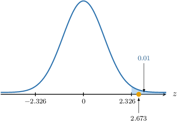
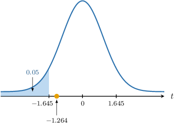
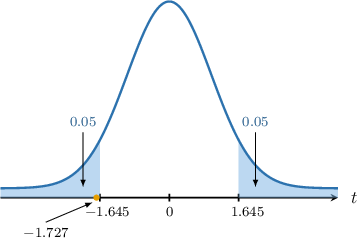
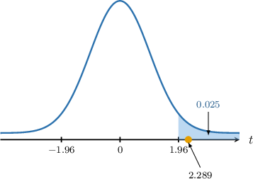

# Hypothesis Tests for Two Proportions

Source: https://www.mathacademy.com/topics/3324?courseId=73
Topic ID: 3324

## Prerequisites

- [Hypothesis Tests for Two Means: Equal But Unknown Population Variances](./3313-hypothesis-tests-for-two-means-equal-but-unknown-population-variances.md)
- [Point Estimates of Population Proportions](./3932-point-estimates-of-population-proportions.md)

## Lesson

### Introduction

In this lesson, we'll learn how to conduct hypothesis tests for the difference between two population proportions.

Suppose we have two populations. Let the proportion of individuals in the first and second populations with a particular characteristic be $p_1$ and $p_2,$ respectively. Independent random samples of size $n_1$ and $n_2$ are drawn from each population.

Suppose the sample sizes are sufficiently large such that

$$

n_i \cdot \widehat{\,p}_i > 5, \qquad n_i\cdot (1-\widehat{\,p}_i)>5, \qquad i=1,2.

$$

Then, we know that the sampling distributions of our estimates $\widehat{\,p}_1$ and $\widehat{\,p}_2$ of $p_1$ and $p_2$ respectively are given by

$$

\widehat{\,p}_1 \sim N\left(p_1, \dfrac{p_1(1-p_1)}{n_1}\right), \qquad \widehat{\,p}_2 \sim N\left(p_2, \dfrac{p_2(1-p_2)}{n_2}\right).

$$

Since the samples are independent, by the properties of expectation and variance, we have

$$

\textrm E [\widehat{\,p}_1 - \widehat{\,p}_2] = p_1 - p_2, \qquad \text{Var} [\widehat{\,p}_1 - \widehat{\,p}_2] = \dfrac{p_1(1-p_1)}{n_1} + \dfrac{p_2(1-p_2)}{n_2}.

$$

Since $\widehat{\,p}_1$ and $\widehat{\,p}_2$ are normally distributed, their difference is also normal, and we have

$$

\widehat{\,p}_1 - \widehat{\,p}_2 \sim N\left(p_1 - p_2, \dfrac{p_1(1-p_1)}{n_1} + \dfrac{p_2(1-p_2)}{n_2}\right).

$$

In most practical situations, $p_1$ and $p_2$ are unknown. However, we can approximate the above distribution using estimates obtained from sample data. Thus, we can write

$$

\dfrac{(\widehat{\,p}_1 - \widehat{\,p}_2) - (p_1-p_2)}{\sqrt{\dfrac{\widehat{\,p}_1(1-\widehat{\,p}_1)}{n_1}+\dfrac{\widehat{\,p}_2(1-\widehat{\,p}_2)}{n_2}}\phantom{|}} \sim N(0,1).

$$

### Pooled vs. Unpooled Estimates of Proportion

Suppose we wish to carry out the following hypothesis test:

- $H_0: p_1 = p_2$

- $H_1: p_1 > p_2$

As we just saw, the variance of the difference between the two sampling distributions is

$$

\text{Var}[\widehat{\,p}_1 - \widehat{\,p}_2] = \dfrac{p_1(1-p_1)}{n_1} + \dfrac{p_2(1-p_2)}{n_2}.

$$

Now, under the null hypothesis, the two proportions are equal. Thus, assuming that $H_0$ is true, we can set

$$

p_1 = p_2 = p

$$

which gives

$$

\begin{aligned}Var[\overset{\,𝑝}{ˆ}_{1}−\overset{\,𝑝}{ˆ}_{2}] & =\frac{𝑝(1−𝑝)}{𝑛_{1}}+\frac{𝑝(1−𝑝)}{𝑛_{2}}\end{aligned}

$$

which simplifies to

$$

\begin{aligned}Var[\overset{\,𝑝}{ˆ}_{1}−\overset{\,𝑝}{ˆ}_{2}] & =𝑝(1−𝑝)(\frac{1}{𝑛_{1}}+\frac{1}{𝑛_{2}}).\end{aligned}

$$

Since the two proportions are equal under the null hypothesis, we can use a **pooled estimate** $\overline{p}$ of the shared proportion $p$ to form a point estimate.

$$

\overline{p} = \dfrac{x_1+x_2}{n_1+n_2} = \dfrac{n_1\widehat{\,p}_1+n_2\widehat{\,p}_2}{n_1+n_2}

$$

where $x_1$ and $x_2$ give the number of sample elements from the first and second samples, respectively, with the characteristic.

Thus, our estimate for the variance is

$$

\text{Var}[\widehat{\,p}_1 - \widehat{\,p}_2] =\overline{p}(1-\overline{p})\left(\dfrac{1}{n_1} + \dfrac{1}{n_2}\right).

$$

This is similar to the pooled variance estimate we saw in a previous lesson.

As a result, we can use the following normal approximation:

$$

\dfrac {(\widehat{\,p}_1 - \widehat{\,p}_2) - (p_1-p_2)} {\sqrt{\overline{p}(1-\overline{p}) \left( \dfrac{1}{n_1}+\dfrac{1}{n_2} \right) } \phantom{|}} \sim N(0,1)

$$

Note the following:

- A pooled variance estimate is preferable to an unpooled estimate when the null hypothesis assumes $p_1 = p_2.$ It can be shown that the standard error of the pooled estimate is lower than the unpooled one, making our hypothesis test more reliable.

- On the other hand, suppose we have the following null hypothesis: In this case, the variances cannot be assumed equal, and we must use an unpooled estimate for the variance, i.e.,

In this lesson, we'll only consider null hypotheses of the form $p_1 = p_2.$

### A Worked Example

Consider two samples of sizes $n_1=60$ and $n_2=90$ from two large populations where some individuals have a particular characteristic. Given that the samples are independent and the numbers of individuals having the characteristic in the two samples are $x_1=24$ and $x_2=18,$ respectively, we wish to carry out a hypothesis test at the $1\%$ significance level to determine whether there is sufficient evidence that the proportion $p_1$ of individuals having the characteristic in the first population is larger than the corresponding proportion $p_2$ in the second population.

Since $n_1=60,$ $n_2=90,$ $x_1=24,$ $x_2=18,$ we have that

- $\widehat{\,p}_1 = \dfrac{x_1}{n_1} = \dfrac{24}{60} = \dfrac{2}{5},$

- $\widehat{\,p}_2 = \dfrac{x_2}{n_2} = \dfrac{18}{90} = \dfrac{1}{5}$

and

- $n_1 \widehat{\,p}_1 = 60 \cdot \dfrac{2}{5} = 24 > 5,$

- $n_1(1-\widehat{\,p}_1) = 60 \cdot \left(1-\dfrac{2}{5}\right) = 36 > 5,$

- $n_2 \widehat{\,p}_2 = 90 \cdot \dfrac{1}{5} = 18 > 5,$

- $n_2(1-\widehat{\,p}_2) = 90 \cdot \left(1-\dfrac{1}{5}\right) = 72 > 5.$

As a result, we may use a normal approximation:

$$

\dfrac {(\widehat{\,p}_1 - \widehat{\,p}_2) - (p_1-p_2)} {\sqrt{\overline{p}(1-\overline{p}) \left( \dfrac{1}{n_1}+\dfrac{1}{n_2} \right) } \phantom{|}} \sim N(0,1),

$$

where

- $\overline{p}=\dfrac{x_1+x_2}{n_1+n_2}=\dfrac{n_1\widehat{\,p}_1+n_2\widehat{\,p}_2}{n_1+n_2}$ is the pooled sample proportion,

- $\!\widehat{\,p}_1, \widehat{\,p}_2$ are the sample proportions,

- $p_1, p_2$ are the population proportions,

- $n_1, n_2$ are the sample sizes,

- $x_1, x_2$ are the numbers of elements in samples possessing the given characteristics.

In our example, the null and alternative hypotheses are the following:

- $H_0: p_1 = p_2$ is the null hypothesis (the population proportions are equal)

- $H_1: p_1 > p_2$ is the alternative (one-tailed) hypothesis (the first population proportion is larger)

First, we compute the pooled sample proportion:

$$

\overline{p}=\dfrac{x_1+x_2}{n_1+n_2} = \dfrac{24+18}{60+90} = \dfrac{7}{25}

$$

Assuming the null hypothesis, i.e., $p_1-p_2=0,$ we compute the test statistic:

$$

\begin{aligned}𝑧 & =\frac{(\overset{\,𝑝}{ˆ}_{1}−\overset{\,𝑝}{ˆ}_{2})−(𝑝_{1}−𝑝_{2})}{\sqrt{\overset{𝑝}{–}(1−\overset{𝑝}{–})(\frac{1}{𝑛_{1}}+\frac{1}{𝑛_{2}})}|} \\ & =\frac{(\frac{2}{5}−\frac{1}{5})−(0)}{5} \\ & ≈2.673\end{aligned}

$$

Next, we determine the critical region corresponding to our significance level.

The table above shows the $z$-scores $z_p$ such that $P(Z > z_p) = p$ for some particular values of $p,$ where $Z\sim N(0,1).$

According to the table, the $1\%$ one-tailed critical value is $z \approx 2.326.$ Since the alternative hypothesis is $p_1 \gt p_2,$ we must consider the right tail. So, our critical region is

$$

Z \geq 2.326.

$$

Finally, notice that our test statistic ($2.673$) lies in the critical region, as shown below.

So, we reject the null hypothesis $H_0.$ As a result, we conclude that there is *sufficient* evidence that, at the $1\%$ level of significance, we have $p_1 \gt p_2.$

### Example: Conducting a One-Tailed Hypothesis for Two Proportions

#### Question

Consider two samples of sizes $n_1=90$ and $n_2=70$ from two large populations where some individuals have a particular characteristic. You're given that the samples are independent and the numbers of individuals having the characteristic in the two samples are $x_1=18$ and $x_2=20,$ respectively.

Carry out a hypothesis test at the $5\%$ significance level to determine whether there is sufficient evidence that the proportion $p_1$ of individuals having the characteristic in the first population is smaller than the corresponding proportion $p_2$ in the second population.

The table below shows the $z$-scores $z_p$ such that $P(Z > z_p) = p$ for some particular values of $p,$ where $Z\sim N(0,1).$

#### Explanation

Since $n_1=90,$ $n_2=70,$ $x_1=18,$ $x_2=20,$ we have that

- $\widehat{\,p}_1 = \dfrac{x_1}{n_1} = \dfrac{18}{90} = \dfrac{1}{5},$

- $\widehat{\,p}_2 = \dfrac{x_2}{n_2} = \dfrac{20}{70} = \dfrac{2}{7}$

and

- $n_1 \widehat{\,p}_1 = 90 \cdot \dfrac{1}{5} = 18 > 5,$

- $n_1(1-\widehat{\,p}_1) = 90 \cdot \left(1-\dfrac{1}{5}\right) = 72 > 5,$

- $n_2 \widehat{\,p}_2 = 70 \cdot \dfrac{2}{7} = 20 > 5,$

- $n_2(1-\widehat{\,p}_2) = 90 \cdot \left(1-\dfrac{2}{7}\right) = 50 > 5.$

As a result, we may use a normal approximation:

$$

\dfrac {(\widehat{\,p}_1 - \widehat{\,p}_2) - (p_1-p_2)} {\sqrt{\overline{p}(1-\overline{p}) \left( \dfrac{1}{n_1}+\dfrac{1}{n_2} \right) } \phantom{|}} \sim N(0,1),

$$

where

- $\overline{p}=\dfrac{x_1+x_2}{n_1+n_2}=\dfrac{n_1\widehat{\,p}_1+n_2\widehat{\,p}_2}{n_1+n_2}$ is the pooled sample proportion,

- $\!\widehat{\,p}_1, \widehat{\,p}_2$ are the sample proportions,

- $p_1, p_2$ are the population proportions,

- $n_1, n_2$ are the sample sizes,

- $x_1, x_2$ are the numbers of elements in samples possessing the given characteristics.

In our example:

- $H_0: p_1 = p_2$ is the null hypothesis (the population proportions are equal)

- $H_1: p_1 < p_2$ is the alternative (one-tailed) hypothesis (the first population proportion is smaller)

First, we compute the pooled sample proportion:

$$

\overline{p}=\dfrac{x_1+x_2}{n_1+n_2} = \dfrac{18+20}{90+70} = \dfrac{19}{80}

$$

Assuming the null hypothesis, i.e., $p_1-p_2=0,$ we compute the test statistic:

$$

\begin{aligned}𝑧 & =\frac{(\overset{\,𝑝}{ˆ}_{1}−\overset{\,𝑝}{ˆ}_{2})−(𝑝_{1}−𝑝_{2})}{\sqrt{\overset{𝑝}{–}(1−\overset{𝑝}{–})(\frac{1}{𝑛_{1}}+\frac{1}{𝑛_{2}})}|} \\ & =\frac{(\frac{1}{5}−\frac{2}{7})−(0)}{5} \\ & ≈−1.264\end{aligned}

$$

According to the table, the $5\%$ one-tailed critical value is $z \approx 1.645.$

Since the alternative hypothesis is $p_1 \lt p_2,$ we must consider the left tail. So, our critical region is

$$

Z \leq -1.645.

$$

Our test statistic ($-1.264$) lies outside the critical region, as shown below.

So, we do not reject the null hypothesis $H_0.$ As a result, we conclude the following:

$\qquad$ **insufficient**

### Example: Conducting a Two-Tailed Hypothesis for Two Proportions

#### Question

Consider two samples of sizes $n_1=70$ and $n_2=80$ from two large populations where some individuals have a particular characteristic. You're given that the samples are independent and the proportions of individuals having the characteristic in the two samples are $\widehat{\,p}_1=0.8$ and $\widehat{\,p}_2=0.9,$ respectively.

Carry out a hypothesis test at the $10\%$ significance level to determine whether there is sufficient evidence that the proportion $p_1$ of individuals having the characteristic in the first population does not equal the corresponding proportion $p_2$ in the second population.

The table below shows the $z$-scores $z_p$ such that $P(Z > z_p) = p$ for some particular values of $p,$ where $Z\sim N(0,1).$

#### Explanation

Since $n_1=70,$ $n_2=80,$ $\widehat{\,p}_1=0.8,$ $\widehat{\,p}_2=0.9,$ we have that

- $n_1 \widehat{\,p}_1 = 70 \cdot 0.8 = 56> 5,$

- $n_1(1-\widehat{\,p}_1) = 70 \cdot \left(1-0.8\right) = 14 > 5,$

- $n_2 \widehat{\,p}_2 = 80 \cdot 0.9 = 72 > 5,$

- $n_2(1-\widehat{\,p}_2) = 80 \cdot \left(1-0.9\right) = 8 > 5.$

As a result, we may use a normal approximation:

$$

\dfrac {(\widehat{\,p}_1 - \widehat{\,p}_2) - (p_1-p_2)} {\sqrt{\overline{p}(1-\overline{p}) \left( \dfrac{1}{n_1}+\dfrac{1}{n_2} \right) } \phantom{|}} \sim N(0,1),

$$

where

- $\overline{p}=\dfrac{x_1+x_2}{n_1+n_2}=\dfrac{n_1\widehat{\,p}_1+n_2\widehat{\,p}_2}{n_1+n_2}$ is the pooled sample proportion,

- $\!\widehat{\,p}_1, \widehat{\,p}_2$ are the sample proportions,

- $p_1, p_2$ are the population proportions,

- $n_1, n_2$ are the sample sizes,

- $x_1, x_2$ are the numbers of elements in samples possessing the given characteristics.

In our example:

- $H_0: p_1 = p_2$ is the null hypothesis (the population proportions are equal)

- $H_1: p_1 \neq p_2$ is the alternative (two-tailed) hypothesis (the population proportions are distinct)

First, we compute the pooled sample proportion:

$$

\overline{p}=\dfrac{n_1\widehat{\,p}_1+n_2\widehat{\,p}_2}{n_1+n_2} =\dfrac{56+72}{70+80} = \dfrac{64}{75}

$$

Assuming the null hypothesis, i.e., $p_1-p_2=0,$ we compute the test statistic:

$$

\begin{aligned}𝑧 & =\frac{(\overset{\,𝑝}{ˆ}_{1}−\overset{\,𝑝}{ˆ}_{2})−(𝑝_{1}−𝑝_{2})}{\sqrt{\overset{𝑝}{–}(1−\overset{𝑝}{–})(\frac{1}{𝑛_{1}}+\frac{1}{𝑛_{2}})}|} \\ & =\frac{(0.8−0.9)−(0)}{\sqrt{\frac{64}{75}(1−\frac{64}{75})(\frac{1}{70}+\frac{1}{80})}|} \\ & ≈−1.727\end{aligned}

$$

According to the table, the $10\%$ two-tailed critical value (the same as the $10\% \div 2 = 5\%$ one-tailed critical value) is $z \approx 1.645.$

Since we are considering both tails, our critical region is

$$

Z \leq {-1.645} \qquad \text{or} \qquad Z \geq {1.645}.

$$

Our test statistic ($-1.727$) lies in the critical region, as shown below.

So, we reject the null hypothesis $H_0.$ As a result, we conclude the following:

$\qquad$ **sufficient**

### Example: Testing a Hypothesis for Differences in Proportions: Applications

#### Question

A bank wants to check if the proportion of approved loan applications in Branch A is higher than in Branch B. The summary statistics of two samples of loan applications from each branch are given in the table below, where $n$ is the sample size of the surveyed loan applications, and $x$ is the number of approved applications in the respective sample.

Carry out a hypothesis test at the $2.5\%$ significance level to determine whether there is sufficient evidence that the proportion $p_1$ of approved loan applications in Branch A is higher than the corresponding proportion $p_2$ in Branch B.

The table below shows the $z$-scores $z_p$ such that $P(Z > z_p) = p$ for some particular values of $p,$ where $Z\sim N(0,1).$ Using this information, complete the following statements.

#### Explanation

Since $n_1=600,$ $n_2=500,$ $x_1=400,$ $x_2=300,$ we have that

- $\widehat{\,p}_1 = \dfrac{x_1}{n_1} = \dfrac{400}{600} = \dfrac{2}{3},$

- $\widehat{\,p}_2 = \dfrac{x_2}{n_2} = \dfrac{300}{500} = \dfrac{3}{5}$

and

- $n_1 \widehat{\,p}_1 = 600 \cdot \dfrac{2}{3} = 400 > 5,$

- $n_1(1-\widehat{\,p}_1) = 600 \cdot \left(1-\dfrac{2}{3}\right) = 200 > 5,$

- $n_2 \widehat{\,p}_2 = 500 \cdot \dfrac{3}{5} = 300> 5,$

- $n_2(1-\widehat{\,p}_2) = 500 \cdot \left(1-\dfrac{3}{5}\right) = 200 > 5.$

As a result, we may use a normal approximation:

$$

\dfrac {(\widehat{\,p}_1 - \widehat{\,p}_2) - (p_1-p_2)} {\sqrt{\overline{p}(1-\overline{p}) \left( \dfrac{1}{n_1}+\dfrac{1}{n_2} \right) } \phantom{|}} \sim N(0,1),

$$

where

- $\overline{p}=\dfrac{x_1+x_2}{n_1+n_2}=\dfrac{n_1\widehat{\,p}_1+n_2\widehat{\,p}_2}{n_1+n_2}$ is the pooled sample proportion,

- $\!\widehat{\,p}_1, \widehat{\,p}_2$ are the sample proportions,

- $p_1, p_2$ are the population proportions,

- $n_1, n_2$ are the sample sizes,

- $x_1, x_2$ are the numbers of elements in samples possessing the given characteristics.

In our example:

- $H_0: p_1 = p_2$ is the null hypothesis (the population proportions are equal)

- $H_1: p_1 > p_2$ is the alternative (one-tailed) hypothesis (the first population proportion is larger)

First, we compute the pooled sample proportion:

$$

\overline{p}=\dfrac{x_1+x_2}{n_1+n_2} = \dfrac{400+300}{600+500} = \dfrac{7}{11}

$$

Assuming the null hypothesis, i.e., $p_1-p_2=0,$ we compute the test statistic:

$$

\begin{aligned}𝑧 & =\frac{(\overset{\,𝑝}{ˆ}_{1}−\overset{\,𝑝}{ˆ}_{2})−(𝑝_{1}−𝑝_{2})}{\sqrt{\overset{𝑝}{–}(1−\overset{𝑝}{–})(\frac{1}{𝑛_{1}}+\frac{1}{𝑛_{2}})}|} \\ & =\frac{(\frac{2}{3}−\frac{3}{5})−(0)}{3} \\ & ≈2.289\end{aligned}

$$

According to the table, the $2.5\%$ one-tailed critical value is $z \approx 1.960.$

Since the alternative hypothesis is $p_1 \gt p_2,$ we must consider the right tail. So, our critical region is

$$

Z \geq {1.960}.

$$

Our test statistic ($2.289$) lies inside the critical region, as shown below.

So, we reject the null hypothesis $H_0.$ As a result, we conclude the following:

$\qquad$ **sufficient**
