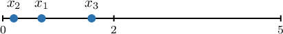
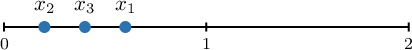
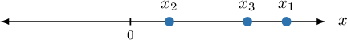
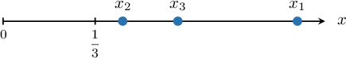

# Introduction to Order Statistics

Source: https://www.mathacademy.com/topics/3326?courseId=73
Topic ID: 3326

## Prerequisites

- [The Continuous Uniform Distribution](./791-the-continuous-uniform-distribution.md)
- [The Normal Distribution](./1843-the-normal-distribution.md)
- [The Exponential Distribution](./3074-the-exponential-distribution.md)
- [Independence of Continuous Random Variables](./3863-independence-of-continuous-random-variables.md)
- [Sampling Distributions](./3864-sampling-distributions.md)

## Lesson

### Introduction

Given an I.I.D random sample from a probability distribution, suppose we needed to know the probability that the third largest value was less than $10,$ or the probability that the second smallest value was greater than $5.$

To find such probabilities, we first need to put the values in the sample in ascending order. This is where we use so-called **order statistics.**

For an I.I.D random sample $X_1, X_2, \ldots X_n,$ the **order statistics** are obtained by arranging the values in ascending order. The **$r$th order statistic**, denoted $X_{(r)},$ is the $r$th smallest value in the ordered sample. Specifically,

- the first order statistic is $X_{(1)} = \min\left\{X_1, X_2, X_3, \ldots, X_n\right\},$

- the second order statistic is $X_{(2)} =$ the second smallest of $\left\{X_1, X_2, X_3, \ldots, X_n\right\},$

- the third order statistic: $X_{(3)} =$ the third smallest of $\left\{X_1, X_2, X_3, \ldots, X_n\right\},$

- $\vdots$

- the $r$th order statistic is $X_{(r)} =$ the $r$th smallest of $\left\{X_1, X_2, X_3, \ldots, X_n\right\},$

- $\vdots$

- the $n$th order statistic is $X_{(n)} = \max\left\{X_1, X_2, X_3, \ldots, X_n\right\}.$

To demonstrate, consider the following sample taken from the I.I.D random sample $X_1, X_2, \ldots, X_5.$

$$

9,\quad 5,\quad 12,\quad 4,\quad 16

$$

What is the third order statistic $x_{(3)}$ for this sample?

To find the third order statistic for this sample, we first sort the numbers in increasing order:

$$

x_{(1)} = 4,\quad x_{(2)} = 5,\quad x_{(3)} = 9,\quad x_{(4)} = 12,\quad x_{(5)} = 16

$$

Therefore, the third order statistic for this sample is $x_{(3)} = 9.$

### Example: Finding an Order Statistic

#### Question

Consider the following sample taken from the I.I.D random sample $X_1, X_2, \ldots, X_6.$

$$

7,\quad 9,\quad 5,\quad 1,\quad 5,\quad 3

$$

What is the third order statistic $x_{(3)}$ for this sample?

#### Explanation

Suppose that $X_1, X_2, \ldots X_n$ is an I.I.D random sample from a probability distribution. The order statistics, denoted $X_{(r)},$ are defined by ranking the values from smallest to largest. Specifically:

- $X_{(1)} = \min\left\{X_1, X_2, X_3, \ldots, X_n\right\}$

- $X_{(2)} =$ the second smallest of $\left\{X_1, X_2, X_3, \ldots, X_n\right\}$

- $X_{(3)} =$ the third smallest of $\left\{X_1, X_2, X_3, \ldots, X_n\right\}$

- $\vdots$

- $X_{(n)} = \max\left\{X_1, X_2, X_3, \ldots, X_n\right\}$

To find the third order statistic for this sample, we first sort the numbers in increasing order:

$$

x_{(1)} = 1,\quad x_{(2)} = 3,\quad x_{(3)} = 5,\quad x_{(4)} = 5,\quad x_{(5)} = 7,\quad x_{(6)} = 9

$$

Therefore, the third order statistic for this sample is $x_{(3)} = 5.$

### Calculating Probabilities Associated With Maximums

Let $X_1$, $X_2$, $X_3$ be three numbers chosen independently and uniformly at random from the interval $[0,5].$ What is the probability that the *maximum* of the three variables is less than $2?$

Suppose that $X_1, X_2, \ldots X_n$ is an I.I.D random sample from a probability distribution. The order statistics, denoted $X_{(r)},$ are defined by ranking the values from smallest to largest. Specifically:

- $X_{(1)} = \min\left\{X_1, X_2, X_3, \ldots, X_n\right\}$

- $X_{(2)} =$ the second smallest of $\left\{X_1, X_2, X_3, \ldots, X_n\right\}$

- $X_{(3)} =$ the third smallest of $\left\{X_1, X_2, X_3, \ldots, X_n\right\}$

- $\quad\vdots$

- $X_{(n)} = \max\left\{X_1, X_2, X_3, \ldots, X_n\right\}$

Now, for *continuous* probability distributions, we may assume that

$$

X_{(1)} < X_{(2)} < X_{(3)} < \cdots < X_{(n)}

$$

since the probability that any order statistics are the same equals zero.

We wish to find $P\left(X_{(3)} < 2\right).$ This can only happen if *all* $X_i$'s in our sample are smaller than $2.$ One such configuration is shown below.

First, we note that since $X_i\sim U[0,5],$ we have

$$

\begin{aligned}𝑃(𝑋_{𝑖}<2) & =𝑃(0<𝑋_{𝑖}<2) \\ & =∫_{20}𝑓(𝑥)\,d𝑥 \\ & =∫_{20}\frac{1}{5}\,d𝑥 \\ & =\frac{2}{5}−0 \\ & =\frac{2}{5}.\end{aligned}

$$

Therefore, since the $X_i$'s are independent, we have

$$

\begin{aligned}𝑃(𝑋_{(3)}<2) & =𝑃(𝑋_{1}<2,𝑋_{2}<2,𝑋_{3}<2) \\ & =𝑃(𝑋_{1}<2)⋅𝑃(𝑋_{2}<2)⋅𝑃(𝑋_{3}<2) \\ & =\frac{2}{5}⋅\frac{2}{5}⋅\frac{2}{5} \\ & =\frac{8}{125}\end{aligned}

$$

Let's see another example.

### Example: Calculating the Probability That the Maximum Is Smaller Than Some Value

#### Question

Let $X_1, X_2, X_3$ be three independent random variables, each chosen from the distribution with the following PDF:

$$

\begin{aligned}\frac{𝑥}{2},\, & 0≤𝑥≤2, \\ 0,\, & otherwise.\end{aligned}

$$

What is the probability that the third order statistic $X_{(3)}$ is less than $1?$

#### Explanation

Suppose that $X_1, X_2, \ldots X_n$ is an I.I.D random sample from a probability distribution. The order statistics, denoted $X_{(r)},$ are defined by ranking the values from smallest to largest. Specifically:

- $X_{(1)} = \min\left\{X_1, X_2, X_3, \ldots, X_n\right\}$

- $X_{(2)} =$ the second smallest of $\left\{X_1, X_2, X_3, \ldots, X_n\right\}$

- $X_{(3)} =$ the third smallest of $\left\{X_1, X_2, X_3, \ldots, X_n\right\}$

- $\quad\vdots$

- $X_{(n)} = \max\left\{X_1, X_2, X_3, \ldots, X_n\right\}$

For continuous probability distributions, we may assume that

$$

X_{(1)} < X_{(2)} < X_{(3)} < \cdots < X_{(n)}

$$

since the probability that any order statistics are the same equals zero.

We wish to find $P\left(X_{(3)} < 1\right).$ This can only happen if ** $X_i$'s in our sample are smaller than $1.$ One such configuration is shown below.

The probability that any one $X_i$ is less than $1$ is

$$

\begin{aligned}𝑃(𝑋_{𝑖}<1) & =𝑃(0<𝑋<1) \\ & =∫_{10}𝑓(𝑥)\,d𝑥 \\ & =∫_{10}\frac{𝑥}{2}\,d𝑥 \\ & =[\frac{𝑥^{2}}{4}]_{10} \\ & =\frac{1}{4}.\end{aligned}

$$

Therefore, since the $X_i$'s are independent, we have

$$

\begin{aligned}𝑃(𝑋_{(3)}<1) & =𝑃(𝑋_{1}<1,𝑋_{2}<1,𝑋_{3}<1) \\ & =𝑃(𝑋_{1}<1)⋅𝑃(𝑋_{2}<1)⋅𝑃(𝑋_{3}<1) \\ & =\frac{1}{4}⋅\frac{1}{4}⋅\frac{1}{4} \\ & =\frac{1}{64}\end{aligned}

$$

### Calculating Probabilities Associated With Minimums

Let $X_1$, $X_2,$ and $X_3$ be three numbers independently chosen from $N(1,2^2).$ What is the approximate probability that the *minimum* of the three variables is at most $0?$

Suppose that $X_1, X_2, \ldots X_n$ is an I.I.D random sample from a probability distribution. The order statistics, denoted $X_{(r)},$ are defined by ranking the values from smallest to largest. Specifically:

- $X_{(1)} = \min\left\{X_1, X_2, X_3, \ldots, X_n\right\}$

- $X_{(2)} =$ the second smallest of $\left\{X_1, X_2, X_3, \ldots, X_n\right\}$

- $X_{(3)} =$ the third smallest of $\left\{X_1, X_2, X_3, \ldots, X_n\right\}$

- $\quad\vdots$

- $X_{(n)} = \max\left\{X_1, X_2, X_3, \ldots, X_n\right\}$

For continuous probability distributions, we may assume that

$$

X_{(1)} < X_{(2)} < X_{(3)} < \cdots < X_{(n)}

$$

since the probability that any order statistics are the same equals zero.

We wish to find $P\left(X_{(1)} \le 0\right).$ To do this, we will first compute the complementary probability and then subtract it from $1{:}$

$$

P\left(X_{(1)} \leq 0\right) = 1 - P\left(X_{(1)} > 0\right).

$$

The event $X_{(1)} > 0$ means that all three numbers $X_1, X_2, X_3$ must be greater than $0.$ One such configuration is shown below.

Since the numbers are chosen independently, we have

$$

\begin{aligned}𝑃(𝑋_{(1)}>0) & =𝑃(𝑋_{1}>0,𝑋_{2}>0,𝑋_{3}>0) \\ & =𝑃(𝑋_{1}>0)⋅𝑃(𝑋_{2}>0)⋅𝑃(𝑋_{3}>0).\end{aligned}

$$

Each $X_i \sim N(1,2^2),$ so, we transform $X$ into a standard normal random variable $Z$ by $z$-scoring:

$$

\begin{aligned}𝑃(𝑋_{𝑖}>0) & =𝑃(𝑍>\frac{0−1}{2}) \\ & =𝑃(𝑍>−0.5)\end{aligned}

$$

Hence, the probability that $X_i > 0$ is

$$

\begin{aligned}𝑃(𝑋_{𝑖}>0) & =𝑃(𝑍>−0.5) \\ & =1−𝑃(𝑍≤−0.5) \\ & =1−Φ(−0.5) \\ & =1−0.3085 \\ & =0.6915.\end{aligned}

$$

Therefore, the probability that all three numbers are greater than $0$ is

$$

P\left(X_{(1)} > 0 \right) = 0.6915 \cdot 0.6915 \cdot 0.6915 \approx 0.3307.

$$

Finally, the desired probability is

$$

P\left(X_{(1)} \leq 0 \right) = 1 - P\left(X_{(1)} > 0\right) \approx 1 - 0.3307 = 0.6693.

$$

Thus, the probability that the minimum of $(X_1, X_2, X_3)$ is at most $0$ is $0.6693.$

### Example: Calculating the Probability That the Minimum Is Smaller Than Some Value

#### Question

Let $X_1$, $X_2,$ and $X_3$ be three independent random variables, each chosen from an exponential distribution with rate parameter $\lambda = 1.$ What is the approximate probability that the minimum of the three variables is at most $\dfrac{1}{3}?$

**

$$

\begin{aligned}𝑒^{−𝑥}, & 𝑥≥0, \\ 0, & otherwise.\end{aligned}

$$

#### Explanation

Suppose that $X_1, X_2, \ldots X_n$ is an I.I.D random sample from a probability distribution. The order statistics, denoted $X_{(r)},$ are defined by ranking the values from smallest to largest. Specifically:

- $X_{(1)} = \min\left\{X_1, X_2, X_3, \ldots, X_n\right\}$

- $X_{(2)} =$ the second smallest of $\left\{X_1, X_2, X_3, \ldots, X_n\right\}$

- $X_{(3)} =$ the third smallest of $\left\{X_1, X_2, X_3, \ldots, X_n\right\}$

- $\quad\vdots$

- $X_{(n)} = \max\left\{X_1, X_2, X_3, \ldots, X_n\right\}$

For continuous probability distributions, we may assume that

$$

X_{(1)} < X_{(2)} < X_{(3)} < \cdots < X_{(n)}

$$

since the probability that any order statistics are the same equals zero.

We wish to find $P\left(X_{(1)} \le \dfrac{1}{3}\right).$ To do this, we will first compute the complementary probability and then subtract it from $1{:}$

$$

P\left(X_{(1)} \leq \dfrac{1}{3}\right) = 1 - P\left(X_{(1)} > \dfrac{1}{3}\right).

$$

The event $X_{(1)} > \dfrac{1}{3}$ means that all three numbers $X_1, X_2, X_3$ must be greater than $\dfrac{1}{3}.$ One such configuration is shown below.

Since the numbers are chosen independently, we have

$$

\begin{aligned}𝑃(𝑋_{(1)}>\frac{1}{3}) & =𝑃(𝑋_{1}>\frac{1}{3},𝑋_{2}>\frac{1}{3},𝑋_{3}>\frac{1}{3}) \\ & =𝑃(𝑋_{1}>\frac{1}{3})⋅𝑃(𝑋_{2}>\frac{1}{3})⋅𝑃(𝑋_{3}>\frac{1}{3}).\end{aligned}

$$

The cumulative distribution function (CDF) of the exponential distribution for $x\geq 0$ is

$$

\begin{aligned}𝐹_{𝑋}(𝑥) & =𝑃(𝑋_{𝑖}≤𝑥) \\ & =∫_{𝑥0}𝑓_{𝑋}(𝑡)\,d𝑡 \\ & =∫_{𝑥0}𝑒^{−𝑡}\,d𝑡 \\ & =1−𝑒^{−𝑥}.\end{aligned}

$$

Thus, the probability that any one variable $X_i > \dfrac{1}{3}$ is

$$

P\left( X_i > \dfrac{1}{3}\right) = 1 - F_X\left(\dfrac{1}{3}\right) = 1- (1 - e^{-1/3}) = e^{-1/3}.

$$

Therefore, the probability that all three numbers are greater than $\dfrac{1}{3}$ is

$$

P\left(X_{(1)} > \dfrac{1}{3}\right) = e^{-1/3} \cdot e^{-1/3} \cdot e^{-1/3} = e^{-1}.

$$

Finally, the desired probability is

$$

P\left(X_{(1)} \leq \dfrac{1}{3}\right) = 1 - P\left(X_{(1)} > \dfrac{1}{3}\right) = 1 - e^{-1} \approx 0.632.

$$

Thus, the probability that the minimum of $(X_1, X_2, X_3)$ is at most $\dfrac{1}{3}$ is $0.632.$
