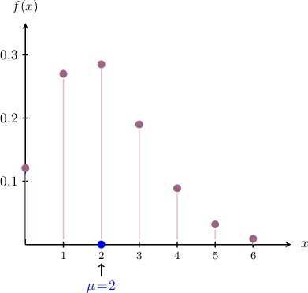

# The Central Limit Theorem

Source: https://www.mathacademy.com/topics/359?courseId=73
Topic ID: 359

## Prerequisites

- [Variance of Continuous Random Variables](./2988-variance-of-continuous-random-variables.md)
- [Sample Means From Normal Populations](./3067-sample-means-from-normal-populations.md)
- [The Binomial Distribution](./3281-the-binomial-distribution.md)

## Lesson

### Introduction

Recall that if $X_1, X_2, \ldots, X_{n}$ is a random sample of size $n$ drawn from a *normal* population $N(\mu,\sigma^2),$ then the sample mean $\overline{X}$ is normally distributed with the following sampling distribution:

$$

\overline{X} = \dfrac{1}{n} \sum\limits_{i=1}^n X_i \sim N\left(\mu,\dfrac{\sigma^2}{n}\right)

$$

However, what if the sample were drawn from a population that is not normally distributed? What can we say about the sampling distribution of the sample mean in this case?

Ultimately, the sampling distribution of $\overline{X}$ depends on the population distribution. Unfortunately, no general result exists that tells us how $\overline{X}$ is distributed for an arbitrary population distribution.

However, an important result, known as the **central limit theorem,** tells us that when the sample size $n$ is large, the sample mean $\overline{X}$ is approximately normally distributed. Moreover, the sampling distribution of $\overline{X}$ for large $n$ *does not depend on the population distribution!*

Let's state the theorem formally:

*Suppose that $X_1, X_2, \ldots, X_n$ is a random sample of size $n$ from a population with a population mean $\mu$ and population standard deviation $\sigma.$ The central limit theorem (or CLT) states that for sufficiently large $n,$ the distribution of the sample mean $\overline{X}$ can be approximated as*

$$

\overline{X}\sim N\!\left(\mu,\frac{\sigma^2}{n}\right).

$$

In other words, as the sample size increases, the distribution of the sample mean is approximately normal.

Let's note a few points:

- We assume that $X_1, X_2, \ldots, X_{n}$ are independent and identically distributed, and they can have *any* probability distribution (discrete or continuous).

- The theorem is valid for *sufficiently large* $n.$ Typically, $n \geq 30$ is assumed to be sufficiently large, although this does vary. In general, the larger, the better!

- The CLT assumes that $\mu$ and $\sigma$ both exist. Surprisingly, this is not true for every probability distribution (e.g. the Cauchy distribution).

The central limit theorem is a crucial result in statistics and has far-reaching implications. Let's build some intuition around it.

### Visualizing the Convergence of the Sampling Distribution

Consider a random variable $X$ that follows a binomial distribution, where

$$

X \sim B(20,0.1).

$$

In this case, the parameters are $m=20$ and $p=0.1.$ Let's start by calculating the mean and the variance of $X\mathbin{:}$

- It can be shown that the mean $\mu$ is given by

- It can also be shown that the variance $\sigma^2$ is given by

The probability mass function of our (discrete) binomial random variable for the first few values of $x$ is shown below.

To understand the sampling distribution of $\overline{X}$ for this population, suppose we conduct the following experiment:

1. Pick a value for the sample size $n.$

2. Using a computer, randomly generate $1\,000$ samples of size $n$ drawn from our binomial population.

3. Calculate the sample mean for each sample.

4. Create a histogram of the sample means to visualize the approximate sampling distribution.

5. Repeat this process for increasing values of $n.$

Let's follow this procedure for samples sizes of $2,4$ and $9\mathbin{:}$

- First, let's consider samples of size $n=2.$ In this case Next, generating $1\,000$ samples of size $n=2$ and calculating the corresponding sample mean for each sample, we can visualize the resulting distribution using a histogram similar to the one shown below. Notice that since the sample size is very small, the distribution of the sample mean does not closely resemble the corresponding normal distribution.

- Next, we consider samples of size $n=4.$ In this case Generating $1\,000$ samples of size $n=4,$ calculating the corresponding sample mean for each sample, and then drawing our histogram, we'll get something similar to the one shown below. Notice that the distribution of the sample mean is much closer to the corresponding normal distribution than the $n=2$ case.

- Finally, we consider samples of size $n=9.$ In this case Generating $1\,000$ samples of size $n=9,$ calculating the sample mean for each sample, and then drawing our histogram, we'll get something similar to the one shown below. Notice that the distribution of the sample mean is much closer to the corresponding normal distribution compared to the $n=2$ and $n=4$ cases.

As the sample size $n$ increases, the histograms become more and more similar to their corresponding normal distribution, and the standard error of the sample mean becomes smaller and smaller.

### Example: Finding an Approximate Probability Using the Central Limit Theorem

#### Question

Let $X_1, X_2, \ldots, X_{120}$ be a random sample of size $n = 120$ from a population with a population mean $\mu = 100$ and population standard deviation $\sigma = 60.$ Find an approximation for the probability that the sample mean is between $102$ and $105.$

**

#### Explanation

Suppose that $X_1, X_2, \ldots, X_n$ is a random sample of size $n$ from a population with a population mean $\mu$ and population standard deviation $\sigma.$ The central limit theorem (or CLT) states that for sufficiently large $n,$ the distribution of the sample mean $\overline{X}$ can be approximated as

$$

\overline{X}\sim N\!\left(\mu,\frac{\sigma^2}{n}\right).

$$

In our case, we have

$$

n = 120, \qquad \mu = 100, \qquad \sigma = 60.

$$

Therefore, by the CLT, we have that the distribution of the sample mean can be approximated as

$$

\begin{aligned}\overset{𝑋}{} & ∼𝑁\,(𝜇,\frac{𝜎^{2}}{𝑛}) \\ & ∼𝑁\,(100,\frac{60^{2}}{120}) \\ & ∼𝑁(100,30).\end{aligned}

$$

We want to find $P(102 \lt \overline{X} \lt 105).$ So, we convert $\overline{X}$ to a standard normal random variable by $z$-scoring:

$$

\begin{aligned}𝑃(102<\overset{𝑋}{}<105) & =𝑃(\frac{102−100}{\sqrt{√30}}<𝑍<\frac{105−100}{\sqrt{√30}}) \\ & =𝑃(\frac{2}{\sqrt{√30}}<𝑍<\frac{5}{\sqrt{√30}}) \\ & ≈𝑃(0.37<𝑍<0.91) \\ & =𝑃(𝑍<0.91)−𝑃(𝑍<0.37) \\ & =Φ(0.91)−Φ(0.37)\end{aligned}

$$

From the tables, we have

$$

\begin{aligned}Φ(0.37)=0.6443, \\ Φ(0.91)=0.8186.\end{aligned}

$$

Therefore,

$$

\begin{aligned}𝑃(102<\overset{𝑋}{}<105) & =Φ(0.91)−Φ(0.37) \\ & =0.8186−0.6443 \\ & =0.1743.\end{aligned}

$$

### Example: Using the CLT With a Population Whose Probability Distribution Is Discrete

#### Question

Let $X_1, X_2, \ldots, X_{185}$ be a random sample of size $n = 185$ from a population with the probability mass function given above. Find an approximation in terms of $\Phi(z)$ for $P(|\overline{X}| \gt 0.1).$

**

#### Explanation

Suppose that $X_1, X_2,\ldots, X_n$ is a random sample of size $n$ from a population with population mean $\mu$ and population standard deviation $\sigma.$ The central limit theorem (or CLT) states that for sufficiently large $n,$ the distribution of the sample mean $\overline{X}$ can be approximated as

$$

\overline{X}\sim N\!\left(\mu,\frac{\sigma^2}{n}\right).

$$

In our case:

- the sample size is

- the population mean is

- the population variance is

Therefore, by the CLT, we have that the distribution of the sample mean can be approximated as

$$

\begin{aligned}\overset{𝑋}{} & ∼𝑁\,(𝜇,\frac{𝜎^{2}}{𝑛}) \\ & ∼𝑁\,(0,\frac{7.4}{185}) \\ & ∼𝑁(0,0.04).\end{aligned}

$$

We want to find $P(|\overline{X}| \gt 0.1).$ So, we convert $\overline{X}$ to a standard normal random variable by $z$-scoring:

$$

\begin{aligned}𝑃(|\overset{𝑋}{}|>0.1) & =𝑃(\overset{𝑋}{}<−0.1)+𝑃(\overset{𝑋}{}>0.1) \\ & ≈𝑃(𝑍<\frac{−0.1−0}{\sqrt{√0.04}})+𝑃(𝑍>\frac{0.1−0}{\sqrt{√0.04}}) \\ & =𝑃(𝑍<−0.5)+𝑃(𝑍>0.5) \\ & =𝑃(𝑍<−0.5)+1−𝑃(𝑍<0.5) \\ & =1+Φ(−0.5)−Φ(0.5).\end{aligned}

$$

By the symmetry of the normal distribution, we have

$$

\qquad \Phi(-0.5) = 1-\Phi(0.5).

$$

Therefore, we conclude that

$$

\begin{aligned}𝑃(|\overset{𝑋}{}|>0.1) & =1+Φ(−0.5)−Φ(0.5) \\ & =1+(1−Φ(0.5))−Φ(0.5) \\ & =2−2Φ(0.5) \\ & =2(1−Φ(0.5)).\end{aligned}

$$

### Example: Using the CLT With a Population Whose Probability Distribution Is Continuous

#### Question

Let $X_1,X_2,\ldots,X_{100}$ be a random sample of size $n=100$ from a population with probability density function

$$

\begin{aligned}\frac{2}{9}𝑥, & 0≤𝑥≤3, \\ 0, & otherwise.\end{aligned}

$$

Given that the population variance $\sigma^2 = 0.5,$ calculate $P(\overline{X}>1.9).$

**

#### Explanation

Suppose that $X_1,X_2,\ldots,X_n$ is a random sample of size $n$ from a population with population mean $\mu$ and population standard deviation $\sigma.$ The central limit theorem (or CLT) states that for sufficiently large $n,$ the distribution of the sample mean $\overline{X}$ can be approximated as

$$

\overline{X}\sim N\!\left(\mu,\frac{\sigma^2}{n}\right).

$$

In our case:

- the sample size is

- the population mean is

- the population variance is $\sigma^2 = 0.5.$

Therefore, by the CLT, we have that the distribution of the sample mean can be approximated as

$$

\begin{aligned}\overset{𝑋}{} & ∼𝑁\,(𝜇,\frac{𝜎^{2}}{𝑛}) \\ & ∼𝑁\,(2,\frac{0.5}{100}) \\ & ∼𝑁(2,0.005).\end{aligned}

$$

We want to find $P(\overline{X}>1.9).$ So, we convert $\overline{X}$ to a standard normal random variable by $z$-scoring:

$$

\begin{aligned}𝑃(\overset{𝑋}{}>1.9) & =𝑃(𝑍>\frac{1.9−2}{\sqrt{√0.005}}) \\ & ≈𝑃(𝑍>−1.41).\end{aligned}

$$

Using the symmetry of the normal distribution, we have

$$

\begin{aligned}𝑃(𝑍>−1.41) & =1−𝑃(𝑍≤−1.41) \\ & =1−Φ(−1.41).\end{aligned}

$$

From the table, we have that

$$

\Phi(-1.41) = 0.0793.

$$

Therefore,

$$

\begin{aligned}𝑃(\overset{𝑋}{}>1.9) & =1−Φ(−1.41) \\ & =1−0.0793 \\ & =0.9207.\end{aligned}

$$

### Sums of I.I.D. Random Variables

Let's assume that $X_1, X_2, \ldots, X_n$ is a random sample of size $n$ from a population with a population mean $\mu$ and population standard deviation $\sigma.$ The central limit theorem states that, for sufficiently large $n,$

$$

\overline{X}\approx N\!\left(\mu,\frac{\sigma^2}{n}\right).

$$

An important consequence of the central limit theorem is that if $X_1, X_2, \ldots, X_n$ are I.I.D, then

$$

X =\sum_{i=1}^n X_i \approx N(n\mu, n\sigma^2).

$$

In other words, a sum of I.I.D random variables is approximately normally distributed.

To see why, note that if

$$

\overline{X} = \dfrac1n\sum_{i=1}^n X_i \approx N\!\left(\mu,\dfrac{\sigma^2}{n}\right),

$$

then the random variable

$$

X = n\overline{X} = \underbrace{\overline{X} + \overline{X} + \cdots + \overline{X}}_{n\,\textrm{times}}

$$

is a sum of $n$ (approximately) normally distributed random variables and is therefore normally distributed. Therefore, the mean and variance of $X$ are given by

$$

\textrm E[X] = n\cdot \mu, \qquad \textrm{Var}[X] = n^2\cdot \dfrac{\sigma^2}{n} = n\sigma^2.

$$

Writing this in terms of $\overline{X},$ we have

$$

n\overline{X} \approx N\!\left(n\mu,n\sigma^2\right).

$$

### Equivalent Forms of the Central Limit Theorem

Throughout this lesson, we've used the fact that if $X_1, X_2, \ldots, X_n$ is a random sample of size $n$ from a population with a population mean $\mu$ and population standard deviation $\sigma,$ then for sufficiently large $n,$

$$

\overline{X}\approx N\!\left(\mu,\frac{\sigma^2}{n}\right).

$$

We can rewrite the central limit in several different ways. Let's list some of the most common.

- One way of restating the central limit theorem is as follows: This statement tells us that the deviation of $\overline{X}$ from the mean $\mu$ is (approximately) normally distributed with a mean of zero and a variance that's the same as $\overline{X}.$

- We can also write the central limit theorem as This statement tells us that $z$-scoring the sample mean gives a random variable that (approximately) follows a standard normal distribution.

- Earlier, we saw that If we $z$-score this result, we get which means that we can express the central limit theorem in the following form:
