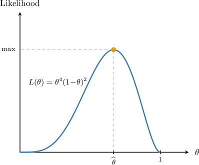

# Likelihood Functions for Discrete Probability Distributions

Source: https://www.mathacademy.com/topics/3603?courseId=73
Topic ID: 3603

## Prerequisites

- [The Bernoulli Distribution](./3071-the-bernoulli-distribution.md)
- [Product Notation](./3081-product-notation.md)
- [The Binomial Distribution](./3281-the-binomial-distribution.md)
- [The Poisson Distribution](./3282-the-poisson-distribution.md)
- [Sampling Distributions](./3864-sampling-distributions.md)
- [Properties of Finite Series](../../../high-school/integrated-math-honors/lessons/integrated-math-ii-honors/3958-properties-of-finite-series.md)

## Lesson

### Introduction

Sometimes, we might know the general form of the probability distribution for a population, yet we may not know some of its underlying parameters. We wish to develop strategies to estimate unknown population parameters from sample data. One such strategy is to use **likelihood functions.**

In this lesson, we'll learn how to compute likelihood functions for particular discrete probability distributions.

Suppose we have an I.I.D. (independent and identically distributed) random sample

$$

X_1, \: X_2, \: \ldots, \: X_n,

$$

where the probability mass function of each $X_i$ is given by

$$

f(x;\,\theta)

$$

and $\theta$ is an *unknown,* fixed parameter.

Suppose we have a particular sample from this distribution:

$$

x_1, \: x_2, \: \ldots, \: x_n

$$

We define the **likelihood function** $L(\theta)$ as

$$

L(\theta) = P(X_1=x_1, X_2=x_2, \ldots , X_n = x_n).

$$

The likelihood function gives the probability of getting a particular sample for a specific parameter value.

Now, since we assumed that all $X_i$'s are independent and identically distributed, by the multiplication law, we have

$$

\begin{aligned}𝐿(𝜃) & =𝑃(𝑋_{1}=𝑥_{1},𝑋_{2}=𝑥_{2},…,𝑋_{𝑛}=𝑥_{𝑛}) \\ & =𝑃(𝑋_{1}=𝑥_{1})⋅𝑃(𝑋_{2}=𝑥_{2})⋯𝑃(𝑋_{𝑛}=𝑥_{𝑛}) \\ & =\underset{\underset{𝑖=1}{∏}}{\overset{}{𝑛}}𝑃(𝑋_{𝑖}=𝑥_{𝑖}) \\ & =\underset{\underset{𝑖=1}{∏}}{\overset{}{𝑛}}𝑓(𝑥_{𝑖};\,𝜃).\end{aligned}

$$

To summarize, the likelihood function $L(\theta)$ is defined as

$$

L(\theta) = \prod_{i=1}^n f(x_i;\,\theta).

$$

Let's take a look at a concrete example.

### A Worked Example

Suppose that

$$

X_1,\quad X_2,\quad X_3,\quad X_4,\quad X_5,\quad X_6

$$

is an I.I.D random sample from a population, where

$$

X_i\sim \text{Bernoulli}(\theta)

$$

and $\theta$ is the *unknown* probability of success.

Suppose we conduct a sample and get the following data:

$$

x_1=0, \quad x_2=1, \quad x_3=1, \quad x_4=0, \quad x_5=1, \quad x_6=1

$$

Let's compute the likelihood function for this sample.

Recall that if $X_1, X_2, \ldots, X_{n}$ are I.I.D random variables with probability mass function $f(x; \theta),$ then the likelihood function of a random sample $x_1, x_2, \ldots, x_n$ is given by

$$

L(\theta) = P(X_1=x_1, X_2=x_2, \ldots , X_n = x_n) = \displaystyle\prod_{i=1}^n f(x_i;\,\theta).

$$

The probability mass function for a Bernoulli random variable with an unknown probability of success $\theta$ is given by

$$

f(x; \theta) = \theta^x(1-\theta)^{1-x}, \qquad x=0,1.

$$

Using this definition, we can calculate the likelihood function as follows:

$$

\begin{aligned}𝐿(𝜃) & =\underset{\underset{𝑖=1}{∏}}{\overset{}{𝑛}}𝑓(𝑥_{𝑖};\,𝜃) \\ & =\underset{\underset{𝑖=1}{∏}}{\overset{}{𝑛}}𝜃^{𝑥_{𝑖}}(1−𝜃)^{1−𝑥_{𝑖}} \\ & =(𝜃^{𝑥_{1}}(1−𝜃)^{1−𝑥_{1}})⋅(𝜃^{𝑥_{2}}(1−𝜃)^{1−𝑥_{2}})\,⋯\,(𝜃^{𝑥_{𝑛}}(1−𝜃)^{1−𝑥_{𝑛}}) \\ & =𝜃^{\,∑𝑥_{𝑖}}(1−𝜃)^{\,∑(1−𝑥_{𝑖})} \\ & =𝜃^{\,∑𝑥_{𝑖}}(1−𝜃)^{\,𝑛−∑𝑥_{𝑖}} \\ & =𝜃^{𝑆}(1−𝜃)^{𝑛−𝑆}\end{aligned}

$$

where $\displaystyle S = \sum\limits_ {i=1}^n x_i.$

For our sample, we have that $n=6,$ and

$$

\begin{aligned}𝑆 & =\underset{\underset{𝑖=1}{∑}}{\overset{}{𝑛}}𝑥_{𝑖} \\ & =0+1+1+0+1+1 \\ & =4.\end{aligned}

$$

Therefore, the likelihood function for this sample is given by

$$

\begin{aligned}𝐿(𝜃) & =𝜃^{4}(1−𝜃)^{6−4} \\ & =𝜃^{4}(1−𝜃)^{2}.\end{aligned}

$$

The graph of $L(\theta)$ is shown below.

Notice that $L(\theta)$ has a maximum inside the interval $\theta \in [0,1].$ The value $\widehat{\,\theta\,}$ that corresponds to the maximum likelihood is called the **maximum likelihood estimate** of the parameter $\theta$ for the given sample.

We'll discuss how to compute the maximum likelihood estimate in future topics. But, for now, let's see more examples of finding the likelihood functions for different distributions and samples.

### Example: Likelihood Functions for Bernoulli Random Variables

#### Question

Suppose $X_1,X_2,\ldots,X_{10}$ is an I.I.D random sample with $X_i\sim \text{Bernoulli}(\theta)$ and unknown probability of success $\theta.$ For a particular sample $x_1, x_2, \ldots, x_{10},$ you're given that

$$

\displaystyle\sum_{i=1}^{10} x_i = 7.

$$

Find the likelihood function of the sample.

**

$$

f(x)=\theta^x (1-\theta)^{1-x}, \qquad x = 0,1.

$$

#### Explanation

Recall that if $X_1, X_2, \ldots, X_{n}$ are independent and identically distributed discrete random variables with probability mass function $f(x; \theta),$ where $\theta$ is an unknown parameter, then the likelihood function of a random sample $x_1, x_2, \ldots, x_n$ is

$$

L(\theta) = P(X_1=x_1, X_2=x_2, \ldots , X_n = x_n) = \displaystyle\prod_{i=1}^n f(x_i;\,\theta).

$$

In our case, we are given a sample of $n=10$ independent Bernoulli random variables with unknown parameter $\theta,$ for which the probability mass function is

$$

f(x; \theta) = \theta^x(1-\theta)^{1-x}, \qquad x=0,1.

$$

We can calculate the likelihood function as follows:

$$

\begin{aligned}𝐿(𝜃) & =\underset{\underset{𝑖=1}{∏}}{\overset{}{𝑛}}𝑓(𝑥_{𝑖};\,𝜃) \\ & =\underset{\underset{𝑖=1}{∏}}{\overset{}{𝑛}}𝜃^{𝑥_{𝑖}}(1−𝜃)^{1−𝑥_{𝑖}} \\ & =(𝜃^{𝑥_{1}}(1−𝜃)^{1−𝑥_{1}})⋅(𝜃^{𝑥_{2}}(1−𝜃)^{1−𝑥_{2}})\,⋯\,(𝜃^{𝑥_{𝑛}}(1−𝜃)^{1−𝑥_{𝑛}}) \\ & =𝜃^{\,∑𝑥_{𝑖}}(1−𝜃)^{\,∑(1−𝑥_{𝑖})} \\ & =𝜃^{\,∑𝑥_{𝑖}}(1−𝜃)^{\,𝑛−∑𝑥_{𝑖}} \\ & =𝜃^{𝑆}(1−𝜃)^{𝑛−𝑆}\end{aligned}

$$

where $\displaystyle S = \sum\limits_ {i=1}^n x_i.$

We are told that $\displaystyle S=\sum\limits_ {i=1}^n x_i=7$ and $n=10.$ Therefore,

$$

\begin{aligned}𝐿(𝜃) & =𝜃^{7}(1−𝜃)^{10−7} \\ & =𝜃^{7}(1−𝜃)^{3}.\end{aligned}

$$

### Example: Likelihood Functions for Binomial Random Variables

#### Question

Suppose $X_1, X_2, \ldots, X_{12}$ is an I.I.D random sample with $X_i \sim B(4,\theta)$ and unknown probability of success $\theta.$ For a particular sample $x_1, x_2, \ldots, x_{12},$ you're given that

$$

\displaystyle\sum_{i=1}^{12} x_i = 22.

$$

Find the likelihood function of the sample up to a constant $C.$

**

$$

f(x) = \displaystyle \binom{n}{x} \theta^x (1-\theta)^{n-x}, \qquad x = 0,1,2,\ldots, n.

$$

#### Explanation

Recall that if $X_1, X_2, \ldots, X_{n}$ are independent and identically distributed discrete random variables with probability mass function $f(x; \theta),$ where $\theta$ is an unknown parameter, then the likelihood function of a random sample $x_1, x_2, \ldots, x_n$ is

$$

L(\theta) = P(X_1 = x_1, X_2 = x_2, \ldots , X_n = x_n) = \displaystyle\prod_{i=1}^n f(x_i;\,\theta).

$$

In our case, we are given a sample of $n = 12$ independent binomial random variables with unknown probability of success $\theta$ and $N = 4$ trials, for which the probability mass function is

$$

\begin{aligned}𝑓(𝑥;𝜃)=(\frac{4}{𝑥})𝜃^{𝑥}(1−𝜃)^{4−𝑥}, & \,𝑥=0,1,2,3,4.\end{aligned}

$$

We can calculate the likelihood function as follows:

$$

\begin{aligned}𝐿(𝜃) & =\underset{\underset{𝑖=1}{∏}}{\overset{}{𝑛}}𝑓(𝑥_{𝑖};𝜃) \\ & =\underset{\underset{𝑖=1}{∏}}{\overset{}{𝑛}}(\frac{4}{𝑥_{𝑖}})𝜃^{𝑥_{𝑖}}(1−𝜃)^{4−𝑥_{𝑖}} \\ & =((\frac{4}{𝑥_{1}})𝜃^{𝑥_{1}}(1−𝜃)^{4−𝑥_{1}})⋅((\frac{4}{𝑥_{2}})𝜃^{𝑥_{2}}(1−𝜃)^{4−𝑥_{2}})⋯((\frac{4}{𝑥_{𝑛}})𝜃^{𝑥_{𝑛}}(1−𝜃)^{4−𝑥_{𝑛}}) \\ & =𝐶\,𝜃^{\,∑𝑥_{𝑖}}(1−𝜃)^{\,∑(4−𝑥_{𝑖})} \\ & =𝐶\,𝜃^{\,∑𝑥_{𝑖}}(1−𝜃)^{\,4𝑛−∑𝑥_{𝑖}} \\ & =𝐶\,𝜃^{𝑆}(1−𝜃)^{4𝑛−𝑆}\end{aligned}

$$

where $\displaystyle C = \prod\limits_{i=1}^n {4 \choose x_i}$ is a constant and $\displaystyle S = \sum\limits_ {i=1}^{n} x_i.$

We are told that $\displaystyle S = \sum\limits_ {i=1}^{n} x_i = 22$ and $n = 12.$ Therefore,

$$

\begin{aligned}𝐿(𝜃) & =𝐶\,𝜃^{22}(1−𝜃)^{4(12)−22} \\ & =𝐶\,𝜃^{22}(1−𝜃)^{26}.\end{aligned}

$$

### Example: Likelihood Functions for Poisson Random Variables

#### Question

Suppose $X_1,X_2,X_3,X_4,X_{5}$ is an I.I.D random sample with $X_i\sim \mathrm{Po}(\theta)$ and unknown rate parameter $\theta.$ Find the likelihood function of the sample $0, 2, 3, 1, 1.$

#### Explanation

Recall that if $X_1, X_2, \ldots, X_{n}$ are independent and identically distributed discrete random variables with probability mass function $f(x; \theta),$ where $\theta$ is an unknown parameter, then the likelihood function of a random sample $x_1, x_2, \ldots, x_n$ is

$$

L(\theta) = \displaystyle\prod_{i=1}^n f(x_i; \theta).

$$

In our case, we are given a sample of $n=5$ independent Poisson random variables with unknown parameter $\theta,$ for which the probability mass function is

$$

f(x; \theta) = \dfrac{\theta^{x} e^{-\theta}}{x!}, \qquad x=0,1,2,\ldots\,.

$$

We can calculate the likelihood function as follows:

$$

\begin{aligned}𝐿(𝜃) & =\underset{\underset{𝑖=1}{∏}}{\overset{}{𝑛}}𝑓(𝑥_{𝑖};𝜃) \\ & =\underset{\underset{𝑖=1}{∏}}{\overset{}{𝑛}}\frac{𝜃^{𝑥_{𝑖}}𝑒^{−𝜃}}{𝑥_{𝑖}!} \\ & =(\frac{𝜃^{𝑥_{1}}𝑒^{−𝜃}}{𝑥_{1}!})⋅(\frac{𝜃^{𝑥_{2}}𝑒^{−𝜃}}{𝑥_{2}!})⋯(\frac{𝜃^{𝑥_{𝑛}}𝑒^{−𝜃}}{𝑥_{𝑛}!}) \\ & =𝜃^{∑𝑥_{𝑖}}⋅𝑒^{−∑𝜃}⋅\underset{\underset{𝑖=1}{∏}}{\overset{}{𝑛}}\frac{1}{(𝑥_{𝑖})!} \\ & =𝜃^{∑𝑥_{𝑖}}⋅𝑒^{−𝑛𝜃}⋅\frac{1}{\underset{𝑛𝑖=1}{\overset{}{∏}}(𝑥_{𝑖})!} \\ & =\frac{1}{𝐶}\,𝜃^{𝑆}\,𝑒^{−𝑛𝜃}\end{aligned}

$$

where $\displaystyle C=\prod\limits_{i=1}^{n} (x_i)!$ is a constant and $\displaystyle S = \sum\limits_ {i=1}^n x_i.$

For our sample, we have that

$$

\begin{aligned}𝑆 & =\underset{\underset{𝑖=1}{∑}}{\overset{}{𝑛}}𝑥_{𝑖} \\ & =0+2+3+1+1 \\ & =7 \\ 𝐶 & =\underset{\underset{𝑖=1}{∏}}{\overset{}{𝑛}}(𝑥_{𝑖})! \\ & =0!⋅2!⋅3!⋅1!⋅1! \\ & =1⋅2⋅6⋅1⋅1 \\ & =12\end{aligned}

$$

and $n=5.$ Therefore,

$$

\begin{aligned}𝐿(𝜃) & =\frac{1}{12}\,𝜃^{7}\,𝑒^{−5𝜃}.\end{aligned}

$$
