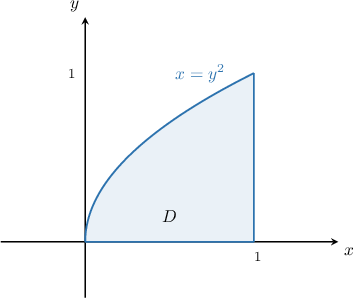

# Marginal Distributions for Continuous Random Variables

Source: https://www.mathacademy.com/topics/3636?courseId=73
Topic ID: 3636

## Prerequisites

- [Cumulative Distribution Functions for Continuous Random Variables](./2163-cumulative-distribution-functions-for-continuous-random-variables.md)
- [Marginal Distributions for Discrete Random Variables](./3002-marginal-distributions-for-discrete-random-variables.md)
- [Joint Distributions for Continuous Random Variables](./3052-joint-distributions-for-continuous-random-variables.md)

## Lesson

### Introduction

We've seen how to construct the marginal mass functions for two discrete random variables from their joint probability mass function. We now wish to formulate analogous definitions when our random variables are continuous.

First, recall that if $f(x,y)$ is the joint PMF of the *discrete* random variables $X$ and $Y$ with supports $S_X$ and $S_Y$, respectively, then

- the marginal mass function of $X$ is given by

- and the marginal mass function of $Y$ is given by

Now suppose that $X$ and $Y$ are *continuous* random variables with joint probability density function $f(x, y).$

- The **marginal density function** of $X$ is defined as

- The **marginal density function** of $Y$ is defined as

We sometimes refer to a marginal density function as a **marginal probability density function** (or **marginal PDF**).

It's helpful to appreciate the analogy between the discrete and continuous cases as this often helps us to remember their definitions. In summary:

- To convert from discrete to continuous, we turn sums into integrals.

- When we compute $f_X$ in the discrete case, we sum over all possible values of $Y.$ In the continuous case, we integrate with respect to $y.$

- When we compute $f_Y$ in the discrete case, we sum over all possible values of $X.$ In the continuous case, we integrate with respect to $x.$

Let's now see a concrete example of how to compute a marginal density function.

### A Concrete Example

Let $X$ and $Y$ be two continuous random variables with the joint probability density function

$$

\begin{aligned}\frac{3}{2}(𝑥^{2}+𝑦^{2}), & 0≤𝑥≤1,\,0≤𝑦≤1, \\ 0, & otherwise.\end{aligned}

$$

Let's find the expression for the marginal density function $f_X(x)$ of $X.$

In our case, the marginal density function of $X$ for $0\leq x \leq 1$ is

$$

\begin{aligned}𝑓_{𝑋}(𝑥) & =∫_{∞−∞}^{}𝑓(𝑥,𝑦)\,d𝑦 \\ & =∫_{10}^{}\frac{3}{2}(𝑥^{2}+𝑦^{2})\,d𝑦 \\ & =\frac{3}{2}∫_{10}^{}𝑥^{2}+𝑦^{2}\,d𝑦 \\ & =\frac{3}{2}[𝑥^{2}𝑦+\frac{𝑦^{3}}{3}]_{𝑦=1𝑦=0}^{} \\ & =\frac{3}{2}[𝑥^{2}⋅1+\frac{1^{3}}{3}]−\frac{3}{2}⋅[0] \\ & =\frac{3}{2}[𝑥^{2}+\frac{1}{3}] \\ & =\frac{1}{2}(3𝑥^{2}+1).\end{aligned}

$$

Therefore, the full expression for $f_X(x)$ is given by

$$

\begin{aligned}\frac{1}{2}(3𝑥^{2}+1), & 0≤𝑥≤1, \\ 0, & otherwise.\end{aligned}

$$

### Example: Finding a Marginal Distribution From a Joint Distribution

#### Question

Let $X$ and $Y$ be two continuous random variables with the joint probability density function

$$

\begin{aligned}\frac{15}{7}𝑥^{2}𝑦^{4}, & 1≤𝑥≤2,\,0≤𝑦≤1, \\ 0, & otherwise.\end{aligned}

$$

Find the expression for the marginal PDF $f_Y(y).$

#### Explanation

If $X$ and $Y$ are two continuous random variables with joint probability density function $f(x, y),$ then the marginal density functions for $X$ and $Y$ are

$$

\begin{aligned}𝑓_{𝑋}(𝑥)=∫_{∞−∞}^{}𝑓(𝑥,𝑦)\,d𝑦,\,𝑓_{𝑌}(𝑦)=∫_{∞−∞}^{}𝑓(𝑥,𝑦)\,d𝑥.\end{aligned}

$$

In our case, the marginal density function of $Y$ for $0\leq y \leq1$ is

$$

\begin{aligned}𝑓_{𝑌}(𝑦) & =∫_{21}^{}\frac{15}{7}𝑥^{2}𝑦^{4}\,d𝑥 \\ & =\frac{15}{7}𝑦^{4}[\frac{1}{3}𝑥^{3}]_{𝑥=2𝑥=1}^{} \\ & =\frac{5}{7}𝑦^{4}[𝑥^{3}]_{𝑥=2𝑥=1}^{} \\ & =\frac{5}{7}𝑦^{4}(2^{3}−1^{3}) \\ & =5𝑦^{4}.\end{aligned}

$$

Therefore, the full expression for $f_Y(y)$ is given by

$$

\begin{aligned}5𝑦^{4}, & 0≤𝑦≤1, \\ 0, & otherwise.\end{aligned}

$$

### Example: Finding a Marginal Probability From a Joint Distribution

#### Question

Let $X$ and $Y$ be two continuous random variables with the joint probability density function

$$

\begin{aligned}𝑒^{−(4𝑥+𝑦/4)}, & 𝑥≥0,\,𝑦≥0, \\ 0, & otherwise.\end{aligned}

$$

Find $P(-4 \leq Y \leq 4).$

#### Explanation

If $X$ and $Y$ are two continuous random variables with joint probability density function $f(x, y),$ then the marginal density functions for $X$ and $Y$ are

$$

\begin{aligned}𝑓_{𝑋}(𝑥)=∫_{∞−∞}^{}𝑓(𝑥,𝑦)\,d𝑦,\,𝑓_{𝑌}(𝑦)=∫_{∞−∞}^{}𝑓(𝑥,𝑦)\,d𝑥.\end{aligned}

$$

In our case, the marginal density function of $Y$ for $y \geq 0$ is

$$

\begin{aligned}𝑓_{𝑌}(𝑦) & =∫_{∞0}^{}𝑒^{−(4𝑥+𝑦/4)}\,d𝑥 \\ & =[−\frac{1}{4}𝑒^{−(4𝑥+𝑦/4)}]_{𝑥=∞𝑥=0}^{} \\ & =−\frac{1}{4}(0−𝑒^{−(0+𝑦/4)}) \\ & =\frac{1}{4}𝑒^{−𝑦/4}.\end{aligned}

$$

Therefore, the full expression for $f_Y(y)$ is given by

$$

\begin{aligned}\frac{1}{4}𝑒^{−𝑦/4}, & 𝑦≥0, \\ 0, & otherwise.\end{aligned}

$$

Therefore, the required probability is

$$

\begin{aligned}𝑃(−4≤𝑌≤4) & =∫_{4−4}^{}𝑓_{𝑌}(𝑦)\,d𝑦 \\ & =∫_{40}^{}\frac{1}{4}𝑒^{−𝑦/4}\,d𝑦 \\ & =[−𝑒^{−𝑦/4}]_{40}^{} \\ & =(−𝑒^{−4/4}+𝑒^{0}) \\ & =1−\frac{1}{𝑒}.\end{aligned}

$$

### Example: Finding a Marginal Distribution From a Joint Distribution: Non-Rectangular Domains

#### Question

Let $X$ and $Y$ be two continuous random variables with the joint probability density function

$$

f(x,y) = 5y\sqrt{x}, \quad y^2 \leq x \leq 1, \quad y\geq 0.

$$

Find the expression for the marginal PDF $f_Y(y).$

#### Explanation

If $X$ and $Y$ are two continuous random variables with joint probability density function $f(x, y),$ then the marginal density functions for $X$ and $Y$ are

$$

\begin{aligned}𝑓_{𝑋}(𝑥)=∫_{∞−∞}^{}𝑓(𝑥,𝑦)\,d𝑦,\,𝑓_{𝑌}(𝑦)=∫_{∞−∞}^{}𝑓(𝑥,𝑦)\,d𝑥.\end{aligned}

$$

First, let's sketch the region $D = \{(x,y) \::\: y^2 \leq x \leq1,\, y\geq 0 \}.$

In our case, the marginal density function of $Y$ for $0 \leq y \leq 1$ is

$$

\begin{aligned}𝑓_{𝑌}(𝑦) & =∫_{1𝑦^{2}}^{}5𝑦\sqrt{√𝑥}\,d𝑥 \\ & =5𝑦∫_{1𝑦^{2}}^{}\sqrt{√𝑥}\,d𝑥 \\ & =5𝑦[\frac{2}{3}𝑥^{3/2}]_{𝑥=1𝑥=𝑦^{2}}^{} \\ & =\frac{10𝑦}{3}[𝑥^{3/2}]_{𝑥=1𝑥=𝑦^{2}}^{} \\ & =\frac{10𝑦}{3}[1^{3/2}−(𝑦^{2})^{3/2}] \\ & =\frac{10𝑦}{3}[1−𝑦^{3}] \\ & =\frac{10(𝑦−𝑦^{4})}{3}.\end{aligned}

$$

Therefore, the full expression for $f_Y(y)$ is given by

$$

\begin{aligned}\frac{10(𝑦−𝑦^{4})}{3}, & 0≤𝑦≤1, \\ 0, & otherwise.\end{aligned}

$$

### Marginal Cumulative Distribution Functions

Recall that the cumulative distribution function (or CDF) of a continuous random variable $X$ with probability density function $f(x)$ is defined as

$$

F(x) = P(X\leq x) = \int_{-\infty}^x f(t)\,\textrm d t.

$$

Now suppose we know the marginal distributions $f_X(x)$ and $f_Y(y)$ of the continuous random variables $X$ and $Y.$

Then we can define the **marginal cumulative distribution functions** (or **marginal CDFs**) of $X$ and $Y$ analogously as follows:

- The marginal CDF of $X,$ denoted $F_X(x),$ is given by

- The marginal CDF of $Y,$ denoted $F_Y(y),$ is given by

Let's see an example.

### Example: Finding a Marginal CDF

#### Question

Let $X$ and $Y$ be two continuous random variables with the joint probability density function

$$

\begin{aligned}\frac{3}{8}(𝑥+𝑦)^{2}, & −1≤𝑥≤1,\,−1≤𝑦≤1, \\ 0, & otherwise.\end{aligned}

$$

Find the marginal cumulative distribution function (CDF) $F_Y(y)$ of $Y.$

#### Explanation

If $X$ and $Y$ are two continuous random variables with joint probability density function $f(x, y),$ then the marginal density functions for $X$ and $Y$ are

$$

\begin{aligned}𝑓_{𝑋}(𝑥)=∫_{∞−∞}^{}𝑓(𝑥,𝑦)\,d𝑦,\,𝑓_{𝑌}(𝑦)=∫_{∞−∞}^{}𝑓(𝑥,𝑦)\,d𝑥.\end{aligned}

$$

In our case, the marginal density function of $Y$ for $-1 \leq y \leq 1$ is

$$

\begin{aligned}𝑓_{𝑌}(𝑦) & =∫_{1−1}^{}\frac{3}{8}(𝑥+𝑦)^{2}\,d𝑥 \\ & =\frac{3}{8}[\frac{1}{3}(𝑥+𝑦)^{3}]_{𝑥=1𝑥=−1}^{} \\ & =\frac{1}{8}[(𝑥+𝑦)^{3}]_{𝑥=1𝑥=−1}^{} \\ & =\frac{1}{8}[(1+𝑦)^{3}−(−1+𝑦)^{3}] \\ & =\frac{1}{8}[(𝑦+1)^{3}−(𝑦−1)^{3}] \\ & =\frac{1}{8}[(𝑦^{3}+3𝑦^{2}+3𝑦+1)−(𝑦^{3}−3𝑦^{2}+3𝑦−1)] \\ & =\frac{1}{8}[(𝑦^{3}+3𝑦^{2}+3𝑦+1)−(𝑦^{3}−3𝑦^{2}+3𝑦−1)] \\ & =\frac{1}{8}[2(3𝑦^{2}+1)] \\ & =\frac{1}{4}(3𝑦^{2}+1).\end{aligned}

$$

Therefore, the marginal CDF of $Y$ for $-1 \leq y \leq 1$ is

$$

\begin{aligned}𝐹_{𝑌}(𝑦) & =∫_{𝑦−∞}^{}𝑓_{𝑌}(𝑢)\,d𝑢 \\ & =∫_{𝑦−1}^{}\frac{1}{4}(3𝑢^{2}+1)\,d𝑢 \\ & =\frac{1}{4}∫_{𝑦−1}^{}(3𝑢^{2}+1)\,d𝑢 \\ & =\frac{1}{4}[𝑢^{3}+𝑢]_{𝑦−1}^{} \\ & =\frac{1}{4}[𝑦^{3}+𝑦−(−1)^{3}−(−1)] \\ & =\frac{1}{4}[𝑦^{3}+𝑦+2] \\ & =\frac{𝑦^{3}+𝑦+2}{4}.\end{aligned}

$$

Therefore, the full expression for the marginal CDF of $Y$ is

$$

\begin{aligned}0, & 𝑦<−1 \\ \frac{𝑦^{3}+𝑦+2}{4}, & −1≤𝑦≤1 \\ 1 & 𝑦>1.\end{aligned}

$$
