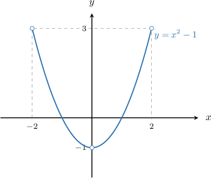
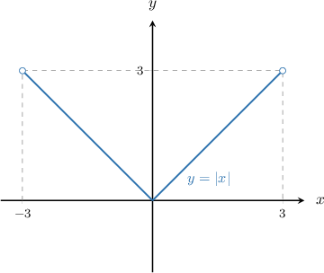
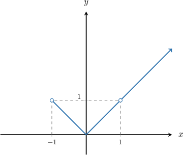
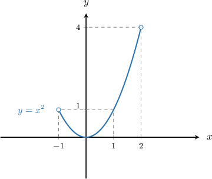

# The Distribution Function Method With Many-to-One Transformations

Source: https://www.mathacademy.com/topics/3637?courseId=73
Topic ID: 3637

## Prerequisites

- [The Distribution Function Method](./3055-the-distribution-function-method.md)
- [Further Rules of Absolute Value](../../../high-school/traditional/lessons/algebra-i/3536-further-rules-of-absolute-value.md)

## Lesson

### Introduction

Let $X$ be a continuous random variable, and suppose that

$$

Y = u(X),

$$

where $u(X)$ is a function of $X.$

We can use the distribution function method to compute the PDF of $Y.$ Broadly speaking, the distribution function method involves the following two steps:

- First, we find an expression for $F_Y$ in terms of $F_X,$ where $F_Y$ and $F_X$ are the cumulative distribution functions of $Y$ and $X,$ respectively.

- Then, we differentiate $F_Y$ to get the probability density function $f_Y$ of $Y.$

We've already seen how we use the distribution function technique to find the PDF of $Y$ in cases where $u(X)$ is strictly monotonic (i.e., strictly increasing or decreasing). If $u(X)$ is monotonic, then there is a one-to-one correspondence between $Y$ and $X,$ so computing the PDF of $Y$ is reasonably straightforward.

We can also use the distribution function method in cases where $u$ is not monotonic, although a little more care is needed. This is what we'll focus on in this lesson.

### A Worked Example

Let $X$ be a continuous random variable with the following probability density function:

$$

\begin{aligned}\frac{3}{16}𝑥^{2}, & 0<|𝑥|<2 \\ 0, & otherwise\end{aligned}

$$

Suppose that we define a new random variable $Y$ as

$$

Y = X^2-1.

$$

First, notice that $Y = X^2-1$ is two-to-one over the interval $0 < |x| < 2,$ as shown below.

Moreover, for $0 < |x| < 2,$ we have that $-1 \lt y \lt 3.$

Let's use the distribution function method to calculate the probability density function of $Y.$

Consider the interval $-1 < y < 3.$ We write down the definition of the cumulative distribution of $Y,$ and then use our transformation to isolate $X$ in the parentheses. This will allow us to write $F_Y$ in terms of $F_X\mathbin{:}$

$$

\begin{aligned}𝐹_{𝑌}(𝑦) & =𝑃(𝑌≤𝑦) \\ & =𝑃(𝑋^{2}−1≤𝑦) \\ & =𝑃(𝑋^{2}≤𝑦+1) \\ & =𝑃(−(𝑦+1)^{1/2}≤𝑋≤(𝑦+1)^{1/2}) \\ & =𝐹_{𝑋}((𝑦+1)^{1/2})−𝐹_{𝑋}(−(𝑦+1)^{1/2})\end{aligned}

$$

Now, to compute the PDF $f_Y(y)$ for $-1 \lt y < 3,$ we differentiate $F_Y$ with respect to $y$ using the chain rule, as usual. This gives

$$

\begin{aligned}𝑓_{𝑌}(𝑦) & =𝐹_{′𝑌}^{}(𝑦) \\ & =\frac{1}{2}(𝑦+1)^{−1/2}⋅𝐹_{′𝑋}^{}((𝑦+1)^{1/2})+\frac{1}{2}(𝑦+1)^{−1/2}⋅𝐹_{′𝑋}^{}(−(𝑦+1)^{1/2}) \\ & =\frac{1}{2}(𝑦+1)^{−1/2}⋅𝑓_{𝑋}((𝑦+1)^{1/2})+\frac{1}{2}(𝑦+1)^{−1/2}⋅𝑓_{𝑋}(−(𝑦+1)^{1/2}) \\ & =\frac{1}{2}(𝑦+1)^{−1/2}(𝑓_{𝑋}((𝑦+1)^{1/2})+𝑓_{𝑋}(−(𝑦+1)^{1/2})).\end{aligned}

$$

Applying the definition of $f_X,$ we finally arrive at

$$

\begin{aligned}𝑓_{𝑌}(𝑦) & =\frac{1}{2}(𝑦+1)^{−1/2}(𝑓_{𝑋}((𝑦+1)^{1/2})+𝑓_{𝑋}(−(𝑦+1)^{1/2})) \\ & =\frac{1}{2}(𝑦+1)^{−1/2}(\frac{3}{16}((𝑦+1)^{1/2})^{2}+\frac{3}{16}(−(𝑦+1)^{1/2})^{2}) \\ & =\frac{1}{2}(𝑦+1)^{−1/2}(\frac{3}{16}(𝑦+1)+\frac{3}{16}(𝑦+1)) \\ & =\frac{3}{16}(𝑦+1)^{−1/2}(𝑦+1) \\ & =\frac{3}{16}(𝑦+1)^{1/2} \\ & =\frac{3}{16}\sqrt{√𝑦+1}.\end{aligned}

$$

Therefore, the full expression for the PDF of $Y$ is

$$

\begin{aligned}\frac{3}{16}\sqrt{√𝑦+1}, & −1<𝑦<3 \\ 0, & otherwise.\end{aligned}

$$

### Example: Applying Two-to-One Transformations to Random Variables

#### Question

Let $X$ be a continuous random variable with the following probability density function:

$$

\begin{aligned}\frac{1}{24}(𝑥+1)^{2}, & −3<𝑥<3 \\ 0, & otherwise\end{aligned}

$$

If $Y = |X|,$ then what is the probability density function of $Y?$

#### Explanation

First, notice that the transformation $Y = |X|$ is two-to-one over the interval $-3\lt x \lt 3.$

Moreover, for $-3\lt x \lt 3,$ we have that $0 \leq y \lt 3.$

Now, using the definition of the cumulative distribution of $Y,$ for $0 \leq y < 3,$ we have

$$

\begin{aligned}𝐹_{𝑌}(𝑦) & =𝑃(𝑌≤𝑦) \\ & =𝑃(|𝑋|≤𝑦) \\ & =𝑃(−𝑦≤𝑋≤𝑦) \\ & =𝐹_{𝑋}(𝑦)−𝐹_{𝑋}(−𝑦).\end{aligned}

$$

To compute the PDF $f_Y(y)$ for $0 \leq y < 3,$ we differentiate $F_Y$ with respect to $y$ using the chain rule. This gives

$$

\begin{aligned}𝑓_{𝑌}(𝑦) & =𝐹_{′𝑌}^{}(𝑦) \\ & =𝐹_{′𝑋}^{}(𝑦)−(−1)𝐹_{′𝑋}^{}(−𝑦) \\ & =𝐹_{′𝑋}^{}(𝑦)+𝐹_{′𝑋}^{}(−𝑦) \\ & =𝑓_{𝑋}(𝑦)+𝑓_{𝑋}(−𝑦).\end{aligned}

$$

Applying the definition of $f_X,$ we finally arrive at

$$

\begin{aligned}𝑓_{𝑌}(𝑦) & =𝑓_{𝑋}(𝑦)+𝑓_{𝑋}(−𝑦) \\ & =\frac{1}{24}(𝑦+1)^{2}+\frac{1}{24}(−𝑦+1)^{2} \\ & =\frac{1}{24}[(𝑦^{2}+2𝑦+1)+(𝑦^{2}−2𝑦+1)] \\ & =\frac{1}{24}(2𝑦^{2}+2) \\ & =\frac{1}{12}(𝑦^{2}+1).\end{aligned}

$$

Therefore, the full expression for the PDF of $Y$ is

$$

\begin{aligned}\frac{1}{12}(𝑦^{2}+1), & 0≤𝑦<3 \\ 0, & otherwise.\end{aligned}

$$

### One-to-One and Many-to-One Transformations

We know how to compute the PDF of $Y = u(X)$ in cases where $u$ is either one-to-one or two-to-one over the entire support of $X.$ Let's now expand this to cases where $u(X)$ is both one-to-one and many-to-one over different intervals.

As an example, let $X$ be a continuous random variable with the following probability density function:

$$

\begin{aligned}𝑒^{−(𝑥+1)}, & 𝑥>−1 \\ 0, & otherwise\end{aligned}

$$

Now suppose that the random variable $Y$ is defined as

$$

Y = |X|.

$$

To compute the PDF of $Y,$ we separately apply the distribution function method on the regions where $Y$ is one-to-one and many-to-one.

First, let's visualize the transformation $Y = |X|$ over the interval $x > - 1.$

Notice the following:

- The transformation is one-to-one over the interval $x \geq 1.$ On this interval, $y \geq 1.$

- The transformation is two-to-one over the interval $-1 \lt x \lt 1.$ On this interval, $0 \leq y \lt 1.$

So, we need to consider these two cases separately.

- First, we consider the case $y \geq 1.$ Using the definition of the cumulative distribution of $Y,$ for $y \geq 1,$ we have Notice that we used the fact that $|X| = X$ for $X > 0.$ To compute the PDF $f_Y(y)$ for $y \geq 1,$ we differentiate $F_Y$ with respect to $y.$ This gives Applying the definition of $f_X,$ we finally arrive at

- Next, we consider the case $0 \leq y \lt 1.$ Using the definition of the cumulative distribution of $Y,$ for $0 \leq y \lt 1,$ we have To compute the PDF $f_Y(y)$ for $0 \leq y \lt 1,$ we differentiate $F_Y$ with respect to $y$ using the chain rule. This gives Applying the definition of $f_X,$ we finally arrive at

Therefore, the full expression for the PDF of $y$ is

$$

\begin{aligned}𝑒^{−(𝑦+1)}+𝑒^{𝑦−1}, & 0≤𝑦<1 \\ 𝑒^{−(𝑦+1)}, & 𝑦≥1 \\ 0, & otherwise.\end{aligned}

$$

### Example: One-to-One and Many-to-One Transformations

#### Question

Let $X$ be a continuous random variable with the following probability density function:

$$

\begin{aligned}\frac{5}{33}𝑥^{4}, & −1<𝑥<2 \\ 0, & otherwise\end{aligned}

$$

If the probability density function of $Y = X^2$ is given by

$$

\begin{aligned}𝑔(𝑦), & 0<𝑦<1 \\ ℎ(𝑦), & 1≤𝑦<4 \\ 0, & otherwise\end{aligned}

$$

find the function $h(y).$

#### Explanation

First, let's visualize the transformation $Y = X^2$ over the interval $-1 < x < 2.$

Notice the following:

- The transformation is two-to-one over the interval $-1 \lt x < 1.$ On this interval, $Y$ is nonzero on $0 \lt y \lt 1.$

- The transformation is one-to-one over the interval $1 \leq x \lt 2.$ On this interval, $Y$ is nonzero on $1 \leq y \lt 4.$

In this question, we're asked to consider only the interval $1 \leq y \lt 4.$

Using the definition of the cumulative distribution of $Y,$ for $1 \leq y \lt 4,$ we have

$$

\begin{aligned}𝐹_{𝑌}(𝑦) & =𝑃(𝑌≤𝑦) \\ & =𝑃(𝑋^{2}≤𝑦) \\ & =𝑃(\sqrt{√𝑋^{2}}≤\sqrt{√𝑦}) \\ & =𝑃(|𝑋|≤\sqrt{√𝑦}) \\ & =𝑃(𝑋≤\sqrt{√𝑦}) \\ & =𝐹_{𝑋}(\sqrt{√𝑦}).\end{aligned}

$$

Notice that we used $|X| = X$ for $X > 0.$

To compute the PDF $f_Y(y)$ for $1 \leq y \lt 4,$ we differentiate $F_Y$ with respect to $y$ using the chain rule. This gives

$$

\begin{aligned}𝑓_{𝑌}(𝑦) & =𝐹_{′𝑌}^{}(𝑦) \\ & =\frac{1}{2\sqrt{√𝑦}}⋅𝐹_{′𝑋}^{}(\sqrt{√𝑦}) \\ & =\frac{1}{2\sqrt{√𝑦}}⋅𝑓_{𝑋}(\sqrt{√𝑦}).\end{aligned}

$$

Applying the definition of $f_X,$ we finally arrive at

$$

\begin{aligned}𝑓_{𝑌}(𝑦) & =\frac{1}{2\sqrt{√𝑦}}⋅𝑓_{𝑋}(\sqrt{√𝑦}) \\ & =\frac{1}{2\sqrt{√𝑦}}⋅\frac{5}{33}(\sqrt{√𝑦})^{4} \\ & =\frac{1}{2\sqrt{√𝑦}}⋅\frac{5}{33}𝑦^{2} \\ & =\frac{5}{66}\,𝑦^{3/2}.\end{aligned}

$$

Consequently, $h(y) = \dfrac{5}{66}\,y^{3/2}.$
