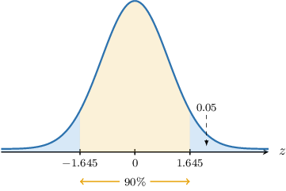
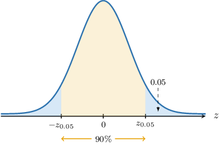

# Confidence Intervals for One Proportion: Finite Population Corrections

Source: https://www.mathacademy.com/topics/3931?courseId=73
Topic ID: 3931

## Prerequisites

- [Confidence Intervals for One Proportion](./3300-confidence-intervals-for-one-proportion.md)
- [Finite Population Corrections for Sample Proportions](./5020-finite-population-corrections-for-sample-proportions.md)

## Lesson

### Introduction

In this lesson, we'll learn how to construct confidence intervals for population proportions when the population we're sampling is finite. First, let's quickly recap some important results.

Suppose we have a random sample of size $n$ from a sufficiently large population where a proportion $p$ of the population has a particular characteristic. Then, we have the following approximation:

$$

\widehat{\,p} \sim N\left(p, \dfrac{p(1-p)}{n}\right)

$$

where $\widehat{\,p}$ is the sample proportion. Now, if we $z$-score this result, we have

$$

\dfrac{\widehat{\,p} - p}{\sqrt{\dfrac{p(1-p)}{n}}} \sim N(0,1).

$$

Replacing our expression for the variance with its sample-based estimate, we have

$$

\dfrac{\widehat{\,p} - p}{\sqrt{\dfrac{\widehat{\,p}(1-\widehat{\,p})}{n}}\phantom{|}} \sim N(0,1).

$$

For this result to be valid, the following conditions must be satisfied:

- More than five members of the sample have the characteristic $(n \widehat{\,p} > 5),$ and

- More than five members of the sample do *not* have the characteristic $(n (1-\widehat{\,p}) > 5).$

Then, for a given value $\alpha$ between $0$ and $1,$ a $[100(1-\alpha)]\%$ confidence interval for $p$ is given by

$$

\widehat{\,p} \pm z_{\alpha/2} \cdot \sqrt{\dfrac{\widehat{\,p}(1-\widehat{\,p})}{n}}.

$$

where

- $z_{\alpha/2}$ is the $z$-score satisfying $P(Z > z_{\alpha/2}) =\dfrac\alpha2,$ and $Z\sim N(0,1),$

- $E = z_{\alpha/2}\cdot \sqrt{\dfrac{\widehat{\,p}(1-\widehat{\,p})}{n}}$ is the margin of error.

These results assume that the sample elements are independent (i.e., the population we're drawing from is infinite). However, if the population size $N$ is finite and not large compared to the sample size, the independence assumption is no longer valid.

In such cases, we can apply the finite population correction factor as follows:

$$

\dfrac{\widehat{\,p} - p}{\sqrt{\dfrac{\widehat{\,p}(1-\widehat{\,p})}{n}\cdot \dfrac{N-n}{N-1}}\phantom{|}} \sim N(0,1).

$$

Then, the expression for our confidence interval is given by

$$

\widehat{\,p} \pm z_{\alpha/2} \cdot \sqrt{\dfrac{\widehat{\,p}(1-\widehat{\,p})}{n} \cdot \dfrac{N-n}{N-1}}.

$$

### Example: Finding Confidence Intervals for Population Proportions

#### Question

Consider a sample of size $n=65$ from a population of size $N=310$ where some individuals have a particular characteristic. Given that the proportion of those in the sample with the characteristic is $\widehat{\,p}=0.8,$ find a $90\%$ confidence interval for the population proportion $p$ of individuals having this characteristic.

**

#### Explanation

Since $n=65,$ $N=310,$ and $\widehat{\,p}=0.8,$ we have that

- $n \widehat{\,p} = 65 \cdot 0.8 = 52 > 5,$

- $n(1-\widehat{\,p}) = 65 \cdot (1-0.8) = 13 > 5.$

As a result, we may use a normal approximation:

$$

\dfrac{\widehat{\,p} - p}{\sqrt{\dfrac{\widehat{\,p}(1-\widehat{\,p})}{n}\cdot \dfrac{N-n}{N-1}}\phantom{|}} \sim N(0,1),

$$

where

- $\!\widehat{\,p}$ is the sample proportion,

- $p$ is the population proportion,

- $n$ is the sample size,

- $N$ is the population size.

Notice that the finite population correction factor

$$

\dfrac{N-n}{N-1}

$$

is necessary when the sample size is a significant proportion of the population, typically exceeding $5\%\cdot N.$ In our case, we have

$$

65 > 5\%\cdot N = 5\%\cdot 310 = 15.5.

$$

Then, given a value $\alpha$ between $0$ and $1,$ the corresponding $[100(1-\alpha)]\%$ confidence interval for the population proportion $p$ of the original distribution can be written as

$$

\widehat{\,p} \pm z_{\alpha/2} \cdot \sqrt{\dfrac{\widehat{\,p}(1-\widehat{\,p})}{n} \cdot \dfrac{N-n}{N-1}},

$$

where $P(Z > z_{\alpha/2}) = \dfrac{\alpha}{2}$ and $Z \sim N(0,1).$

We are interested in finding a $90\%$ confidence interval. So, we have

$$

\alpha=1-0.9=0.1 \qquad\Longrightarrow\qquad \dfrac{\alpha}{2}=0.05.

$$

We are given that $P(Z > 1.645) = 0.05.$ As a result,

$$

z_{\alpha/2} = z_{0.05} = 1.645.

$$

Therefore, a $90\%$ confidence interval for the population proportion $p$ is

$$

\begin{aligned}0.8±1.645⋅\sqrt{\frac{0.8(1−0.8)}{65}⋅\frac{310−65}{310−1}},\end{aligned}

$$

which simplifies to

$$

\begin{aligned}0.8±0.073.\end{aligned}

$$

### Example: Finding Confidence Intervals for Population Proportions in Context

#### Question

A total of $N=400$ students use an e-learning platform. In a random sample of $n=130$ of these students, $78$ declared they were satisfied with the quality of the course materials.

Find a $90\%$ confidence interval for the population proportion $p$ of students satisfied with the course materials.

**

#### Explanation

First, let's interpret the data:

- the population consists of all students subscribed to the e-learning platform,

- some of the students are satisfied with the quality of the course materials, some aren't,

- the size of the random sample is $n=130,$

- the size of the population is $N=400,$ and

- the proportion of students from the sample who are satisfied can be found as follows:

Now, we have that $n=130,$ $N=400,$ and $\widehat{\,p}=0.6,$ so

- $n \widehat{\,p} = 130\cdot 0.6= 78> 5,$

- $n(1-\widehat{\,p}) = 130\cdot (1-0.6) = 52> 5.$

As a result, we may use a normal approximation:

$$

\dfrac{\widehat{\,p} - p}{\sqrt{\dfrac{\widehat{\,p}(1-\widehat{\,p})}{n}\cdot \dfrac{N-n}{N-1}}\phantom{|}} \sim N(0,1),

$$

where

- $\!\widehat{\,p}$ is the sample proportion,

- $p$ is the population proportion,

- $n$ is the sample size,

- $N$ is the population size.

Notice that the finite population correction factor

$$

\dfrac{N-n}{N-1}

$$

is necessary when the sample size is a significant proportion of the population, typically exceeding $5\%\cdot N.$ In our case, we have

$$

130> 5\%\cdot N = 5\%\cdot 400 = 20.

$$

Then, given a value $\alpha$ between $0$ and $1,$ the corresponding $[100(1-\alpha)]\%$ confidence interval for the population proportion $p$ of the original distribution can be written as

$$

\widehat{\,p} \pm z_{\alpha/2} \cdot \sqrt{\dfrac{\widehat{\,p}(1-\widehat{\,p})}{n} \cdot \dfrac{N-n}{N-1}},

$$

where $P(Z > z_{\alpha/2}) = \dfrac{\alpha}{2}$ and $Z \sim N(0,1).$

We are interested in finding a $90\%$ confidence interval. So, we have

$$

\alpha=1-0.9=0.1 \qquad\Longrightarrow\qquad \dfrac{\alpha}{2}=0.05.

$$

We also need to find the $z$-score value $z_{0.05}$ such that $P(Z > z_{0.05}) = 0.05,$ where $Z \sim N(0,1).$

From the percentage points table of the normal distribution, we obtain that $z_{0.05}=1.645{:}$

Therefore, a $90\%$ confidence interval for the population proportion $p$ is

$$

\begin{aligned}0.6±1.645⋅\sqrt{\frac{0.6(1−0.6)}{130}⋅\frac{400−130}{400−1}},\end{aligned}

$$

which simplifies to

$$

\begin{aligned}0.6±0.058.\end{aligned}

$$

Finally,

$$

(0.6- 0.058, \, 0.6+ 0.058) = (0.54, 0.66).

$$
