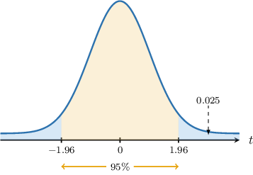
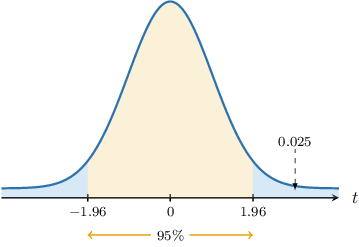
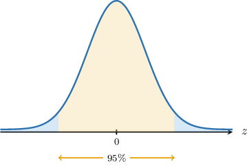

# Confidence Intervals for Paired Samples: Known Variances

Source: https://www.mathacademy.com/topics/3970?courseId=73
Topic ID: 3970

## Prerequisites

- [Confidence Intervals for Two Means: Known and Unequal Population Variances](./3298-confidence-intervals-for-two-means-known-and-unequal-population-variances.md)

## Lesson

### Introduction

Suppose a doctor wishes to determine the effect of a new diabetes treatment on patient blood sugar levels before and after treatment.

A sample of $n = 65$ patients is conducted, yielding two data sets:

$$

\big\{x_1,x_2,\ldots,x_{65}\big\}, \qquad \big\{y_1,y_2,\ldots,y_{65}\big\}

$$

These data sets are *dependent* because each pair $(x_i, y_i)$ is collected from the *same patient*. For this reason, we call this a **paired sample**.

Let's define the following variables:

- $X_i$ is the blood sugar level (in $\mathrm{mg/dL}$) of the $i$th patient before the treatment

- $Y_i$ the blood sugar level (in $\mathrm{mg/dL}$) of the $i$th patient after the treatment

- $\textrm E[X_i] = \mu_x$ is the (population) mean blood sugar level of the patients before the treatment

- $\textrm E[Y_i] = \mu_y$ is the (population) mean blood sugar level of the patients after the treatment

In a previous lesson, we learned how to construct a confidence interval for $\mu_x - \mu_y,$ the difference between two *independent* samples. However, these techniques cannot be applied here since our samples are dependent. So, how do we compare these two samples? The answer lies in analyzing the differences.

Instead of working with two datasets, we compute the difference for each pair:

$$

D_i = X_i - Y_i

$$

By reducing the problem to a single dataset of differences, we can analyze the distribution of $D_i$ to draw inferences about the mean difference.

Let's assume that the set $D_1, D_2, \ldots D_n$ are independent and identically distributed (I.I.D). Then, we have two possible cases:

- Suppose we run some tests, and it's confirmed that $D_i$ is normally distributed. Then, the distribution of the sample mean $\overline D$ is given by where $\mu$ is the population mean of $D_i,$ and $\sigma^2$ is the population variance of $D_i.$

- If $D_i$ is not normally distributed but the sample size is large, then by the central limit theorem,

In both cases, we can use one-sample procedures to construct a confidence interval for $\mu,$ the mean difference between pre- and post-treatment blood sugar levels.

Let's take a look at a concrete example.

### Example: Finding Confidence Intervals for Mean for Paired Sample

#### Question

Consider two independent paired samples of size $n=60$ from the random variables $X$ and $Y.$ You're given that the means for these samples are $\overline{x} = 11.8$ and $\overline{y} = 9.6,$ respectively. Given that the differences between the paired observations $D_i=X_i-Y_i$ are I.I.D. with variance $\sigma^2 = 4.53^2,$ find a $95\%$ confidence interval for the population mean of $D_i.$

**

#### Explanation

We do not know the distribution of the differences $D_i.$ However, the sample size $n = 60\geq 30$ is **. Therefore, according to the central limit theorem, we may use the following approximation:

$$

\overline{D} \sim N\left(\mu, \dfrac{\sigma^2}{n}\right),

$$

where

- $\overline{D}$ is the sample mean,

- $\mu$ is the population mean of $D_i$,

- $\sigma^2$ is the population variance of $D_i,$ and

- $n$ is the sample size.

As a result, given a value $\alpha$ between $0$ and $1,$ the corresponding $[100(1-\alpha)]\%$ confidence interval for the mean difference $\mu$ between $X$ and $Y$ can be written as

$$

\overline{d} \pm E

$$

where

- $\overline{d}=\overline{x}-\overline{y}\,$ is a point estimate for $\mu,$

- $E=z_{\alpha/2} \cdot \dfrac{\sigma}{\sqrt{n}}$ is the margin of error,

- $P(Z > z_{\alpha/2}) = \dfrac{\alpha}{2}$ and $Z\sim N(0,1).$

Now, to construct the confidence interval, we proceed as follows:

- **** Find a point estimate for $\mu{:}$ We compute our point estimate as follows:

- **** Find the margin of error. Since we are interested in finding a $95\%$ confidence interval, we have We are given that $P(Z > 1.96) = 0.025.$ As a result, Now, we can compute the margin of error:

- **** Construct the $95\%$ confidence interval for the population mean of $D{:}$ Our $95\%$ confidence interval is

### Interpreting Confidence Intervals

A confidence interval for the difference $\mu_x-\mu_y$ between the population means can be interpreted in the following ways:

- If all values within the confidence interval are *positive*, this suggests that $\mu_x - \mu_y > 0.$ In other words We should carry out a statistical hypothesis test to formally verify this claim.

- If all values within the confidence interval are *negative*, this suggests that $\mu_x - \mu_y < 0.$ In other words Again, we should conduct a statistical hypothesis test to verify this claim.

- If the confidence interval contains zero, then there is *insufficient evidence* of a statistically significant difference between the two means. Therefore, we conclude

Let's see an example.

### Example: Finding Confidence Intervals for Paired Samples: Applications

#### Question

A scientist is studying the effect of a new negative catalyst on $n=45$ chemical reactions. Suppose that $x_1,x_2,\ldots,x_{45}$ are the reaction times observed without the catalyst and $y_1,y_2,\ldots,y_{45}$ are the reaction times obtained with the catalyst. It is known that the differences $X_i - Y_i$ between the reaction times without and with the catalyst are I.I.D. random variables with population variance $\sigma^2=(22\,\textrm{min})^2.$ You're given that the sample means of these samples are $\overline x=36\,\textrm{min}$ and $\overline y=30\,\textrm{min}.$

Find a $95\%$ confidence interval for the population mean of $X_i-Y_i$ and interpret the result.

**

#### Explanation

Let us call $D_i = X_i-Y_i$ the random variable that represents the difference in the reaction times of a randomly selected reaction.

We do not know the distribution of the differences $D_i.$ However, the sample size $n = 45\geq 30$ is **. Therefore, according to the central limit theorem, we may use the following approximation:

$$

\overline{D} \sim N\left(\mu, \dfrac{\sigma^2}{n}\right),

$$

where

- $\overline{D}$ is the sample mean,

- $\mu$ is the population mean of $D_i,$

- $\sigma^2$ is the population variance of $D_i,$ and

- $n$ is the sample size.

As a result, given a value $\alpha$ between $0$ and $1,$ the corresponding $[100(1-\alpha)]\%$ confidence interval for the mean difference $\mu$ between $X$ and $Y$ can be written as

$$

\overline{d} \pm E

$$

where

- $\overline{d}=\overline{x}-\overline{y}$ is a point estimate for $\mu,$

- $E=z_{\alpha/2} \cdot \dfrac{\sigma}{\sqrt{n}}$ is the margin of error,

- $P(Z > z_{\alpha/2}) = \dfrac{\alpha}{2}$ and $Z\sim N(0,1).$

Now, to construct the confidence interval, we proceed as follows:

- **** Find a point estimate for $\mu{:}$

- **** Find the margin of error. Since we are interested in finding a $95\%$ confidence interval, we have We are given that $P(Z > 1.96) = 0.025.$ As a result, Now, we can compute the margin of error:

- **** Construct the $95\%$ confidence interval for the population mean of $D{:}$

Note that the confidence interval contains zero.

$$

(6-6.43, \, 6+6.43) = (-0.43,\,12.43)

$$

Since the confidence interval contains zero, the data suggests that the average reaction time with the catalyst is approximately the same as without the catalyst.

### Example: Deriving Confidence Intervals for Paired Samples

#### Question

Consider two paired random samples $X_1, X_2, \ldots, X_{27}$ and $Y_1, Y_2, \ldots, Y_{27}$ of size $n = 27.$ It is known that the differences between paired observations $D_i = X_i - Y_i$ are normally distributed with population mean $\mu$ and population variance $\sigma^2 = 3.$ Derive the expression used to construct a $95\%$ confidence interval for $\mu.$

#### Explanation

To construct a confidence interval, we start with a random variable that depends on the samples and has a known distribution under certain conditions.

Consider the random variable

$$

\begin{aligned}𝑍 & =\frac{(\overset{𝑋}{}−\overset{𝑌}{})−𝜇}{\frac{𝜎}{\sqrt{√𝑛}}} \\ & =\frac{(\overset{𝑋}{}−\overset{𝑌}{})−𝜇}{(\frac{\sqrt{√3}}{\sqrt{√27}})} \\ & =\frac{(\overset{𝑋}{}−\overset{𝑌}{})−𝜇}{(\frac{1}{3})},\end{aligned}

$$

where $\overline{X}$ and $\overline{Y}$ are the sample means of the given samples.

It is known that if the samples are paired and the differences between each pair are normally distributed with a population mean $\mu$ and known population variance, $Z$ has a standard normal distribution.

We have that

$$

Z \sim {\color{black}N(0,1)}.

$$

We wish to find an interval that we're $95\%$ confident that the random variable $Z$ lies within. This interval is indicated in the diagram below:

Since we're computing a $95\%$ confidence interval, the area bounded by each "tail" that we're excluding from our confidence interval must be $\dfrac{1 - 0.95}{2} = 0.025.$ We can find the endpoints of such interval using a table of values for the normal distribution.

Using a table of values for the normal distribution, we require a value $c$ such that

$$

P(Z > c) = {\color{black}0.025}.

$$

In other words,

$$

\begin{aligned}𝑃(−𝑐<𝑍<𝑐)=0.95.\end{aligned}

$$

Let's call $c = z_{0.025}.$

Now, we find the appropriate confidence interval by solving the inequality inside the parentheses of the last probability statement for the difference mean $\mu.$

$$

\begin{aligned}−𝑧_{0.025} & <𝑍<𝑧_{0.025} \\ −𝑧_{0.025} & <\frac{(\overset{𝑥}{}−\overset{𝑦}{–})−𝜇}{(\frac{1}{3})}<𝑧_{0.025}\end{aligned}

$$

To solve this inequality, we first multiply by $\dfrac{1}{3}$ to get rid of the denominator:

We solve the inequality as follows:

$$

\begin{aligned}−\frac{𝑧_{0.025}}{3} & <(\overset{𝑥}{}−\overset{𝑦}{–})−𝜇<\frac{𝑧_{0.025}}{3}\end{aligned}

$$

Then, we multiply all sides by $-1:$

$$

\begin{aligned}\frac{𝑧_{0.025}}{3} & >𝜇−(\overset{𝑥}{}−\overset{𝑦}{–})>−\frac{𝑧_{0.025}}{3}\end{aligned}

$$

Next, we add $\overline{x} - \overline{y}:$

$$

\begin{aligned}\frac{𝑧_{0.025}}{3}+\overset{𝑥}{}−\overset{𝑦}{–} & >𝜇>−\frac{𝑧_{0.025}}{3}+\overset{𝑥}{}−\overset{𝑦}{–}\end{aligned}

$$

Next, we rewrite our inequality so that the smaller terms are on the left-hand side.

$$

\begin{aligned}\overset{𝑥}{}−\overset{𝑦}{–}−\frac{𝑧_{0.025}}{3} & <𝜇<\overset{𝑥}{}−\overset{𝑦}{–}+\frac{𝑧_{0.025}}{3}\end{aligned}

$$

Now, we write our result more compactly.

Finally, we can write our interval as follows:

$$

\begin{aligned}(\overset{𝑥}{}−\overset{𝑦}{–})±𝑧_{0.025}⋅\frac{1}{3}\end{aligned}

$$

The full proof is given below:

Consider the random variable

$$

\begin{aligned}𝑍 & =\frac{(\overset{𝑋}{}−\overset{𝑌}{})−𝜇}{\frac{𝜎}{\sqrt{√𝑛}}} \\ & =\frac{(\overset{𝑋}{}−\overset{𝑌}{})−𝜇}{(\frac{\sqrt{√3}}{\sqrt{√27}})} \\ & =\frac{(\overset{𝑋}{}−\overset{𝑌}{})−𝜇}{(\frac{1}{3})},\end{aligned}

$$

where $\overline{X}$ and $\overline{Y}$ are the sample means of the given samples.

We have that

$$

Z \sim {\color{black}N(0,1)}.

$$

Using a table of values for the normal distribution, we require a value $c$ such that

$$

P(Z > c) = {\color{black}0.025}.

$$

In other words,

$$

\begin{aligned}𝑃(−𝑐<𝑍<𝑐)=0.95.\end{aligned}

$$

Let's call $c = z_{0.025}.$

Now, we find the appropriate confidence interval by solving the inequality inside the parentheses of the last probability statement for the difference mean $\mu.$

$$

\begin{aligned}−𝑧_{0.025} & <𝑍<𝑧_{0.025} \\ −𝑧_{0.025} & <\frac{(\overset{𝑥}{}−\overset{𝑦}{–})−𝜇}{(\frac{1}{3})}<𝑧_{0.025}\end{aligned}

$$

We solve the inequality as follows:

$$

\begin{aligned}−\frac{𝑧_{0.025}}{3} & <(\overset{𝑥}{}−\overset{𝑦}{–})−𝜇<\frac{𝑧_{0.025}}{3}\end{aligned}

$$

$$

\begin{aligned}\frac{𝑧_{0.025}}{3} & >𝜇−(\overset{𝑥}{}−\overset{𝑦}{–})>−\frac{𝑧_{0.025}}{3}\end{aligned}

$$

$$

\begin{aligned}\frac{𝑧_{0.025}}{3}+\overset{𝑥}{}−\overset{𝑦}{–} & >𝜇>−\frac{𝑧_{0.025}}{3}+\overset{𝑥}{}−\overset{𝑦}{–}\end{aligned}

$$

$$

\begin{aligned}\overset{𝑥}{}−\overset{𝑦}{–}−\frac{𝑧_{0.025}}{3} & <𝜇<\overset{𝑥}{}−\overset{𝑦}{–}+\frac{𝑧_{0.025}}{3}\end{aligned}

$$

Finally, we can write our interval as follows:

$$

\begin{aligned}(\overset{𝑥}{}−\overset{𝑦}{–})±𝑧_{0.025}⋅\frac{1}{3}\end{aligned}

$$
